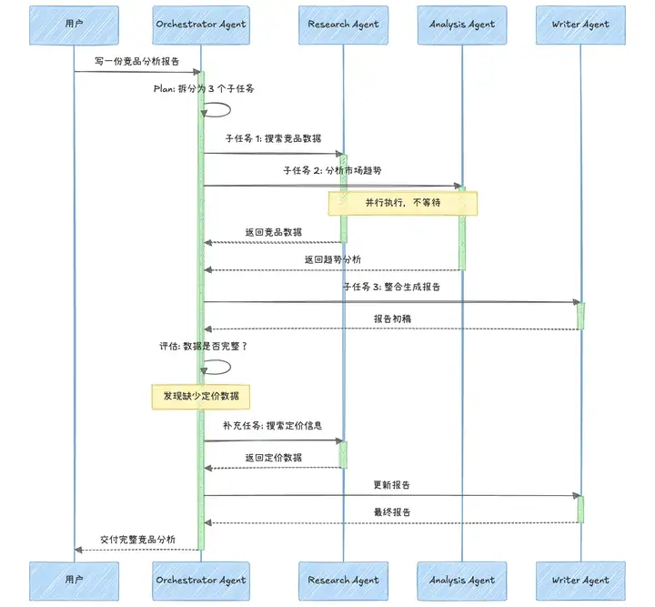

AI Agent 开发踩坑

<!-- more -->

# AI Agent 踩坑

### 1. 架构的坑

#### 1.1 ReAct架构

::: warning 

ReAct 的默认行为是 **继续循环而非停止** 

**要理解框架在做什么，而不只是调它的 API**

:::

LLM 不擅长判断 **"够了"** 这个时刻，它倾向于继续调用工具、继续推理，最终陷入无限循环。

LLM 输出的非确定性会被 **循环放大** ，多次迭代可能产出完全不靠谱的结果，甚至导致 API 成本失控

LangGraph 所谓的 **"图结构"** 底层本质就是:

- 一个模型节点（Model）
- 若干个工具节点（Tools）
- 加几条条件边（根据 state 决定下一步调谁）

[但框架把这个简单结构裹了厚厚一层抽象](https://www.decodingai.com/p/building-production-react-agents)（换成裸 Python + if/else + 调 API，功能上甚至是可以自己手写的）

#####  **生产环境中 ReAct Agent 必须解决的三类故障：**  

1. **循环控制：** 如何控制 迭代次数 和 超时时间？
2. **降级策略：** 工具失败如何优雅降级，如何设置重试策略、备用路径？
3. **幻觉检测：** Agent 声称观察到了工具根本没返回的内容

单 Agent 循环的工程实现，看 OpenAI 开源的 [Codex CLI](https://link.zhihu.com/?target=https%3A//github.com/openai/codex)（Rust 实现的终端编码 Agent）

OpenAI 专门写了一篇 [Unrolling the Codex agent loop](https://openai.com/zh-Hans-CN/index/unrolling-the-codex-agent-loop/) 详细拆解其 Agent 循环的内部机制，从 Responses API 的 JSON 构造到 prompt caching 的工程细节全部公开。

#### 1.2 Plan and Execute 架构

> 先列计划再执行

#### 1.3 Orchestrator-Worker 架构

> 一个协调Agent 分发子任务给多个专业的Sub Agent （Claude Research）

 

读 [DeerFlow](https://link.zhihu.com/?target=https%3A//github.com/bytedance/deer-flow) 源码，2026 年 2 月 v2.0 从零重写，基于 LangGraph + LangChain 构建。

它的核心架构是 Lead Agent 拆解任务 → 子 Agent 在 Docker 隔离容器中并行执行 → 结果回收拼装，配合持久化 Memory 和可扩展的 Skills 系统。

**价值在于：** 这是一个**真正的 Orchestrator-Worker 架构的生产实现** 

- 能看到 LangGraph 的图结构在实际多 Agent 编排中是怎么用的
- 子 Agent 的上下文隔离怎么做
- Skills 怎么按需加载来控制 token 消耗

#### 1.4 Evaluator-Optimizer 架构

> 一个Agent执行，另一个Agent评估并反馈建议

四篇必读：

[Chain-of-Thought](https://arxiv.org/abs/2201.11903)（推理基础）

[ReAct](https://arxiv.org/abs/2210.03629)（Agent 工具调用开创性工作）

[Toolformer](https://arxiv.org/abs/2201.11903)（LLM 自主学习使用工具）

[Reflexion](https://arxiv.org/abs/2303.11366)（自我反思纠错）

系统论文：Generative Agents、HuggingGPT、Voyager。[Lilian Weng](https://link.zhihu.com/?target=https%3A//lilianweng.github.io/posts/2023-06-23-agent/) 的 Agent 综述是领域被引用最多的文章

### 2. RAG的坑

#### **2.1 切片** 

**80% 的 RAG 失败追溯到 chunking（文档切分）决策，而非检索或生成环节** ， 切分策略对检索质量的影响 **不亚于甚至超过 Embedding 模型** 的选择

大多数人第一反应是 "语义切分"（semantic chunking，按语义相似度断句）肯定比"按字符数固定切分"效果好，毕竟名字听起来就更聪明，但 FloTorch 2026 年 2 月的 [基准测试](https://ragaboutit.com/the-2026-rag-performance-paradox-why-simpler-chunking-strategies-are-outperforming-complex-ai-driven-methods/) 把这个直觉打了个粉碎。

**递归字符切分 512 tokens 以 69% 准确率排名第一**，全面碾压语义切分。为什么？语义切分会产生 3-5 倍的向量碎片，平均 chunk 只有 43 个 token，检索召回率看起来高达 91.9%，但 [端到端回答准确率只有 54%](https://blog.premai.io/rag-chunking-strategies-the-2026-benchmark-guide/) 比递归切分低了 15 个百分点。原因是 chunk 太短了，LLM 拿到一堆句子碎片根本拼不出完整答案。

#### **2.2 Embedding 漂移**

知识库嵌入一次之后，半年过去了，业务术语变了、新产品上线了、法规更新了，但向量是旧的，检索质量无声无息地退化，用户投诉增加但你完全不知道哪层出了问题

[生产级RAG必做的事](https://brlikhon.engineer/blog/building-production-rag-systems-in-2026-complete-tutorial-with-langchain-pinecone)：增量嵌入、监控余弦相似度分布变化、冷数据每季度重新嵌入、像管理源码版本一样管理 Embedding 模型版本

#### **2.3 故障级联** 

**RAG 说到底是一条 pipeline：** 

  `Query 分类 → 检索 → 重排序 → Context 组装 → 生成 → 验证` 

每层 95% 准确率听起来很高，五层串下来整体可靠性只有 81%

**90%** 的 **Agentic RAG** 项目在生产环境失败，技术本身没有问题，问题出在工程师低估了每层故障的复合效应，这意味着你必须能对每层独立做可观测性，而不是出了问题 ==只知道 **"答案不对"** 却不知道是 **检索错了** 还是 **生成幻觉了**== 。

[ragas - RAG评估工具](https://github.com/vibrantlabsai/ragas)：量化 **Faithfulness**（是否忠于检索证据？） 和 **Context Precision**（检索回来的上下文是否真的相关？）

- **量化：** 不是拍脑袋说“感觉还行”，而是给出可比较的分数
- **Faithfulness `/ˈfeɪθf(ə)lnəs/`（忠实度）：** 回答里的说法，有多少是能在检索到的 context 里找到依据的，==即看 **“生成有没有编”**==
  - 高：基本都“有据可查”
  - 低：模型在瞎补、幻觉
- **Context Precision `/prɪˈsɪʒən/`（上下文精确率）：** 检索返回的内容里，有多少是真正和问题相关、对回答有用的，==即看 **“检索有没有捞准”**== 
  - 高：返回的段落大多有用
  - 低：召回很多噪音，虽然也许夹杂少量有用信息

**举例：**用户问：A 产品的适用人群？检索回来 5 段，其中 2 段是 A 产品适用人群（有用），3 段是 B 产品介绍（无关）

**模型回答：** 如果 **回答只说了那 2 段** 里确实写过的内容 -> **Faithfulness 高**，但检索 **5 段里只有 2 段有用 -> Context Precision 偏低**

#### **2.4 上下文幻觉** 

[Chroma 2025 年 7 月的研究](https://blog.premai.io/building-production-rag-architecture-chunking-evaluation-monitoring-2026-guide/) 测试了 18 个模型（包括 GPT-4.1、Claude 4、Gemini 2.5），发现随着上下文长度增加，**所有模型的检索质量都在退化**。更短更精确的上下文反而比灌 50K token 效果更好。实战建议是把组装后的上下文控制在 **8K token 以内**，超了说明你的重排序阈值太松了。

#### **2.5 必须思考的问题**

- [ ] ##### 不同文档类型（PDF、表格、代码）需要不同的切分策略，如何设计？

- [ ] **混合检索（向量搜索 + BM25关键词搜索）在什么场景下 ==优于== 纯向量检索？** 

- [ ] **怎么设计评估体系，用来在上线前发现检索退化？** 

- [ ] **怎么处理权限控制（谁能看到哪些文档）？** 

