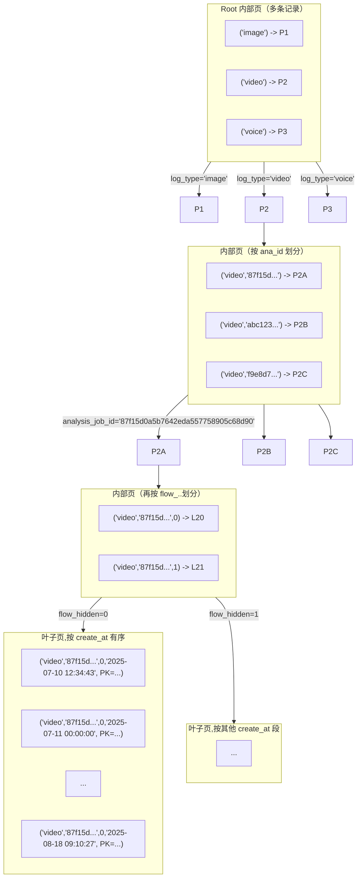
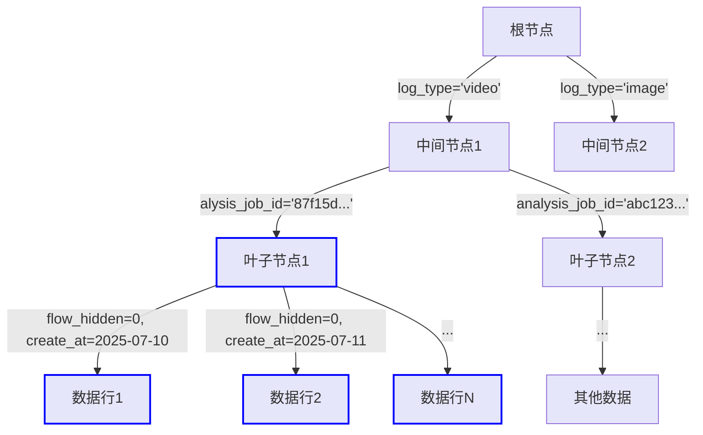
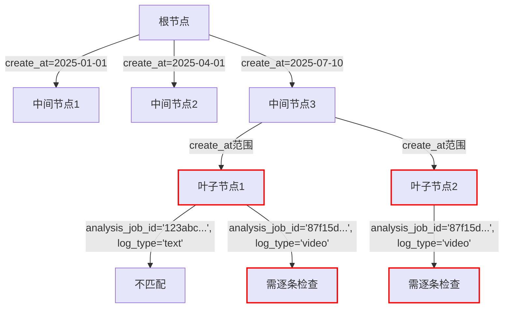

# Mysql调优

### 1. 执行计划分析

#### 1.1 什么是执行计划

**执行计划:**  指一条 SQL 语句在经过 **MySQL 查询优化器** 的优化后，具体的执行方式，常用于 **SQL 性能分析、优化** 等场景。

```sql
EXPLAIN + SELECT / UPDATE / DELETE... 查询语句；
```

通过 `EXPLAIN` 的结果，能看到目标SQL 可 **命中那些 索引、是什么 type、多少行记录被查询** 等 

支持 `SELECT`、`DELETE`、`INSERT`、`REPLACE` 以及 `UPDATE` 语句

#### 1.2 执行计划示例

```sql
mysql> EXPLAIN 
SELECT * FROM employee_department 
WHERE employee_id IN (
    SELECT employee_id 
    FROM employee_department 
    GROUP BY employee_id 
    HAVING COUNT(*) > 1
);

+----+-------------+----------------------+------------+-------+---------------------------+---------------+---------+------+--------+----------+-------------+
| id | select_type | table                | partitions | type  | possible_keys             | key           | key_len | ref  | rows   | filtered | Extra       |
+----+-------------+----------------------+------------+-------+---------------------------+---------------+---------+------+--------+----------+-------------+
|  1 | PRIMARY     | employee_department  | NULL       | ALL   | NULL                      | NULL          | NULL    | NULL | 331143 |   100.00 | Using where |
|  2 | SUBQUERY    | employee_department  | NULL       | index | PRIMARY,department_id_idx | PRIMARY       | 16      | NULL | 331143 |   100.00 | Using index |
+----+-------------+----------------------+------------+-------+---------------------------+---------------+---------+------+--------+----------+-------------+
```

执行计划结果中共有 12 列，各列代表的含义总结如下表：

| **列名**      | **含义**                                     |
| ------------- | -------------------------------------------- |
| id            | SELECT 查询的序列标识符                      |
| select_type   | SELECT 关键字对应的查询类型                  |
| table         | 用到的表名                                   |
| partitions    | 匹配的分区，对于未分区的表，值为 NULL        |
| type          | 表的访问方法                                 |
| possible_keys | 可能用到的索引                               |
| key           | 实际用到的索引                               |
| key_len       | 所选索引的长度                               |
| ref           | 当使用索引等值查询时，与索引作比较的列或常量 |
| rows          | 预计要读取的行数                             |
| filtered      | 按表条件过滤后，留存的记录数的百分比         |
| Extra         | 附加信息                                     |

### 2. 如何分析EXPLAIN结果

首先需要明确执行计划中的每个字段含义：

#### id

`SELECT` 标识符，用于标识每个 `SELECT` 语句的执行顺序。

**id** 就像 SQL 查询的 **执行顺序编号**，告诉你哪个部分先执行、哪个后执行

- **id 相同**，看类型 **SUBQUERY → PRIMARY → UNION** 

  ```sql
  | id | select_type | table          |
  |----|-------------|----------------|
  | 1  | PRIMARY     | 主查询         |
  | 1  | SUBQUERY    | 子查询         |
  ```

- **id 不同**，值越大，执行优先级越高

  ```sql
  | id | select_type | table          |
  |----|-------------|----------------|
  | 1  | PRIMARY     | 主查询         |
  | 2  | SUBQUERY    | 子查询         |
  ```

- **id值为NULL**，永远最后执行的合并操作（比如 `UNION` 的结果）

  ```sql
  | id   | select_type | table        |
  |------|-------------|--------------|
  | NULL | UNION       | 合并结果集     |
  ```

  

#### select_type 查询类型

查询的类型，主要用于区分普通查询、联合查询、子查询等复杂的查询，常见的值有：

- **SIMPLE**：**简单查询**，最基础的 `SELECT` 查询，没有嵌套或联合。
- **PRIMARY**：**主查询**，若包含子查询或其他部分，外层的 SELECT 将被标记为 PRIMARY。
- **SUBQUERY**：**子查询**，被嵌套在主查询内部的独立查询。
- **UNION**：**联合查询**，在UNION操作中，第二个及以后的查询语句。
- **DERIVED**：**派生表**，FROM子句中的子查询，会生成临时表。
- **UNION RESULT**：**联合结果**，UNION操作的最终合并结果。


#### table

当前查询执行的数据表

每行都有对应的表名，表名除了正常的表之外，也可能是以下列出的值：

- **`<unionM,N>`** : 本行引用了 id 为 M 和 N 的行的 UNION 结果；
- **`<derivedN>`** : 本行引用了 id 为 N 的表所产生的的派生表结果。派生表有可能产生自 FROM 语句中的子查询。
- **`<subqueryN>`** : 本行引用了 id 为 N 的表所产生的的物化子查询结果。


#### partitions

查询所匹配记录所在的分区，对于未分区的表，值为 `NULL`。


#### type(重要)

查询执行的类型，描述了查询是如何执行的。所有值的顺序从最优到最差排序为：


##### **常见的几种类型含义如下：** 

| 访问类型        | 通俗解释                                                     | 性能等级 | 示例场景                                                     |
| --------------- | ------------------------------------------------------------ | -------- | ------------------------------------------------------------ |
| **system**      | 表只有一行数据（系统表特例）                                 | 🚀 最优   | `SELECT * FROM system_table WHERE id=1` (***MyISAM引擎***)   |
| **const**       | 用主键/唯一索引直接定位单条数据                              | 🚀 最优   | `SELECT * FROM users WHERE user_id = 1`                      |
| **eq_ref**      | 联表时，前表的每行在后表 **唯一匹配一条** （主键/唯一索引联表） | ⭐️ 极优   | `SELECT * FROM users JOIN orders ON users.id = orders.user_id` |
| **ref**         | 用普通索引找到 **多条匹配数据**                              | 👍 良好   | `SELECT * FROM users WHERE age = 25` (age有普通索引)         |
| **index_merge** | 同时使用多个索引，然后合并结果                               | ⚡️ 较优   | `SELECT * FROM users WHERE user_id = 1 OR username = 'admin'` |
| **range**       | 用索引检索 **范围数据**，执行计划中的 **key** 列表示使用了哪个索引 | ✅ 不错   | `SELECT * FROM users WHERE age BETWEEN 20 AND 30`            |
| **index**       | 全索引扫描，查询遍历了整棵索引树（***比 ALL 快因为只扫描索引，而索引一般在内存***） | ⚠️ 较差   | `SELECT COUNT(*) FROM users` (使用了覆盖索引)                |
| **ALL**         | 全表扫描（***需要优化***）                                   | 🐢 最差   | `SELECT * FROM users WHERE phone LIKE '%123%'`               |

##### **`eq_ref` 与 `ref` 的区别** 

|    类型    | 匹配行数 |   索引类型    |              示例              |
| :--------: | :------: | :-----------: | :----------------------------: |
| **eq_ref** | 唯一1条  | 主键/唯一索引 | `ON users.id = orders.user_id` |
|  **ref**   | 可能多条 |   普通索引    |   `WHERE department_id = 3`    |

##### **性能优化建议**

1. **避免 `ALL`**：

   - 为查询条件添加索引
   - •避免在索引列上使用函数或通配符`%`开头

2. **提升 `range` 到 `ref`**：

   ```sql
   -- 优化前：type=range
   SELECT * FROM orders 
   WHERE order_date > '2023-01-01'
   
   -- 优化后：type=ref (如果status有索引)
   SELECT * FROM orders 
   WHERE status = 'paid' 
     AND order_date > '2023-01-01'
   ```

3. **`index` 特殊情况**：

   当查询只需要索引列时（覆盖索引），**index** 比 **ALL** 快很多：

   ```sql
   -- 虽然扫描整个索引，但不需要回表
   SELECT user_id FROM users 
   WHERE last_login_time > '2023-01-01'
   ```


#### possible_keys

**possible_keys** 列表示 **MySQL** 执行查询时**可能用到的索引**。

如果这一列为 **NULL** ，则表示 **没有可能用到的索引**，这种情况下，需要检查 `WHERE` 语句中所使用的的列，看是否可以通过给这些列中某个或多个添加索引的方法来提高查询性能。


#### key(重要)

**key** 列表示 **MySQL** 实际使用到的索引，如果为 **NULL**，则表示未用到索引。


#### key_len

表示 **MySQL** 实际使用的索引的最大长度（***字节*** ），例如：

- **smallint :** **2** 个字节
- **varchar(255) :** **1022** 个字节
  - `255×4=1020（字符数据）+2（长度前缀）+0（如果字段是NOTNULL）=1022字节` 
- **datetime:** **5** 个字节

当使用到联合索引时，有可能是多个列的长度和，在满足需求的前提下 **越短越好**。

如果 key 列显示 NULL ，则 key_len 列也显示 NULL 。


#### ref

表示在查询索引时，哪些列或者常量被用来与索引的值进行比较:

- **const :** 表示使用了常量值（如 `WHERE id = 5`）
- **func :** 表示使用了函数（如 `WHERE UPPER(name) = 'JOHN'`）
- **NULL :** 表示没有使用索引匹配（可能是全表扫描或索引失效），或查询使用了 **范围查询**（`create_at BETWEEN ...`），而不是精确匹配（`=`），因为它不是直接通过  `=` 或  `IN` 匹配索引


#### rows

表示 **预估扫描行数**， 根据表统计信息及选用情况，大致估算出找到所需的记录或所需读取的行数，数值越小越好。


#### filtered

表示估算的经过查询条件删选出的列数的百分比。例如 `rows` 是 1000，`filtered` 是 50（50%），则实际筛选出的列数为 1000 * 50% = 500。


#### Extra(重要)

包含了 **MySQL** 解析查询的额外信息，通过这些信息，可以更准确的理解 MySQL 到底是如何执行查询的。常见的值如下：

| Extra 值                                  | 通俗解释                                                     | 性能影响 | 优化建议                         |
| ----------------------------------------- | ------------------------------------------------------------ | -------- | -------------------------------- |
| **Using index**                           | 查询只通过索引就完成了（***覆盖索引*** ），无需回表查数据    | ✅ 极优   | 保持当前索引策略                 |
| **Using index condition**                 | 表示查询优化器使用了**索引条件下推（*ICP*）**，在存储引擎层提前过滤数据 | ✅ 较优   | MySQL 5.6+默认开启，无需特别优化 |
| **Using where**                           | 表明 **查询使用了 WHERE 子句** 进行条件过滤，需要在Server层对存储引擎返回的数据进行过滤（***比如 create_at 范围*** ） | ⚠️ 中     | 检查WHERE条件是否可以利用索引    |
| **Using filesort**                        | 需要额外内存排序（***未用索引排序*** ）                      | ❌ 差     | 为ORDER BY字段添加索引           |
| **Using temporary**                       | 需要创建临时表存储查询结果（***常见于 ORDER BY / GROUP BY*** ） | ❌ 差     | 优化GROUP BY字段顺序或添加索引   |
| **Using join buffer (Block Nested Loop)** | 连表查询时使用了缓存块，通常因为 **被驱动表无索引** 时，MySQL先将驱动表读出放到 **join buffer** 中，**再遍历**被驱动表与驱动表进行查询 | ⚠️ 中     | 为关联字段添加索引               |
| **Select tables optimized away**          | 查询已被优化到只需读取索引（如MIN/MAX使用索引）              | ✅ 极优   | 保持即可                         |

这里提醒下，当 Extra 列包含 <span style="color: red"><b>Using filesort </b></span>或 <span style="color: red"><b>Using temporary</b></span> 时，MySQL 的性能可能会存在问题，需要尽可能避免。


### 3. 案例 

##### **索引对比说明**

创建如下两个不同顺序的索引

```sql
CREATE INDEX idx_logrecord_query ON SyncLogRecord(log_type, analysis_job_id, flow_hidden,create_at);

CREATE INDEX idx_logrecord_query5 ON SyncLogRecord(create_at, analysis_job_id, log_type, flow_hidden);
```

下面是使用两个索引的执行计划对比

```sql
EXPLAIN SELECT COUNT(*) FROM `SyncLogRecord` force index(idx_logrecord_query)
WHERE create_at >= '2025-07-10 12:34:43'
AND create_at <= '2025-08-18 09:10:27'
AND log_type = 'video'
AND analysis_job_id='87f15d0a5b7642eda557758905c68d90'
AND flow_hidden=0

+---------------------------------------------------------------------------------------------------------------------------------------------------------------------+
| id | select_type | table          | partitions | type  | possible_keys       | key                 | key_len | ref  | rows  | filtered | Extra                      |
|----|-------------|----------------|------------|-------|---------------------|---------------------|---------|------|-------|----------|----------------------------|
| 1  | `SIMPLE`    | SyncLogRecord  | `NULL`     | range | idx_logrecord_query | idx_logrecord_query | 2051    | NULL | 44909 | 100.00   | `Using where; Using index` |


EXPLAIN SELECT COUNT(*) FROM `SyncLogRecord` force index(idx_logrecord_query5)
WHERE create_at >= '2025-07-10 12:34:43'
AND create_at <= '2025-08-18 09:10:27'
AND log_type = 'video'
AND analysis_job_id='87f15d0a5b7642eda557758905c68d90'
AND flow_hidden=0

+---------------------------------------------------------------------------------------------------------------------------------------------------------------------+
| id | select_type | table          | partitions | type  | possible_keys       | key                 | key_len | ref  | rows  | filtered | Extra                      |
|----|-------------|----------------|------------|-------|---------------------|---------------------|---------|------|-------|----------|----------------------------|
| 1  | `SIMPLE`    | SyncLogRecord  | `NULL`     | range | idx_logrecord_query5| idx_logrecord_query5| 2051    | NULL | 44909 | 1.00     | `Using where; Using index` |
+---------------------------------------------------------------------------------------------------------------------------------------------------------------------+

```

如下实际索引和索引示意图



**1. 高效索引：** `(log_type, analysis_job_id, flow_hidden, create_at)` 



**检索路径**（蓝色标注部分）

1. 从根节点定位 `log_type='video'` 的子树
2. 在中间节点定位 `analysis_job_id='87f15d...'`
3. 在叶子节点过滤 `flow_hidden=0`并扫描 `create_at`范围
4. 直接返回匹配的连续数据块

**2. 低效索引：** `(create_at, analysis_job_id, log_type, flow_hidden)`



**检索路径**（红色标注部分）：

1. 从根节点扫描 `create_at` 范围（*2025-07-10 到 2025-08-18*）
2. 加载所有匹配的叶子节点（*44,909 行*）
3. 对每行数据逐条检查：
   - `if analysis_job_id='87f15d...'?`  
   - `if log_type='video' ?` 
   - `if flow_hidden=0 ?`  
4. 最终返回匹配数据

##### **关键差异对比及总结** 

|         特性         |          高效索引          |                    低效索引                    |
| :------------------: | :------------------------: | :--------------------------------------------: |
|   **B+树组织方式**   |   按等值列分组后范围扫描   |             按范围列分组后逐条过滤             |
| **叶子节点访问模式** |      顺序访问连续区块      |                随机访问分散节点                |
|   **存储引擎过滤**   |      完全在索引层完成      | 仅能过滤 `create_at`，其他条件回 **Server** 层 |
|     **I/O次数**      | 3-4次树高访问 + 少量顺序读 |           3-4次树高访问 + 大量随机读           |

1. **高效索引**
   - 等值条件（`log_type`等）快速收敛到子树，**大幅减少扫描范围**
   - 范围查询（`create_at`）仅在最终的小数据集上执行
2. **低效索引**
   - 范围查询前置导致**必须加载所有日期匹配的叶子节点**
   - 后续等值条件无法利用索引有序性，变成**暴力扫描**
3. **B+树特性**
   - 非叶子节点仅存储导航键值，叶子节点通过链表连接
   - **索引列顺序决定数据的物理排序方式**，影响检索路径

**为啥有 Using Where ？** 

**Using where 显示 ≠ 性能问题** ，这里仅表示**最终校验**，即使索引全覆盖且时间精确到秒级，MySQL 依然要对时间边界和条件组合做最终校验，在 `Using index`+ `filtered=100%` 时，`Using where `的损耗通常小于 **0.1%** 的查询总耗时

✅ `type=range`（已优化）

✅ `key_len`（完全覆盖）

✅ `filtered=100%` 
