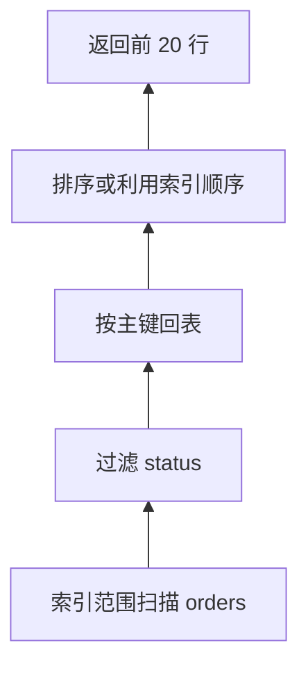
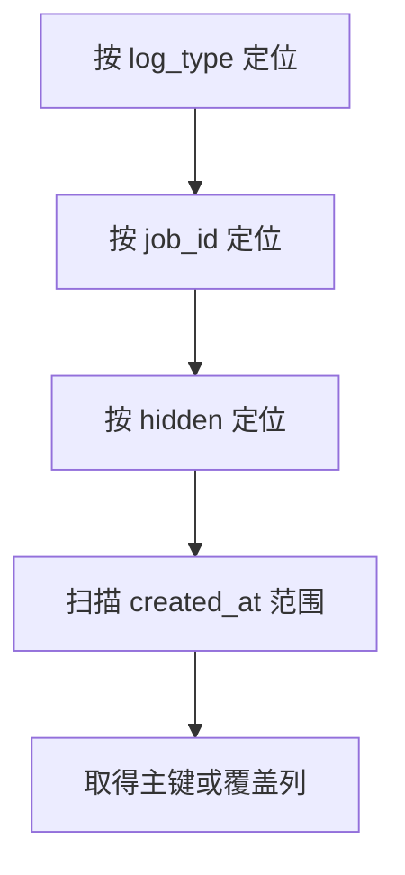

执行计划描述 MySQL 优化器准备如何访问表、使用索引、连接数据和完成排序。它是定位 SQL 性能问题的证据之一，但不能替代真实耗时、等待事件和业务调用频率。

<!-- more -->

## 1. EXPLAIN 与 EXPLAIN ANALYZE

### 1.1 只查看估算计划

```sql
EXPLAIN
SELECT id, order_no, created_at
FROM orders
WHERE customer_id = 1001
  AND status = 'paid'
ORDER BY created_at DESC
LIMIT 20;
```

`EXPLAIN` 不执行普通 `SELECT`，主要展示优化器基于统计信息得到的估算。它也可用于 `UPDATE`、`DELETE`、`INSERT`、`REPLACE` 等语句，但对写语句做分析时仍应先确认目标和环境。

### 1.2 查看实际执行数据

```sql
EXPLAIN ANALYZE
SELECT id, order_no, created_at
FROM orders
WHERE customer_id = 1001
  AND status = 'paid'
ORDER BY created_at DESC
LIMIT 20;
```

`EXPLAIN ANALYZE` 会真实执行语句，并以 TREE 形式返回每个迭代器的估算成本、实际耗时、实际行数和循环次数。MySQL 8.4 支持分析 `SELECT`、`TABLE` 以及多表 `UPDATE`、`DELETE`。它比单纯 `EXPLAIN` 更能揭示估算偏差，但必须注意：

- 对慢查询运行它，查询仍然可能很慢。
- 对受支持的多表 `UPDATE`、`DELETE` 使用它会产生真实副作用，不能把它当成无害的预览。
- 生产环境应先评估负载、锁影响和返回数据量，必要时在副本或脱敏数据环境复现。

## 2. 输出格式怎么选

```sql
EXPLAIN FORMAT=TRADITIONAL SELECT ...;
EXPLAIN FORMAT=JSON SELECT ...;
EXPLAIN FORMAT=TREE SELECT ...;
```

| 格式 | 适合场景 | 特点 |
|---|---|---|
| `TRADITIONAL` | 日常快速检查 | 一表一行，字段紧凑，最常见 |
| `TREE` | 理解算子层级 | 直接呈现执行树，`EXPLAIN ANALYZE` 使用该结构 |
| `JSON` | 工具处理与深入分析 | 信息更完整，包含成本和层级结构 |

阅读执行树时，应从最内层或最先执行的叶子算子开始，沿数据流向外看，而不是把文本第一行当作第一步。


```mermaid
flowchart BT
    scan[索引范围扫描 orders] --> filter[过滤 status]
    filter --> lookup[按主键回表]
    lookup --> sort[排序或利用索引顺序]
    sort --> limit[返回前 20 行]
```

实际计划不一定包含图中的每一步。例如覆盖索引可避免回表，索引顺序匹配时也可能不需要额外排序。

## 3. 传统输出的关键列

| 列 | 含义 | 阅读重点 |
|---|---|---|
| `id` | 查询块标识 | 不能简单按数值推断所有执行顺序 |
| `select_type` | 查询块类型 | 如 `SIMPLE`、`PRIMARY`、`SUBQUERY`、`DERIVED` |
| `table` | 当前访问对象 | 可能是表、派生表或物化结果 |
| `partitions` | 访问的分区 | 用于判断是否发生分区裁剪 |
| `type` | 访问方法 | 反映如何定位行，不是独立的性能分数 |
| `possible_keys` | 候选索引 | 有候选不代表采用它一定更优 |
| `key` | 实际索引 | `NULL` 表示未选择索引访问 |
| `key_len` | 使用的索引键长度 | 可辅助判断联合索引使用到哪一部分 |
| `ref` | 与索引比较的值 | 可能是常量或前表列 |
| `rows` | 预计检查的行数 | 是统计估算，不是实际值 |
| `filtered` | 条件过滤后预计保留比例 | 可粗略估算传给下一步的数据量 |
| `Extra` | 额外执行信息 | 需结合完整计划解释 |

粗略估算某一步传出的行数时，可以观察：

```text
rows × filtered / 100
```

连接查询还要考虑该步骤的循环次数，因此不能只看单行 `rows` 就判断总工作量。

## 4. type：访问方法而非排行榜

常见访问方法包括：

| `type` | 含义 | 常见场景 |
|---|---|---|
| `system` / `const` | 最多匹配一行 | 主键或唯一键与常量等值比较 |
| `eq_ref` | 前表每行在当前表最多匹配一行 | 使用主键或唯一非空索引连接 |
| `ref` | 通过非唯一索引查找一组行 | 普通索引等值查询 |
| `range` | 扫描索引区间 | 范围、部分 `IN`、前缀范围 |
| `index` | 扫描整个索引 | 可能比扫描整行更窄，但仍是全索引扫描 |
| `ALL` | 扫描整表 | 小表可能合理，大表需结合过滤和频率判断 |

常见访问路径可以概括为：


```mermaid
flowchart LR
    point[单点定位] --> range[范围定位]
    range --> fullIndex[全索引扫描]
    fullIndex --> fullTable[全表扫描]
```

这张图只表达“定位范围通常逐渐扩大”，不表示前一项在任何场景都更快。例如：

- 返回表中大部分数据时，顺序扫描可能比大量随机回表更便宜。
- 小表全表扫描通常不是优化重点。
- 一个 `ref` 访问若被外层循环数百万次，可能比一次可控的 `ALL` 更慢。

## 5. Extra 中的常见信息

### 5.1 Using index

通常表示只读取索引就能提供所需列，即覆盖索引。它可以减少回表，但不意味着扫描行数一定少。

### 5.2 Using index condition

表示使用索引条件下推，在存储引擎层利用索引列先过滤一部分记录，再决定是否回表。

### 5.3 Using where

表示还需对读取到的行应用条件。它本身不是故障，关键在于进入过滤步骤的行数是否合理。

### 5.4 Using temporary

表示执行过程中需要内部临时表，常见于某些分组、排序、去重或派生表场景。应结合临时表规模和是否落盘判断影响。

### 5.5 Using filesort

表示不能直接用索引顺序完成排序，需要额外排序算法。名称中的 `file` 不代表一定写入磁盘；排序能否留在内存还取决于数据量、行宽和内存限制。

## 6. 从估算到实测

假设 TREE 输出包含：

```text
-> Index lookup on orders using idx_customer_status
   (cost=120 rows=100)
   (actual time=0.050..18.200 rows=12000 loops=1)
```

这里真正值得关注的是：优化器估算 100 行，实际却返回 12000 行。常见原因包括：

- 统计信息陈旧。
- 列值分布倾斜，普通统计无法准确描述。
- 多列条件高度相关，但优化器按相对独立估算。
- 参数在不同调用间差异很大。

可按以下顺序处理：

1. 确认 SQL 与参数确实来自慢请求。
2. 更新并检查统计信息，而不是立刻强制索引。
3. 比较估算行数和实际行数，找到偏差最大的节点。
4. 检查高耗时节点的 `loops`，确认是否被重复执行。
5. 再评估索引、SQL 改写、直方图或数据模型调整。

```sql
ANALYZE TABLE orders;
```

`ANALYZE TABLE` 会影响优化器统计信息，生产执行前应了解表规模和版本行为。

## 7. 联合索引案例

查询如下：

```sql
SELECT id, created_at
FROM audit_logs
WHERE log_type = 'video'
  AND job_id = '87f15d0a5b7642eda557758905c68d90'
  AND hidden = 0
  AND created_at >= '2026-10-01'
ORDER BY created_at DESC
LIMIT 100;
```

候选索引：

```sql
KEY idx_log_job_hidden_created (
  log_type,
  job_id,
  hidden,
  created_at
)
```

前三列是等值条件，随后是时间范围和排序列。这个顺序让 MySQL 能先缩小等值前缀，再扫描相邻的时间区间：


```mermaid
flowchart TD
    root[按 log_type 定位] --> job[按 job_id 定位]
    job --> hidden[按 hidden 定位]
    hidden --> time[扫描 created_at 范围]
    time --> rows[取得主键或覆盖列]
```

但它是否是正确索引仍要回答：

- 各条件的选择性和数据分布如何？
- 查询需要哪些返回列，是否会大量回表？
- 相同前缀是否服务于其他高频查询？
- 写放大、索引体积和缓存命中率是否可接受？
- `EXPLAIN ANALYZE` 的实际行数、循环和耗时是否改善？

不能把“等值列在前、范围列在后”机械应用于所有查询。索引顺序最终由访问模式与成本决定。

## 8. 常见误判

### 8.1 possible_keys 有索引，为什么 key 是 NULL

优化器认为其他路径成本更低。可能是返回比例太高、表很小、统计估算如此，或索引回表成本过高。不要仅凭这一列强制索引。

### 8.2 rows 很小，为什么仍然慢

`rows` 是估算，还可能忽略外层循环、锁等待、网络传输、磁盘抖动和结果处理。用 `EXPLAIN ANALYZE` 与性能监控交叉验证。

### 8.3 key_len 越长越好吗

不是。它用于理解参与查找的键长度，受类型、字符集、可空性和索引前缀影响，不是性能评分。

### 8.4 出现 Using filesort 就必须加索引吗

不是。小结果集排序可能很便宜，而为低频查询增加宽索引会持续增加写入和存储成本。

## 9. 一套可复用的分析流程

1. 从慢查询日志或链路追踪确认 SQL、参数、频率和端到端耗时。
2. 查看表结构、索引、数据规模与字段分布。
3. 运行 `EXPLAIN`，记录访问方法、索引、估算行数和额外操作。
4. 在风险可控时运行 `EXPLAIN ANALYZE`，比较估算与实际。
5. 只针对主要成本提出改动，并明确写入、存储和维护代价。
6. 用相同数据、参数和并发条件复测，不只比较单次执行。
7. 观察上线后的慢查询分布，确认没有把成本转移到其他 SQL。

更完整的证据采集、索引设计和配置边界见[MySQL 调优](./Mysql调优.md)。

## 参考资料

- [MySQL 8.4 EXPLAIN Statement](https://dev.mysql.com/doc/refman/8.4/en/explain.html)
- [MySQL 8.4 Obtaining Execution Plan Information](https://dev.mysql.com/doc/refman/8.4/en/execution-plan-information.html)
- [MySQL 8.4 Understanding the Query Execution Plan](https://dev.mysql.com/doc/refman/8.4/en/execution-plan-understanding.html)
