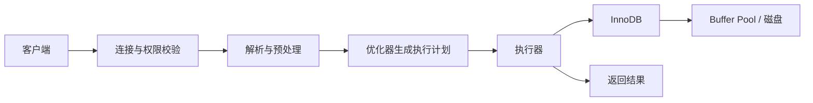
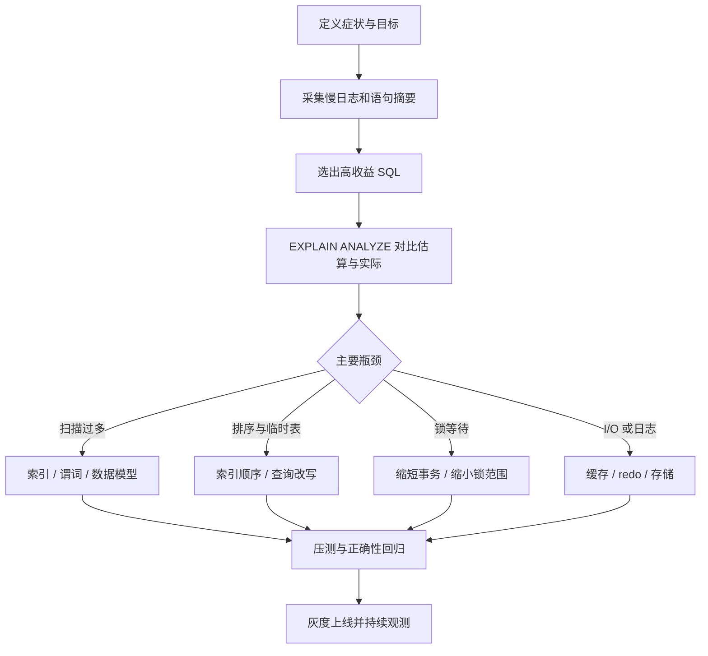

# MySQL 调优：从定位瓶颈到验证收益

本文面向 MySQL 8.x 与 InnoDB。调优的目标不是“让 SQL 看起来更高级”，而是在正确性不变的前提下，用数据证明延迟、吞吐量或资源消耗得到了改善。

::: tip 调优原则

1. 先建立基线，再修改。
2. 先定位瓶颈，再选择工具。
3. 一次只改变一个主要变量。
4. 同时观察平均值、P95/P99、吞吐量和错误率。
5. 优化完成后要回归结果集、并发行为和执行计划。

:::

## 一、先理解查询执行链路

一条查询大致经过以下阶段：



各阶段可能出现不同瓶颈：

| 阶段 | 常见问题 | 优先检查 |
| --- | --- | --- |
| 连接 | 连接数过高、频繁建连、线程排队 | 连接池、`Threads_connected`、`Threads_running` |
| 优化器 | 统计信息失真、索引选择不合理 | `EXPLAIN`、`ANALYZE TABLE`、直方图 |
| 执行器 | 扫描行数多、排序或临时表开销大 | `EXPLAIN ANALYZE`、Performance Schema |
| InnoDB | Buffer Pool 命中率低、刷盘压力大 | Buffer Pool、redo、I/O 延迟 |
| 并发控制 | 锁等待、死锁、长事务 | `data_lock_waits`、死锁日志、事务列表 |

::: warning MySQL 8.x 没有查询缓存

MySQL 8.0 已移除 Query Cache。现代 MySQL 的查询执行链路不应再包含“先查 Query Cache”这一步。应用侧缓存、InnoDB Buffer Pool 和操作系统页缓存是不同层次的机制，不要混为一谈。

:::

## 二、建立可复现的性能基线

### 1. 先定义问题

不要只说“数据库很慢”，至少记录：

- 慢的是单条 SQL、某个接口，还是整个实例；
- 开始时间、持续时间和发生频率；
- P50、P95、P99 延迟与 QPS/TPS；
- 当时的 CPU、内存、磁盘 IOPS、I/O 延迟和网络；
- 是否伴随锁等待、连接堆积、主从延迟或错误率上升；
- 数据量、参数绑定值和并发度。

### 2. 使用慢查询日志捕获样本

先确认当前设置：

```sql
SHOW VARIABLES WHERE Variable_name IN (
  'slow_query_log',
  'slow_query_log_file',
  'long_query_time',
  'log_queries_not_using_indexes'
);
```

在经过评估的诊断窗口内，可以临时调整全局变量：

```sql
SET GLOBAL slow_query_log = ON;
SET GLOBAL long_query_time = 0.5;
```

`long_query_time` 同时具有 Global 和 Session 作用域。修改 Global 值只会成为新连接的默认值；已有连接仍使用原 Session 值，需要重连或在目标会话执行 `SET SESSION long_query_time = 0.5`。连接池应逐连接处理或重建连接。

`log_queries_not_using_indexes` 可能产生大量日志，不能在高流量实例上盲目开启。动态设置通常不会在重启后保留，长期配置应通过配置文件或受控的持久化机制完成。

### 3. 从 Performance Schema 找高成本 SQL

下面的查询按总耗时筛选语句摘要，适合发现“单次不慢，但调用极多”的 SQL：

```sql
SELECT
  DIGEST_TEXT,
  COUNT_STAR AS exec_count,
  ROUND(SUM_TIMER_WAIT / 1e12, 2) AS total_seconds,
  ROUND(AVG_TIMER_WAIT / 1e9, 2) AS avg_ms,
  SUM_ROWS_EXAMINED AS rows_examined,
  SUM_ROWS_SENT AS rows_sent,
  SUM_CREATED_TMP_DISK_TABLES AS disk_tmp_tables
FROM performance_schema.events_statements_summary_by_digest
WHERE DIGEST_TEXT IS NOT NULL
ORDER BY SUM_TIMER_WAIT DESC
LIMIT 20;
```

重点关注两个比例：

```text
扫描放大 = rows_examined / rows_sent
单次成本 = total_time / exec_count
```

扫描放大只能作为候选信号：聚合、计数和存在性判断等查询可能天然扫描多、返回少，必须结合查询语义、执行计划和实际行数判断。返回列过多不会直接提高这个按“行”计算的比值，应另行观察结果字节数、网络开销和覆盖索引机会。调用次数极高时，则可能要从批处理、缓存或调用链入手。

## 三、读懂执行计划

### 1. `EXPLAIN` 与 `EXPLAIN ANALYZE`

`EXPLAIN ANALYZE` 从 MySQL 8.0.18 开始提供。使用前先确认实例版本以及目标语句是否在当前版本的支持范围内。

```sql
EXPLAIN FORMAT=TREE
SELECT id, created_at, total_amount
FROM orders
WHERE user_id = 42
  AND status = 'paid'
ORDER BY created_at DESC
LIMIT 20;

EXPLAIN ANALYZE
SELECT id, created_at, total_amount
FROM orders
WHERE user_id = 42
  AND status = 'paid'
ORDER BY created_at DESC
LIMIT 20;
```

- `EXPLAIN` 展示优化器的估算，不真正返回查询结果。
- `EXPLAIN ANALYZE` 会执行语句，并给出实际行数、循环次数和耗时。
- `EXPLAIN ANALYZE` 会真实执行语句并消耗资源。受支持的 DML 范围随版本而定，不要在未确认版本、影响范围和回滚方案时对生产写操作使用。

传统表格格式中，优先看这些字段：

| 字段 | 关注点 |
| --- | --- |
| `type` | 访问方式。`ALL` 表示全表扫描，但小表或低选择性查询不一定需要优化 |
| `key` | 实际选择的索引，不能只看 `possible_keys` |
| `key_len` | 联合索引实际使用到的大致长度 |
| `rows` | 优化器预计读取的行数 |
| `filtered` | 读取后预计保留的比例 |
| `Extra` | 覆盖索引、索引条件下推、排序、临时表等信息 |

完整字段说明与案例可继续阅读[《MySQL 执行计划》](./MySQL执行计划.md)。

### 2. 用“估算与实际的偏差”定位问题

`EXPLAIN ANALYZE` 中如果估算行数与实际行数相差几个数量级，优化器可能基于错误统计信息选择了错误的连接顺序或索引。依次检查：

1. 表和索引统计信息是否过旧；
2. 数据是否严重倾斜；
3. 多列之间是否存在强相关性；
4. 参数值是否让同一模板呈现完全不同的选择性。

必要时可在维护窗口执行：

```sql
ANALYZE TABLE orders;
```

不要把 `FORCE INDEX` 当作首选方案。它会把当前数据分布下的经验固化到 SQL 中，数据增长后可能变成新的瓶颈。

## 四、InnoDB 与索引机制

### 1. 页、聚簇索引与二级索引

InnoDB 默认页大小通常为 16 KiB，可以用下面的语句确认：

```sql
SHOW VARIABLES LIKE 'innodb_page_size';
```

InnoDB 的表数据按聚簇索引组织：

- 有主键时，主键作为聚簇索引；
- 没有主键时，InnoDB 会选择定义顺序中的第一个、且所有键列均为 `NOT NULL` 的 `UNIQUE` 索引；
- 都不存在时，InnoDB 生成隐藏的行标识；
- 二级索引叶子节点保存二级索引键和聚簇索引键；后者通常是主键，也可能是被选中的唯一键或隐藏行标识；
- 通过二级索引获取未被索引覆盖的列时，需要再访问聚簇索引，这就是“回表”。


因此，主键越宽，每个二级索引的空间成本通常越高。主键应稳定、非空并尽量紧凑，但是否使用自增键仍需结合分库、数据合并和写入热点等约束决定。

### 2. 联合索引不是“字段集合”

联合索引 `(a, b, c)` 按字典序排列，可以直接支持从最左列开始的搜索：

```sql
WHERE a = ?;
WHERE a = ? AND b = ?;
WHERE a = ? AND b = ? AND c = ?;
```

它通常不能高效定位完全跳过 `a` 的条件：

```sql
WHERE b = ? AND c = ?;
```

MySQL 在特定情况下可能采用 Skip Scan 等策略，但这不等于索引顺序可以忽略。是否有效必须以当前版本、数据分布和执行计划为准。

### 3. 联合索引顺序：等值、排序、范围

常见的设计顺序是：

1. 放置高频的等值条件；
2. 尝试让索引顺序满足 `ORDER BY` 或 `GROUP BY`；
3. 将范围条件放在等值条件之后；
4. 仅在收益明确时加入返回列形成覆盖索引。

例如：

```sql
SELECT id, created_at, total_amount
FROM orders
WHERE user_id = ?
  AND status = 'paid'
  AND created_at >= ?
ORDER BY created_at DESC
LIMIT 20;
```

候选索引可以是：

```sql
CREATE INDEX idx_orders_user_status_created
ON orders (user_id, status, created_at DESC);
```

这里不能只背“选择性最高的列放最前”。索引还要服务查询前缀、排序、范围与复用关系。最终应使用真实参数和接近生产的数据量验证。

### 4. 覆盖索引与回表

如果查询需要的列都能从索引得到，就可能避免回表：

```sql
CREATE INDEX idx_orders_user_status_created_amount
ON orders (user_id, status, created_at DESC, total_amount);
```

覆盖索引会提高读取性能，但也会增加：

- 索引占用空间；
- 写入与页分裂成本；
- Buffer Pool 压力；
- DDL 和维护成本。

不要为了消除一次回表，把大量低价值列塞入索引。

### 5. 保持谓词可索引

下面的写法经常使普通 B+Tree 索引难以直接定位：

```sql
-- 对索引列做函数运算
WHERE DATE(created_at) = '2026-10-09';

-- 隐式类型转换风险
WHERE phone = 13800138000; -- phone 是 VARCHAR

-- 前导通配符
WHERE domain LIKE '%example.com';

-- 对列进行算术运算
WHERE amount * 100 > 5000;
```

优先改写为：

```sql
WHERE created_at >= '2026-10-09 00:00:00'
  AND created_at <  '2026-10-10 00:00:00';

WHERE phone = '13800138000';

WHERE amount > 50;
```

函数索引、生成列、全文索引或专用搜索系统也可能适用，但应根据查询模式选型，而不是机械改写。

## 五、SQL 与数据访问优化

### 1. 只读取需要的数据

```sql
-- 避免
SELECT * FROM orders WHERE id = ?;

-- 优先
SELECT id, status, total_amount FROM orders WHERE id = ?;
```

减少返回列可以降低网络、序列化、临时表和回表成本，也更容易形成覆盖索引。

### 2. 使用稳定的分页方式

深分页需要扫描并丢弃大量记录：

```sql
SELECT id, created_at
FROM orders
ORDER BY id
LIMIT 100000, 20;
```

如果业务允许，改用基于游标的 Keyset Pagination：

```sql
SELECT id, created_at
FROM orders
WHERE id > ?
ORDER BY id
LIMIT 20;
```

多列排序时，游标条件必须与排序键和唯一性保持一致，例如使用 `(created_at, id)`。

### 3. 避免 N+1 查询

应用先查一批主记录，再逐行查询关联数据，会把一次请求放大成大量数据库往返。可根据场景选择：

- 一次 `JOIN`；
- 批量 `IN (...)`；
- 预加载；
- 数据加载器或应用层合并。

`JOIN` 并不总比子查询快，`IN` 也不总比 `EXISTS` 慢。优化器会重写部分查询，结论必须以执行计划和实测为准。

### 4. 批量写入并控制事务大小

与逐行提交相比，适度批量写入能减少网络往返和提交成本：

```sql
INSERT INTO event_log (event_type, payload)
VALUES
  ('created', '{"id": 1}'),
  ('created', '{"id": 2}'),
  ('created', '{"id": 3}');
```

批次过大又会增加事务持锁时间、redo/undo 压力和失败重试成本。批量大小应通过压测确定。

### 5. 谨慎使用大范围更新和删除

将大任务拆成有界批次：

```sql
DELETE FROM audit_log
WHERE id < ?
ORDER BY id
LIMIT 5000;
```

每批提交后记录进度，并观察复制延迟、锁等待、redo 生成速率和磁盘空间。需要删除大部分数据时，还应比较分区淘汰、归档换表等方案。

## 六、事务、MVCC 与锁

### 1. 一致性读与锁定读

普通 `SELECT` 通常是一致性读，通过 MVCC 读取可见版本，不为返回的记录加行锁：

```sql
SELECT * FROM inventory WHERE sku_id = 1001;
```

锁定读读取较新的可见数据并加锁：

```sql
SELECT *
FROM inventory
WHERE sku_id = 1001
FOR UPDATE;
```

如果后续决策依赖“读到后直到更新前不能被别人改变”，应在同一短事务内使用锁定读或原子条件更新，而不是先普通查询再写入。

### 2. 隔离级别的关键差异

| 隔离级别 | 普通一致性读 | 主要权衡 |
| --- | --- | --- |
| `READ COMMITTED` | 每次一致性读通常创建新的 Read View | 锁冲突较少，但同一事务两次读取可能不同 |
| `REPEATABLE READ` | 首次一致性读建立快照，后续通常复用 | MySQL 默认级别；需理解快照读与当前读差异 |
| `SERIALIZABLE` | 更强隔离，普通读行为也更严格 | 并发能力较低，只适合确有需要的场景 |

隔离级别不是越高越好，也不能因为“访问量大”就直接切换到 `READ COMMITTED`。它是业务正确性契约的一部分，修改前必须验证库存、余额、幂等和重试逻辑。

### 3. Record、Gap 与 Next-Key Lock

- Record Lock：锁定索引记录；
- Gap Lock：锁定索引记录之间的间隙；
- Next-Key Lock：索引记录上的 Record Lock 与该记录之前的 Gap Lock 的组合。

在 `REPEATABLE READ` 下，范围锁定读可能使用 Next-Key Lock，阻止其他事务向相关范围插入记录。锁定范围由访问路径决定：缺少合适索引时，MySQL 可能扫描并锁定大量索引记录，看起来像“锁住了整张表”，但不应简单描述为自动升级成表锁。

### 4. 用原子更新实现乐观并发控制

```sql
UPDATE inventory
SET stock = stock - 1,
    version = version + 1
WHERE sku_id = ?
  AND stock > 0
  AND version = ?;
```

应用检查受影响行数：

- `1`：更新成功；
- `0`：库存不足、版本冲突或记录不存在，需要重新读取并按策略重试。

不要无限重试。设置最大次数、退避和幂等键，避免冲突时形成重试风暴。

### 5. 诊断锁等待与死锁

```sql
SELECT *
FROM performance_schema.data_lock_waits;

SELECT *
FROM performance_schema.data_locks;

SHOW ENGINE INNODB STATUS;
```

常见治理手段：

1. 缩短事务，把网络调用和复杂计算移出事务；
2. 为锁定读提供准确索引，缩小扫描和加锁范围；
3. 多表更新采用一致的访问顺序；
4. 对死锁和锁等待超时做有界重试；
5. 监控长事务，避免 undo 版本长期无法回收。

## 七、表结构与索引维护

### 1. 选择合适的数据类型

- 在覆盖业务范围的前提下使用合适的整数宽度；
- 金额使用 `DECIMAL` 或最小货币单位整数，不使用浮点数表达精确金额；
- 时间类型要明确时区和取值范围；
- 字符集与排序规则应服务真实比较语义；
- `NOT NULL` 应依据数据模型，而不是作为无条件性能口诀；
- `ENUM` 会把业务值集合固化进表结构，不适合频繁变化的字典。

### 2. 定期审查冗余和未使用索引

索引会增加写放大和存储占用。删除索引前至少确认：

- 观察窗口覆盖完整业务周期；
- 没有低频但关键的月末、报表或故障恢复查询；
- 不属于外键、唯一约束或关键排序需求；
- 已准备回滚方案。

MySQL 8.x 可以先将候选索引设为不可见进行验证：

```sql
ALTER TABLE orders ALTER INDEX idx_legacy INVISIBLE;

-- 验证完成后恢复或删除
ALTER TABLE orders ALTER INDEX idx_legacy VISIBLE;
```

不可见索引默认只是不参与优化器选路，索引本身仍会被维护、占用空间，`UNIQUE` 约束也仍然生效；显式或隐式主键不能设为不可见。如果开启 `optimizer_switch=use_invisible_indexes=on`，优化器仍可使用它。因此该功能适合验证查询计划与回归风险，不能模拟真正删除索引后的写入和空间收益。

## 八、实例参数：先判断资源瓶颈

参数调优不能替代 SQL 和索引优化。优先关注下列类别，而不是复制一份“万能配置”：

| 类别 | 代表参数或指标 | 需要回答的问题 |
| --- | --- | --- |
| Buffer Pool | `innodb_buffer_pool_size`、读请求与物理读 | 活跃数据集能否被缓存，是否挤压操作系统和其他进程 |
| Redo | redo 容量、checkpoint age、日志等待 | 写入突发时是否频繁 checkpoint 或等待日志空间 |
| 刷盘 | `innodb_flush_log_at_trx_commit`、`sync_binlog` | 可接受多大的故障数据丢失窗口 |
| 临时表 | 内存/磁盘临时表计数 | 是否因排序、分组或列类型频繁落盘 |
| 连接 | `max_connections`、活跃线程、连接内存 | 连接上限是否掩盖了连接泄漏或下游过载 |
| I/O | 数据文件与日志文件延迟 | 瓶颈是缓存不足、随机读、刷脏还是存储本身 |

涉及持久性的参数必须由业务 RPO/RTO 决定。为追求跑分而降低刷盘保证，可能把性能问题变成数据一致性事故。

## 九、一套可执行的调优流程



### 示例：订单列表查询

原始查询：

```sql
SELECT *
FROM orders
WHERE user_id = 42
  AND status = 'paid'
  AND DATE(created_at) = '2026-10-09'
ORDER BY created_at DESC
LIMIT 20;
```

诊断重点：

1. `DATE(created_at)` 是否阻碍范围定位；
2. 现有索引是否同时服务等值过滤与排序；
3. `SELECT *` 是否导致不必要回表和网络传输；
4. 估算行数与实际行数是否接近。

改写查询：

```sql
SELECT id, created_at, total_amount
FROM orders
WHERE user_id = 42
  AND status = 'paid'
  AND created_at >= '2026-10-09 00:00:00'
  AND created_at <  '2026-10-10 00:00:00'
ORDER BY created_at DESC
LIMIT 20;
```

候选索引：

```sql
CREATE INDEX idx_orders_user_status_created
ON orders (user_id, status, created_at DESC);
```

验证时不要只看“是否命中索引”，还要对比：

- 实际扫描行数；
- 首行和总执行时间；
- Buffer Pool 冷热两种状态；
- 不同用户、状态和日期参数；
- 并发下的 P95/P99；
- 索引增加后的写入成本和空间占用。

## 十、上线前检查清单

- [ ] 记录了变更前的执行计划、延迟、扫描行数和资源指标；
- [ ] 使用真实数据分布与代表性参数完成验证；
- [ ] 校验了结果集、排序、分页与事务语义；
- [ ] 新索引与现有索引没有明显重复；
- [ ] 评估了在线 DDL 的锁、空间、复制延迟和执行时间；
- [ ] 未用 `FORCE INDEX` 掩盖统计信息或查询设计问题；
- [ ] 参数变更明确记录了持久性与内存风险；
- [ ] 准备了回滚方式和上线后的观测窗口。

## 参考资料

- [MySQL 8.4 Reference Manual: Optimization](https://dev.mysql.com/doc/refman/8.4/en/optimization.html)
- [MySQL 8.4 Reference Manual: EXPLAIN](https://dev.mysql.com/doc/refman/8.4/en/explain.html)
- [MySQL 8.4 Reference Manual: InnoDB Indexes](https://dev.mysql.com/doc/refman/8.4/en/innodb-indexes.html)
- [MySQL 8.4 Reference Manual: InnoDB Locking and Transaction Model](https://dev.mysql.com/doc/refman/8.4/en/innodb-locking-transaction-model.html)
- [MySQL 8.4 Reference Manual: Performance Schema](https://dev.mysql.com/doc/refman/8.4/en/performance-schema.html)
