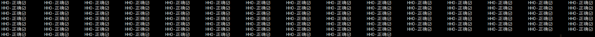
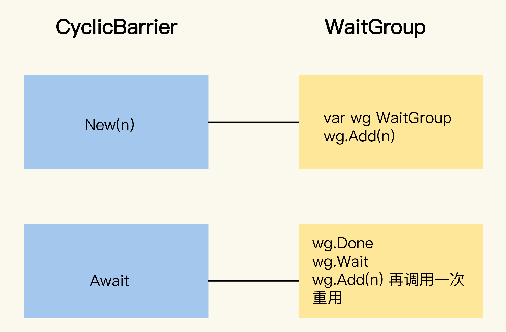
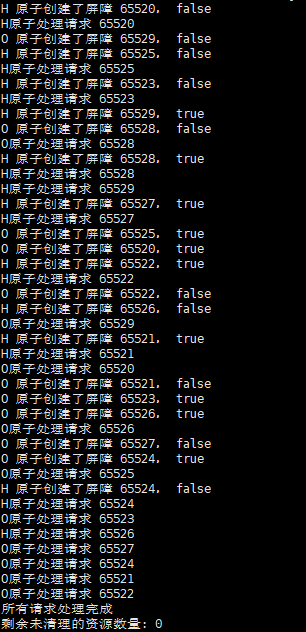

一氧化二氢引出的业务优化

<!-- more -->

## 1. 水工厂问题

### 1.1 问题如下

有一个名叫大自然的搬运工的工厂，生产一种叫做一氧化二氢的神秘液体。这种液体的分子是由一个氧原子和两个氢原子组成的，也就是水（H~2~O）。

这个工厂有多条生产线，每条生产线负责生产氧原子或者是氢原子，每条生产线由一个 **goroutine** 负责。
这些生产线会通过一个栅栏，只有一个氧原子生产线和两个氢原子生产线都准备好，才能生成出一个水分子， 否则所有的生产线都会处于 **等待状态**。

也就是说，一个水分子必须由三个不同的生产线提供原子，而且水分子是一个一个按照顺序产生的， 每生产一个水分子，就会打印出 <span style="color:blue"><b>`HHO、HOH、OHH`  </b></span>三种形式的其中一种。<span style="color:red"><b>`HHH、OOH、OHO、HOO、OOO` </b> </span> 都是不被允许的。
生产线中氢原子的生产线为 **2N** 条，氧原子的生产线为 **N** 条。

**思路：**  

如果使用 **WaitGroup**，则非常复杂，而且重用和 **Done** 方法的调用有并发的问题，程序可能 **panic**，此时应考虑 **循环栅栏**

```go
package main

import (
	"context"
	"fmt"
	"math/rand"
	"sort"
	"sync"
	"time"

	"github.com/marusama/cyclicbarrier"
	"golang.org/x/sync/semaphore"
)

// H2O 定义水分子的组成
type H2O struct {
	semaH *semaphore.Weighted         // 氢原子的信号量
	semaO *semaphore.Weighted         // 氧原子的信号量
	b     cyclicbarrier.CyclicBarrier // 循环栅栏，用来控制合成
}

func New() *H2O {
	return &H2O{
		semaH: semaphore.NewWeighted(2), // 氢原子需要两个
		semaO: semaphore.NewWeighted(1), // 氧原子需要一个
		b:     cyclicbarrier.New(3),     // 需要三个原子才能合成
	}
}

func (h2o *H2O) hydrogen(releaseHydrogen func()) {
	h2o.semaH.Acquire(context.Background(), 1)

	releaseHydrogen()                 // 输出H
	h2o.b.Await(context.Background()) // 等待栅栏放行
	h2o.semaH.Release(1)              // 释放氢原子空槽
}

func (h2o *H2O) oxygen(releaseOxygen func()) {
	h2o.semaO.Acquire(context.Background(), 1)

	releaseOxygen()                   // 输出O
	h2o.b.Await(context.Background()) // 等待栅栏放行
	h2o.semaO.Release(1)              // 释放氢原子空槽
}

func main() {
	//用来存放水分子结果的channel
	var ch chan string
	releaseHydrogen := func() {
		ch <- "H"
	}
	releaseOxygen := func() {
		ch <- "O"
	}

	// 300个原子，300个goroutine,每个goroutine并发的产生一个原子
	var N = 100
	ch = make(chan string, N*3)

	h2o := New()

	// 用来等待所有的goroutine完成
	var wg sync.WaitGroup
	wg.Add(N * 3)

	// 200个氢原子goroutine
	for i := 0; i < 2*N; i++ {
		go func() {
			time.Sleep(time.Duration(rand.Intn(100)) * time.Millisecond)
			h2o.hydrogen(releaseHydrogen)
			wg.Done()
		}()
	}
	// 100个氧原子goroutine
	for i := 0; i < N; i++ {
		go func() {
			time.Sleep(time.Duration(rand.Intn(100)) * time.Millisecond)
			h2o.oxygen(releaseOxygen)
			wg.Done()
		}()
	}
	//等待所有的goroutine执行完
	wg.Wait()

	// 结果中肯定是300个原子
	if len(ch) != N*3 {
		fmt.Println("错误 ❌: expect %d atom but got %d", N*3, len(ch))
		return
	}
	// 每三个原子一组，分别进行检查。要求这一组原子中必须包含两个氢原子和一个氧原子，这样才能正确组成一个水分子。
	var s = make([]string, 3)
	for i := 0; i < N; i++ {
		s[0] = <-ch
		s[1] = <-ch
		s[2] = <-ch
		sort.Strings(s)

		water := s[0] + s[1] + s[2]
		if water != "HHO" {
			fmt.Println("错误 ❌: expect a water molecule but got %s", water)
			return
		}
		fmt.Printf("%s-正确✅\t ", water)
	}
	fmt.Println("")
}
```

**打印结果：** 

 

### 1.2 CyclicBarrier 与 WaitGroup

[CyclicBarrier](https://github.com/marusama/cyclicbarrier) 是一个可重用的栅栏并发原语，常常应用于重复进行一组 **goroutine** 同时执行的场景中。其允许一组 **goroutine** 彼此等待，到达一个共同的执行点，同时，由于可以被重复使用，也叫 **循环栅栏**。具体的机制是，大家都在栅栏前等待，等全部都到齐了，就抬起栅栏放行。

与 **WaitGroup** 的区别如下:

1. **CyclicBarrier** 适合用于 *“固定数量的 **goroutine** 等待同一个执行点 “*  的场景中；
2. 放行 **goroutine** 之后，**CyclicBarrier** 可以重复利用；
3. 不像 **WaitGroup** 重用的时候，必须小心翼翼避免 **panic**；

处理可重用的多 **goroutine** 等待同一个执行点的场景的时候，**CyclicBarrier** 和 **WaitGroup** 方法调用的对应关系如下：

  

如果使用 **WaitGroup** 实现的话，调用比较复杂，不像 **CyclicBarrier** 那么清爽。更重要的是，如果想重用 **WaitGroup**，你还要保证，将 **WaitGroup** 的计数值重置到 **n** 的时候不会出现并发问题。

::: tip 贴士：

**WaitGroup** 更适合用在 *“一个 **goroutine** 等待一组 **goroutine** 到达 **同一个** 执行点 ”* 的场景中（非 **goroutine** 内部），或者是不需要重用的场景中。

而该同步原语（*cyclicbarrier*）特别适合需要分阶段同步的并行计算场景

:::

### 1.3 CyclicBarrier 说明

**CyclicBarrier** 有两个初始化方法：

1. 第一个是 **New** 方法，它只需要一个参数，来指定循环栅栏参与者的数量；
2. 第二个方法是 **NewWithAction：**  
   - 它额外提供一个函数，可以在每一次到达执行点的时候执行一次
   - 执行具体的时间点是在 **最后一个参与者到达之后，但是其它的参与者还未被放行之前** 。故能利用它，做放行之前的一些共享状态的更新等操作。

```go
func New(parties int) CyclicBarrier
func NewWithAction(parties int, barrierAction func() error) CyclicBarrier
```

**CyclicBarrier** 是一个接口，定义的方法如下：

```go
type CyclicBarrier interface {
    // 等待所有的参与者到达，如果被ctx.Done()中断，会返回ErrBrokenBarrier
    Await(ctx context.Context) error

    // 重置循环栅栏到初始化状态。如果当前有等待者，那么它们会返回ErrBrokenBarrier
    Reset() 

    // 返回当前等待者的数量
    GetNumberWaiting() int

    // 参与者的数量
    GetParties() int

    // 循环栅栏是否处于中断状态
    IsBroken() bool
}
```

循环栅栏的使用也很简单，参与者只需调用 **Await(ctx)** 等待，等所有的参与者都到达后，再执行下一步。

当执行下一步的时候，循环栅栏的状态又恢复到初始的状态了，可以迎接下一轮同样多的参与者。

### 1.4 CyclicBarrier 的实现

#### CyclicBarrier 的数据结构及核心代码

```go
// round
type round struct {
	count    int           // count of goroutines for this roundtrip
	waitCh   chan struct{} // wait channel for this roundtrip
	brokeCh  chan struct{} // channel for isBroken broadcast
	isBroken bool          // is barrier broken
}

// cyclicBarrier impl CyclicBarrier intf
type cyclicBarrier struct {
	parties       int
	barrierAction func() error

	lock  sync.RWMutex
	round *round
}

// New initializes a new instance of the CyclicBarrier, specifying the number of parties.
func New(parties int) CyclicBarrier {
	if parties <= 0 {
		panic("parties must be positive number")
	}
	return &cyclicBarrier{
		parties: parties,
		lock:    sync.RWMutex{},
		round: &round{
			waitCh:  make(chan struct{}),
			brokeCh: make(chan struct{}),
		},
	}
}
```

#### Await

```go
// Await 等待直到所有参与方都在此屏障上调用了 await
// 如果在任何 goroutine 等待时屏障被重置，或者当 await 被调用时屏障已损坏，或者在等待时屏障损坏，则返回 ErrBrokenBarrier
// 如果任何 goroutine 在等待时被 ctx.Done() 中断，则所有其他等待的 goroutine 将返回 ErrBrokenBarrier，并且屏障进入损坏状态
// 如果当前 goroutine 是最后一个到达的，并且在构造函数中提供了非 nil 的屏障动作，则当前 goroutine 在允许其他 goroutine 继续之前运行该动作
// 如果在屏障动作期间发生错误，则返回该错误并且屏障进入损坏状态
func (b *cyclicBarrier) Await(ctx context.Context) error {
	var (
		ctxDoneCh <-chan struct{}
	)
    // 如果有上下文，获取其Done通道
	if ctx != nil {
		ctxDoneCh = ctx.Done()
	}

	// 检查上下文是否已取消（非阻塞检查）
	select {
	case <-ctxDoneCh:
		return ctx.Err()
	default:
	}

	b.lock.Lock()

	// 检查屏障是否已损坏
	if b.round.isBroken {
		b.lock.Unlock()
		return ErrBrokenBarrier
	}

	// 增加等待goroutine计数
	b.round.count++

	// 保存到局部变量预防竞态条件
	waitCh := b.round.waitCh
	brokeCh := b.round.brokeCh
	count := b.round.count

	b.lock.Unlock()
	
    // 防御性检查：调用次数不能超过参与方总数
	if count > b.parties {
		panic("CyclicBarrier.Await is called more than count of parties")
	}

	if count < b.parties {
		// 非最后一个到达的goroutine, 等待其他goroutine
		select {
		case <-waitCh:		// 正常释放通道
			return nil
		case <-brokeCh: 	// 屏障损坏通道
			return ErrBrokenBarrier
		case <-ctxDoneCh:	// 上下文取消
			b.breakBarrier(true)
			return ctx.Err()
		}
	} else {
        // 最后一个到达的goroutine, 执行屏障动作并重置屏障
		if b.barrierAction != nil {
			err := b.barrierAction()
			if err != nil {
				b.breakBarrier(true)
				return err
			}
		}
		b.reset(true) // 安全重置屏障
		return nil
	}
}

func (b *cyclicBarrier) reset(safe bool) {
	b.lock.Lock()
	defer b.lock.Unlock()

	if safe {
        // 安全模式：broadcast 正常关闭等待通道（所有goroutine正常释放）
		close(b.round.waitCh)
	} else if b.round.count > 0 {
        // 非安全模式且有等待者时，破坏屏障
		b.breakBarrier(false)
	}

	// 创建新的轮次（关键的重置操作）
	b.round = &round{
		waitCh:  make(chan struct{}),
		brokeCh: make(chan struct{}),
	}
}

func (b *cyclicBarrier) breakBarrier(needLock bool) {
    // 按需加锁（避免重复加锁）
	if needLock {
		b.lock.Lock()
		defer b.lock.Unlock()
	}

	if !b.round.isBroken {
		b.round.isBroken = true

        // broadcast 广播损坏状态（通过关闭通道实现）
		close(b.round.brokeCh)
	}
}
```

**关键点**：

- **条件加锁**：通过 `needLock` 参数避免在已持有锁的情况下重复加锁
- **广播机制**：关闭 `brokeCh` 通道会立即释放所有等待的 **goroutine**
- **幂等设计**：只有屏障未损坏时才执行操作

## 2. 业务中的思考

既然 **H2O** 可以通过 **CyclicBarrier** 控制并发 - 同步点，那么 **“H” - “O”** 也可以。这不正好对应的业务中的类似场景：

- 视频录制地址是 **预制的地址** ，可能 **先、后** 于录制视频回调触发的路径移动，此时要控制 **A协程 地址生成后 **， **B协程再进行录制视频文件的移动**； 
- 推送时机同步；

### 2.1 单机屏障

```go
package main

import (
	"context"
	"fmt"
	"github.com/marusama/cyclicbarrier"
	"math/rand"
	"sync"
	"time"
)

// SyncPoint 表示一个同步点，用于H和O原子的配对
type SyncPoint struct {
	barrier cyclicbarrier.CyclicBarrier
	mu      sync.Mutex
	done    bool // 标记是否已经完成配对
}

// H2OManager 管理所有的H2O配对
type H2OManager struct {
	syncMap sync.Map // key: requestID, value: *SyncPoint
}

// NewH2OManager 创建一个新的H2O管理器
func NewH2OManager() *H2OManager {
	return &H2OManager{}
}

// getOrCreateSyncPoint 获取或创建一个同步点
func (m *H2OManager) getOrCreateSyncPoint(requestID int, elem string) *SyncPoint {
	val, loaded := m.syncMap.LoadOrStore(requestID, &SyncPoint{
		barrier: cyclicbarrier.New(2), // 2个原子配对
	})
	fmt.Printf("%s 原子创建了屏障 %d， %v\n", elem, requestID, loaded)
	return val.(*SyncPoint)
}

// ProcessHydrogen 处理H原子
func (m *H2OManager) ProcessHydrogen(requestID int, doSomething func()) {
	sp := m.getOrCreateSyncPoint(requestID, "H")

	// 执行H原子的操作
	doSomething()

	// 等待配对
	sp.barrier.Await(context.Background())

	// 检查是否已经完成配对
	sp.mu.Lock()
	if !sp.done {
		sp.done = true
		sp.mu.Unlock()
		// 等待一小段时间确保O原子也完成了操作
		//time.Sleep(100 * time.Millisecond)
		// 清理资源
		m.syncMap.Delete(requestID)
	} else {
		sp.mu.Unlock()
	}
}

// ProcessOxygen 处理O原子
func (m *H2OManager) ProcessOxygen(requestID int, doSomething func()) {
	sp := m.getOrCreateSyncPoint(requestID, "O")

	// 执行O原子的操作
	doSomething()

	// 等待配对
	sp.barrier.Await(context.Background())

	// 检查是否已经完成配对
	sp.mu.Lock()
	if !sp.done {
		sp.done = true
		sp.mu.Unlock()
		// 等待一小段时间确保H原子也完成了操作
		//time.Sleep(100 * time.Millisecond)
		// 清理资源
		m.syncMap.Delete(requestID)
	} else {
		sp.mu.Unlock()
	}
}

// 模拟随机延迟
func randomPause2(max int) {
	time.Sleep(time.Millisecond * time.Duration(rand.Intn(max)))
}

func main() {
	// 创建H2O管理器
	manager := NewH2OManager()

	// 模拟多个请求
	numRequests := 65530
	var wg sync.WaitGroup
	wg.Add(10 * 2) // 每个请求有H和O两个原子

	// 启动多个worker处理请求
	for i := 65520; i < numRequests; i++ {
		requestID := i

		// 启动H原子处理
		go func(id int) {
			defer wg.Done()
			manager.ProcessHydrogen(id, func() {
				fmt.Printf("H原子处理请求 %d\n", id)
			})
		}(requestID)

		// 启动O原子处理
		go func(id int) {
			defer wg.Done()
			manager.ProcessOxygen(id, func() {
				fmt.Printf("O原子处理请求 %d\n", id)
			})
		}(requestID)
	}

	// 等待所有请求处理完成
	wg.Wait()
	fmt.Println("所有请求处理完成")

	// 验证所有资源是否已清理
	count := 0
	manager.syncMap.Range(func(key, value interface{}) bool {
		count++
		return true
	})
	fmt.Printf("剩余未清理的资源数量: %d\n", count)
}
```

**执行结果：** 

 

通过一个全局 `syncMap sync.Map // key: requestID, value: *SyncPoint`  即可以控制任意两类 **goroutine** 的同步栅栏，其中：

- **requestID：** 即两类 **goroutine** 中的每组标志位；
- **value:** 即 **CyclicBarrier** 的同步点，可等待对方的协程到达；

::: warning 注意：

此种场景适合同一进程下的多类 **goroutine** 同步

:::

### 2.2 分布式屏障

单机如上，可以不引入外部中间件来进行进程中的 **多协程内执行的同步** ，那么分布式呢？


```go
package main

import (
	"context"
	"errors"
	"fmt"
	"github.com/go-redis/redis/v8"
	"math"
	"time"
)

type RedisBarrier struct {
	client     *redis.Client
	barrierKey string
	releaseKey string
	parties    int
	timeout    time.Duration
}

func NewRedisBarrier(client *redis.Client, barrierKey string, parties int, timeout time.Duration) *RedisBarrier {
	return &RedisBarrier{
		client:     client,
		barrierKey: barrierKey,
		releaseKey: barrierKey + ":release",
		parties:    parties,
		timeout:    timeout,
	}
}

func (b *RedisBarrier) Await(ctx context.Context) error {
	script := redis.NewScript(`
    local n = redis.call("INCR", KEYS[1])
    if n == 1 then
		local timeout = tonumber(ARGV[1])
		if timeout < 1 then timeout = 1 end
        redis.call("EXPIRE", KEYS[1], timeout)
    end
    return n
	`)
	// 设置过期时间 防止悬挂
	timeoutSec := int(math.Round(b.timeout.Seconds()))
	n, err := script.Run(ctx, b.client, []string{b.barrierKey}, timeoutSec).Result()
	if err != nil {
		if err == redis.Nil {
			fmt.Println(b.barrierKey, "脚本执行结果异常")
			return nil
		}
		return err
	}

	if _, ok := n.(int64); !ok {
		return errors.New("redis result n type is not int64")
	}
	if n == int64(b.parties) {
		// 最后一个到达，释放其他等待者
		for i := 0; i < b.parties-1; i++ {
			b.client.RPush(ctx, b.releaseKey, "go")
		}
		// 释放自己 清理 barrier key 和 release key
		b.client.Del(ctx, b.barrierKey)
		b.client.Del(ctx, b.releaseKey)
	} else {
		// 阻塞等待被释放
		_, err = b.client.BLPop(ctx, b.timeout, b.releaseKey).Result()
		if err != nil {
			if err == redis.Nil {
				fmt.Println(b.barrierKey, "阻塞等待被释放, %s 已过期\n", b.releaseKey)
				return nil
			}
			return err
		}
	}
	return nil
}

func main() {
	ctx := context.Background()
	rdb := redis.NewClient(&redis.Options{
		Addr:     "192.168.14.33:6379",
		Password: "CORERAIN@redis2024",
	})

	barrierKey := fmt.Sprintf("redis_barrier_%d", 2333)
	barrier := NewRedisBarrier(rdb, barrierKey, 2, 30*time.Second)
	fmt.Println("arriving barrier，等待其他进程...")
	err := barrier.Wait(ctx)
	if err != nil {
		fmt.Println("barrier error:", err)
	} else {
		fmt.Println("所有进程都到达，继续执行")
	}
	time.Sleep(2 * time.Second)
	fmt.Println("Over.")
}
```

**代码说明：** 

- **barrierKey** 用于计数，**releaseKey** 用于释放等待者。
- **parties** 是参与 **barrier** 的进程/协程数。
- 每轮 **barrier** 结束后自动清理 **key**，可循环使用。
- 可以在不同进程/主机上运行这段代码，达到多轮分布式同步效果。


### 2.3 场景差异

可能会有人和我一样，一开始觉着有些像抢分布式锁，然后怎么怎么样…. 但感觉又不像，这是由于没透彻分清差异：

| 功能      | 分布式锁       | 分布式循环屏障     |
| --------- | -------------- | ------------------ |
| 语义      | 互斥           | 同步               |
| 典型用法  | 只允许一个执行 | 等待所有人到齐     |
| Redis实现 | SETNX/Redlock  | INCR+BLPOP/RPUSH等 |
| 谁先到    | 谁先执行       | 谁先到都要等       |

::: important **stack overflow的学院级示例：** 

 在一个假设的剧院中：

- It is called <span style="font-size:1.1em">**Mutex** </span> if only one person is allowed to watch the play.
  - 如果只允许一个人观看演出，则称为互斥锁。
- It is called <span style="font-size:1.1em">**Semaphore** </span> if N number of people are allowed to watch the play. If anybody leaves the Theater during the play then other person can be allowed to watch the play.
  - 如果允许 N 个人观看演出，则称为信号量。如果在演出期间任何人离开剧院，则可以允许其他人观看演出。
- It is called <span style="font-size:1.1em">**CountDownLatch**</span>  if no one is allowed to enter until every person vacates the theater. Here each person has free will to leave the theater.
  - 如果直到每个人都离开剧院才允许进入，则称为倒计时门闩。在这里，每个人都有自由离开剧院的意愿。
- It is called <span style="font-size:1.1em">**CyclicBarrier** </span> if the play will not start until every person enters the theater. Here a showman can not start the show until all the persons enter and grab the seat. Once the play is finished the same barrier will be applied for next show.
  - 如果演出不会开始，直到每个人都进入剧院，则称为循环屏障。在这里，表演者不能开始表演，直到所有的人都进入并占据座位。一旦演出结束，相同的屏障将适用于下一场演出。

Here, a person is a *thread*, a play is a *resource*.
在这里，一个人是一个线程，一个演出是一个资源。

::: 


::: note **附录：** etcd并发原语

- [**Barrier：** 分布式栅栏](https://github.com/etcd-io/etcd/blob/882713c4b6d383b18d2b9924738df7c07b2f360f/client/v3/experimental/recipes/barrier.go#L4)

- [**DoubleBarrier：** 计数型栅栏](https://github.com/etcd-io/etcd/blob/882713c4b6d383b18d2b9924738df7c07b2f360f/client/v3/experimental/recipes/double_barrier.go#L27)

:::

