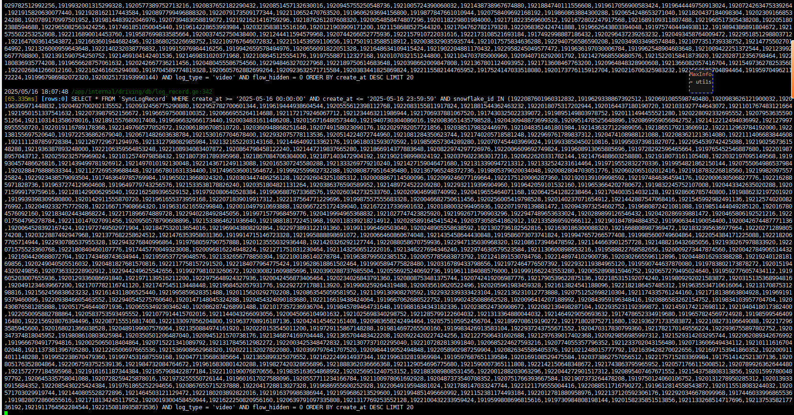
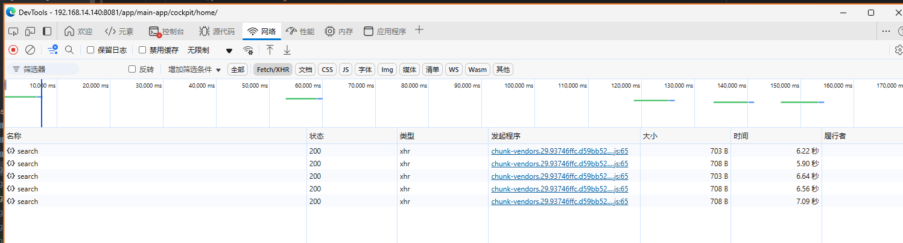
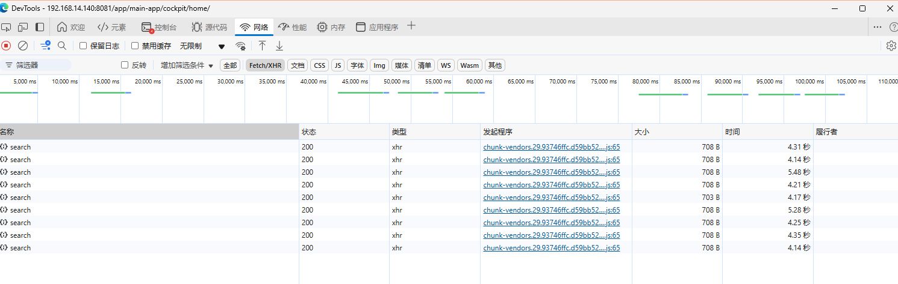

**go-zero** 的并发利器 **mr** 在业务中的应用

<!-- more -->

## 1. 查询异常

**原查询如下：** 这是一个告警 **List** 接口，其中 `filters.SnowflakeIdList` 会根据传入的 **雪花ID** 来过滤其对应范围内的告警数据，但当其长度十分大时，对应的 **SQL** 会超过 **65535** 个长度，从而触发异常 <span style="color:red">Error 1390 (HYooo): Prepared statement contains too many placeholders.</span>

```go
func (slr *SyncLogRecordRepo) List(ctx context.Context, filters *vo.LogRecordListFilter, fields []string) ([]*entities.SyncLogRecord, error) {
	var dbInfos []models.SyncLogRecord

	// 增加查询超时
	ctx, cancel := context.WithTimeout(ctx, 60*time.Second)
	defer cancel()

	query := slr.DbPool.Scopes(models.ActiveRecord).WithContext(ctx).Model(&models.SyncLogRecord{})
	if filters.PageSize <= 0 {
		filters.PageSize = 20
	}

	offset := int32(0)
	if filters.Current > 1 {
		offset = filters.PageSize * (filters.Current - 1)
	}

	if fields != nil && len(fields) > 0 {
		query.Select(fields)
	}

	query = formatQuery(query, &LogRecordQueryBase{
		Keyword:         filters.Keyword,
		StartDate:       filters.StartDate,
		EndDate:         filters.EndDate,
		AlgorithmIdList: filters.AlgorithmIdList,
		Archived:        filters.Archived,
		HandleStatus:    filters.HandleStatus,
		LogType:         filters.LogType,
		WhetherAlert:    filters.WhetherAlert,
		CameraUuidList:  filters.CameraUuidList,
		SnowflakeIdList: filters.SnowflakeIdList,
		IDList:          filters.IDList,
		SystemID:        filters.SystemID,
	})
	result := query.Order(fmt.Sprintf("%s %s", filters.GetSortField(), filters.GetSortType())).Limit(int(filters.PageSize)).Offset(int(offset)).Find(&dbInfos)
	if result.Error != nil {
		return nil, result.Error
	}
	var entityList []*entities.SyncLogRecord
	for _, dbInfo := range dbInfos {
		entityList = append(entityList, dbInfo.TransToEntity())
	}
	return entityList, nil
}
```

此时，理所当然会考虑进行批处理分批查询并处理然后聚合，即 **MapReduce** 

## 2. MapReduce

### 2.1 概念及基本使用

- [wiki](https://en.wikipedia.org/wiki/MapReduce) 
- [go-zero 并发组件 mr](https://go-zero.dev/docs/components/mr#%E7%A4%BA%E4%BE%8B2%E7%AE%80%E5%8D%95%E7%9A%84-mapreduce-%E6%93%8D%E4%BD%9C)  

**MapReduce：** 一种编程模型，使用并行处理来加速大规模数据处理过程。可在 **Hadoop** 集群中的数百或数千台服务器之间实现大规模可扩展性。

```c
function map(String name, String document):
    // name: document name
    // document: document contents
    for each word w in document:
        emit (w, 1)

function reduce(String word, Iterator partialCounts):
    // word: a word
    // partialCounts: a list of aggregated partial counts
    sum = 0
    for each pc in partialCounts:
        sum += pc
    emit (word, sum)
```

其核心思想是“**分而治之**”

- **Mapper负责“分”：** ，即把复杂的任务分解为若干个“简单的任务”来处理。“简单的任务” 包含三层含义：
  - 数据或计算的规模相对原任务要大大 **缩小** ；
  - **就近计算原则**，即任务会分配到存放着所需数据的节点上进行计算；
  - 小任务**可以并行计算，彼此间几乎没有依赖**关系；
- **Reducer：** 负责对 **map** 阶段的**结果进行汇总**。

### 2.2 go-zero的mr源码

```go
package mr

import (
	"context"
	"errors"
	"source/errorx"
	"sync"
	"sync/atomic"
)

const (
	defaultWorkers = 16
	minWorkers     = 1
)

var (
	// ErrCancelWithNil is an error that mapreduce was cancelled with nil.
	ErrCancelWithNil = errors.New("mapreduce cancelled with nil")
	// ErrReduceNoOutput is an error that reduce did not output a value.
	ErrReduceNoOutput = errors.New("reduce not writing value")
)

type (
	// ForEachFunc is used to do element processing, but no output.
	ForEachFunc[T any] func(item T)
	// GenerateFunc is used to let callers send elements into source.
	GenerateFunc[T any] func(source chan<- T)
	// MapFunc is used to do element processing and write the output to writer.
	MapFunc[T, U any] func(item T, writer Writer[U])
	// MapperFunc is used to do element processing and write the output to writer,
	// use cancel func to cancel the processing.
	MapperFunc[T, U any] func(item T, writer Writer[U], cancel func(error))
	// ReducerFunc is used to reduce all the mapping output and write to writer,
	// use cancel func to cancel the processing.
	ReducerFunc[U, V any] func(pipe <-chan U, writer Writer[V], cancel func(error))
	// VoidReducerFunc is used to reduce all the mapping output, but no output.
	// Use cancel func to cancel the processing.
	VoidReducerFunc[U any] func(pipe <-chan U, cancel func(error))
	// Option defines the method to customize the mapreduce.
	Option func(opts *mapReduceOptions)

	mapperContext[T, U any] struct {
		ctx       context.Context
		mapper    MapFunc[T, U]
		source    <-chan T
		panicChan *onceChan
		collector chan<- U
		doneChan  <-chan struct{}
		workers   int
	}

	mapReduceOptions struct {
		ctx     context.Context
		workers int
	}

	// Writer interface wraps Write method.
	Writer[T any] interface {
		Write(v T)
	}
)

// Finish runs fns parallelly, cancelled on any error.
func Finish(fns ...func() error) error {
	if len(fns) == 0 {
		return nil
	}

	return MapReduceVoid(func(source chan<- func() error) {
		for _, fn := range fns {
			source <- fn
		}
	}, func(fn func() error, writer Writer[any], cancel func(error)) {
		if err := fn(); err != nil {
			cancel(err)
		}
	}, func(pipe <-chan any, cancel func(error)) {
	}, WithWorkers(len(fns)))
}

// FinishVoid runs fns parallelly.
func FinishVoid(fns ...func()) {
	if len(fns) == 0 {
		return
	}

	ForEach(func(source chan<- func()) {
		for _, fn := range fns {
			source <- fn
		}
	}, func(fn func()) {
		fn()
	}, WithWorkers(len(fns)))
}

// ForEach maps all elements from given generate but no output.
func ForEach[T any](generate GenerateFunc[T], mapper ForEachFunc[T], opts ...Option) {
	options := buildOptions(opts...)
	panicChan := &onceChan{channel: make(chan any)}
	source := buildSource(generate, panicChan)
	collector := make(chan any)
	done := make(chan struct{})

	go executeMappers(mapperContext[T, any]{
		ctx: options.ctx,
		mapper: func(item T, _ Writer[any]) {
			mapper(item)
		},
		source:    source,
		panicChan: panicChan,
		collector: collector,
		doneChan:  done,
		workers:   options.workers,
	})

	for {
		select {
		case v := <-panicChan.channel:
			panic(v)
		case _, ok := <-collector:
			if !ok {
				return
			}
		}
	}
}

// MapReduce maps all elements generated from given generate func,
// and reduces the output elements with given reducer.
func MapReduce[T, U, V any](generate GenerateFunc[T], mapper MapperFunc[T, U], reducer ReducerFunc[U, V],
	opts ...Option) (V, error) {
	panicChan := &onceChan{channel: make(chan any)}
	source := buildSource(generate, panicChan)
	return mapReduceWithPanicChan(source, panicChan, mapper, reducer, opts...)
}

// MapReduceChan maps all elements from source, and reduce the output elements with given reducer.
func MapReduceChan[T, U, V any](source <-chan T, mapper MapperFunc[T, U], reducer ReducerFunc[U, V],
	opts ...Option) (V, error) {
	panicChan := &onceChan{channel: make(chan any)}
	return mapReduceWithPanicChan(source, panicChan, mapper, reducer, opts...)
}

// mapReduceWithPanicChan maps all elements from source, and reduce the output elements with given reducer.
func mapReduceWithPanicChan[T, U, V any](source <-chan T, panicChan *onceChan, mapper MapperFunc[T, U],
	reducer ReducerFunc[U, V], opts ...Option) (val V, err error) {
	options := buildOptions(opts...)
	// output is used to write the final result
	output := make(chan V)
	defer func() {
		// reducer can only write once, if more, panic
		for range output {
			panic("more than one element written in reducer")
		}
	}()

	// collector is used to collect data from mapper, and consume in reducer
	collector := make(chan U, options.workers)
	// if done is closed, all mappers and reducer should stop processing
	done := make(chan struct{})
	writer := newGuardedWriter(options.ctx, output, done)
	var closeOnce sync.Once
	// use atomic type to avoid data race

	var retErr errorx.AtomicError
	finish := func() {
		closeOnce.Do(func() {
			close(done)
			close(output)
		})
	}
	cancel := once(func(err error) {
		if err != nil {
			retErr.Set(err)
		} else {
			retErr.Set(ErrCancelWithNil)
		}

		drain(source)
		finish()
	})

	go func() {
		defer func() {
			drain(collector)
			if r := recover(); r != nil {
				panicChan.write(r)
			}
			finish()
		}()

		reducer(collector, writer, cancel)
	}()

	go executeMappers(mapperContext[T, U]{
		ctx: options.ctx,
		mapper: func(item T, w Writer[U]) {
			mapper(item, w, cancel)
		},
		source:    source,
		panicChan: panicChan,
		collector: collector,
		doneChan:  done,
		workers:   options.workers,
	})

	select {
	case <-options.ctx.Done():
		cancel(context.DeadlineExceeded)
		err = context.DeadlineExceeded
	case v := <-panicChan.channel:
		// drain output here, otherwise for loop panic in defer
		drain(output)
		panic(v)
	case v, ok := <-output:
		if e := retErr.Load(); e != nil {
			err = e
		} else if ok {
			val = v
		} else {
			err = ErrReduceNoOutput
		}
	}

	return
}

// MapReduceVoid maps all elements generated from given generate,
// and reduce the output elements with given reducer.
func MapReduceVoid[T, U any](generate GenerateFunc[T], mapper MapperFunc[T, U],
	reducer VoidReducerFunc[U], opts ...Option) error {
	_, err := MapReduce(generate, mapper, func(input <-chan U, writer Writer[any], cancel func(error)) {
		reducer(input, cancel)
	}, opts...)
	if errors.Is(err, ErrReduceNoOutput) {
		return nil
	}

	return err
}

// WithContext customizes a mapreduce processing accepts a given ctx.
func WithContext(ctx context.Context) Option {
	return func(opts *mapReduceOptions) {
		opts.ctx = ctx
	}
}

// WithWorkers customizes a mapreduce processing with given workers.
func WithWorkers(workers int) Option {
	return func(opts *mapReduceOptions) {
		if workers < minWorkers {
			opts.workers = minWorkers
		} else {
			opts.workers = workers
		}
	}
}


func buildOptions(opts ...Option) *mapReduceOptions {
	options := newOptions()
	for _, opt := range opts {
		opt(options)
	}

	return options
}

func buildSource[T any](generate GenerateFunc[T], panicChan *onceChan) chan T {
	source := make(chan T)
	go func() {
		defer func() {
			if r := recover(); r != nil {
				panicChan.write(r)
			}
			close(source)
		}()

		generate(source)
	}()

	return source
}

// drain drains the channel.
func drain[T any](channel <-chan T) {
	// drain the channel
	for range channel {
	}
}

func executeMappers[T, U any](mCtx mapperContext[T, U]) {
	var wg sync.WaitGroup
	defer func() {
		wg.Wait()
		close(mCtx.collector)
		drain(mCtx.source)
	}()

	var failed int32
	pool := make(chan struct{}, mCtx.workers)
	writer := newGuardedWriter(mCtx.ctx, mCtx.collector, mCtx.doneChan)
	for atomic.LoadInt32(&failed) == 0 {
		select {
		case <-mCtx.ctx.Done():
			return
		case <-mCtx.doneChan:
			return
		case pool <- struct{}{}:
			item, ok := <-mCtx.source
			if !ok {
				<-pool
				return
			}

			wg.Add(1)
			go func() {
				defer func() {
					if r := recover(); r != nil {
						atomic.AddInt32(&failed, 1)
						mCtx.panicChan.write(r)
					}
					wg.Done()
					<-pool
				}()

				mCtx.mapper(item, writer)
			}()
		}
	}
}

func newOptions() *mapReduceOptions {
	return &mapReduceOptions{
		ctx:     context.Background(),
		workers: defaultWorkers,
	}
}

func once(fn func(error)) func(error) {
	once := new(sync.Once)
	return func(err error) {
		once.Do(func() {
			fn(err)
		})
	}
}

type guardedWriter[T any] struct {
	ctx     context.Context
	channel chan<- T
	done    <-chan struct{}
}

func newGuardedWriter[T any](ctx context.Context, channel chan<- T, done <-chan struct{}) guardedWriter[T] {
	return guardedWriter[T]{
		ctx:     ctx,
		channel: channel,
		done:    done,
	}
}

func (gw guardedWriter[T]) Write(v T) {
	select {
	case <-gw.ctx.Done():
		return
	case <-gw.done:
		return
	default:
		gw.channel <- v
	}
}

type onceChan struct {
	channel chan any
	wrote   int32
}

func (oc *onceChan) write(val any) {
	if atomic.CompareAndSwapInt32(&oc.wrote, 0, 1) {
		oc.channel <- val
	}
}
```


## 3. 优化批处理

该查询场景十分契合其分治并行处理的形式，且分批提高性能（***无需 sleep*** ），故优化后如下：

```go
func (slr *SyncLogRecordRepo) List(ctx context.Context, filters *vo.LogRecordListFilter, fields []string) ([]*entities.SyncLogRecord, error) {
	var dbInfos []models.SyncLogRecord
	// 增加查询超时
	sqlCtx, sqlCancel := context.WithTimeout(ctx, 60*time.Second)
	defer sqlCancel()

	if len(filters.SnowflakeIdList) < listRecordBatchSize {
		query := slr.DbPool.Scopes(models.ActiveRecord).WithContext(sqlCtx).Model(&models.SyncLogRecord{})
		if filters.PageSize <= 0 {
			filters.PageSize = 20
		}

		offset := int32(0)
		if filters.Current > 1 {
			offset = filters.PageSize * (filters.Current - 1)
		}

		if fields != nil && len(fields) > 0 {
			query.Select(fields)
		}
		query = formatQuery(query, &LogRecordQueryBase{
			Keyword:         filters.Keyword,
			StartDate:       filters.StartDate,
			EndDate:         filters.EndDate,
			AlgorithmIdList: filters.AlgorithmIdList,
			Archived:        filters.Archived,
			HandleStatus:    filters.HandleStatus,
			LogType:         filters.LogType,
			WhetherAlert:    filters.WhetherAlert,
			CameraUuidList:  filters.CameraUuidList,
			SnowflakeIdList: filters.SnowflakeIdList,
			IDList:          filters.IDList,
			SystemID:        filters.SystemID,
		})
		result := query.Order(fmt.Sprintf("%s %s", filters.GetSortField(), filters.GetSortType())).Limit(int(filters.PageSize)).Offset(int(offset)).Find(&dbInfos)
		if result.Error != nil {
			return nil, result.Error
		}
		var entityList []*entities.SyncLogRecord
		for _, dbInfo := range dbInfos {
			entityList = append(entityList, dbInfo.TransToEntity())
		}
		return entityList, nil
	}

	// map reduce
	batches := splitIds(filters.SnowflakeIdList, listRecordBatchSize)
	logx.Debugf("List Log, batch: %d, batch Size：%d", len(batches), listRecordBatchSize)
	generateFunc := func(source chan<- []int64) {
		for _, batch := range batches {
			source <- batch
		}
	}
	mapperFunc := func(batch []int64, writer mr.Writer[[]*entities.SyncLogRecord], cancel func(error)) {
		query := slr.DbPool.Scopes(models.ActiveRecord).WithContext(ctx).Model(&models.SyncLogRecord{})
		if filters.PageSize <= 0 {
			filters.PageSize = 20
		}

		offset := int32(0)
		if filters.Current > 1 {
			offset = filters.PageSize * (filters.Current - 1)
		}

		if fields != nil && len(fields) > 0 {
			query.Select(fields)
		}
		query = formatQuery(query, &LogRecordQueryBase{
			Keyword:         filters.Keyword,
			StartDate:       filters.StartDate,
			EndDate:         filters.EndDate,
			AlgorithmIdList: filters.AlgorithmIdList,
			Archived:        filters.Archived,
			HandleStatus:    filters.HandleStatus,
			LogType:         filters.LogType,
			WhetherAlert:    filters.WhetherAlert,
			CameraUuidList:  filters.CameraUuidList,
			SnowflakeIdList: batch,
			IDList:          filters.IDList,
			SystemID:        filters.SystemID,
		})
		result := query.Order(fmt.Sprintf("%s %s", filters.GetSortField(), filters.GetSortType())).
			Limit(int(filters.PageSize)).Offset(int(offset)).Find(&dbInfos)
		if result.Error != nil {
			cancel(result.Error)
			return
		}
		var entityList []*entities.SyncLogRecord
		for _, dbInfo := range dbInfos {
			entityList = append(entityList, dbInfo.TransToEntity())
		}
		writer.Write(entityList)
	}
	reducerFunc := func(pipe <-chan []*entities.SyncLogRecord, writer mr.Writer[[]*entities.SyncLogRecord], cancel func(error)) {
		var all []*entities.SyncLogRecord
		for batch := range pipe {
			all = append(all, batch...)
		}
		writer.Write(all)
	}
	result, err := mr.MapReduce(generateFunc, mapperFunc, reducerFunc, mr.WithContext(sqlCtx), mr.WithWorkers(8))
	if err != nil {
		return nil, err
	}

	return result, nil
}
```

**修改后的 SQL 打印如下：**  

 

**测试并调整并发： ** 

`160 batch * 1000 size = 16W`  数据量, **4 worker**

 

`32 batch * 5000 size = 16W`  数据量, **8 worker**  




## FindInBatches

[**FindInBatches**](https://gorm.io/zh_CN/docs/advanced_query.html#FindInBatches) 允许分批查询和处理记录。 这对于有效地处理大型数据集、减少内存使用和提高性能尤其有用。

使用`FindInBatches`, GORM 处理指定批大小的记录。 在批处理功能中，您可以对每批记录应用操作。

```go
// 处理记录，批处理大小为100
result := db.Where("processed = ?", false).FindInBatches(&results, 100, func(tx *gorm.DB, batch int) error {
  for _, result := range results {
    // 对批中的每条记录进行操作
  }

  // 保存对当前批记录的修改
  tx.Save(&results)

  // tx.RowsAffected 提供当前批处理中记录的计数（the count of records in the current batch）
  // 'batch' 变量表示当前批号（the current batch number）

  // 返回 error 将阻止更多的批处理
  return nil
})
// result.Error 包含批处理过程中遇到的任何错误
// result.RowsAffected 提供跨批处理的所有记录的计数（the count of all processed records across batches）
```

