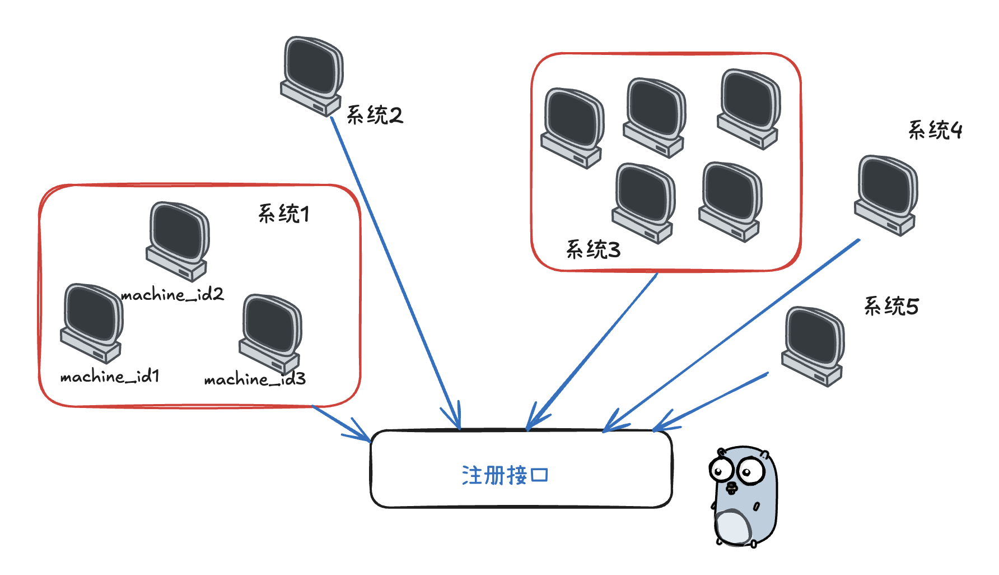
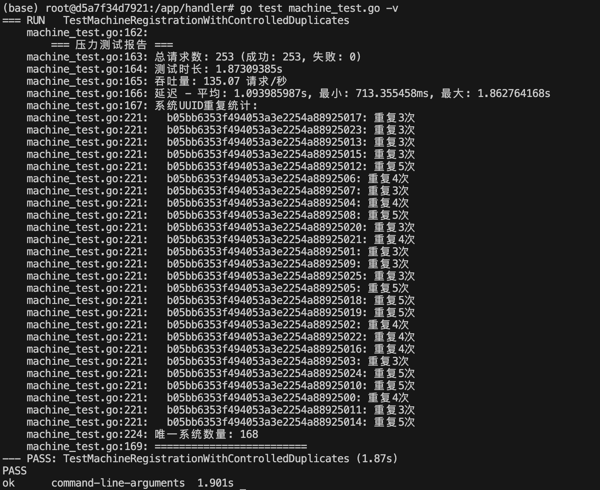

# 分布式注册引发的ABA问题及优化

> #### 问题背景
>
> 最近优化边缘端分布式往中心端注册的业务，以前实现很糙，无法支撑大量设备的多节点同时注册场景，由于其每套系统有可能是单机版，也有可能是小集群，若小集群则涉及相同 `systemUUID` 但不同 `machineID` 的并发注册请求，且同时请求时较为稀疏，因此诞生了如下问题：
>
> 1. 重复创建系统记录
> 2. 竞态条件
> 3. 性能瓶颈
> 4. 请求超时

  

## 1. 初步想到的解决方案

### 1.1 SingleFlight模式 (单飞)

**核心原理**:

- 相同key的并发请求共享同一个执行结果
- 第一个请求执行，后续请求等待结果

**✅ 优点：** 简单无依赖、合并执行（常用于读多或写幂等）、结果共享

**❌ 缺点：** 单机、无超时

**适用场景**: 单机部署、读多写少的场景、**相同key的请求需要共享** 结果

### 1.2 数据库唯一约束 + 重试机制

**核心原理**:

- 数据库层面保证唯一性
- 捕获冲突错误并重试

**✅ 优点：** 数据库级别保证一致性、分布式支持、事务

**❌ 缺点：** 依赖DB、重试、错误处理机制复杂、DB压力明显

**适用场景**: 多实例部署、对数据库性能要求不高、需要强一致性保证

### 1.3 Redis分布式锁

**核心原理**:

- 使用Redis的SETNX实现分布式锁
- 确保分布式环境下的互斥访问

**✅ 优点：** 分布式支持、超时控制、性能好

**❌ 缺点：** 依赖 Redis 、增加系统复杂、网络延迟

**适用场景：** 多实例部署、已有 **Redis** 基础设施、需要严格的互斥控制

### 1.4 分段锁

**核心原理**:
- 将锁空间分片，减少锁竞争
- 使用哈希算法将key映射到不同分片
- 支持读写锁和超时控制

**✅ 优点：** 简单无依赖、高性能（细粒度弱竞争）、超时控制

**❌ 缺点：** 需要合理设置分片数量（取决于规模）

**适用场景：** 高并发场景、单机或集群部署、需要细粒度控制

因此场景是分布式往 **单个中心端服务** 去注册，同时期望尽量 **简单无依赖**，基本上就在 **SingleFlight** 和 **分段锁** 之中考虑了

## 2. 动态分段锁的ABA问题

### 2.1 ABA的出现

听说 **ABA问题** 是看 **Mutex** 源码中使用了大量的 **CAS** 操作才了解的，当时以为离普通业务开发会很远，直到按照自己的思路实现分段锁时...

由于全局锁太重，遂通过每个 `systemUUID` 为 **key** 来存储每把 `sync.Mutex` 锁为 **value** 的思路来实现，然后通过 `sync.Map` 的 `LoadOrStore` 来规避并发问题，同时空间应要释放，因此使用原子的 `refCount` 解锁时回收♻️（动态），然后初版就踩坑 **ABA** 了

```go
package utils

import (
	"fmt"
	"math/rand"
	"sync"
	"sync/atomic"
	"time"
)

type systemLock struct {
	systemLocks sync.Map
}

type lockWrapper struct {
	mu       *sync.Mutex
	refCount int32 // atomic
}

var (
	instance *systemLock
	once     sync.Once
)

func newGlobalSystemLock() *systemLock {
	once.Do(func() {
		instance = &systemLock{}
	})
	return instance
}

func (s *systemLock) GetSystemLock(systemUUID string) *sync.Mutex {
	// 快速路径检查
	if existing, ok := s.systemLocks.Load(systemUUID); ok {
		wrapper := existing.(*lockWrapper)
		atomic.AddInt32(&wrapper.refCount, 1)
		return wrapper.mu
	}

	// 慢速路径创建新锁
	newWrapper := &lockWrapper{
		mu:       &sync.Mutex{},
		refCount: 1,
	}

	// 使用 LoadOrStore 确保原子性
	if actual, loaded := s.systemLocks.LoadOrStore(systemUUID, newWrapper); loaded {
		wrapper := actual.(*lockWrapper)
		atomic.AddInt32(&wrapper.refCount, 1)
		return wrapper.mu
	}

	return newWrapper.mu
}

func (s *systemLock) ReleaseLock(systemUUID string) {
	actual, ok := s.systemLocks.Load(systemUUID)
	if !ok {
		return
	}

	wrapper := actual.(*lockWrapper)
	if atomic.AddInt32(&wrapper.refCount, -1) == 0 {
		// 使用 CompareAndDelete 确保安全删除
		for {
			if s.systemLocks.CompareAndDelete(systemUUID, wrapper) {
				return
			}
			// 短暂休眠避免忙等待
			time.Sleep(time.Duration(rand.Intn(20)) * time.Microsecond)

			// 再次检查是否真的需要删除
			if existing, ok := s.systemLocks.Load(systemUUID); !ok || existing.(*lockWrapper).refCount > 0 {
				return
			}
		}
	}
}

```

上述实现理论上想动态创建 “细粒度锁”，但手动管理锁的生命周期以及 **频繁使用原子操作和CAS** 来引用计数，有不少 **bug** 和复杂度，最直接的就是：**ReleaseLock** 的删除逻辑有 **ABA** 问题，锁被删除后又被新建，`CompareAndDelete` 可能误删新锁。

### 2.2 什么是ABA问题？

**ABA问题指的是：** 某个对象A被删除后又被新建成A（地址/内容一样），另一个线程以为它还是原来的A，结果做了错误的操作。

在该场景下，锁对象被回收后又被新建，`CompareAndDelete` 存在误删新锁

#### 2.2.1 出现步骤

假设有两个并发 **goroutine**，分别为**G1**和**G2**，操作同一个 `systemUUID`：

1. 初始状态  `systemLocks` 中有 `systemUUID`，指向 `wrapper1`，`refCount=1`
2. **G1先解锁** 调用 `ReleaseLock(systemUUID)`

   - 执行`atomic.AddInt32(&wrapper1.refCount, -1)`，变成0

   - 进入for循环，准备 `CompareAndDelete(systemUUID, wrapper1)` 
3. **G2此时上锁** 调用 `GetSystemLock(systemUUID)` 

   - 执行 `s.systemLocks.Load(systemUUID)`，发现有 `wrapper1` (有锁)，但 `refCount=0`，但G2还没加锁。

   - **G2** 继续执行 `s.systemLocks.LoadOrStore(systemUUID, newWrapper2)`，因为 **G1** 还没删掉锁，**G2** 得到并返回 `wrapper1.mu` **旧的未删除锁** ，`refCount + 1` 
4.  **G1再继续 for循环 CAS操作**

   - 执行 `s.systemLocks.CompareAndDelete(systemUUID, wrapper1)` ，成功删除
- 但此时 **G2** 还在用旧锁，锁对象被误删。

5. **G2持有旧锁 wrapper1.mu**，但 `sync.Map` 存储的 **key** 又被误删 

   - 后续如果有其他 **goroutine** 调用 `GetSystemLock(systemUUID)`，会创建新的 **wrapper2**，导致：

     * 两个不同的 **goroutine** 使用不同的锁 ***(wrapper1.mu 和 wrapper2.mu）***，失去互斥保护。

     * 由于失去保护， **countList[num] += 1 （下文单测）也可能发生数据竞争**，导致计数减少（部分写入丢失）。

6. 同时 **refCount 泄漏** 

   * **wrapper1 的。key** 已经被删除，但 `wrapper1.refCount`  仍然被 **G2** 引用***（refCount=1）***。
   * 如果 **G2** 后续调用 `ReleaseLock`，它会尝试减少 `wrapper1.refCount`，但 `wrapper1` 已经不在 `systemLocks` 中，可能导致：
       * **refCount 无法归零**，`wrapper1` 永远不会被 **GC 回收（内存泄漏）** 
       *  `wrapper1.refCount` 会被减到负数，若引用计数定义为 **uint** 可能导致溢出

::: caution 为何有时测试没有报错？

* **旧的 sync.Mutex 仍然有效：** 即使 **wrapper1** 被删除，`wrapper1.mu` 仍然是一个 **有效的 sync.Mutex** ，可以正常加锁解锁
* **countList 的减少不明显:**  由于冲突概率较低，部分写入丢失可能被其他 **goroutine** 的写入掩盖，导致计数看起来“差不多正确”
* **没有 -race 检测 ：** 如果没有启用 `go test -race` ，数据竞争可能不会被发现。

:::

### 2.3 单测 “-race” 检测

```go
package main

import (
	"math/rand"
	"strconv"
	"sync"
	"testing"
	"time"
)

func TestSystemLock_ConcurrentAccess(t *testing.T) {
	sl := newGlobalSystemLock()
	var wg sync.WaitGroup
	c := 15
	iterations := c * 1000
	countList := make([]int, c)
	// 并发测试
	wg.Add(iterations)
	for i := 0; i < iterations; i++ {
		newK := i % c
		go func(num int) {
			defer wg.Done()
			mu := sl.GetSystemLock(strconv.Itoa(num))
			mu.Lock()
			//time.Sleep(time.Duration(rand.Intn(2)) * time.Microsecond) // 模拟工作负载
			countList[num] += 1
			mu.Unlock()
			sl.ReleaseLock(strconv.Itoa(num))
		}(newK)
	}
	wg.Wait()
	t.Log("countList:", countList, sl.LockCount, sl.UnlockCount)
}
```

执行后，会很明显的看出不容易发现的 **数据竞争**

```go
go test -race -v

/* 
=== RUN   TestSystemLock_ConcurrentAccess
==================
WARNING: DATA RACE
Read at 0x00c0001481d0 by goroutine 349:
  test/m.TestSystemLock_ConcurrentAccess.func1()
      /Volumes/develop/zzheng/CODE/zero-one/demo_test.go:26 +0xcc
  test/m.TestSystemLock_ConcurrentAccess.gowrap1()
      /Volumes/develop/zzheng/CODE/zero-one/demo_test.go:29 +0x44
      ...
==================
==================
WARNING: DATA RACE
...
Previous write at 0x00c000296388 by goroutine 376:
  ??()
      -:0 +0x100d56ee8
  sync/atomic.AddInt32()
      <autogenerated>:1 +0x14
  test/m.TestSystemLock_ConcurrentAccess.func1()
      /Volumes/develop/zzheng/CODE/zero-one/demo_test.go:28 +0x11c
  test/m.TestSystemLock_ConcurrentAccess.gowrap1()
      /Volumes/develop/zzheng/CODE/zero-one/demo_test.go:29 +0x44

==================
    demo_test.go:32: countList: [1000 1000 1000 1000 1000 1000 1000 1000 1000 1000 1000 1000 1000 1000 1000] 15000 14017
    testing.go:1398: race detected during execution of test
--- FAIL: TestSystemLock_ConcurrentAccess (0.07s)
FAIL
exit status 1
FAIL    test/m  0.763s
/*
```

### 2.4 sync.Map动态锁 + 唯一ID防ABA（无效）

```go
//...
type lockWrapper struct {
	mu       *sync.Mutex
	refCount int32 // atomic
	id       int64
}

var idGen int64

func (s *systemLock) GetSystemLock(systemUUID string) *sync.Mutex {
	// ...

	// 慢速路径创建新锁
	newID := atomic.AddInt64(&idGen, 1)
	newWrapper := &lockWrapper{
		mu:       &sync.Mutex{},
		refCount: 1,
		id:       newID,
	}
	// ...

	return newWrapper.mu
}

func (s *systemLock) ReleaseLock(systemUUID string) {
	actual, ok := s.systemLocks.Load(systemUUID)
	if !ok {
		return
	}

	wrapper := actual.(*lockWrapper)
	if atomic.AddInt32(&wrapper.refCount, -1) == 0 {
		// 使用 CompareAndDelete 确保安全删除
		for {
			// 再次Load，确保是同一个对象
			current, ok := s.systemLocks.Load(systemUUID)
			if !ok || current.(*lockWrapper).id != wrapper.id {
				return
			}
			if s.systemLocks.CompareAndDelete(systemUUID, wrapper) {
				return
			}
			time.Sleep(time.Duration(rand.Intn(20)) * time.Microsecond)
		}
	}
}
```

**问题根源：**

该实现中，锁对象本身（lockWrapper）被回收和重建，即使有唯一ID，但锁对象的内存地址变了，导致：

1. goroutine A 获取锁对象 wrapper1（地址0x1000，ID=1）
2. goroutine A 加锁，业务未完成
3. goroutine B 获取锁对象 wrapper1（地址0x1000，ID=1），refCount+1
4. goroutine A 业务完成，Unlock，ReleaseLock，refCount-1=0，删除锁对象
5. goroutine C 获取锁，发现不存在，新建锁对象 wrapper2（地址0x2000，ID=2）
6. goroutine B 业务完成，Unlock，ReleaseLock，refCount-1=0，尝试删除锁对象
7. 此时 wrapper1 已经被删除了，wrapper2 是新对象，但 goroutine B 还在用 wrapper1

**关键点（为什么版本号/唯一ID在这里不够）：**

- 锁对象被回收后，goroutine B 还在用旧的锁对象 **sync.Map 里存的是指针，就算 goroutineA 删除了 key，也仅是把其标记，并不会被GC，删除的实质是：** 
  - 对于 **指针类型** 的值：只是将 `entry.p` 指针从指向实际值改为 `nil` 或标记为 `expunged`（原子操作）
  - 对于 **值类型** 的值：同样是通过操作指针实现的逻辑删除
  - **不会主动释放内存**：删除操作不会显式调用内存释放，实际内存由 Go 的垃圾回收器管理

- 即使有 **唯一ID**，但主要也是用于 **防止误删**，确保删除的是同一个对象
- 即使用 **CAS** 对比指针，只要锁对象被回收又新建，**ABA** 问题依然存在，因为锁对象是动态分配和回收的，没有 **GC** 保护，一旦被回收，地址可能被复用
- 除非你能保证锁对象被回收后，**所有 goroutine 都不再访问旧对象，否则依然有竞态**


::: tip **那么有无简单且高效的方法，既能回收内存又能避免ABA？**

**理论上：**

- 按当前的数据结构来实现的话没有。只要允许锁对象被回收，就 **必须有一种机制保证 “ 同一时刻只有一个锁对象在用 ”** ，这就需要全局锁/分片锁保护生命周期（但这样复杂度和性能都不如静态分段锁）

- 业界常见的做法是不回收锁对象，或者定期批量清理长时间不用的锁对象（但这也不能100%避免极端并发下的ABA问题）。

- 锁对象常驻 = 无限长分段锁 = 最安全最简单

- 动态回收 = 必然有ABA/竞态风险，且实现复杂

- 99%场景推荐锁对象常驻，内存占用可控，代码健壮，或者直接使用静态

因此将 **ReleaseLock** 相关的动态回收机制去除依然不会出现竟态问题

:::

### 2.5 一句话结论

 **动态锁只要有 “锁对象回收/重建”，就有ABA和提前删除问题，锁保护就不可靠。静态分段锁永不回收，最安全。** 

 

#### 业界无锁数据结构的ABA解决方案

- 指针+版本号（tagged pointer）：每次修改都增加版本号，CAS时一起对比

- Hazard Pointer：每个线程声明自己正在用哪个指针，回收时要等所有线程都不用了

- Epoch-based GC：分代回收，确保没有线程在用时才回收

这些机制都比你现在的动态锁实现复杂很多，且Go标准库没有直接支持。

## 3. 静态分段锁

绝大多数高并发场景，适合锁对象数量有限（如几十、几百）且热点分布均匀的场景

**✅ 优点：** 极其简单，易于维护、锁对象常驻内存，无GC压力、哈希分片后锁竞争极小，性能高

**❌ 缺点：** 分片数量固定（无法动态），锁对象数量大于有哈希冲突、小于有内存浪费

#### 3.1 静态分段锁，简单实现

```go
var (
    shardCount = 32 // 根据实际情况调整
    shards = make([]sync.Mutex, shardCount)
)

func getShard(systemUUID string) uint32 {
    h := fnv.New32a()
    h.Write([]byte(systemUUID))
    return h.Sum32() % uint32(shardCount)
}

func (s *machine) FirstRegister(machine *common.RegisterMachine, project *model.Project) (string, error) {
    shard := getShard(machine.SystemUUID)
    shards[shard].Lock()
    defer shards[shard].Unlock()
    
    // 实际的注册逻辑
		return s.processRegister(machine, project)
}
```

##### 为什么静态分段锁不会有ABA问题？

- 静态分段锁的锁对象常驻内存，永不删除，同一个key永远哈希到同一个锁对象。

- 不会有“锁对象被提前删除/新建”的问题，锁的生命周期和进程一致，所以不会有ABA问题。

::: info **shards数组的并发读写是否存在竞态问题？**

**Go** 的 **slice/array** 只要不扩容/不写入，是线程安全的。

- 只要你对 **shards** 数组的操作仅限于“读”（即获取某个分片的锁对象，然后对该锁加锁/解锁）

- 这里的 **shards** 是一个长度固定的 **slice**，初始化后不再变动，只读不写，所以并发读 **slice** 本身是安全的
- **补充：** 非同时并发写同一个 **index** 也不会 **DATA RACE** 

##### **可能的竞态风险点**

- **slice** 本身不变，元素不变，只读，没问题
- 唯一的风险是：如果你在程序运行期间有代码 **会重新分配/扩容/写入shards这个slice**，那就会有竞态

##### **参考资料**

- Go官方FAQ：[Are slices thread-safe?](https://golang.org/doc/faq#atomic_maps) 

:::

下面是一个使用 **静态分段锁** 和 **全局互斥锁** 的单元测试对比：

```go
package main

import (
	"strconv"
	"sync"
	"testing"
	"time"
)


func TestShardedLock(t *testing.T) {
	sl := NewShardedLock(100)
	var wg sync.WaitGroup
	iterations := 1000
	countList := make([]int, 10)
	wg.Add(iterations)
	for i := 0; i < iterations; i++ {
		newK := i % 10
		go func(num int) {
			defer wg.Done()
			sl.Lock(strconv.Itoa(num))
			time.Sleep(2 * time.Millisecond) // 模拟工作负载
			countList[num] += 1
			sl.Unlock(strconv.Itoa(num))
		}(newK)
	}
	wg.Wait()
	t.Log("countList:", countList)
}

/*
=== RUN   TestShardedLock
    demo_test.go:62: countList: [100 100 100 100 100 100 100 100 100 100]
--- PASS: TestShardedLock (0.23s)
*/

func TestMutex(t *testing.T) {
	var wg sync.WaitGroup
	var mu sync.Mutex
	iterations := 1000
	countList := make([]int, 10)
	wg.Add(iterations)
	for i := 0; i < iterations; i++ {
		newK := i % 10
		go func(num int) {
			defer wg.Done()
			mu.Lock()
			time.Sleep(2 * time.Millisecond) // 模拟工作负载
			countList[num] += 1
			mu.Unlock()
		}(newK)
	}
	wg.Wait()
	t.Log("countMap:", countList)

}

/*
=== RUN   TestMutex
    demo_test.go:82: countMap: [100 100 100 100 100 100 100 100 100 100]
--- PASS: TestMutex (2.27s)
*/
```

优化后，性能差异明显，效率提升了 **10倍** 不止

### 3.2 分段读写锁（读多写少）

如需读写分离，推荐用分段读写锁。

```go
type ShardedRWLock struct {
	shards    []sync.RWMutex
	shardMask uint32
}

func NewShardedRWLock(shardCount int) *ShardedRWLock {
	if shardCount <= 0 {
		shardCount = 32
	}
	n := 1
	for n < shardCount {
		n <<= 1
	}
	shardCount = n

	return &ShardedRWLock{
		shards:    make([]sync.RWMutex, shardCount),
		shardMask: uint32(shardCount - 1),
	}
}

func (sl *ShardedRWLock) Lock(key string) {
	idx := sl.getShardIndex(key)
	sl.shards[idx].Lock()
}

func (sl *ShardedRWLock) Unlock(key string) {
	idx := sl.getShardIndex(key)
	sl.shards[idx].Unlock()
}

func (sl *ShardedRWLock) RLock(key string) {
	idx := sl.getShardIndex(key)
	sl.shards[idx].RLock()
}

func (sl *ShardedRWLock) RUnlock(key string) {
	idx := sl.getShardIndex(key)
	sl.shards[idx].RUnlock()
}

func (sl *ShardedRWLock) getShardIndex(key string) uint32 {
	h := fnv.New32a()
	h.Write([]byte(key))
	return h.Sum32() & sl.shardMask
}


var GlobalShardLock = utils.NewShardedLock(32)

func Register(systemUUID string) {
    GlobalShardLock.Lock(systemUUID)
    defer GlobalShardLock.Unlock(systemUUID)
    // ...业务逻辑...
}
```

### 3.3 实际建议

- 绝大多数业务**直接用 静态分段锁 或 “锁对象常驻” 方案**，不用担心内存问题（每把锁几十字节，**百万把锁也才几十MB** ）。

- 只有在锁对象数量 **极大且稀疏、且极度关注内存** 的场景，才考虑动态回收+复杂保护，且需严防ABA。

- **推荐静态分段锁：** 锁对象常驻，简单高效，适合99%的业务。

- **动态锁+定期清理：** 适合极端大规模、锁对象数量极大且极度稀疏的key场景，但实现复杂，且仍可能存在窗口导致的极小概率ABA问题。
- 如果有更极端的需求（比如亿级key且内存极度敏感），可以考虑 **分布式锁/定期清理+版本号等更复杂的方案** ，但一般业务完全没必要。

- 如果你确实要用动态锁，请 **用如下成熟实现：**
  - [go-zero lockedcalls](https://github.com/zeromicro/go-zero/blob/master/core/syncx/lockedcalls.go) 
  - [go-zero-singleflight](https://github.com/zeromicro/go-zero/blob/master/core/syncx/singleflight.go)  
  - `"golang.org/x/sync/singleflight"`  

### 4. lockedcalls.go 

#### 4.1 动态分段锁

难道就没有人实现过这类场景的动态分段锁吗？其实不然，来看一看 **go-zero** 官方的优秀实现，该实现是个 **高度专用的动态分段锁**，其价值在于：

1. 精准的 **Key级** 并发控制 🎯
2. 独立执行保证 ***（无副作用共享）*** 
3. 资源高效管理 ***（自动清理♻️）*** 

```go
package syncx

import "sync"

type (
	// LockedCalls makes sure the calls with the same key to be called sequentially.
	// For example, A called F, before it's done, B called F, then B's call would not blocked,
	// after A's call finished, B's call got executed.
	// The calls with the same key are independent, not sharing the returned values.
	// A ------->calls F with key and executes<------->returns
	// B ------------------>calls F with key<--------->executes<---->returns
	LockedCalls interface {
		Do(key string, fn func() (any, error)) (any, error)
	}

	lockedGroup struct {
		mu sync.Mutex
		m  map[string]*sync.WaitGroup
	}
)

// NewLockedCalls returns a LockedCalls.
func NewLockedCalls() LockedCalls {
	return &lockedGroup{
		m: make(map[string]*sync.WaitGroup),
	}
}

func (lg *lockedGroup) Do(key string, fn func() (any, error)) (any, error) {
begin:
	lg.mu.Lock()
	if wg, ok := lg.m[key]; ok {
		lg.mu.Unlock()
		wg.Wait()
		goto begin
	}

	return lg.makeCall(key, fn)
}

func (lg *lockedGroup) makeCall(key string, fn func() (any, error)) (any, error) {
	var wg sync.WaitGroup
	wg.Add(1)
	lg.m[key] = &wg
	lg.mu.Unlock()

	defer func() {
		// delete key first, done later. can't reverse the order, because if reverse,
		// another Do call might wg.Wait() without get notified with wg.Done()
		lg.mu.Lock()
		delete(lg.m, key)
		lg.mu.Unlock()
		wg.Done()
	}()

	return fn()
}
```

##### 为什么先 delete 再 wg.Done？

如果反过来：

- 协程A调用 wg.Done()
- 协程B收到通知但尚未获取锁
- 协程C抢到锁并重新使用相同Key
- 协程B获取锁后发现Key已被复用 → 逻辑错误

如果场景需要 **确保相同资源的操作串行化，同时允许不同资源并行处理**，该实现比 **SingleFlight** 更合适，而对于读多写少且结果可共享的场景，**SingleFlight** 依然是更好的选择

#### 4.2 一些说明

##### **动态的体现：** 

- 锁对象是“按需创建、按需销毁”的，只有有请求的key才会分配锁对象，用完自动回收。

- 不需要预先分配一堆锁对象，锁的数量和实际活跃key数量一致。

##### **适合的场景** 

- 锁对象数量极多极稀疏：比如你有几百万、几千万个不同的key，但每个key的并发很低，且大部分key大部分时间都没人用。

- 典型例子：大规模分布式缓存、分布式唯一资源管理、用户级别的限流/互斥等。

##### **具体举例**

- 分布式缓存的本地互斥：假如你有1亿个缓存key，只有活跃key才需要加锁，静态分段锁会导致大量key哈希到同一分片，串行严重；动态锁则只为活跃key分配锁，且互不影响。

- 用户级别的操作互斥：比如有1000万用户，只有活跃用户才需要加锁，动态锁可以做到“用多少分配多少”。

- 大规模分布式任务调度：每个任务ID都要加锁，但任务ID数量极大且大部分时间不活跃。

| 场景/方案       | 静态分段锁         | 动态锁                      |
| :-------------- | :----------------- | :-------------------------- |
| 锁对象数量有限  | 性能极高，简单     | 有额外哈希、GC、互斥CAS开销 |
| 锁对象数量极大  | 哈希冲突多，性能差 | 性能好，内存占用低          |
| 热点key均匀     | 性能极高           | 性能高                      |
| 热点key极度稀疏 | 可能有冲突         | 性能高                      |
| 代码复杂度      | 低                 | 高                          |
| 维护成本        | 低                 | 高                          |

##### 你的“分布式注册”场景属于哪种？

- 如果你的 **systemUUID** 数量是有限的（比如几百、几千、几万），静态分段锁完全足够，性能最好，代码最简单。

- 如果你的 **systemUUID** 数量极大（比如百万级、千万级），且大部分时间都不活跃，动态锁才有优势。

绝大多数注册业务，**systemUUID** 数量远小于分片数，静态分段锁就够啦。

 


#### 附：

超时读写锁

```go
package logic

import (
	"fmt"
	"hash/fnv"
	"sync"
	"sync/atomic"
	"time"
)

// ShardedRWMutex 分段读写锁
type ShardedRWMutex struct {
	shards    []*sync.RWMutex
	shardMask uint32
	shardCount int
	stats     *ShardStats
}

// ShardStats 分片统计信息
type ShardStats struct {
	TotalLocks   int64
	TotalUnlocks int64
	TotalRLocks  int64
	TotalRUnlocks int64
	LastAccess   time.Time
}

// NewShardedRWMutex 创建分段读写锁
func NewShardedRWMutex(shardCount int) *ShardedRWMutex {
	if shardCount <= 0 {
		shardCount = 16 // 默认16个分片
	}
	
	// 确保分片数量是2的幂次，便于位运算优化
	shardCount = nextPowerOfTwo(shardCount)
	
	shards := make([]*sync.RWMutex, shardCount)
	for i := 0; i < shardCount; i++ {
		shards[i] = &sync.RWMutex{}
	}
	
	return &ShardedRWMutex{
		shards:     shards,
		shardMask:  uint32(shardCount - 1),
		shardCount: shardCount,
		stats:      &ShardStats{},
	}
}

// Lock 获取写锁
func (sl *ShardedRWMutex) Lock(key string) {
	shardIndex := sl.getShardIndex(key)
	sl.shards[shardIndex].Lock()
	atomic.AddInt64(&sl.stats.TotalLocks, 1)
	sl.stats.LastAccess = time.Now()
}

// Unlock 释放写锁
func (sl *ShardedRWMutex) Unlock(key string) {
	shardIndex := sl.getShardIndex(key)
	sl.shards[shardIndex].Unlock()
	atomic.AddInt64(&sl.stats.TotalUnlocks, 1)
}

// RLock 获取读锁
func (sl *ShardedRWMutex) RLock(key string) {
	shardIndex := sl.getShardIndex(key)
	sl.shards[shardIndex].RLock()
	atomic.AddInt64(&sl.stats.TotalRLocks, 1)
	sl.stats.LastAccess = time.Now()
}

// RUnlock 释放读锁
func (sl *ShardedRWMutex) RUnlock(key string) {
	shardIndex := sl.getShardIndex(key)
	sl.shards[shardIndex].RUnlock()
	atomic.AddInt64(&sl.stats.TotalRUnlocks, 1)
}

// TryLock 尝试获取写锁（非阻塞）
func (sl *ShardedRWMutex) TryLock(key string) bool {
	shardIndex := sl.getShardIndex(key)
	acquired := sl.shards[shardIndex].TryLock()
	if acquired {
		atomic.AddInt64(&sl.stats.TotalLocks, 1)
		sl.stats.LastAccess = time.Now()
	}
	return acquired
}

// TryRLock 尝试获取读锁（非阻塞）
func (sl *ShardedRWMutex) TryRLock(key string) bool {
	shardIndex := sl.getShardIndex(key)
	acquired := sl.shards[shardIndex].TryRLock()
	if acquired {
		atomic.AddInt64(&sl.stats.TotalRLocks, 1)
		sl.stats.LastAccess = time.Now()
	}
	return acquired
}

// getShardIndex 根据key计算分片索引
func (sl *ShardedRWMutex) getShardIndex(key string) uint32 {
	h := fnv.New32a()
	h.Write([]byte(key))
	return h.Sum32() & sl.shardMask
}

// GetStats 获取统计信息
func (sl *ShardedRWMutex) GetStats() *ShardStats {
	return &ShardStats{
		TotalLocks:    atomic.LoadInt64(&sl.stats.TotalLocks),
		TotalUnlocks:  atomic.LoadInt64(&sl.stats.TotalUnlocks),
		TotalRLocks:   atomic.LoadInt64(&sl.stats.TotalRLocks),
		TotalRUnlocks: atomic.LoadInt64(&sl.stats.TotalRUnlocks),
		LastAccess:    sl.stats.LastAccess,
	}
}

// GetShardInfo 获取分片信息
func (sl *ShardedRWMutex) GetShardInfo() map[string]interface{} {
	return map[string]interface{}{
		"shard_count": sl.shardCount,
		"shard_mask":  sl.shardMask,
		"stats":       sl.GetStats(),
	}
}

// nextPowerOfTwo 计算大于等于n的最小2的幂次
func nextPowerOfTwo(n int) int {
	if n <= 1 {
		return 1
	}
	
	power := 1
	for power < n {
		power <<= 1
	}
	return power
}

// ShardedLockWithTimeout 带超时的分段锁
type ShardedLockWithTimeout struct {
	*ShardedRWMutex
	timeout time.Duration
}

// NewShardedLockWithTimeout 创建带超时的分段锁
func NewShardedLockWithTimeout(shardCount int, timeout time.Duration) *ShardedLockWithTimeout {
	return &ShardedLockWithTimeout{
		ShardedRWMutex: NewShardedRWMutex(shardCount),
		timeout:        timeout,
	}
}

// LockWithTimeout 带超时的写锁
func (sl *ShardedLockWithTimeout) LockWithTimeout(key string) error {
	shardIndex := sl.getShardIndex(key)
	
	// 使用channel实现超时控制
	done := make(chan bool, 1)
	go func() {
		sl.shards[shardIndex].Lock()
		done <- true
	}()
	
	select {
	case <-done:
		atomic.AddInt64(&sl.stats.TotalLocks, 1)
		sl.stats.LastAccess = time.Now()
		return nil
	case <-time.After(sl.timeout):
		return fmt.Errorf("获取锁超时: %v", sl.timeout)
	}
}

// RLockWithTimeout 带超时的读锁
func (sl *ShardedLockWithTimeout) RLockWithTimeout(key string) error {
	shardIndex := sl.getShardIndex(key)
	
	done := make(chan bool, 1)
	go func() {
		sl.shards[shardIndex].RLock()
		done <- true
	}()
	
	select {
	case <-done:
		atomic.AddInt64(&sl.stats.TotalRLocks, 1)
		sl.stats.LastAccess = time.Now()
		return nil
	case <-time.After(sl.timeout):
		return fmt.Errorf("获取读锁超时: %v", sl.timeout)
	}
}
```


### 单飞

go-zero的

```go
package logic

import (
	"callback-handler/internal/common"
	"callback-handler/internal/domain/entities"
	"callback-handler/internal/domain/dependency"
	"callback-handler/pkg/utils"
	"callback-handler/pkg/crerror"
	"fmt"
	"strings"
	"sync"
	"time"
	
	"github.com/zeromicro/go-zero/core/syncx"
	"github.com/zeromicro/go-zero/core/logx"
	"gopkg.in/yaml.v2"
)

type MachineRegisterLogic struct {
	mu           sync.Mutex
	singleFlight syncx.SingleFlight
	dao          *dependency.DAO
	config       *common.Config
}

func NewMachineRegisterLogic(dao *dependency.DAO, config *common.Config) *MachineRegisterLogic {
	return &MachineRegisterLogic{
		singleFlight: syncx.NewSingleFlight(),
		dao:          dao,
		config:       config,
	}
}

// FirstRegister 使用SingleFlight模式处理并发注册
func (m *MachineRegisterLogic) FirstRegister(machine *common.RegisterMachine, project *entities.Project) (string, error) {
	logx.Info("设备注册请求开始, machine-id(%s), system-uuid(%s)", machine.MachineID, machine.SystemUUID)
	
	// 使用systemUUID作为key，确保相同系统的并发请求共享结果
	key := fmt.Sprintf("register_system_%s", machine.SystemUUID)
	
	result, err := m.singleFlight.Do(key, func() (interface{}, error) {
		return m.doRegister(machine, project)
	})
	
	if err != nil {
		return "", err
	}
	
	// 类型断言
	if configStr, ok := result.(string); ok {
		return configStr, nil
	}
	
	return "", fmt.Errorf("注册结果类型错误")
}

// doRegister 实际的注册逻辑
func (m *MachineRegisterLogic) doRegister(machine *common.RegisterMachine, project *entities.Project) (string, error) {
	logx.Info("开始处理注册逻辑, system-uuid(%s)", machine.SystemUUID)
	
	// 创建机器信息
	ma := &entities.Machine{
		MachineID:     machine.MachineID,
		ProjectID:     machine.ProjectID,
		SystemUUID:    machine.SystemUUID,
		PeerID:        machine.PeerID,
		HostName:      machine.HostName,
		Arch:          machine.Arch,
		Distro:        machine.Distro,
		KernelVersion: machine.KernelVersion,
	}

	// 验证密码
	if machine.Password != project.Password {
		return "", crerror.NewError("注册的密钥有误！")
	}

	// 分配IP地址
	ip, err := m.genNextIP(ma.ProjectID, project.CIDR)
	if err != nil {
		return "", fmt.Errorf("动态生成IP异常: %v", err)
	}
	logx.Info("为机器分配IP: %s", ip)

	// 生成VPN配置
	vpnConfig, err := m.generateVPNConfig(ip, project)
	if err != nil {
		return "", fmt.Errorf("生成VPN配置异常: %v", err)
	}

	// 创建或获取系统信息（使用数据库事务确保原子性）
	err = m.createSystemIfNotExists(machine)
	if err != nil {
		return "", fmt.Errorf("处理系统信息异常: %v", err)
	}

	// 创建机器记录
	err = m.createMachineRecord(ma, vpnConfig)
	if err != nil {
		return "", fmt.Errorf("创建机器记录异常: %v", err)
	}

	// 加密配置
	encryptedConfig := utils.CBCEncryptConfig(vpnConfig, m.config.AESKey)
	
	logx.Info("注册完成, machine-id(%s), system-uuid(%s)", machine.MachineID, machine.SystemUUID)
	return encryptedConfig, nil
}

// createSystemIfNotExists 创建系统信息（如果不存在）
func (m *MachineRegisterLogic) createSystemIfNotExists(machine *common.RegisterMachine) error {
	// 使用数据库事务确保原子性
	return m.dao.WithTransaction(func(tx *dependency.DAO) error {
		// 查询系统是否存在
		_, err := tx.System.GetByID(machine.SystemUUID)
		if err != nil {
			if crerror.IsNotFound(err) {
				logx.Info("系统(%s)未注册, 准备创建...", machine.SystemUUID)
				
				// 创建系统记录
				_, err = tx.System.Create(&entities.System{
					ProjectID:  machine.ProjectID,
					SystemUUID: machine.SystemUUID,
					SystemName: machine.SystemName,
				})
				if err != nil {
					return fmt.Errorf("创建系统记录失败: %v", err)
				}
				logx.Info("系统(%s)创建成功", machine.SystemUUID)
			} else {
				return fmt.Errorf("查询系统信息失败: %v", err)
			}
		} else {
			logx.Info("系统(%s)已存在", machine.SystemUUID)
		}
		return nil
	})
}

// createMachineRecord 创建机器记录
func (m *MachineRegisterLogic) createMachineRecord(ma *entities.Machine, configData []byte) error {
	ma.ACL = m.config.VPNConf.DefaultACL
	ma.IPv4 = ma.IPv4
	ma.Status = int8(common.Online)
	ma.VpnStatus = int8(common.Ready)
	ma.Config = string(configData)

	_, err := m.dao.Machine.Create(ma)
	if err != nil {
		return fmt.Errorf("创建机器记录失败: %v", err)
	}
	
	logx.Info("机器记录创建成功, machine-id(%s)", ma.MachineID)
	return nil
}


```


redis

```go
package logic

import (
	"callback-handler/internal/common"
	"callback-handler/internal/domain/entities"
	"callback-handler/internal/domain/dependency"
	"callback-handler/pkg/utils"
	"callback-handler/pkg/crerror"
	"context"
	"fmt"
	"strings"
	"time"
	
	"github.com/zeromicro/go-zero/core/logx"
	"github.com/zeromicro/go-zero/core/stores/redis"
	"gopkg.in/yaml.v2"
)

type MachineRegisterLogicV3 struct {
	dao    *dependency.DAO
	config *common.Config
	redis  *redis.Redis
}

func NewMachineRegisterLogicV3(dao *dependency.DAO, config *common.Config, redis *redis.Redis) *MachineRegisterLogicV3 {
	return &MachineRegisterLogicV3{
		dao:    dao,
		config: config,
		redis:  redis,
	}
}

// FirstRegister 使用Redis分布式锁处理并发注册
func (m *MachineRegisterLogicV3) FirstRegister(machine *common.RegisterMachine, project *entities.Project) (string, error) {
	logx.Info("设备注册请求开始, machine-id(%s), system-uuid(%s)", machine.MachineID, machine.SystemUUID)
	
	// 使用systemUUID作为分布式锁的key
	lockKey := fmt.Sprintf("register_lock:%s", machine.SystemUUID)
	lockValue := fmt.Sprintf("%s_%d", machine.MachineID, time.Now().UnixNano())
	
	// 尝试获取分布式锁
	ctx := context.Background()
	acquired, err := m.redis.SetnxExCtx(ctx, lockKey, lockValue, 30) // 30秒超时
	if err != nil {
		return "", fmt.Errorf("获取分布式锁失败: %v", err)
	}
	
	if !acquired {
		logx.Info("获取分布式锁失败，系统(%s)正在被其他请求处理", machine.SystemUUID)
		return "", crerror.NewError("系统正在注册中，请稍后重试")
	}
	
	// 确保锁会被释放
	defer func() {
		// 使用Lua脚本确保只有锁的持有者才能释放锁
		script := `
			if redis.call("get", KEYS[1]) == ARGV[1] then
				return redis.call("del", KEYS[1])
			else
				return 0
			end
		`
		m.redis.EvalCtx(ctx, script, []string{lockKey}, []string{lockValue})
	}()
	
	// 执行注册逻辑
	return m.doRegister(machine, project)
}

// doRegister 实际的注册逻辑
func (m *MachineRegisterLogicV3) doRegister(machine *common.RegisterMachine, project *entities.Project) (string, error) {
	logx.Info("开始处理注册逻辑, system-uuid(%s)", machine.SystemUUID)
	
	// 创建机器信息
	ma := &entities.Machine{
		MachineID:     machine.MachineID,
		ProjectID:     machine.ProjectID,
		SystemUUID:    machine.SystemUUID,
		PeerID:        machine.PeerID,
		HostName:      machine.HostName,
		Arch:          machine.Arch,
		Distro:        machine.Distro,
		KernelVersion: machine.KernelVersion,
	}

	// 验证密码
	if machine.Password != project.Password {
		return "", crerror.NewError("注册的密钥有误！")
	}

	// 使用数据库事务确保原子性
	var result string
	err := m.dao.WithTransaction(func(tx *dependency.DAO) error {
		// 1. 检查并创建系统记录
		err := m.ensureSystemExists(tx, machine)
		if err != nil {
			return err
		}
		
		// 2. 分配IP地址
		ip, err := m.genNextIP(tx, ma.ProjectID, project.CIDR)
		if err != nil {
			return fmt.Errorf("动态生成IP异常: %v", err)
		}
		ma.IPv4 = ip
		logx.Info("为机器分配IP: %s", ip)

		// 3. 生成VPN配置
		vpnConfig, err := m.generateVPNConfig(ip, project)
		if err != nil {
			return fmt.Errorf("生成VPN配置异常: %v", err)
		}

		// 4. 创建机器记录
		err = m.createMachineRecord(tx, ma, vpnConfig)
		if err != nil {
			return err
		}

		// 5. 加密配置
		result = utils.CBCEncryptConfig(vpnConfig, m.config.AESKey)
		return nil
	})
	
	if err != nil {
		return "", err
	}
	
	logx.Info("注册完成, machine-id(%s), system-uuid(%s)", machine.MachineID, machine.SystemUUID)
	return result, nil
}

// ensureSystemExists 确保系统记录存在
func (m *MachineRegisterLogicV3) ensureSystemExists(tx *dependency.DAO, machine *common.RegisterMachine) error {
	// 先查询系统是否存在
	_, err := tx.System.GetByID(machine.SystemUUID)
	if err != nil {
		if crerror.IsNotFound(err) {
			logx.Info("系统(%s)未注册, 准备创建...", machine.SystemUUID)
			
			// 创建系统记录
			_, err = tx.System.Create(&entities.System{
				ProjectID:  machine.ProjectID,
				SystemUUID: machine.SystemUUID,
				SystemName: machine.SystemName,
			})
			if err != nil {
				return fmt.Errorf("创建系统记录失败: %v", err)
			}
			logx.Info("系统(%s)创建成功", machine.SystemUUID)
		} else {
			return fmt.Errorf("查询系统信息失败: %v", err)
		}
	} else {
		logx.Info("系统(%s)已存在", machine.SystemUUID)
	}
	return nil
}

// createMachineRecord 创建机器记录
func (m *MachineRegisterLogicV3) createMachineRecord(tx *dependency.DAO, ma *entities.Machine, configData []byte) error {
	ma.ACL = m.config.VPNConf.DefaultACL
	ma.Status = int8(common.Online)
	ma.VpnStatus = int8(common.Ready)
	ma.Config = string(configData)

	_, err := tx.Machine.Create(ma)
	if err != nil {
		return fmt.Errorf("创建机器记录失败: %v", err)
	}
	
	logx.Info("机器记录创建成功, machine-id(%s)", ma.MachineID)
	return nil
}

// generateVPNConfig 生成VPN配置
func (m *MachineRegisterLogicV3) generateVPNConfig(ip string, project *entities.Project) ([]byte, error) {
	// 获取中继节点
	relayNodes := m.getRelayNode()
	
	// 获取CIDR网段
	cidr, err := m.getCIDRRange()
	if err != nil {
		return nil, fmt.Errorf("获取CIDR网段失败: %v", err)
	}
	mask := strings.Split(cidr, "/")[1]

	// 获取ACL配置
	acl, err := m.getDefaultACL(m.config.VPNConf.DefaultACL)
	if err != nil {
		return nil, fmt.Errorf("获取ACL配置失败: %v", err)
	}

	// 构建VPN配置
	vpnConf := m.config.VPNConf
	config := common.VPNConfig{
		Web:           fmt.Sprintf("0.0.0.0:%d", vpnConf.WebPort),
		MDNS:          vpnConf.MDNS,
		Protocol:      vpnConf.Protocol,
		Listen:        vpnConf.Listen,
		InterfaceAddr: fmt.Sprintf("%s/%s", ip, mask),
		ACL:           acl,
		InterfaceName: vpnConf.InterfaceName,
		LogLevel:      vpnConf.LogLevel,
		Room:          vpnConf.Room,
		RelayNodes:    relayNodes,
	}

	return yaml.Marshal(config)
}

// 其他辅助方法
func (m *MachineRegisterLogicV3) genNextIP(tx *dependency.DAO, projectID string, cidr string) (string, error) {
	// 在事务中实现IP分配逻辑，确保原子性
	return "", nil
}

func (m *MachineRegisterLogicV3) getRelayNode() []string {
	return []string{}
}

func (m *MachineRegisterLogicV3) getCIDRRange() (string, error) {
	return "", nil
}

func (m *MachineRegisterLogicV3) getDefaultACL(acl string) (string, error) {
	return acl, nil
}
```


