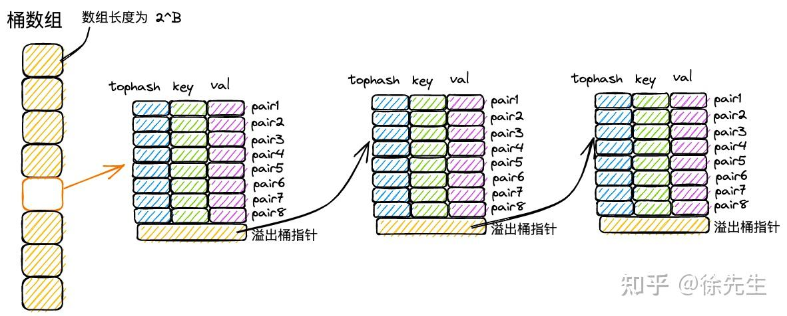
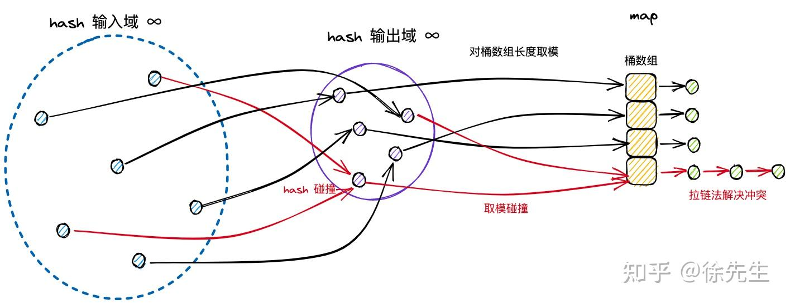
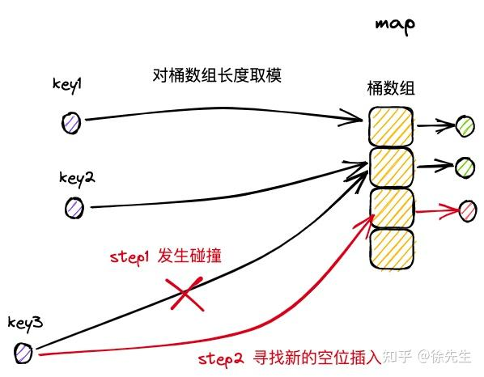

Map底层实现

<!-- more -->

# 从源码理解 Map
map又称字典，有以下特性：
1. k-v键值对结构；
2. key都是可哈希的（python中是不可变类型），相同值哈希后值相同，故能去重；
3. 读、写、删除操作的时间复杂度都是O(1)；

### 1. 原理

#### 1.1 map简述

**map：** 又称为 **hash map** ，算法上基于对key的哈希实现映射和寻址；在数据结构上基于 **桶数组** 实现对 **key-value** 的存储。

**写流程简述：** 

1. 通过哈希方法取到 key 的 hash 值；
2. hash 值对桶的长度取模，确定其所属的桶；
3. 在桶中遍历并插入 kv 对；

利用 hash 特性来去重，故取模后能**映射到桶的数组位置**，通过桶内遍历的方式锁定对应的 key-value ，控制每个桶内 kv 对的数量，就能保证 O(1) 的复杂度。

#### 1.2 哈希

 **hash：** 译作散列，哈希表也就是散列表，是将任意一种长度的输入压缩到固定长度输出摘要的过程 ，由于输入空间大于输出固定的输出空间长度，故哈希映射后可能会 **出现相同的值*（哈希冲突 ）*** ，故压缩过程中会有信息遗漏且过程不可逆，其特性如下：

- **可重入性：**相同的 key，必然产生相同的 hash 值；

- **离散性：** 只要两个 key 不相同，不论其相似度的高低，产生的 hash 值会在整个输出域内均匀地离散化；
- **单向性：** 企图通过 hash 值反向映射回 key 是无迹可寻的；
- **哈希冲突：** 由于输入域（key）无穷大，输出域（hash 值）有限，因此必然存在不同 key 映射到相同 hash 值的情况，称之为 hash 冲突；

#### 1.3 桶数组

桶数组的长度为 **2 的整数次幂** 

- 每个桶固定存储 **8对 kv 键值对** 
- 若同一桶数组索引下，超过 8 对写入，则会通过创建 **桶链表** 来延长存储空间 

 

#### 1.4 拉链法

解决哈希冲突的手段之一

拉链法中，将命中同一个桶的元素通过 **链表** 的形式进行链接，便于动态扩展

#### 1.5 开放寻址法

开放寻址法中，在插入新条目时，会基于一定的探测策略持续寻找，直到找到一个可用于存放数据的空位为止

 

### 2.Map的数据结构

### 问题:

#### 单核下并发读写Map是否安全？
不安全，虽然单核CPU时间片上一时刻只能执行一个gorotine，依然会出现map写操作时进行协程切换，一个写操作包含哈希计算、查找桶、写入值等，本身就不是一个原子操作，因此会fatal。

::: tips fatal和panic的区别：

**panic：** 

- **Go runtime** 的错误机制
- 可以被 **recover** 捕获处理
- 通常由程序逻辑错误引发

**fatal：**

- **Go runtime** 的致命错误 
- **无法被recover** 捕获，会立即终止程序并打印堆栈信息
- 通常表示程序状态已经不可恢复

:::

### 参考

- https://zhuanlan.zhihu.com/p/597483155
-  