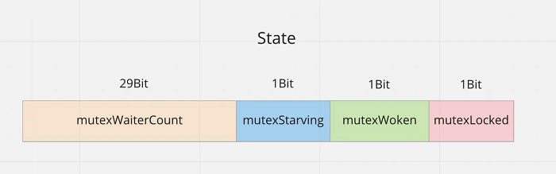

# sync.Mutex 发展史

## 1. First Commit

2008 年，@rsc 提交了 [sync.Mutex 的初始版本代码](https://github.com/golang/go/commit/bf3dd3f0efe5b45947a991e22660c62d4ce6b671#diff-a8c424f9dc7e3acf3f180a5cbf3f7748e6fd39c6f1eab0b4fd7ec11c548cdbeb) ，早期实现相对简单，结合了 CAS（比较并交换）和信号量。

## 2. 抢占&计数优化

2011 年，@dvyukov 提交了第一个 [sync 优化](https://codereview.appspot.com/4631075/#ps2001)：改进 **Mutex** 以允许连续获取，引入了 `mutexWoken` （唤醒状态）和 **等待者计数** 的概念

### 2.1 抢锁

```go
type Mutex struct {
    state int32
    sema  uint32
}

const (
     mutexLocked = 1 << iota // 第0行：iota=0 → 1<<0 = 1   mutex is locked
   	 mutexWoken              // 第1行：iota=1 → 1<<1 = 2
   	 mutexWaiterShift = iota // 第2行：iota=2 → 直接赋值为2

)

func (m *Mutex) Lock() {
    // Fast path: 幸运case，能够直接获取到锁
    if atomic.CompareAndSwapInt32(&m.state, 0, mutexLocked) {
        return
    }

    awoke := false
    for {
        old := m.state
        new := old | mutexLocked // 新状态加锁
        if old&mutexLocked != 0 {
            new = old + 1<<mutexWaiterShift //等待者数量加一
        }
        if awoke {
            // goroutine是被唤醒的，
            // 新状态清除唤醒标志
            new &^= mutexWoken
        }
        if atomic.CompareAndSwapInt32(&m.state, old, new) { //设置新状态
            if old&mutexLocked == 0 {
                // 锁原状态未加锁
                break
            }
            runtime.Semacquire(&m.sema) // 请求信号量
            awoke = true
        }
    }
}
```

**state字段：** 通过位掩码存储锁状态，非常巧妙，分别是：

|   位域   |            用途             |   操作示例   |
| :------: | :-------------------------: | :----------: |
|  `[0]`   |   锁持有状态 mutexLocked    | `state & 1`  |
|  `[1]`   |     唤醒标志 mutexWoken     | `state & 2`  |
| `[2:31]` | 等待者数量 mutexWaiterShift | `state >> 2` |

 **比特位0-1**：

- 0 = `mutexLocked ` 表示锁是否被持有， 持有锁的标记）
- 1 = `mutexWoken` 表示是否有被唤醒的 goroutine

✅ **比特位2-31**： 表示等待锁的 goroutine 数量

- **全部存储等待者的数量**，通过 `state >> 2` 读取
- 最大理论值：`2²⁹ - 1`（29位有效计数，因 `1<<2` 占用了第2位）

| 位数 | 第 31...2 位           | 第1位      | 第0位       |
| ---- | ---------------------- | ---------- | ----------- |
| 含义 | **位移计算的起始位置** | mutexWoken | mutexLocked |

```go
state += 1 << mutexWaiterShift  // 每次+4（二进制 0b100）
```

在比特位2-31区域累加计数（如`0b100`=1个等待者，`0b1000`=2个等待者）

### 2.2 抢锁流程**（3 个 Goroutine 抢锁）**

#### 步骤 1: G1 第一个调用 Lock()

##### **G1 执行流程**

Fast Path

```go
atomic.CompareAndSwapInt32(&m.state, 0, 1) // 0 → 1
```

- **成功**！G1 直接获取锁。

##### **状态更新**

```markdown
m.state = 1 (二进制: 00000001)
| Bit 0 (mutexLocked) = 1 (锁被持有)
| 其他位 = 0
```

------

#### **步骤 2: G2 调用 Lock()（锁已被 G1 持有）**

##### **G2 执行流程**

1. **Fast Path 失败**（`m.state == 1`）。

2. 进入慢速路径

   - 第一次循环

     ```go
     old := m.state // old = 1 (00000001)
     new := old | mutexLocked // new = 1 | 1 = 1
     if old&mutexLocked != 0 // true (1 & 1 = 1)
         new = old + 1<<mutexWaiterShift // new = 1 + 4 = 5 (00000101)
     ```

     - CAS 尝试：

       ```go
       atomic.CompareAndSwapInt32(&m.state, 1, 5)
       ```

       - **成功**！`m.state` 从 `1` 变成 `5`。

     - G2 调用 `runtime.Semacquire(&m.sema)` 进入休眠。

##### **状态更新** 

```markdown
m.state = 5 (二进制: 00000101)
| Bit 0 (mutexLocked) = 1 (锁被 G1 持有)
| Bit 1 (mutexWoken) = 0
| Bit 2-31 (等待者计数) = 1 (00000101 >> 2 = 1)
```

------

#### **步骤 3: G3 调用 Lock()（锁仍被 G1 持有，且有 1 个等待者）**

##### **G3 执行流程**

1. **Fast Path 失败**（`m.state == 5`）。

2. 进入慢速路径：

   - 第一次循环：

     ```go
     old := m.state // old = 5 (00000101)
     new := old | mutexLocked // new = 5 | 1 = 5
     if old&mutexLocked != 0 // true (5 & 1 = 1)
         new = old + 1<<mutexWaiterShift // new = 5 + 4 = 9 (00001001)
     ```

     - CAS 尝试：

       ```
       atomic.CompareAndSwapInt32(&m.state, 5, 9)
       ```

       - **成功**！添加一个等待者，`m.state` 从 `5` 变成 `9`

     - G3 调用 `runtime.Semacquire(&m.sema)` 进入休眠

##### **状态更新**

```markdown
m.state = 9 (二进制: 00001001)
| Bit 0 (mutexLocked) = 1 (锁被 G1 持有)
| Bit 1 (mutexWoken) = 0
| Bit 2-31 (等待者计数) = 2 (00001001 >> 2 = 2)
```

### 2.3 释放锁

释放锁的 **Unlock()** ⽅法同样复杂，含有大量的位运算

```go
func (m *Mutex) Unlock() {
    // Fast path: drop lock bit.
    new := atomic.AddInt32(&m.state, -mutexLocked) //去掉锁标志
    if (new+mutexLocked)&mutexLocked == 0 { //本来就没有加锁
        panic("sync: unlock of unlocked mutex")
    }

    old := new
    for {
        // 如果等待者为0 或者 锁是否被占用或已有唤醒标志
        if old>>mutexWaiterShift == 0 || old&(mutexLocked|mutexWoken) != 0 {
            return
        }
        // 新状态，准备唤醒goroutine
        new = (old - 1<<mutexWaiterShift) | mutexWoken // 减少一个等待者(减4) | 设置唤醒标志
        if atomic.CompareAndSwapInt32(&m.state, old, new) {
            runtime.Semrelease(&m.sema)
            return
        }
        old = m.state
    }
}
```

### 2.4 解锁流程（G1 调用 Unlock()，当前有 G2、G3 在等待, G4新来）

#### **初始状态 （和上文加锁最后状态一致）**

```markdown
m.state = 9 (二进制: 00001001)
| Bit 0 (mutexLocked) = 1 (锁被 G1 持有)
| Bit 1 (mutexWoken) = 0
| Bit 2-31 (等待者计数) = 2 (G2、G3 在等待)
```

------

#### **步骤 1: G1 调用 Unlock()**

##### **G1 执行流程**

1. **Fast Path: 释放锁标志** 

   ```go
   new := atomic.AddInt32(&m.state, -mutexLocked) // 9 - 1 = 8 (00001000) 
   ```

   - 锁标志位清零，`m.state` 从 `9` → `8` 

2. **检查双重解锁（确保必须是以前加了锁的才能解锁）** 

   ```go
   if (new+mutexLocked)&mutexLocked == 0 { // (8+1)&1 = 9&1 = 1 != 0 → 不会触发 panic
       panic("sync: unlock of unlocked mutex")
   }
   ```

   - 确认锁原本是被持有的，若未加锁接解锁，或者连续解锁都会 **panic** 
     - 直接 **Unlock**  则 `new = -1 => -1 + 1 & 1 => 0 & 1 == 0` 

3. **检查是否需要唤醒等待者** 

   ```go
   old := 8
   for {
       // 条件 1: 无等待者 → 8>>2 = 2 != 0 → 不成立
       // 条件 2: 锁已被持有或已有唤醒标志 → 8 & (1|2) => 8 & (0001 | 0010 => 0011)3 => (1000 & 0011) => 0 → 不成立
       if old>>mutexWaiterShift == 0 || old&(mutexLocked|mutexWoken) != 0 {
           return
       }
       // 1100
   ```

   - 有等待者（计数=2），且无竞争（下文解释），才需要唤醒一个 **Goroutine** 
   - `old&(mutexLocked|mutexWoken) != 0` 何时成立？
     - **锁已被其他 Goroutine 持有**（`mutexLocked = 0001`）
     - **已有 Goroutine 被标记为唤醒**（`mutexWoken = 0010`）避免重复唤醒
     - **锁被持有且已有唤醒标志**（极端情况）

4. **准备唤醒 G2** 

   ```go
   new = (old - 1<<mutexWaiterShift) | mutexWoken // (8 - 4)等待者减1 => 4 | 2 = 6 (00000110)
   if atomic.CompareAndSwapInt32(&m.state, 8, 6) { // CAS 8 → 6
       runtime_Semrelease(&m.sema) // 唤醒 G2
       return
   }
   ```

   二进制视角：

   |      操作       |              二进制表示              |           含义           |
   | :-------------: | :----------------------------------: | :----------------------: |
   |   初始 `old`    |            `00001000` (8)            | 等待者=2，无唤醒/锁持有  |
   |    减 `1<<2`    | `00001000 - 00000100 = 00000100` (4) |         等待者-1         |
   | 或 `mutexWoken` |              `00000100               | 00000010 = 00000110` (6) |
   |   最终 `new`    |            `00000110` (6)            |     等待者=1，已唤醒     |

   - 等待者计数减 1（`8 - 4 = 4`）
   - 设置唤醒标志（`4 | 2 = 6`）
   - CAS 成功，释放信号量唤醒 G2

##### **状态更新** 

```markdown
m.state = 6 (二进制: 00000110)
| Bit 0 (mutexLocked) = 0 (锁未被持有)
| Bit 1 (mutexWoken) = 1 (G2 将被唤醒)
| Bit 2-31 (等待者计数) = 1 (G3 仍在等待)
```

------

#### **步骤 2: G2 被唤醒后抢锁 - Success** 

##### **G2 执行流程** 

1. **从 `runtime.Semacquire()` 返回，设置 `awoke = true`** 

2. 进入 `Lock()` 的慢路径循环 

   ```go
   for {
       old := 6 (00000110)
       new := old | mutexLocked // 6 | 1 = 7 (00000111)
       if old&mutexLocked != 0 { // 6 & 1 = 0 → 跳过
       }
       if awoke { // true		
           new &^= mutexWoken // 7 &^ 2 = 5 => 0111 & 1101 => (0000 0101)
       }
       if atomic.CompareAndSwapInt32(&m.state, 6, 5) { // CAS 6 → 5
           if old&mutexLocked == 0 { // 6 & 1 = 0 → 成功获取锁
               break
           }
       }
   }
   ```

   - 清除唤醒标志（`7 &^ 2 = 5`）
   - CAS 成功，G2 获取锁, 然后 **break** 执行后续业务逻辑

##### **最终状态** 

```markdown
m.state = 5 (二进制: 00000101)
| Bit 0 (mutexLocked) = 1 (锁被 G2 持有)
| Bit 1 (mutexWoken) = 0
| Bit 2-31 (等待者计数) = 1 (G3 仍在等待)
```

#### **步骤 3: G2 被唤醒后被G4抢锁 - Failed** 

**G4 执行流程** 

此时 **G2** 被唤醒，但 **G4** 新来

```go
// goroutine 4 执行 Lock()
if atomic.CompareAndSwapInt32(&m.state, 0, mutexLocked) {
    return  // 失败，因为 m.state = 6
}

// 进入循环
for {
    old := m.state  // old = 6 (00000110)
    new := old | mutexLocked  // new = 6 | 1 = 7 (00000111)
    if old&mutexLocked != 0 {  // 6 & 1 = 0，条件不成立，跳过
        new = old + 1<<mutexWaiterShift
    }
    if awoke {  // awoke = false，跳过
        new &^= mutexWoken
    }
    if atomic.CompareAndSwapInt32(&m.state, old, new) {  // 尝试将 6 改为 7
        if old&mutexLocked == 0 {  // 6 & 1 = 0110 & 0001 = 0，条件成立
            // 此时虽然 G4是后来者，但也先尝试并获取了锁
            break  // 成功获取锁，退出循环
        }
        runtime.Semacquire(&m.sema)
        awoke = true
    }
}
```

#### **步骤 4: G2 被G4抢锁后重新循环** 

```go
// G2 被唤醒后抢锁失败有继续执行 Lock() 的循环
for {
    old := m.state  // old = 7 (00000111)
    new := old | mutexLocked  // new = 7 | 1 = 7 (00000111)
    if old&mutexLocked != 0 {  // 7 & 1 = 1，条件成立
        new = old + 1<<mutexWaiterShift  // new = 7 + 4 = 11 (00001011)
    }
    if awoke {  // awoke = true
        new &^= mutexWoken  // 11 &^ 2 = 9 (00001001)
    }
    if atomic.CompareAndSwapInt32(&m.state, old, new) {  // 尝试将 7 改为 9
        if old&mutexLocked == 0 {  // 7 & 1 = 1，条件不成立
            break
        }
        runtime.Semacquire(&m.sema)  // B 再次进入等待
        awoke = true
    }
}
```

### 2.5 总结

##### 该版本实现下：

- 允许一个 **goroutine** 进行连续获取锁
- 即使存在被阻塞的 **goroutine**，也可以获取一个 **mutex**
  - 当锁被释放时，`Unlock()` 会设置 `mutexWoken` 标志并唤醒一个等待的 **goroutine**
  - 但是，这个被唤醒的 **goroutine** 并不一定立即获得锁，因为：
    - 它需要重新执行 **CAS** 操作
    - 如果 **CAS** 失败，它需要继续等待
- 此外，它还允许新来的 **goroutine** 在之前获取互斥锁 阻塞的 **goroutines**（也就是说，它不强制执行 **FIFO** ）
- 在实现层面，这是通过分离 **等待者计数** 来实现的 锁定标志

::: tips **为什么选择 1/2/4 的布局？**

##### **(1) 数学本质：正交基**

- `1`、`2`、`4` 是**二进制正交基**，任意组合的加法不会产生进位干扰：

  ```markdown
  1 (锁)   = 00000001
  2 (唤醒) = 00000010
  4 (等待) = 00000100
  ```

  - 三者相加：`1 + 2 + 4 = 7 (00000111)`，每位独立可识别。

##### **(2) 等待者计数的设计** 

- 每个等待者用 `4`（即 `1<<2`）表示：
  - 等待者=1 → `4` (`00000100`)
  - 等待者=2 → `8` (`00001000`)
  - 以此类推...
- 关键优势：
  - 增减等待者时直接加减 `4`，无需复杂计算。
  - 通过 `state >> 2` 可直接得到等待者数量。

:::

### 3. 自旋优化

2015 年，@dvyukov 进行了 [第二个 sync 优化](https://go-review.googlesource.com/c/go/+/5430/)：为 **Mutex** 添加主动自旋，主要增加了自旋逻辑。


### 4. 公平优化

2016 年，@dvyukov 进行了 [第三次优化 sync](https://go-review.googlesource.com/c/go/+/34310/)：使 **Mutex** 更加公平，引入了饥饿模式的概念，使锁更加公平。

`sema` 字段相对简单；它是 `runtime_SemacquireMutex` 和 `runtime_Semrelease` 调用所需的参数。 `state` 字段根据不同的位表示不同的含义，次版本已经扩展出了饥饿字段

 

要理解 `Sync.Mutex` ，首先需要理解 `runtime.semaphore` 