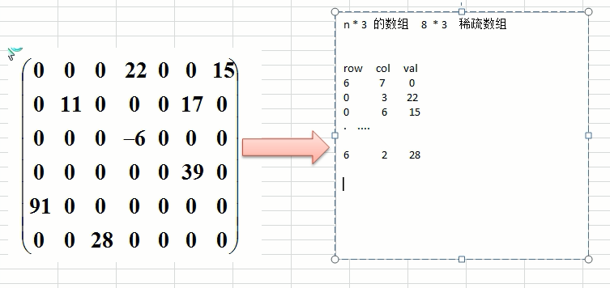

**Golang** 数据结构，数组相关


<!-- more -->

## 1. 数组

### 1.1 Golang 中的数组

同大多语言的数组一样，Go 的数组长度定义后不可更改，长度使用 `len()` 获取。

```go
// 数组定义
var arr1 [10]int                 // 定义长度为10的整型数组，很少这样使用
var arr2 = [5]int{1, 2, 3, 4, 5} // 定义并初始化
arr3 := [5]int{1, 2, 3, 4, 5}   // 自动推导并初始化
arr4 := [5]int{1, 2}          // 指定总长度，前几位被初始化，没有的使用零值	[1 2 0 0 0]
arr5 := [5]int{2: 10, 4: 11}  // 有选择的初始化，没被初始化的使用零值	[0 0 10 0 11]
arr6 := [...]int{2, 3, 4} // 自动计算长度	[2 3 4]

// 数组的长度
len(arr)

// 数组元素获取操作会引发类型的变化，数组将会转化为 Go 中新的数据类型切片
arr[:]      // 代表所有元素
arr[:5]     // 代表前五个元素，即区间的左闭右开
arr[5:]     // 代表从第5个开始（不包含第5个）

// 数组遍历方式一：for 循环遍历
arr := [3]int{1,2,3}

for i := 0; i < len(arr); i++ {
 fmt.Println(arr[i])
}

// 数组遍历方式二：for-range 遍历
arr := [3]int{1,2,3}

for k, v := range arr {
 fmt.Println(k) //元素位置
 fmt.Println(v) //元素值
}
```

## 2. 可变数组

### 2.1 可变数组概念

可变数组是指数组长度可以随着插入数据的增多、减少发生对应变化的数据结构。

**注意：** **C** 语言中的动态数组并不是可变数组，只是其数组长度可以在运行时确定，而不是可以随时”改变“。

可变数组实现方式：

1. 可变数组结构内部维护一个真实数组，用来存储数据；

2. 插入数据时，如果超过内部数组容量，则重新申请一个新的更大的数组，将原有数据拷贝到新数组，继续执行插入即可，这称为 **扩容**；

3. 删除数据时，如果内部数组元素变得很少，可以重新申请一个新的更小的数组，将原有数据拷贝到新数组中，这称呼为 **缩容**。

### 2.2 扩容缩容机制

如果扩容和缩容的时机设计不当，则会引起 `复杂度震荡`。比如在某个结点进行添加数据时需要扩容，而下次操作则是删除该结点，则正好执行缩容，反复增加删除增加删除，那么其时间复杂度会一直维持在最高水平。

复杂度震荡的解决办法：扩容的倍数缩容的时机相乘不等于 **1** 即可。

还有一些引擎如 **V8**，会使用均摊方式进行扩容缩容。比如设定数组容量为 **5**：`cap = 5`，那么在长度到 5 时，就需要一次扩容，
扩容时就需要移动 **5** 个数据，这样就会造成插入数据时，因为要扩容会造成该次插入耗时比平时状态更长！。为了避免数组的某次增
减、删除元素操作突然耗时较长，可以进行均摊，比如每次插入元素，都将`cap + 1`。

### 2.3 可变数组特性

可变数组其特点、复杂度与数组没有本质区别，因为其底层也是维护着一个数组，只不过用户可以无视其容量进行数据数目变更

### 2.4 实现

**Golang** 官方为了解决数组长度不能扩展，以及基本类型数组传递时产生副本的问题，官方包中引入了专有的数据结构切片 **Slice**，使用方式如下：

```go
// 常用创建方式：
var s1 []int    // 和声明没有长度的数组一样，但是无意义，因为底层的数组指针为nil
s2 := []byte {'a','b','c'}
fmt.Println(s1)    //输出 []
fmt.Print(s2)    //输出 [97 98 99]

// 使用 make 函数创建：
slice1 := make([]int,5)  // 创建长度为5，容量为5，初始值为0的切片
slice2 := make([]int,5,7) // 创建长度为5，容量为7，初始值为0的切片
slice3 := []int{1,2,3,4,5} // 创建长度为5，容量为5，并已经初始化的切片
```

手动实现一个基础可变数组示例

```go
package main

import (
	"fmt"
)


const MaxSize = 5 // 默认容量，取最小值便于测试

type DynamicArray struct {
	data     []interface{} // 可变数组内的真实数组
	capacity int           // 可变数组的真实容量
	length   int           // 可变数组的元素个数
}

// 数组扩容
func (arr *DynamicArray) expandCap() {
	if arr.length < arr.capacity {
		return
	}
	//拷贝数据
	newCap := arr.capacity * 2
	newData := make([]interface{}, newCap)
	for i := 0; i < arr.length; i++ {
		newData[i] = arr.data[i]
	}

	// 变更容量
	arr.data = newData
	arr.capacity = newCap
}

// 数组缩容
func (arr *DynamicArray) reduceCap() {
	if arr.length > int(arr.capacity/4) {
		return
	}

	newCap := int(arr.capacity / 2)
	newData := make([]interface{}, newCap)

	for i := 0; i < arr.length; i++ {
		newData[i] = arr.data[i]
	}
	arr.data = newData
	arr.capacity = newCap
}

// Insert 增
func (arr *DynamicArray) Insert(e interface{}, index int) {
	if index < 0 || index > arr.length {
		fmt.Println("插入位置不合法")
		return
	}

	// 每次插入前执行扩容机制，判断是否需要扩容
	arr.expandCap()

	// 总长度从后往前遍历，若大于指定位置则其他数组后移，等于则刚好插入
	for i := arr.length; i >= index; i-- {
		if i == index {
			arr.data[index] = e
		} else {
			arr.data[arr.length] = arr.data[arr.length-1]
		}
	}

	arr.length++
}

// Delete 增
func (arr *DynamicArray) Delete(index int) {
	if index < 0 || index > arr.length-1 {
		return
	}

	// arr.缩容？
	arr.reduceCap()
	for i := 0; i < arr.length; i++ {
		if i >= index {
			arr.data[i] = arr.data[i+1]
		}
	}
	arr.length--
}

// Update 增
func (arr *DynamicArray) Update(e interface{}, index int) {
	if index < 0 || index > arr.length {
		return
	}

	//arr.expandCap()
	for i := 0; i < arr.length; i++ {
		if i == index {
			arr.data[i] = e
		}
	}
}

func (arr *DynamicArray) Length() int {
	return arr.length
}

func (arr *DynamicArray) Capacity() int {
	return arr.capacity

}

func (arr *DynamicArray) Display() {
	fmt.Println(arr.data[:])

}
func NewDynamicArray() *DynamicArray {
	return &DynamicArray{
		data:     make([]interface{}, MaxSize),
		capacity: MaxSize,
		length:   0,
	}
}

func main() {
	dynamic_arr := NewDynamicArray()
	dynamic_arr.Display()
	for i := 0; i < dynamic_arr.Capacity(); i++ {
		dynamic_arr.Insert(i+100, i)
	}
	dynamic_arr.Display()
	dynamic_arr.Insert(88, 5)
	dynamic_arr.Display()
}

```

---

## 3.稀疏矩阵

### 3.1 问题的引入

如下所示的五子棋程序，有存盘退出和续上盘的功能：  


如果使用二维数组来存储，就会如右侧所示存储很多为 0 的浪费空间

### 3.2 稀疏数组存储数据

当一个数组中大部分元素为 0，或者为同一个值的数组时，可以使用稀疏数组来保存该数组，其处理方式为：

-   记录数组一共有几行几列，有多少个不同的值
-   把具有不同值的元素的行列/值记录在一个小规模数组中

如图所示：  



图中的 **row**，**col**，**val** 分别代表有多少行，多少列，对应值，其中第一条数据 **6**，**7**，**10** 存储了左侧数据总计有 **6** 行，**7** 列，**10** 个不同值

### 3.3 实现

```go
package main

import (
	"fmt"
	"reflect"
)

type SparseNode struct {
	row int
	col int
	val interface{}
}

type SparseArray struct {
	data      []SparseNode
	lengthRow int
	lengthCol int
}

// NewSparseArray 将二维数组构建为稀疏矩阵
func NewSparseArray(originArr [][]interface{}) *SparseArray {
	var sparseArr []SparseNode
	for k, v := range originArr {
		for k2, v2 := range v {
			if v2 != nil {
				tempNode := SparseNode{
					k,
					k2,
					v2,
				}
				sparseArr = append(sparseArr, tempNode)
			}

		}
	}
	return &SparseArray{
		data:      sparseArr,
		lengthRow: len(originArr),
		lengthCol: len(originArr[0]),
	}
}

// TransToArray 稀疏矩阵转二维数组
func (sa *SparseArray) TransToArray() [][]interface{} {
	// 构建一个二维切片
	originArr := make([][]interface{}, sa.lengthRow)
	for k, _ := range originArr {
		resultArr := make([]interface{}, sa.lengthCol)
		originArr[k] = resultArr
	}

	for _, v := range sa.data {
		originArr[v.row][v.col] = v.val
	}
	return originArr

}

func main() {
	originArr := [3][3]int{
		{0, 1, 3},
		{0, 2, 0},
		{3, 1, 2},
	}
	fmt.Println(originArr, reflect.TypeOf(originArr))

	originArrI := make([][]interface{}, 3)
	for k, _:=range originArrI {
		inner := make([]interface{}, 3)
		originArrI[k] = inner
	}
	for k, v := range originArr{
		for k2, v2 := range v {
			originArrI[k][k2] = v2
		}
	}
	fmt.Println(originArrI, reflect.TypeOf(originArrI))

	sa := NewSparseArray(originArrI)
	fmt.Println(sa, reflect.TypeOf(sa))

	reArr := sa.TransToArray()
	fmt.Println(reArr, reflect.TypeOf(reArr))

	fmt.Println(&reArr == &originArrI)
}
```

