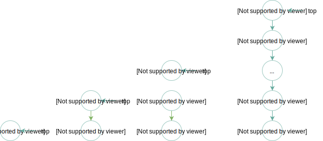
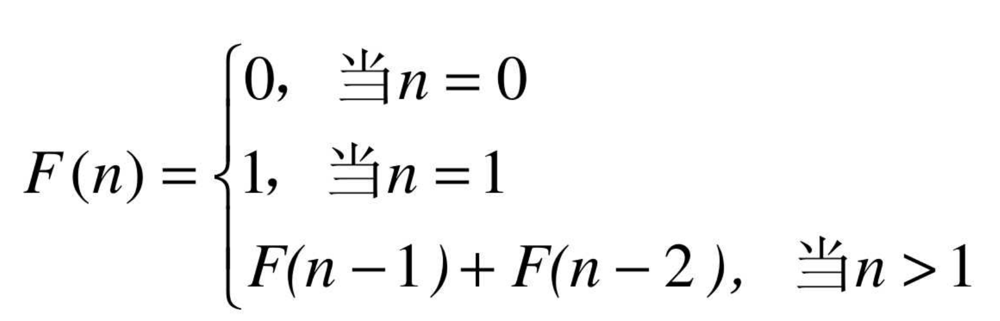

**Golang** 数据结构，栈与队列相关


<!-- more -->

## 1. 栈 

**栈**（*stack*）：一种 **后进先出**（*LIFO*）的有序集合，是在操作上受限的线性表，新添加的或者待删除的元素都保存在栈顶，在栈里，新元素靠近栈顶，旧元素都接近栈底

> 注意：任何不在栈顶的元素都无法访问，为了得到栈底的元素，必须先拿掉上面的元素

栈内部的线性 **表尾端叫做栈顶** （*top*），**表头称为栈底**（*bottom*），不含元素的栈称为空栈
栈的插入操作，常称为压栈或者入栈，栈的删除操作常称为出栈或者弹栈

栈和线性表一样，具备两种存储方式：

- **顺序栈**：顺序方式存储
- **链式栈**：链式存储

### 1.1 顺序栈 

利用一组 **地址连续的存储单元** 依次存放自栈底到栈顶的数据元素，同时指定 **top** 指针指向栈顶元素位置  

如图所示： 



通常做法是 `top = 0` 表示空栈，下标从 `0` 开始。如果设定了栈底指针 `base` ，那么 `top = base` 则记为空栈

初始化时不推荐限定栈的最大容量，应该先分配基本容量，在使用过程中，如果栈的空间不够大，再逐渐扩大，但为简单起见，不做扩大容量的设计

插入新元素时，**top** 指针 **+1**，删除时 **-1**

#### 实现

```go
package main

import (
	"fmt"
	"reflect"
)

const SqStackCap = 5

type SqStack struct {
	item []interface{}
	cap  int
	top  int
}

func NewSqStack() *SqStack {
	return &SqStack{
		item: make([]interface{}, SqStackCap),
		cap:  SqStackCap,
		top:  -1,
	}
}

// Push 压栈操作
func (s *SqStack) Push(e interface{}) bool {
	if s.top == s.cap-1 {
		fmt.Println("栈已满")
		return false
	}

	s.item[s.top+1] = e
	s.top++
	return true
}

// Pop 弹栈操作
func (s *SqStack)Pop() interface{} {
	if s.top == -1 {
		fmt.Println("栈为空")
		return nil
	}

	e := s.item[s.top]
	s.item[s.top] = nil
	s.top--
	return e
}

func (s *SqStack) Top() interface{} {
	if s.top == -1 {
		fmt.Println("栈为空")
		return nil
	}
	return s.item[s.top]
}
func main() {
	stack := NewSqStack()
	stack.Push(876)
	fmt.Println(stack, reflect.TypeOf(stack))
	stack.Push(33)
	stack.Push(11)
	stack.Push(94)
	stack.Push(137)
	stack.Push(258)
	stack.Pop()
	stack.Pop()
	fmt.Println(stack, "top:", stack.top, stack.Top())
}
```

### 1.2 链式栈

**使用链表来实现的栈**，由于是链式存储，链栈基本不存在栈满的情况，除非内存不足！链栈为空其实就是 `top` 为空的时候

我们一般认为向链表中添加元素的操作直接往末尾添加即可，但是在栈中其实有更巧妙的操作，如下所示：  


```go
package main

import (
	"fmt"
	"reflect"
)

type LinkNode struct {
	data interface{}
	next *LinkNode
}

type LinkStack struct {
	top * LinkNode
	length int
}

func NewLinkStack() *LinkStack {
	return &LinkStack{
		top: nil,
		length: 0,
	}
}

func (s *LinkStack)Push(e interface{})  {
	// 如下操作是：引用一个结点，然后将结点的后继指针 指向原栈，摞书
	node := &LinkNode{
		data: e,
		next: s.top,
	}
	s.top = node
	s.length ++
}

func (s *LinkStack)Pop() interface{} {
	if s.top ==nil {
		fmt.Println("空栈无法弹")
		return nil
	}
	e:= s.top.data
	s.top = s.top.next
	s.length--
	return e
}

func (s *LinkStack)Top() interface{} {
	if s.top ==nil {
		fmt.Println("空栈无栈顶")
		return nil
	}
	return s.top
}

func (s *LinkStack)Dispaly() {
	p := s.top
	for p.next != nil {
		fmt.Print(p.data, " <- ")
		p = p.next
	}
	fmt.Println(p.data)
}

func main() {
	l_stack := NewLinkStack()
	l_stack.Push(223)
	fmt.Println(l_stack, reflect.TypeOf(l_stack))
	l_stack.Push(56)
	l_stack.Push(88)
	l_stack.Push(73)
	l_stack.Push(94)
	l_stack.Push(42)
	l_stack.Dispaly()
	l_stack.Pop()
	l_stack.Pop()
	l_stack.Dispaly()
}
```

### 1.3 共享空间栈

栈的顺序存储结构只允许栈顶进出元素，不存在线性表中插入、删除数据时需要移动数据的问题，但是 **必须预设一个数组的存储空间**

虽然 **Golang** 的切片的容量是动态的，但是变更容量带来的内存拷贝消耗也是可观的，如果数组容量过大，又容易出现利用率不足问题   

对于两个相同类型的栈，可以通过一个数组来最大限度的利用已经开辟好的空间来进行操作

**设计思路**：数组有两个端点， 两个栈有两个栈底， 让一个栈的栈底为数组的始端， 即下标为 **0** 处，另一个栈为数组的末端，即下标为 数组容量 **cap - 1** 处，这样， 两个栈如果增加元素， 就是两端点向中间延伸，（*即两个栈在数组的两端，向中间靠拢*），**top1** 和 **top2** 是栈顶指针，只要他们不见面，两个栈就可以一直使用

一些边界情况:

- 栈 **1** 为空，即 `top1 = -1`
- 栈 **2** 为空，即 `top2 = cap`
- 栈 **1** 满，即 `top1 = cap-1`，且 栈 **2** 为空
- 栈 **2** 满，即 `top2 = 0`，且栈 **1** 为空
- 栈满，即 `top+1 == top2`，也即两个栈见面，两个指针之间相差 **1**

> 注意：两栈共享空间的数据结构，通常用于两栈空间需求相反（*此消彼长*），且数据类型一致！！！   

数据结构如图所示： 


```go
package main

import (
	"fmt"
	"reflect"
)

const maxCap = 10

type ShareStack struct {
	items []interface{}
	top   int
	top2  int
	cap   int
}

func NewShareStack() *ShareStack {
	return &ShareStack{
		items: make([]interface{}, maxCap),
		top:   -1,
		top2:  maxCap,
		cap:   maxCap,
	}
}

func (s *ShareStack) Push(e interface{}, stackID int) bool {
	if stackID < 1 || stackID > 2 {
		fmt.Println("编号选择错误")
		return false
	}
	if s.top+1 == s.top2 {
		fmt.Println("栈空间已满")
		return false
	}
	if stackID == 1 { // 第一个栈 入栈
		s.items[s.top+1] = e
		s.top++
	} else { // 第二个栈 出栈
		s.items[s.top2-1] = e
		s.top2--
	}
	return true
}

func (s *ShareStack) Pop(stackID int) interface{} {
	if stackID < 1 || stackID > 2 {
		fmt.Println("栈编号选择错误")
		return false
	}

	if (s.top == -1 && stackID == 1) || (s.top2 == s.cap && stackID == 2) {
		fmt.Println("栈空无法弹栈")
		return nil
	}

	var e interface{}
	if stackID == 1 {
		e = s.items[s.top]
		s.items[s.top] = nil
		s.top--
	} else if stackID == 2 {
		e = s.items[s.top2]
		s.items[s.top2] = nil
		s.top2++
	}
	return e
}

// 获取栈顶元素
func (s *ShareStack)Top(stackID int) interface{}{

	if stackID < 1 || stackID > 2 {
		fmt.Println("栈编号选择错误")
		return false
	}

	if (stackID == -1 && s.top == -1) || (s.top2 == s.cap && stackID == 2) {
		fmt.Println("空栈无法pop")
		return nil
	}

	var e interface{}

	if stackID == 1 {
		e = s.items [s.top]
	} else {
		e = s.items[s.top2]
	}

	return e
}

func main() {
	s_stack := NewShareStack()
	s_stack.Push(13, 2)
	fmt.Println(s_stack, reflect.TypeOf(s_stack))
	s_stack.Push(22, 1)
	s_stack.Push(7, 1)
	s_stack.Push(999, 1)
	s_stack.Push(56, 2)
	fmt.Println(s_stack, s_stack.Top(1), s_stack.Top(2))
	s_stack.Push(345, 2)
	s_stack.Push(89, 2)
	s_stack.Push(9, 2)
	s_stack.Push(6, 2)
	s_stack.Push(5, 2)
	s_stack.Push(888, 1)
	s_stack.Pop(1)
	s_stack.Pop(2)
	fmt.Println(s_stack)
}
```

## 2. 队列

**队列**（*Queue*）：只允许在一端进行插入操作，在另一端进行删除操作的线性表，队列也是特殊的线性表，遵循 **FIFO**（*先进先出，First In First Out*）规则，即在尾部添加元素，并从顶部移除元素，最新添加的元素必须排在队列的末尾

队列一般包含两个索引/指针：

-   **front**：表示队首
-   **rear**：表示队尾



由于队列也是线性表，队列也有两种存储方式：

-   **顺序存储**：使用数组存储数据
-   **链式存储**：其实就是一个单链表，只不过只能尾进头出，称之为链队列

### 2.1 链式存储

此处使用不带头结点的链表来实现的队列，其特点有：

-   空队列时，**front** 和 **rear** 都指向 **nil**
-   入队即链表尾部插入结点
    -   若是第一次入队，则 **front** 和 **rear** 同时指向第一个元素
-   出队即将链表的第一个元素删除，将其后继元素作为 **front** 结点
    -   若链表只有一个结点时，则需将 **rear** 指向 **front** 结点

#### 实现

```go
package main

import (
	"fmt"
	"reflect"
)

type QueueNode struct {
	data interface{}
	next *QueueNode
}

func NewQueueNode(e interface{}) *QueueNode {
	return &QueueNode{
		data: e,
		next: nil,
	}
}

type QueueLink struct {
	rear   *QueueNode
	front  *QueueNode
	length int
}

func NewQueueLink() *QueueLink {

	return &QueueLink{
		rear:   nil,
		front:  nil,
		length: 0,
	}
}

func (q *QueueLink) Put(e interface{}) {
	p := NewQueueNode(e)
	if q.front == nil && q.rear == nil {
		q.rear = p
		q.front = q.rear
	} else {
		q.rear.next = p
		q.rear = p
	}

	q.length++
}

func (q *QueueLink) DeQueue() {
	if q.length == 0 {
		fmt.Println("队列为空，无法出队")
		return
	}

	q.front = q.front.next
	if q.front == nil {
		q.rear = q.front
	}

	q.length--
}

func (q *QueueLink) Search(e interface{}) *QueueNode {
	if q.length == 0 {
		fmt.Println("队列为空，无法出队")
		return nil
	}

	pos := q.front
	for pos.next != nil {
		fmt.Println(pos.data)
		if pos.data == e {
			break
		}
		pos = pos.next
	}
	return pos
}

func (q *QueueLink) Display() {
	if q.length == 0 {
		fmt.Println("队列为空，无法出队")
		return
	}

	pos := q.front
	for pos.next != nil {
		fmt.Print(pos.data, "->")
		pos = pos.next
	}
	fmt.Println(pos.data)
}

func main() {
	queueLink := NewQueueLink()
	fmt.Println(queueLink, reflect.TypeOf(queueLink))
	queueLink.Put(22)
	queueLink.Put(12)
	queueLink.Put(5)
	queueLink.Put(87)
	queueLink.Put(57)
	queueLink.Display()
	queueLink.Put(233)
	queueLink.DeQueue()
	queueLink.DeQueue()
	queueLink.DeQueue()
	queueLink.DeQueue()
	queueLink.DeQueue()
	queueLink.DeQueue()
	queueLink.DeQueue()
	fmt.Println(queueLink.rear, queueLink.front, queueLink.length)
	queueLink.Put(23)
	queueLink.Put(45)
	queueLink.Put(2)
	queueLink.Display()
}
```

### 2.2 顺序存储

顺序存储的操作复杂度：

-   **入队**：只是给数组数据最后一位添加一个元素，时间复杂度为 **O(1)**
-   **出队**：为了保证队头正确性，需要将当前头部及以后所有元素向后移动，时间复杂度为 **O(n)**

顺序存储的 **出队性能很差**，在实际开发中，其实不一定必须移动队列元素，只要将 **队头的位置后移一位** 即可，此时出队性能将会大幅增加：  



**假溢出**：在出队时，**front** 索引位置会不断后移，那么此时会产生新的问题：当 **front** 索引后的位置都被占满，新插入的元素该往哪存放？明明数组在 front 之前还有空位，但是造成了数组满的假象，称之为假溢出！

假溢出问题如果不能得到解决，那么栈的顺序存储就没有任何意义，所以一般情况下顺序存储用于实现循环队列

### 2.3 循环队列

**循环队列**：（*CircleQueue*），底层一般使用数组实现，可以解决顺序存储队列的不足

**假溢出的解决办法**：后面满了，再从头开始，也就是头尾相接的循环，这种头尾相接的顺序存储结构队列即循环队列。

如图所示，当 **a7** 入队时，**rear** 指针到达索引 **0** 位置：  


如果在 **a7** 入队后，再次入队 **1** 个元素，则空间被占满，**front** 和 **rear** 紧紧相邻

很显然在入队出队的时候，我们需要重新计算其真实索引：

-   入队时，**rear** 的计算公式：`rear = (front + length) % cap`
-   出队时，**front** 的计算公式：`front = (front + 1) % cap`

最终可以得到一个通用公式：**`realIndex = (front + i) % cap`**

```go
// 获取队列容量
func (q *CircleQueue)Cap() int {
	return q.cap	// maxSize
}

// 获取在循环队列数组中的真实索引
func (q *CircleQueue)realIndex(index int) int{
	return (q.head + index) % q.Cap()
}
```

**实现如下**

```go
/* 直接 取模 + 1 未通过如上叙述实现*/
package main

import (
	"fmt"
	"reflect"
)

const maxSize = 4

type CircleQueue struct {
	data   []interface{}
	rear   int
	front  int
	length int
}

func NewCircleQueue() *CircleQueue {
	return &CircleQueue{
		data:   make([]interface{}, maxSize),
		rear:   0,
		front:  0,
		length: 0,
	}
}

func (q *CircleQueue) EnQueue(e interface{}) bool {
	if q.length == maxSize {
		fmt.Println("队列已满，无法入队")
		return false
	}
	if q.length == 0 {
		q.data[q.rear] = e
		q.data[q.front] = e
	} else {
		q.rear = q.rear%maxSize + 1
		q.data[q.rear] = e
	}
	q.length++
	return true
}

func (q *CircleQueue) DeQueue() interface{} {
	if q.length == 0 {
		fmt.Println("队列为空, 无法出队")
		return nil
	}
	q.front = q.front%maxSize + 1

	if q.front == q.rear {
		q.front = 0
		q.rear = 0
	}
	q.length--
	return nil
}

func (q *CircleQueue) Dispaly() {
	if q.length == 0 {
		fmt.Println("queue null")
		return
	}
	start := q.front
	for start != q.rear {
		fmt.Print(q.data[start], " <- ")
		start++
	}
	fmt.Println(q.data[start])
}
func main() {
	circleQueue := NewCircleQueue()
	fmt.Println(circleQueue, reflect.TypeOf(circleQueue))
	circleQueue.EnQueue(12)
	circleQueue.EnQueue(3)
	circleQueue.EnQueue(75)
	circleQueue.EnQueue(23)
	circleQueue.EnQueue(88)
	circleQueue.EnQueue(92)
	circleQueue.Dispaly()
	circleQueue.DeQueue()
	circleQueue.DeQueue()
	circleQueue.Dispaly()
	circleQueue.DeQueue()
	circleQueue.DeQueue()
	//circleQueue.Dispaly()
	circleQueue.DeQueue()
	circleQueue.DeQueue()
	circleQueue.Dispaly()
}
```

### 2.4 双端队列

**双端队列**：（*Double Ended Dqueue*)，能够在头尾两端添加、删除元素的队列

## 3.栈的应用

### 3.1 函数调用栈

栈最经典的应用场景是 **函数调用栈**，操作系统为每个线程分配了一块独立内存空间，该内存内部会被构建为类似栈的结构，用于存储函数调用时的临时变量

每进入一个函数，就会将临时变量作为一个栈帧入栈，当被调用函数执行完成，返回之后，将这个函数对应的栈帧出栈。  

### 1.2 表达式求值

对于常见的四则运算，如：`34+13*9+44-12/3`，计算机是很难理解的，编译器通常通过两个栈来实现：

- 一个栈用来保存 **操作数**
- 一个栈用来保存 **运算符**

从左向右遍历表达式，当遇到数字，会直接压入操作数栈；当遇到运算符，就与运算符栈的栈顶元素进行比较如果比运算符栈顶元素的优先级高，就将当前运算符压入栈；如果比运算符栈顶元素的优先级低或者相同，从运算符栈中取栈顶运算符，从操作数栈的栈顶取 2 个操作数，然后进行计算，再把计算完的结果压入操作数栈，继续比较。  

### 1.3 栈匹配括号

栈还用于表达式、代码中的括号匹配。  

假设表达式中只包含三种括号，圆括号 `()`、方括号 `[]` 和花括号`{}`，并且它们可以任意嵌套。比如，`{[{}]}`或 `[{()}([])]` 等都为合法格式，而 `{[}()]`  或 `[({)]` 为不合法的格式。那我现在给你一个包含三种括号的表达式字符串，如何检查它是否合法呢？  

- 栈来保存未匹配的左括号，从左到右依次扫描字符串，当扫描到左括号时，则将其压入栈中；

- 当扫描到右括号时，从栈顶取出一个左括号。如果能够匹配，比如 `“(”` 跟 `“)”` 匹配，`“[”` 跟 `“]”` 匹配，`“{”` 跟 `“}”` 匹配，则继续扫描剩下的字符串
- 如果扫描的过程中，遇到不能配对的右括号，或者栈中没有数据，则说明为非法格式

当所有的括号都扫描完成之后，如果栈为空，则说明字符串为合法格式；否则，说明有未匹配的左括号，为非法格式

### 1.4 浏览器历史记录

使用两个栈，**X** 和 **Y**，我们把首次浏览的页面依次压入栈 **X**，当点击后退按钮时，再依次从栈 **X** 中出栈，并将出栈的数据依次放入栈 **Y**。当我们点击前进按钮时，我们依次从栈 **Y** 中取出数据，放入栈 **X** 中。当栈 **X** 中没有数据时，那就说明没有页面可以继续后退浏览了。当栈 **Y** 中没有数据，那就说明没有页面可以点击前进按钮浏览了。

### 1.5 栈与递归

递归是栈的重要应用。在以前澳洲的兔子泛滥成灾，因为兔子具有惊人的繁殖能力，一对兔子每个月能生出一对兔子，以这对父母为开始，总共生出的后代数目：第一个月小兔子没有繁殖能力，所以还是一对；两个月后， 生下一对小兔子数共有两对； 三个月以后，老兔子又生下一对， 因为小兔子还没有繁殖能力， 所以一共是三对，依次类推。这就是递归现象，用数学公式演示：  

   

使用递归实现： 

```go
func Fbi(int i) int {

    if i < 0 {
        panic("非法参数")
    }

    if i < 2 {
        return i
    }

    return Fbi(i - 1) + Fbi(i - 2)
}

func main() {
    for i := 0; i < 40; i++ {
        fmt.Println("%d ", Fbi(i))
    }
}
```

在上述案例中，最重要的思想就是斐波那契函数 `Fbi()` 调用了自己，这便是递归。递归最需要注意的地方是，**必须给递归制作一个退出条件**，否则无限循环下去，将会是一场噩梦

递归的代码一般都可以无缝转化为迭代方式实现

递归虽然让程序的结构更清晰、简洁，但是大量的递归调用会建立函数的副本，**会耗费大量的时间和内存**，迭代则不需要反复调用函数和占用额外的内存，因此我们应该视不同情况选择不同的代码实现方式


## 4. 队列的应用 

### 2.1 阻塞对垒

**阻塞队列：** 其实就是在队列基础上增加了阻塞操作

- 在 **队列为空** 的时候，从队头取数据会被阻塞，因为此时还没有数据可取，直到队列中有了数据才能返回
- 如果 **队列已满** ，那么插入数据的操作就会被阻塞，直到队列中有空闲位置后再插入数据，然后再返回

该定义其实就是一个 **生产者 - 消费者模型**，可以有效地协调生产和消费的速度。当“生产者”生产数据的速度过快，“消费者”来不及消费时，存储数据的队列很快就会满，此时，生产者就阻塞等待，直到 **消费者** 消费了数据，**生产者** 才会被唤醒继续 **生产**   

而且不仅如此，基于阻塞队列，我们还可以通过协调 **生产者** 和 **消费者** 的个数，来提高数据的处理效率。比如前面的例子，我们可以多配置几个 **消费者**，来应对一个 **生产者**

### 1.2 并发队列

**线程安全的队列** 我们叫作并发队列

最简单直接的实现方式是直接在 `EnQueue()`、`DeQueue()` 方法上加锁，但是锁粒度大并发度会比较低，同一时刻仅允许一个存或者取操作

实际上，基于数组的循环队列，利用 **CAS** 原子操作，可以实现非常高效的并发队列，这也是循环队列比链式队列应用更加广泛的原因

### 1.3 线程池实现

线程池没有空闲线程时，新的任务请求线程资源时，线程池该如何处理？各种处理策略又是如何实现的呢？  

我们一般有两种处理策略。

- 第一种是非阻塞的处理方式，直接拒绝任务请求
- 另一种是阻塞的处理方式，**将请求排队**，等到有空闲线程时，取出排队的请求继续处理，那如何存储排队的请求呢？  

##### 存储排队的请求

我们希望公平地处理每个排队的请求，**先进者先服务**，所以队列这种数据结构很适合来存储排队请求，我们前面说过，队列有基于链表和基于数组这两种实现方式。这两种实现方式对于排队请求又有什么区别呢？  

- **基于链表** 的实现方式，可以实现一个 **支持无限排队的无界队列**（*unbounded queue*），但是可能会导致过多的请求排队等待，请求处理的**响应时间过长**，所以，针对响应时间比较敏感的系统，**基于链表实现的无限排队的线程池是不合适的**

- 而基于数组实现的有界队列（*bounded queue*），队列的 **大小有限**，所以线程池中排队的请求超过队列大小时，接下来的 **请求就会被拒绝**，这种方式 **对响应时间敏感的系统来说，就相对更加合理**，不过，设置一个合理的队列大小，也是非常有讲究的，队列太大导致等待的请求太多，队列太小会导致无法充分利用系统资源、发挥最大性能

除了前面讲到队列应用在线程池请求排队的场景之外，队列可以应用在任何有限资源池中，用于排队请求，比如数据库连接池等，实际上，对于大部分资源有限的场景，当没有空闲资源时，基本上都可以通过 **队列** 这种数据结构来实现请求排队  

### 为什么引入 栈 与 队列 这样的数据结构

数组和链表基本可以完整实现栈/队列的功能，但是计算机中额外引入了这些受限的数据结构，原因是这样做 **简化了程序设计的问题**，划分了不同关注层次，使得思考范围缩小，更加 **聚焦于我们要解决的问题核心**，反之像数组等，因为要分散精力去考虑数组的下标增减等细节问题，反而掩盖了问题的本质