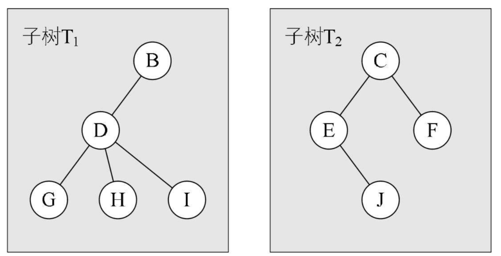

**Golang** 数据结构，树相关


<!-- more -->

## 1. 树

### 1.1 树形结构

现实中，有很多一对多的情况，如公司的行政架构图，文件系统中不同层级的文件，如果用链表这样的线性结构存储，显然很难做到，此时可以用树来表示

**树**（*Tree*）是一种 **非线性数据结构**，经常用来 **存储具有层级关系的数据**，它是 `n（n>=0）`个结点的有限集，`n=0` 时称为空树

在任意一棵非空的树中：

-   有且仅有一个特定的 **根结点**（*Root*）
-   当 `n>1` 时，其余结点可分为 `m（m>0）`个树，可以称为根的 **子树**（*SubTree*）

如图所示


### 1.2 树的理解

树的定义其实采用了 **递归** 的方法，如图所示，两个子树其实是根结点 **A** 的子树，当然 **D,G,H,I** 组成的树又是 **B** 为根结点的子树，以此类推：



除了要主要根结点的唯一性以外，**子树之间一定是互不相交的**，如下所示并不符合树的定义：


树的相关术语：

-   **父结点**：下方连接多个结点
-   **子结点**：父结点下的结点
-   **结点的度**（*De-gree*）：拥有的子树数
-   **叶结点**（*Leaf*）：没有子结点的结点，即 **度为 0**，也称为 **终端结点**
-   **非叶结点**：**度不为 0** 的结点，也称为 **分支结点**，也可以称为内部结点（*根结点除外*）
-   **树的深度**：从上往下定义，为叶结点所在 **最大层数**


**结点的层次**（*Level*）：根结点作为第一层，其孩子为第二层


有序树与无序树：

-   **有序树**：树中的结点的各个子树看成从左至右有次序不可互换
-   **无序树**：与有序树相反

## 2. 树的存储结构

#### 树的三种结构

由于树中的结点具备父子关系，使用顺序存储实现比较困难。树的存储结构主要有三种：

-   双亲表示法
-   孩子表示法
-   孩子兄弟表示法。

### 2.1 双亲表示法

树的每个结点不一定有孩子，但是 **一定有且仅有一个双亲** 结点（*根结点除外*），所以可以通过其双亲表示一个完整的树

```go
// 树种的结点
type node struct {
    data    interface{}         // 数据域：存储结点中的数据
    parent  int                 // 指针域：存储双亲在数组中的下标
}

// 树
type Tree struct {
    nodes   []*node             // 结点指针数组
    root    int                 // 根结点位置
    num     int                 // 结点数
}
```

其存储的数据格式如下：


**双亲表示法的优点**：可以迅速找到当前结点的父结点，当 **parent** 为 **-1** 时，是根结点

**双亲表示法的缺点**：查找当前结点的子结点时，**必须遍历整个树** 

- **缺点解决**：增加一个结点的 **最左孩子域**，这样就能轻易得到结点的孩子
  - 如果没有子结点，整个最左孩子域设置为 **-1**
  - 但是如果孩子很多，超过 **2** 个，又需要关注结点的双亲、孩子、兄弟，那么需要不断的扩展结构，添加其他的域，比如：**双亲域、左右兄弟域** 等等

### 2.2 孩子表示法

把每个结点的孩子结点排列起来，**以链表存储**，如果树有 **n** 个结点，就会有 **n** 个链表，如果是叶结点，则此单链表为 **空链表**，然后 **链表的头指针放在一个数组中**

```go
// 链表中的每个结点存储的不再是数据本身，而是数据在数组中的下标
type node struct {
    child   int                 // 数据域：数组下标 如 A、B、C 对应 1、2、3
    next    *node              // 指针域：指向该结点的下一个孩子结点的指针
}

// 表头结构
type first struct {
    data    interface{}        // 数据域：存储结点数据
    first   *node              // 头指针域：存储该结点的孩子链表的头指针
}

// 树结构
type Tree struct {
    nodes []*node
    root int
    num int
}
```

孩子表示法如图所示：  


**适用于查找某结点的孩子结点，不适用于查找其父结点**

> 相当于用树的结构体中的 **nodes**，把每个结点像数组一样存起来，再额外加指针，关联（*链式指向*）其所有子结点，每个结点通过数组下标再次关联，形成完整结构（*感觉本质还是以顺序存储为媒介，混合了链式关联的结构*）

可以将两种表示方法合二为一，存储效果如图：


> 再对每个 **node** 加个 **parent** 变量，来存储每个结点的父结点

### 2.3 孩子兄弟表示法

任意一棵树，它的结点的第一个孩子如果存在就是唯一的，它的右兄弟如果存在也是唯一的，因此设置两个指针，分别指向该结点的 **第一个孩子** 和此结点的 **右兄弟** 即可

```go
type node struct {
    data interface{}
    firstchild *node
    rightchild *node
}
```

如图所示：


上述的表示方法，给查找某个结点的某个孩子带来了方便，只需要通过 **firstchild** 找到此结点的长子，然后再通过长子结点的 **rightsib** 找到它的二弟，依次类推，直到找到具体的孩子

当然如果要**找到双亲，依然有困难**（*添加 **parent** 指针域可以解决*）

孩子兄弟表示法其实是 **将一棵 复杂的树 表示为了 二叉树** 

## 3. 二叉树

**二叉树**（*Binary Tree*）： 树的每个结点的度最大为 **2**，即最多拥有 **2** 棵子树

二叉树有五种形态：

-   空二叉树
-   只有一个根结点
-   根结点只有左子树
-   根结点只有右子树
-   根结点既有左子树又有右子树

**注意**：二叉树的 **左子树和右子树是有顺序的，不能任意颠倒**，即使树种某个结点只有一棵子树，也要区分它是左子树还是右子树。交换左右子树后生成的新二叉树就不再是以前的二叉树了！！**所以二叉树是 有序树！** 

一些特殊的二叉树：

-   **斜树**：斜树看起来类似线性结构，有左斜树（*只有左侧结点*），右斜树（*只有右侧结点*），此时 **结点的个数就是二叉树的深度** 
-   **真二叉树（*Proper Binary Tree*）**：所有结点的度要么为 **0**，要么为 **2**
-   **满二叉树（*Full Binary Tree*）**：所有结点的度要么为 **0**，要么为 **2**，且叶结点都在最后一层（*其实是在 **真二叉树** 基础上添加了限制*）

### 3.1 非空二叉树的特性

-   **每层结点数**：二叉树的第 **i** 层上至多有 **2<sup>i-1</sup>**个 结点 **（i>=1）**
-   **全部结点数**：高度为 **h** 的二叉树至多有 **2<sup>k</sup>-1** 个结点**（h>=1，也是叶结点所在的最大层数）**。相应的高度 **h = log$_2$n+1**
-   **叶结点数与度关系**：**叶结点数 = 度为 2 结点数 + 1**

叶结点与度关系推导：

```shell
# n0 是叶结点数，n1 是度为1的结点数，n2 是度为2的结点数，T为二叉树的结点连线总数：
T = 1*n1 + 2*n2
T = n - 1
n = n0 + n1 + n2
```

其实还可以得到一个公式： **n = 2n0 + n1 - 1**

如图所示：  


### 3.3 完全二叉树

**完全二叉树（*Complete Binary Tree*）**：叶子结点只会出现在最后 **2** 层，且最后 **1** 层的叶子结点都靠左对其

如图：  


**注意**：**完全二叉树不一定是满的**，但是只要将完全二叉树补充上对应子结点，就是一棵满二叉树。

也可以推理出：

-   满二叉树一定是完全二叉树
-   完全二叉树的根结点到倒数第二层之间的树是一棵满二叉树

#### 特性

完全二叉树的特点：

-   度为 **1** 的结点只有左子树
-   度为 **1** 的结点要么是 **1** 个，要么是 **0** 个
-   同样结点数的二叉树，**完全二叉树深度最小**
-   如果结点度为 **1**，则该结点只有孩子结点，不存在只有右子树的情况

假设完全二叉树的高度为 **h** ，**h >= 1**，则：

-   则至少有 **2<sup>h-1</sup>** 个结点
-   则最多有 **2<sup>h</sup> - 1** 个结点 (*满二叉树*)

总结点数量 n ：

-   则：**2<sup>h - 1</sup> <= b < 2<sup>h</sup>** 
-   也即 **h - 1 <= log2n < h**，由于 **h** 是整数，**h = floor(log2n) + 1** (*向下取整*)

**n0** 是叶结点数，**n1** 是度为 **1** 的结点数，**n2** 是度为 **2** 的结点数：

```shell
# 二叉树本身的规律
n = 2n0 + n1 - 1
# 完全二叉树的n1要么是1，要么是0
```

一颗有 **n(n>0)** 个结点的完全二叉树，从上到下，从左到右，给结点从 **1** 编号，则第 **i** 个结点有：

-   **i=1**，是根结点
-   **i>2**，其父结点编号是 **floor(i/2)**
-   **2i<=n**，其左子结点编号为 **2i**
-   **2i>n**，则其无左子结点
-   **2i+1<=n**，则其右子结点编号为 **2i+1**
-   **2i+1>n**,则其无右子结点

### 3.4 二叉树存储结构

树使用顺序存储是非常困难的，**但是二叉树结构特殊，使用顺序存储也能实现**，即：用一维数组存储二叉树中的结点和结点关系


图中 **4，6，8，9** 结点不存在。顺序存储虽然能够表述二叉树，但是实用性不强，比如一种极端的情况，树的深度为 **k**，但是是右倾斜树，只有 **k** 个结点，却需要分配 **2k-1** 个存储单元，**造成了空间的极大浪费** 

**推荐使用链式存储，即二叉链表**：每个结点最多有两个孩子，结点分别设计一个数据域、两个指针域，即可表示一个结点

```go
type node struct {
    data        interface{}
    lchild      *node
    rchild      *node
}
```

二叉链表示意图：  


### 3.5 二叉树的四种遍历方式

二叉树要对其遍历如图：


遍历一般是 **从根结点开始**，当然我们也可以限制左右顺序遍历是从左开始，主要遍历方法有下列多种：

-   **前序遍历（*Preorder Traversal*）**：根结点 -> 前序遍历左子树 -> 前序遍历右子树，结果为 `A -> BDGH -> CEIF`
-   **中序遍历（*Inorder Traversal*）**：中序遍历左子树 -> 根结点 -> 中序遍历右子树，结果为 `GDHB -> A -> EICF`
-   **后序遍历（*Postorder Traversal*）**：从左到右遍历左子树叶结点 -> 从左到右遍历右子树叶结点 -> 根结点，结果为 `GHDB -> IEFC -> A`
-   **层序遍历（*Level Order Traversal*）**：根结点 -> 第一层 -> 第二层 -> ... 依次类推，结果为 `A -> BC -> DEF -> GHI`

### 3.6 实现

二叉树的定义和遍历都需要利用递归原理

```go
package main

import (
	"fmt"
	"reflect"
)

type BinaryTree struct {
	data  interface{}
	left  *BinaryTree
	right *BinaryTree
}

func NewBinaryTree(e interface{}) *BinaryTree {
	return &BinaryTree{
		data:  e,
		left:  nil,
		right: nil,
	}
}

func Appoint() *BinaryTree {
	/*手动指定如上图的一颗树
							A
				B						C
		D						E				F
	G		H						I
	*/
	A := NewBinaryTree("A")
	B := NewBinaryTree("B")
	C := NewBinaryTree("C")
	D := NewBinaryTree("D")
	E := NewBinaryTree("E")
	F := NewBinaryTree("F")
	G := NewBinaryTree("G")
	H := NewBinaryTree("H")
	I := NewBinaryTree("I")
	A.left = B
	A.right = C
	B.left = D
	D.left = G
	D.right = H
	C.left = E
	C.right = F
	E.right = I
	return A
}

// 对于所有的树来说，遍历都是通用的
// 前序遍历
func PreOrderTraverse(t *BinaryTree) {
	if t == nil {
		return
	}
	fmt.Print(t.data)			// 前序遍历就是从node开始遍历，所以要先打印	ABDGHCEIF
	PreOrderTraverse(t.left)
	PreOrderTraverse(t.right)
}

func InOrderTraverse(t *BinaryTree) {
	if t == nil {
		return
	}
    // 会产生式升序结果	GDHBAEICF
	InOrderTraverse(t.left)
	fmt.Print(t.data)
	InOrderTraverse(t.right)
    
    // 会产生降序结果	FCIEABHDG
	//InOrderTraverse(t.right)
	//fmt.Print(t.data)
    //InOrderTraverse(t.left)
}

// 后序遍历
func PostOrderTraverse(t *BinaryTree) {
	if t == nil {
		return
	}
	PostOrderTraverse(t.left)
	PostOrderTraverse(t.right)
	fmt.Print(t.data)				// GHDBIEFCA
}

func main() {
	t := Appoint()
	fmt.Println(t, reflect.TypeOf(t))
	PreOrderTraverse(t)
	fmt.Println()
	InOrderTraverse(t)
	fmt.Println()
	PostOrderTraverse(t)
}
```

::: tip 二叉树递归缺陷

每次递归调用都会开辟一个函数栈空间，递归次数很多时，就会出现内存的急剧消耗，所以 **最好的遍历方式仍然是迭代方式遍历**

**迭代方式实现遍历与层序遍历的思路相似，都需要借助一个数据结构来实现，一般是 栈 或 队列**

:::

#### 层序遍历

**使用队列**，将根节点入队，循环（*队列为空则表示所有结点出队完成*），从根结点开始，对出的同时，将其左右子结点入队

```go
import (
	"container/list"
)

func LevelOrderTraverse(t *BinaryTree) {
	if t == nil {
		return
	}

	queue := list.New()
	queue.PushBack(t)
	// 循环，将一层层的父结点出队，关联子结点依次入队
	for queue.Len() != 0 {
		queueHead := queue.Remove(queue.Front())	// 队首出队 即上文入队的t
		tempNode:= queueHead.(*BinaryTree)		// 类型断言
		fmt.Print(tempNode.data)
		if tempNode.left != nil {
			queue.PushBack(tempNode.left)
		}
		if tempNode.right != nil {
			queue.PushBack(tempNode.right)
		}
	}
}
```

#### 遍历的应用

层序遍历可以用来：

-   计算二叉树的高度
-   判断一棵树是否为完全二叉树

通过前序/后续遍历 + 中序遍历的结果也可以推导出唯一的一棵二叉树：

-   前序遍历总是从 **root** 结点开始：根结点 -> 左子树 -> 右子树，此时可以找到其根结点 ，**前缀定左**
-   中序遍历从是从左子树开始：左子树 -> 根结点 -> 右子树，从前序遍历已经知道了根结点位置，依据中序就能知道其左右子结点 **中缀定左右**

#### 二叉树与四则运算

四则运算（+、-、\*、/）一般有三种：

-   前缀表达式（*prefix expression*），也称为波兰表达式
-   中缀表达式（*infix expression*），该方式符合人类的视觉思维
-   后缀表达式（*postfix express*），又称为逆波兰表达式

所谓的前缀、后缀、中缀指的是运算的位置是在两个操作数的左中右位置，如下所示：

 

```go
func Appoint2() *BinaryTree {
	A := NewBinaryTree("+")
	B := NewBinaryTree("9")
	C := NewBinaryTree("*")

	D := NewBinaryTree("-")
	E := NewBinaryTree("2")
	F := NewBinaryTree("4")
	G := NewBinaryTree("1")

	A.left = B
	A.right = C
	C.left = D
	C.right = E
	D.left = F
	D.right = G
	return A
}
```

如果将四则运算表达式的操作数作为叶子结点，运算符作为父结点，则可组成一棵二叉树，如 `A / B + C * D - E`：


如果对该二叉树进行前序遍历，就会生成前缀表达式。如果进行中序遍历，则会生成中缀表达式，同理进行后序遍历，则生成后缀表达式

## 4. 二叉搜索树

**二叉搜索树 BST**（*Binary Search Tree*），也称为 **二叉排序树，二叉查找树**

二叉搜索树可以为空。如果不为空，则满足：

-   非空左子树的所有键值小于其根结点的键值
-   非空右子树的所有键值大于其根结点的键值
-   左、右子树本身也都是二叉搜索树

如图所示，红勾表示的即是二叉搜索树：  


### 4.1 二叉搜索树查找思想

如其名称定义，二叉搜索树的查找很便利。如果要对下列混乱的数据进行查找 **7** 是否在数据中：`{1,3,6,7,9,0,4,2,5,8}`。对这种无序的数据，我们可以使用循环操作挨个遍历，或者使用 **哈希表** 方式

如果现在要对一个有序的数据进行查找`{0,1,2,3,4,5,6,7,8,9}`，可以使用二分查找即可快速找出 7 是否在数据中。

其实这和二叉搜索树的概念是一致的，**利用折半的思想**，这个数据序列转换为二叉搜索树后如图：


二叉搜索树与哈希表作为查找时的对比：

-   哈希表需要一个很大的数组，会造成一定的空间浪费
-   哈希表的数据是无序的，二叉搜索树其实是有序数据利用二分查找思想的转换

二叉搜索树在插入结点的时候，**也需要一层层比较大小**，由此也带来新的特性：**很容易获取最大值，最小值**

::: tip 注意

其实二叉搜索就是二分搜索法的是数据结构实现，**中序遍历可以得到从小到大的结果**！！（*右左逆序则从大到小*）

:::

### 4.2 插入实现

#### 递归插入

```go
package main

import (
	"fmt"
	"math/rand"
	"time"
)

type BSTree struct {
	data   int
	left   *BSTree
	right  *BSTree
	parent *BSTree // 记录父结点的原因是便于删除操作，以及对红黑树的演化
}

func NewBSTree(e int) *BSTree {
	return &BSTree{
		data:   e,
		left:   nil,
		right:  nil,
		parent: nil,
	}
}

// 递归实现
func InsertRC(bst *BSTree, e int) *BSTree {
	if bst == nil {
		return NewBSTree(e)
	}
	if e < bst.data {
		bst.left = InsertRC(bst.left, e)
		bst.left.parent = bst
	}
	if e > bst.data {
		bst.right = InsertRC(bst.right, e)
		bst.right.parent = bst
	}
	return bst
}

func InOrderTraverse(tree *BSTree) {
	if tree == nil {
		return
	}
	InOrderTraverse(tree.left)
	fmt.Print(tree.data, " ")
	InOrderTraverse(tree.right)
}

func main() {
	rand.Seed(time.Now().UnixNano())
	arr := []int{}
	for i := 0; i < 20; i++ {
		arr = append(arr, rand.Intn(100))
	}
	fmt.Println(arr)

	var head *BSTree
	for _, item := range arr {
		head = InsertRC(head, item)
	}

	InOrderTraverse(head)
}
```

#### 循环指针插入

遍历形式插入，类似于链表通过 **链式指针 p** 不断比较遍历至空结点再进行插入操作

```go
package main

import (
	"fmt"
	"math/rand"
	"reflect"
	"time"
)

type TreeNode struct {
	data   int
	left   *TreeNode
	right  *TreeNode
	parent *TreeNode // 便于删除
}

func NewTreeNode(e int) *TreeNode {
	return &TreeNode{
		data:   e,
		left:   nil,
		right:  nil,
		parent: nil,
	}
}

// BSTree 二叉搜索树对象
type BSTree struct {
	root   *TreeNode
	length int
}

func NewBSTree() *BSTree {
	return &BSTree{
		root:   nil,
		length: 0,
	}
}

// Insert 插入元素：迭代方式
func (bst *BSTree) Insert(e int) {
	if bst.root == nil {
		bst.root = NewTreeNode(e)
		bst.length++
		return
	}

	p := bst.root
	for p != nil {
		if e < p.data {
			if p.left != nil {
				p = p.left
			} else {
				p.left = NewTreeNode(e)
				p.left.parent = p
				bst.length++
			}
		} else if e > p.data {
			if p.right != nil {
				p = p.right
			} else {
				p.right = NewTreeNode(e)
				p.right.parent = p
				bst.length++
			}
		} else {
			return
		}
	}
	return
}

func InOrderTraverse(root *TreeNode) {
	if root == nil {
		return
	}
	InOrderTraverse(root.left)
	fmt.Print(root.data, " ")
	InOrderTraverse(root.right)
}

func main() {
	rand.Seed(time.Now().UnixNano())
	arr := []int{}
	for i := 0; i < 20; i++ {
		arr = append(arr, rand.Intn(100))
	}
	fmt.Println(arr)

	bst := NewBSTree()
	fmt.Println(bst, reflect.TypeOf(bst))
	for _, item := range arr {
		bst.Insert(item)
	}
	InOrderTraverse(bst.root)
	fmt.Println("\nNon -repeatable tree length is:", bst.length)
}
```

> 若数据重复，每个结点还需添加额外字段 **count** 可以用来计数

#### 二叉搜索树的 ADT

对于二叉搜索树来说，只需要保存根结点即可，因为其他结点都可以通过根结点找到。

二叉树的结点内部必须保留左右子结点信息，**若保留了父结点信息，更便于删除操作**，此外 **还可以用无父结点的二叉搜索树**

### 4.3 二叉搜索树其他操作

#### 查找结点的前驱

前驱结点其实就是中序遍历时，当前结点的前一个结点，即从左侧找，会找到小一点的数据，**该数据一定是删除结点左子树的最大值**，称之为 **前驱**

假设要当前结点为 **n** ，则查找时有三种情况

-   `node.left == nil && node.parent == nil`
    -   前驱为：**无前驱结点**
-   `node.left == nil && node.parent != nil`
    -   前驱为：**node.parent.parent.parent....**
    -   终止条件为：**node** 在 **parent** 的右子树中
-   `n.left != nil`
    -   前驱为：**node.left.right.right.right...**
    -   终止条件为：**right** 为 **nil**

#### 查找结点的后继

后继结点其实就是中序遍历时，当前结点的后一个结点，即从右侧找，会找到大一点的数据，**该数据一定是删除结点右子树的最小值**，称之为 **后继**

假设当前结点为 **n** ，则查找有三种情况

-   `node.right == nil && node.parent == nil`
    -   后继为：**无后继结点**
-   `node.right == nil && node.parent != nil`
    -   后继为：**node.parent.parent.parent....**
    -   终止条件为：**node** 在 **parent** 的左子树中
-   `n.right != nil`
    -   后继为：**node.right.right.right.right...**
    -   终止条件为：**left** 为 **nil**

#### 删除结点

删除结点对应需要先确定结点是否存在，即找到值对应的结点，然后依据找到的结点的不同，执行不同的操作：

-   度为 **0** 结点： **直接删除** 即可，如果删除的结点也是根结点，则还需要将根结点掷空
-   度为 **1** 结点： 使用子结点替换原结点，如果删除的结点也是根结点，则还需将根结点指针指向子结点
    -   如果删除的结点只有左子结点：**`child.parent = node.parent node.parent.left = child`**
    -   如果删除的结点只有右子结点：**`child.parent = node.parent node.parent.right = child`**
-   度为 **2** 结点： 使用期前驱/后继替换当前结点，然后删除刚才替换的前驱/后继

对于度为 **2** 的结点，**其左子树的结点都小于它，右子树的结点都大于它**！！按照二叉搜索树这个特性，取代被删除结点位置的结点值必须仍然比左子树都大，并比右子树都小，这样的结点正好是其前驱/后继。删除度为 **2** 结点的问题到这里就演变为了：找到要删除结点的前驱来替换掉当前位置，或者找到后继来替换掉当前位置，最后删除前驱或者后继。其前驱、后继结点的度必定为 **0** 或者 **1**，此时再删除前驱、后继就变得简单了！

如图所示的二叉搜索树：


**如果不是叶结点，那么会有相当多的麻烦，尤其是被删除结点拥有多个子结点**：

-   删除结点 **9**：将 **8** 替换到 **9**，或者将 **10** 替换到 **9** 即可
-   删除结点 **7**：有两种方式
    -   左侧查找，用 **5** 替换位置 **7**，此时 **3** 依然指向 **5**，**5** 的 **right** 需要指向 **9**
    -   右侧查找，用 **8** 替换位置 **7**，此时 **8** 的 **left** 是 **5**，**right** 是 **9**
-   删除结点 **15**：也有从左侧、右侧查找两种方式
    -   右侧查找：用 **18** 替换位置 **15**，**20** 的 **left** 指向 **19**

```go

```


### 4.4 时间复杂度与平衡树

二叉搜索树其实就是 二分查找法 的数据结构实现，其时间复杂度大致为：**O(logn)**

#### 二叉搜索树的缺陷

但是如果二叉搜索树在插入时，如果相继插入的 **数据都是有序** 的，会造成树形成一个 **类似链表** 的结构 ，按照下列规则添加：

```
9,8,7,6,5,4,3,2,1
```

那么此时二叉搜索树就会像 **链表** 一样存在，其查找速度也会变化为 **O(n)**，**引起查找的极大性能缺失**，这种插入连续数据形成的 **分布不均匀的二叉树 为 非平衡树（*No-Balance*）** 只有 **平衡二叉搜索树 才能更加符合实际的业务需求**

-   对于一棵平衡二叉树，查找操作效率是 **O(logn)** 
-   对于一棵非平衡二叉树，**相当于编写了一个链表**，查找效率上升为 **O(n)** 

> 为了避免这种现象，即保证树是平衡的，就要让树的 **每个结点的左边子孙结点个数尽量等于右边的子孙结点的个数**

#### 平衡二叉搜索树

如果要让链表一样的二叉搜索树恢复平衡，其做法一般是 **缩小树的高度**，即 **让左右子树的高度都尽量接近或者一致**，这样达到平衡的二叉搜索树，我们称之为 **平衡二叉搜索树**（*Ballanced Binary Search Tree*）

常见的平衡二叉搜索树有：

-   **AVL 树：** **Windows** 操作系统常用
-   **B+ 树：** 数据库索引使用
-   **红黑树：** 最重要的平衡二叉搜索树，**C++** 的 **STL** 库，**Java** 中的哈希表（*碰撞超过  **8** 个时，链表转换为红黑树*）


::: info AVL树

**AVL** 树是早期的 **平衡树**，可以实现树的平衡，因为其每个结点 **多存储了一个额外的数据**，**插入/删除效率不及红黑树，所以整体效率不及红黑树**

:::