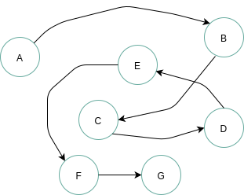

**Golang** 数据结构、算法概述


<!-- more -->

## 1.数据结构概述

### 1.1 数据的容器

在实际开发中，同一类型的数据，往往需要使用容器来进行存储，常见的容器有数组、集合等等。不同的容器在使用上往往带来不同的效果，比如有的容器可以支持快速查找出某个单独数据，如数组、哈希表，有的容器能够支持快速存储，如链表。根据不同需求而使用的不同的数据存储容器都可以称之为`数据结构`。

> **数据**：包括开发中的整数、浮点数等数值类数据，也包括日常中的文字、图形等数据。
>
> **数据元素**：数据的基本单位，比如一个字符串数据，其数据元素就是每个字符，比如一个学生表，每个学生就是数据元素。数据元素也可以称为元素、记录、结点、顶点。
>
> **数据项**：数据项是数据元素不可分割的最小单位，也称为属性、字段、域，包括类似性别、籍贯这样不可拆分的初等项，也包括成绩这样的组合项，例如可以拆分为物理成绩、化学成绩。
>
> **数据结构** （data structure）：相互之间存在一种或多种特定关系的数据元素的集合。数据结构也分为动态、静态两种，比如数组这样的元素个数与元素之间的关系不变的是静态数据结构（static data structure），链表这样的元素个数和元素关系因为增删会发生改变的称为动态数据结构（dynamic data structure）。
>
> **数据对象**：相同数据元素的集合，即一个封装体，既包含属性，也要包含动作。

### 1.2 数据的存储

#### 1.2.1 存储方式

数据在存储时候，可以通过 `数据元素之间的关系` 表示，比如存储为线性的结构、树形结构，这是一种逻辑上的关系，称为 `逻辑结构` 。

当然这些数据 **最终都要在磁盘上进行落地** ，这即是 `物理结构` 。

#### 1.2.2 逻辑结构

> **逻辑结构：** 数据结构实例中的数据元素之间存在的相互关系

一般可以将逻辑结构划分为线性结构、非线性结构两大类，非线性结构一般包括树形、图形结构等，如下所示四种常见逻辑结构：

1. **线性结构：** 结构中的数据元素之间存在着一对一的关系，如线性表、向量、栈、队列、优先队列、字典

2. **集合结构：** 结构中的数据元素之间除了同属于一个集合外，无其他关系(与数学中的集合概念一致)，如并查集

3. **树形结构：** 结构中的数据元素之间存在着一对多的关系，如二叉树

4. **图形结构：** 结构中的数据元素之间存在着多对多的关系，也称为网状结构，如有向图

**线性结构**：**元素之间是一对一关系**，包括链表、队列、栈等常见数据结构，如下图所示：


线性结构具备下列特点：

- 必定存在唯一的一个`第一个元素`
- 必定存在唯一的一个`最后一个元素`
- 除第一个元素之外，其他数据元素均有唯一的前驱

**集合结构**：**元素之间完全平等，只有一个关系，即属于同一集合**，如下图：


**树形结构**：**元素之间是一对多关系**，常见的数据结构有二叉树、堆、并差集等，如下图所示：


**图形结构**：**元素之间是多对多关系**，常见的数据结构是邻接矩阵、邻接表等，如下图所示：


当然我们也可以直观的将数据结构划分为：**线性结构**（一对一关系，如链表），**非线性关系**（非一对一关系，如图、树）。

这些逻辑结构可以通过一个二元组来表示：

> **Data_Structure = (D, S)**  其中 D 是数据元素的有限集合，S 是在 D 中数据元素之间的关系集合。

线性结构的二元组示例：

```txt
D = {01, 02, 03, 04, 05}，
S = {<02,04>, <03,05>, <05,02>, <01,03>}
```

::: info 贴士：

多元组用来描述确定成分的数学对象，即对象个数优先的序列。

:::

### 1.3 存储结构

物理结构既要存储真实的数据，也要存储数据的逻辑关系，如果逻辑结构不能在物理中实现，数据结构也就失去了意义！

> **物理结构（存储结构）** ：物理结构是数据的逻辑结构在计算机中的真实存储形式，即数据结构在计算机中的表示（映像），也称为**存储结构**。

物理结构（元素的关系）在计算机中有两种不同的表示方法：

1. **顺序映像：** 其存储结构称为`顺序存储结构`，特点是借助元素在存储器中的相对位置来表示数据元素之间的逻辑关系

2. **非顺序映像：** 其存储结构称为`链式存储结构`，特点是利用元素存储地址的指针表示数据元素之间的逻辑关系

**顺序结构**：把数据元素存放在连续的存储单元里，其数据间的逻辑关系和物理关系是一致的，最经典的顺序结构是数组，数组中的元素都是依次摆放的，如下所示：


从上图看出，顺序结构可以利用索引快速查找某个位置的数据，但是无法解决插入等问题，在插入一个数据时，为了保证数据的逻辑关系，则插入位置的后续元素都要进行后移一位！！

**链式结构**：

 

从上述看出，链式存储结构可以合理解决插入问题，只需要破坏插入位置的前后元素的关系即可，但是顺序结构失去了索引功能。

此外还有其他存储结构如：**索引存储**在存储元素时还要建立索引表，**散列存储**可以根据一个关键码直接得到存储地址。

::: info 总结

- **顺序结构中：** 数据元素的 存储地址 就能直接的反应数据元素之间的逻辑关系了！
- **而在链式存储结构中：** 需要利用结点之间的指针来间接反应数据元素之间的逻辑结构！

:::

### 2.3 物理结构和逻辑结构关系

**逻辑结构是面向问题的:** 实际业务中，我们需要什么样的数据结构，要根据业务出发选择合适的结构。

**物理结构是面向计算机的：** 选型了逻辑结构后，还需要将这些数据按照逻辑结构规范存储进计算机中。

::: note 所以

数据的逻辑结构是独立于数据的存储结构的，而数据的存储结构则要依赖于数据的逻辑结构来实现。

任何一个算法的设计取决于逻辑结构，其实现依赖于存储结构。

::: 

### 3. 数据的抽象数据类型

#### 3.1 数据在计算机中的存储方式

在物理上，数据是以二进制位的形式存储在物理设备上的，这个`位（bit）`即二进制数 0、1 中的一位，是计算机的最小存储单元。

数据结构的数据元素是由若干位组合形成的位串表示，位串称为**元素**（element）或**结点**（node）。

当数据元素由若干数据项组成时，位串中对应于各个数据项的子位串称为**数据域**（data field）。所以结点也可以看作是数据元素在计算机中的映像。

#### 3.2 抽象数据类型的表示

现在数据结构有了逻辑表现、存储表现，在代码层面需要依靠抽象数据类型 **ADT**（Abstract Data Type)来体现。

::: tip 贴士：

编程语言中内置的数据类型如：`int、string、array`  其实就是数据结构的存储映像实现，但是仅仅这些结构往往不足以使用，还需要自定义一些结构。

:::

ADT 定义格式如下：

```txt
ADT 抽象数据类型名 {
    数据对象：<数据对象的定义>
    数据关系：<数据关系的定义>
    基本操作：<基本操作的定义>
}ADT 抽象数据类型名
```

基本操作往往是：创建、销毁、查找、插入、删除、排序。

**抽象数据类型**就是数据结构的数学数据模型以及定义在该模型上的一系列操作。与数据结构呼应，抽象数据类型可以由三元组表示：

```txt
# 其中D 是数据对象，S 是 D 上的关系集，P 是对 D 的操作集
(D, S, P)
```

严蔚敏《数据结构》中对线性表的抽象数据类型定义示例：

```txt
ADT List {
    数据对象：D = {a1 | a1 ∈ ElemSet, i = 1, 2, ...,n, n >= 0}
    数据关系：R1 = { <ai-1, ai > | ai-1, ai∈D， i=2,...n}           # 类似ai-1中i-1都是下标
    基本操作：
        InitList(&L)
            操作结果：构造一个空线性表L
        DestroyLit(&L)
            初始条件：线性表L已经存在
            操作结果：销毁线性表L
        ClearList(&L)
            初始条件：线性表L已经存在
            操作结果：重置L为空表
        ListEmpty(L)
            初始条件：线性表L已经存在
            操作结果：若L为空表，返回TRUE，否则返回FALSE
        ListLength(L)
            初始条件：线性表L已经存在
            操作结果：返回L中数据元素的个数
        GetElem(L, e, compare())
            初始条件：线性表L已经存在，1<=i<=ListLenth(L)
            操作结果：用e返回L中第i个数据元素的值
        LocateElem(L, e, compare())
            初始条件：线性表L已经存在，compare()是 数据元素判定函数
            操作结果：返回L中第1个与e满足关系compare()的数据元素位序，若这样的数据元素不存在，则返回0
        ProrElem(L, cur_e, &pre_e)
            初始条件：线性表L已存在
            操作结果：若cur_e是L的数据元素，且不是最后一个，则用pre_e返回它的前驱，否则操作失败，pre_e无定义
        NextElem(L, cur_e, &next)e)
            初始条件：线性表L已经存在
            操作结果：若cure_e是L的数据元素，且不是最后一个，则用next_e返回它的后继，否则操作失败，next_e无定义
        ListInsert(&L, i, e)
            初始条件：线性表L已经存在，1<=i<=ListLength(L)+1
            操作结果：在L中第i个位置之前插入新的数据元素e，L的长度加1
        ListDelete(&L, i, &e)
            初始条件：线性表L已经存在且非空，1<=i<=ListLength(L)
            操作结果：删除L的第i个数据元素，并用e返回其值，L的长度减1
        ListTraverse(L, visit())
            初始条件：线性表L已经存在
            操作结果：依次对L的每个数据元素调用函数visit()，一旦visit()失败，则操作失败
}ADT List
```


## 2. 算法概述

### 2.1 什么是算法

> 算法（algorithm）是对特定问题求解步骤的一种描述。

比如现在要计算 1 到 n 之间的整数的和，这个求和函数其实就是一个算法了，当然不同的算法，其效率在不同场景中往往有好坏之分：

```c++
// 第一种算法
int sum(int n) {
    int sum = 0;
    for (int i = 1; i <= n; i++) {
        sum += i;
    }
    return sum;
}

// 第二种算法：数学家高斯孩提时的做法
int sumByGauss(int n) {
    int sum = n * (n + 1) / 2;
    return sum;
}
```

当然我们不能仅仅从代码的数量上就判定高斯的做法更加优秀，而是要通过运算步骤数量来判定，假如现在要运算 1 到 100 之间的整数和，第一种算法 for 循环中的加法运算执行了 100 次，而高斯的算法无论 n 取值为多少，只是进行了乘法、加法、除法这三步运算即得到了结果，n 越大，高斯的算法越发优秀！

### 2.2 算法的特性

**在计算机中是指令的有限序列**，每条指令表示一个或者多个操作。算法具备以下 5 个基本特性：

```txt
输入：可以理解为参数，所以算法可以没有输入，也可以有多个输入
输出：算法必须有输出，没有输出，算法也就失去了意义
有穷性：算法运算的步骤（指令）必须是有限次的，算法无法停止运行同样失去了意义
确定性：算法的每个步骤都必须有明确的意义，在一定条件下，相同的输入只能有唯一结果
可行性：算法的每个步骤都必须是可行有效的，即每一步都能通过执行有限次数完成
```

### 2.3 算法的设计要求

一个算法如果要设计好，必须达到以下目标：

```txt
正确性（correctness）：不含语法错误，对各种合法的输入数据都能满足
可读性（readability）：算法程序应该简洁易懂
健壮性（robustness）：非法数据被输入时，不会引起算法崩溃、出错，也即鲁棒性
效率与低存储量需求：算法的执行时间要尽量短，占据内存要尽量小
```

### 2.4 算法的执行次数

程序的执行时间是无法准确预估的，可以通过预估代码基本操作的执行次数来判断算法的效率，即**频度统计法**。

规模为 $n$ 的问题，所需要的时间可以记为 $T(n)$，在代码中，语句的总执行次数为：

$T(n)= O(f(n))$

如下示例中，算法的执行规模是 n，执行次数是：$T(n) = 3n + 1$。

```c++
void fn(int n) {
    for (int i = 0; i < n; i++) {
        printf("开始本轮输出\n");  // 这里执行 1 * n 次
        printf("%d\n", i);         // 这里执行 1 * n 次
        printf("本轮输出结束\n");  // 这里执行 1 * n 次
    }
    printf("跳出循环，本轮程序运行结束\n");  // 这里执行 1 次
}
```

在上述描述中，通过代码的基本执行次数粗略了估算了算法的效率，但是算法的效率还需要带入规模的差异。现在实现一个结果有两个算法：算法 A 与算法 B，他们的输入规模都是 n，算法 A 要做 2n+3 次操作，算法 B 要做 3n+1 次操作，两个算法谁更快？

一开始 A 算法计算次数很多，但是随着 n 的增长(大于 2)，A 算法计算次数比算法 B 越来越少，所以算法 A 整体上比算法 B 好。

输入规模 n 在没有限制的情况下，只要超过一个数值 N ，这个函数就总大于另一个函数，则称函数是**渐进增长**：

> 函数的渐进增长：给定两个函数 $f(n)$ 和 $g(n)$，如果存在一个整数 $N$，使得所有的 $n > N$ ,$f(n)$ 总是比 $g(n)$ 大，那么 $f(n)$ 的增长渐进快于 $g(n)$。

在评价算法的效率时，往往忽略其处理小规模问题的差异，而是关注在更大规模问题时的表现，即更注重随着规模的增大，其效率的总体变化趋势。

比如下面是 3 个算法的执行次数：

- 算法 A：$9n^2 + 3n + 1000000000$
- 算法 B：$9n^2 + 7n + 10$
- 算法 C：$3n^2 + 3n + 1000000000$
- 算法 D：$n^3 + n^2  + 7$

在数学的极限理论中，当 n 趋于无穷大时，即算法的循环次数无限放大时，A 和 B 的值会无限趋近，而 A 与 C 的比值的极限则为 3，相应的，A 与的 D 相比，A 值的放大速度远不及 D，可以采用数学极限中的 `抓大头` 方法进行比较！

### 2.5 算法的时间复杂度

> **时间复杂度**：随着问题规模 n 的增长，算法执行时间的增长率和 f(n)的增长率相同，称为算法的渐进时间复杂度，简称时间复杂度。

这样用 $O()$ 来体现算法时间复杂度的记法，也称为**大 $O$ 表示法（big-O notation）**。一般情况下，$T(n)$ 增长最慢的算法为最优算法。程序中语句的重复执行的次数称为**频度**（frequency count），频度直接影响了算法的时间复杂度。

**最坏情况与平均情况**：
比如查询 n 个随机数数组中最小数，最好第一个元素就是，那么时间复杂度为 $O(1)$，如果很不幸数组的最后一个元素才是，那么时间复杂度是 $O(n)$。

所以算法的时间复杂度具体会受到 2 个因素影响：

- 问题的规模：规模 $(n)$ 越大，算法的基本操作执行的次数越多
- 待处理数据的初态：如两个数相称，如果有一个因子为 0，那么算法的时间复杂度立刻就变为了 $O(1)$

对算法的分析有两种方法：

- 计算所有情况的平均值，称为平均时间复杂度(上述案例的 n/2)
- 计算最坏情况下的复杂度，**一般都会使用最坏复杂度**

### 2.6 算法的空间复杂度

通过空间能够换取时间上的便利，比如判断某个年份是否是闰年，我们可以书写一个算法，这个算法每次给出年份都要进行计算，但是我们也可以将所有的年份书写为一个键值对，是闰年的值为 1，不是的值为 0，这样判断是否是闰年直接查看键值对结果即可，但是相应的，我们需要这个键值对的额外存储空间。

算法的空间复杂度（space complexity）公式：

$S(n) = O(f(n))$

$n$ 为问题规模，$f(n)$ 为 $n$ 所占存储空间的函数，同样使用大$O$表示法表示空间复杂度。

::: info 总结

**通常我们说算法的复杂度是指时间复杂度**，因为在当前时代，对速度的追求往往大于对空间的追求。

如果算法执行时所需的辅助空间相遇于输入的数据量来说是个常数，那么称此算法为**原地工作**。

数据结构课程其实研究的就是：逻辑结构、存储结构、算法三个方面。

::: 


## 3. 大 O 表示法

### 3.1 大O中的几个记号

**将算法中基本操作的执行次数作为算法时间复杂度的度量**，所以大 $O$ （big-O notation）并不表示具体的运行时间，而是用来比较操作次数，以指出算法运行时间的增速。

大$O$中有两个记号：

- 大 Ω 记号：算法的最好情况，所以 T(n)一般介于 Ω(g(n)) 与 O(f(n)) 之间。
- 大 Θ 记号：算法恰好出现了 g(n) = f(n) 的情况

大 $O$ 表示法一般采用最差情况下的运行时间。

如果存在正的常数 c 和函数 g(n)，对任意 n>>2，有 T(n) > c \* g(n)，即认为：在 n 足够 大后，g(n)给出了 T(n)的一个下界，记为：

```txt
T(n) = Ω(g(n))
```

如果存在正的常数 c1 和 c2，以及函数 h(n)，对任意 n>>2，有 c1*h(n) < T(n) < c2* h(n)，即认为：在 n 足够大后，h(n)给出了 T(n)的一个确界，记为：

```txt
T(n) = Θ(g(n))
```

三者关系如图：  


### 3.2 推导大 $O$ 阶方法

常用的推导大 O 阶的步骤：

1. 用 常数 1 取代运行时间中的所有加法常数

2. 在修改后的运行次数函数中，只保留最高阶项

3. 如果最高阶项目存在且不是 1，则去除与这个项相乘的常数

4. 得到结果就是大 O 阶

示例：

```txt
# 对于规模为n的算法，其执行次数为：
T(n) = 3n + 1

# 其时间复杂度为
T(n) = O(n)
```

**规律总结**：

- 加法规则：多项相加，只保留最高阶的项，且系数变为 1
- 乘法规则：多项相乘，都保留

示例：

- $n^3 + 999n$：$O(n^3)$
- $n^3 + n^2log_2n$：$O(n^3) + O(log_2n)$

### 3.3 递归算法的推导

对于递归算法，假设退出递归时执行的次数为 A，那么递归算法整体的执行次数是一个分段函数：

当 n 满足了边界条件时：$T(n)=A$

当 n 不满足边界条件时：$T(n)=A+T(n-1)$

示例：下列递归算法用于计算数组前 n 个元素的值

```c++
int rsum(int arr[], int n) {
    if(n <= 0){
        return 0;
    }
    return rsum(arr, n - 1) + arr[n - 1];
}
```

因为 n <= 0 比较，return 0 返回，是 2 次操作，所以 A=2，其程序执行次数为：

$$
T(n)=
\begin{cases}
2,n\leq0\\
2+T(n-1),n>0\\
\end{cases}
$$

现在推导其执行次数，得到其复杂度为$O(n)$：

```txt
T(n) = 2 + T(n-1)
     = 2 + 2 + T(n-2)      = 2*2 + T(n-2)
     = 2 + 2 + 2 + T(n-3)  = 2*3 + T(n-3)
     ...
     = 2n + T(0)
     = 2n + 2
```

### 3.4 常数阶 $O(1)$ 和线性阶 $O(n)$

常数阶：算法的效率与输入的规模无关，即不会随着 n 的变化而变化，而线性阶的算法其复杂度随着 n 的增大进行线性增长。如之前提到的计算 1 到 n 之间的正整数和的两种方式：

```c++
// 第一种算法，时间复杂度为 O(n)
int sum(int n) {
    int sum = 0;
    for (int i = 1; i <= n; i++) {
        sum += i;
    }
    return sum;
}

// 第二种算法，时间复杂度为 O(1)
int sumByGauss(int n) {
    int sum = n * (n + 1) / 2; // 执行了1次和，1次乘，1次除，这些常数都可以忽略不计
    return sum;
}
```

**总结 1：顺序执行的代码只影响常数项，可以忽略**

### 3.5 平方阶 $O(n^2)$

循环的时间复杂度为 O(n)，那么循环嵌套的复杂度如下所示为：O(m \* n)：

```c++
void fn(){
    int m = 100;
    int n = 100;
    for (int i = 0; i < m; i++) {
        for (int j = 0; j < n; j++) {
            // 时间复杂度为O(1)的程序序列
        }
     }
}
```

> 循环的时间复杂度等于循环体的复杂度乘以该循环运行的次数。

再看一个例子：

```c++
void fn(){
    int n = 100
    for (int i = 0; i < n; i++) {
        for (int j = i; j < n; j++){
            // 时间复杂度为O(1)的程序序列
        }
     }
}
```

上述算法总执行次数为： `n + (n-1) + (n-2) + ... + 1`，即 `n*(n+1)/2`，拆开后得到：$n^2/2 + n/2$，最终时间复杂度为：$n^2$。

**总结 2：循环中，只需要挑选循环的一个基本操作分析它的执行次数与 n 的关系即可**

**总结 3：多层循环嵌套下，只需要关注最深层循环循环了几次！**

### 3.6 指数阶 $O(2^n)$

示例：斐波那契数列，后一项为前两项之和，如：0 1 1 2 3 5 8...，求第 n 项目。

```c++
// 斐波那契数列递归算法
int fib(int n) {
    if (n <= 1) {
        return n;
    }
    return fib(n - 1) + fib(n - 2);
}

/*
计算其时间复杂度: T(0) = 2,T(1) = 2，后面的 O(1) 表示其他运算
T(n) = T(n - 1) + T(n - 2) + O(1)
     = O(1.618 ^ n)     1.168是黄金分割，T(n) 约为 2^n
*/
```

当然也有更直观的运算方式： $1+2+4+8 = 2^4-1$，即 $0.5*2^n-1$


```c++
// 递归算法其实都可以规划为循环，斐波那契数列还有下面的算法，不难发现其时间复杂度为 O(n)
int fib2(int n) {
    if (n <= 1) {
        return n;
    }

    int first = 0;
    int second = 1;
    for (int i = 0; i < n - 1; i++) {
        int sum = first + second;
        first = second;
        second = sum;
    }
    return second;
}
```

### 3.7 对数阶

首先理解中学数学中的对数。对数的运算其实是幂运算的逆运算，如下所示：

示例：`T(n) = lgn + 1`，执行次数是对数计算的

```c++
void fn(n int){
    for (int i = n; i > 1; i /= 2) {
        // 执行lgn次
    }
}
```

由于每次 count 乘以 2 以后，距离 n 更近了一分，即有多少 2 相乘后大于 n，则会退出循环，$2^x=n$得到$x=log_2n$，其时间复杂度为：$O(log_2n)$，在编程中简写为：`O(log n)`。

### 3.8 旅行商问题

O(n!)的时间极长，主要用来解决计算机领域中的旅行商问题，其计算时间增加的异常快，且改进可能性较低。

示例：现在有一位旅行商，需要前往 5 个城市，而且要确保行程最短，那么就需要将 5 个城市的所有排序方式的长度和都计算一次，要执行 120 次操作，城市数目增加到 6 个时是 720 次，到了 7 个就要执行 5040 次！

那么到了 n 个城市，就要执行 n!(n 的阶乘)次操作才能计算出结果，所以运行时间为 O(n!)，也称为阶乘时间。

### 3.9 总结常见的时间复杂度

**常见的时间复杂度**（从快到慢）：

| 执行次数         | 阶           | 非正式称呼 | 对应算法   |
| ---------------- | ------------ | ---------- | ---------- |
| 12               | $O(1)$       | 常数阶     | 普通运算   |
| $5log_2n+20$     | $O(log_2n)$  | 对数阶     | 二分查找法 |
| 2n+3             | $O(n)$       | 线性阶     | 简单查找   |
| $5log_2n+2n$     | $O(nlog_2n)$ | O(nlogn)阶 |            |
| $3n^2+2n+1$      | $O(n^2)$     | 平方阶     | 选择排序   |
| $5n^3+3n^2+2n+1$ | $O(n^3)$     | 立方阶     |            |
| $2^n$            | $O(2^n)$     | 指数阶     |            |
| n 阶乘           | $O(n!)$      | 阶乘       | 旅行商问题 |
| $n^n$            | $O(n^n)$     |            |            |

常用的时间复杂度顺序口诀——**常对幂指阶**：
$O(1)<=O(log_2n)<=O(n)<=O(nlog_2n)<=O(n^2)<=O(n^3)<=O(2^n)<=O(n!)<O(n^n)$


延伸：我们可以使用极限来比较复杂度的阶，如：

- $\lim\limits_{n\rightarrow\infty}\frac{log_2n}{n} = 0$：意味着 n 趋于无穷大时，n 比$log_2n$变大的速度快的多
- $\lim\limits_{n\rightarrow\infty}\frac{n^2}{2^n} = 0$：意味着 n 趋于无穷大时，$n^2$ 比$2^n$变大的速度快的多

## 4. 空间复杂度计算

### 4.1 空间复杂度的运算

空间复杂度的计算要注重 malloc、free 时动态分配的空间。假设一个递归函数：

```c++
int fact(int n){
    if(n < 0){
        return 1;
    }
    return n * fact(n - 1);
}
```

递归使用了一个调用栈结构，每递归一层都要往调用栈中加入一个工作记录，工作记录为形式参数 n、函数返回值、返回地址，即 3 个存储单元，递归深度是 n，所需的空间就是 3n，空间复杂度就是 3n。

空间复杂度有以下几种情形：

- 常量空间 $O(1)$：存储空间固定，与输入的规模无关
- 线性空间 $O(n)$：存储空间是一个线性集合如数组，集合大小与输入规模 n 成正比
- 二维空间 $O(n^2)$：分配的空间是一个二维数组集合，集合的长度、宽度与输入规模 n 成正比
- 递归空间 $O(n)$：计算机在运行递归代码时，会专门分配一块内存，存储方法调用栈，递归越深，入栈元素越多，到达结束条件时，方法出栈。执行递归操作所需要的内存空间和递归的深度成正比，纯粹递归操作的空间复杂度也是线性的，如果递归深度是 $n$，那么其空间复杂度就是 $O(n)$。

::: tip 贴士

递归程序中，偶尔也会有不断递归下，每轮需要的空间是非线性的，比如每轮调用需要申请一个数组，只有数组的长度递减结束后才结束递归，则可能递归的空间复杂度就是 $O(n^2)$。

:::