**Golang** 数据结构，各种表结构相关


<!-- more -->

## 1. 线性表

### 1.1 线性表概述

线性表（*linear_list*）是由 **n** 个 相同数据元素 组成的 有限序列，记做：

`L = (a_1, a_2, ...,  a_n) (n\geq0)`

**L** 是表名，**a** 是表中的数据元素，也是不可分割的原子数据，称为 **结点** 或者 **记录**，**n** 是表的长度，也是元素的个数，当 `n=0` 时，表为空表

- **位序**：在非空表中，元素按照顺序的位置（*从 **1** 开始到第 **i** 个*）即为元素的 **位序**

- **序列**：元素之间是有序的
- **有限**：元素的数量是有限的，不过计算机中的对象都是有限的，无限数列只存在于数学概念中

线性表的第一个元素称为 **表头（head）**，最后一个元素称为**表尾（tail）**

同一个线性表中的 **元素必定有相同的特性**，即属于同一数据对象，且相邻数据元素之间存在序偶关系

在复杂的线性表中，一个数据元素有多个数据项（*item*）组成，此时常把数据元素称为记录（*record*），含有大量记录的线性表又称为文件（*file*）

```go
// 线性表实例
Color = ('red', 'orange', 'yellow', 'green')
Dept = (建筑学, 计算机, 财会, 生命科学)
```

### 1.2 线性表的特点

（1）线性表是有限的序列。线性表相邻元素可以构成序对，他们之间是有直接前驱和直接后继的逻辑关系的，当表非空时：

> 一般情况下第一个元素无直接前驱，最后一个元素无直接后继
> 其他每个元素都有且只有一个直接前驱和直接后继，即相邻元素间是一对一关系

（2）线性表中的每一个元素都有相同的数据类型

（3）线性表中的每一个元素都有 **位置**、**值**，位置也可以称为下标，决定了数据元素在表中的位置、前驱、后继的逻辑关系。**`一般定义数据元素位置从` 1 开始**

（4）线性表默认是无序表。其元素的值和位置之间可以有特定关系，也可以没有。比如有序表中的元素按照值的递增排列，无序表没有这种要求

### 1.3 线性表的划分

线性表只是一种逻辑结构，在物理上它的存储可以是顺序的也可以是链式的。按照物理存储结构划分，线性表分为:

-   **顺序表**：顺序结构存储
-   **链表**：链式结构存储

链表的逻辑结构具体实现有两种方式：

-   **动态链表**：即常见的单链表、双向链表、循环链表的写法
-   **静态链表**：底层不使用指针，而是使用数组实现结点的增删改查

### 1.4 线性表与数组的区别

-   **物理上**：线性表可以使用顺序存储，也可以使用链式存储
-   **逻辑上**：数组并不一定是线性的，因为其元素可以是结构，枚举，类等，而线性表在逻辑上 **必定是线性的**（*即元素结构相同*）
-   **容量上**：数组的长度一般是固定的，而 **链表的长度支持动态改变（*类比动态数组*）**，可以随时删减添加，并且能够知道元素个数
-   **维度上**：**数组是有维度** 的，二维数组等明显和线性表不同

---

## 2. 顺序表

### 2.1 顺序表概述

顺序表是用一段地址连续的存储单元依次存储线性表的数据元素

顺序表是线性表在物理上顺序存储的具体实践，如图所示：


从图中看出顺序表的特点：

（1）顺序表的逻辑顺序与物理顺序一致，第 **i** 个元素存储于第 **i - 1** 的物理位置上
（2）顺序表的所有元素都可以进行随机访问、顺序访问（*下标访问*）
（3）顺序表中数据元素的数据类型即是其内部的数组的数据类型

如果一个数据元素占据了 **c** 个存储单元(`sizeof(ElemType)`)，那么第 **i** 个元素的存储位置为

`LOC(a_i) = LOC(a_1) + i\times c`

通过上述公式，可以随时计算出顺序表中任意位置的地址，不管是最后一个还是第一个，都是相同的时间

### 2.2 顺序表的结构与存取

#### 基本结构

由于顺序表的特性，其底层可以采用数组进行存储，这个底层可以是静态数组，也可以是动态申请的数组

由于底层采用数组，顺序表的插入与删除也和数组的插入删除一样，会造成大量元素的移动

如果元素插入到最后一个位置，或者删除最后一个位置，那么之前的数据元素无需排序，此时是最好的情况，时间复杂度为 **O(1)**，因为不需要移动元素。如果是其他情况，则所有的数据元素都要进行移动，这个时间复杂度为 **O(n)**

#### 查找效率

根据值查找位置时，如果查找的元素正好是第一位，则数据比较次数为 **1**，如果是最后第 **n** 位，则数据比较次数为 **n**

若各个元素的查找概率为 `p_i`，找到该元素时数据比较次数为 `c_i`，那么查找的平均比较次数 **ACN**（*Average Comparing Number*）为：

`ACN = \sum_{i=1}^n p_i \times c_i`

若仅考虑概率相等的情况，有 `p_1 = p_2 = ... = p_n = 1/n`，且查找第一个元素的比较次数为 **1**，第二个元素的比较次数为 **2**，第一个元素的比较次数为 **i**，则：

`ACN = \sum_{i=1}^n (\frac{1}{n}) \times i = \frac{1}{n} \sum_{i=1}^n i = (\frac{1}{n})  \times (1+2+...+n) = \frac{1+n}{2}`

即查找要平均比较 `\frac{1+n}{2}` 个元素

#### 插入效率

插入到第 **i** 个元素位置之前`（1<=i<=n+1）`，应该把数组内的 `n - i + 1`  个元素向后移动一个位置。最好的情形是在最后一位插入，移动 **0** 个元素，最坏情形是在第一个元素位置插入，移动了 **n** 个元素，平均移动次数为

`ACN = \frac{1}{n+1} \sum_{i=1}^{n+1} (n-i+1) = \frac{1}{n+1}  \times \frac{n(n+1)}{2} = \frac{n}{2}`

#### 删除效率

删除最后一个元素，移动次数为 **0**，删除第一个元素时，移动次数为 **n - 1**，删除第 **i** 个元素，移动元素为第 **i** 个到第 **n - 1** 个，平均移动次数为：

`ACN = \frac{1}{n} \sum_{i=1}^{n} (n-i) = \frac{1}{n}  \times \frac{n(n-1)}{2} = \frac{n-1}{2}`

### 2.3 复杂度总结

| 操作名 | 时间复杂度 | 空间复杂度 |
| ------ | ---------- | ---------- |
| 初始化 | `O(1)`     | `O(1)`     |
| 插入   | `O(n)`     | `O(1)`     |
| 删除   | `O(n)`     | `O(1)`     |
| 查找   | `O(n)`     | `O(1)`     |
| 定位   | `O(1)`     | `O(1)`     |
| 求长度 | `O(1)`     | `O(1)`     |
| 清空   | `O(1)`     | `O(1)`     |

### 2.4 实现

```go
package main

import (
	"fmt"
	"reflect"
)

type SqlList struct {
	data []interface{}
	size int
}

var maxSize = 5

func NewSqlList() *SqlList {
	return &SqlList{
		data: make([]interface{}, maxSize),
		size: 0,
	}
}

func (l *SqlList) Insert(e interface{}, index int) {
	if index < 0 || index > l.size+1 {
		fmt.Println("插入位置不合法")
		return
	}

	l.data = append(l.data[:index-1], append([]interface{}{e}, l.data[index-1:]...)...)
	l.size++

}
func (l *SqlList) Delete(index int) interface{} {
	if index < 0 || index > l.size {
		fmt.Println("插入位置不合法")
		return nil
	}
	if l.size == 0 {
		fmt.Println("空表，无元素可删")
		return nil
	}
	e := l.data[index-1]

	l.data = append(l.data[:index-1], l.data[index:]...)
	l.size--
	return e
}

func (l *SqlList) Update(e interface{}, index int) interface{} {
	if index < 0 || index > l.size {
		fmt.Println("插入位置不合法")
		return nil
	}
	l.data[index-1] = e
	return e
}

func (l *SqlList) SearchByIndex(index int) interface{} {
	if index < 0 || index > l.size {
		fmt.Println("查询index不合法")
		return nil
	}
	return l.data[index-1]
}

func (l *SqlList) SearchByElement(e interface{}) interface{} {
	for i := 0; i < l.size; i++ {
		if l.data[i] == e {
			return i
		}
	}
	return nil
}

func (l *SqlList) Clear() {
	l.size = 0
}

func (l *SqlList) Display() {
	fmt.Println(l.data[0:l.size], l.size)
}

func main() {
	sl := NewSqlList()
	sl.data = []interface{}{22, 46, 6, 71, 12, 8}
	sl.size = 6
	sl.Delete(6)
	fmt.Println(sl, reflect.TypeOf(sl))
	sl.Insert(888, 6)
	sl.Insert(999, 6)
	sl.Display()
	sl.Delete(6)
	sl.Display()
	sl.Update(777, 7)
	sl.Update(777, 6)
	sl.Display()
	sl.SearchByIndex(7)
	fmt.Println(sl.SearchByIndex(6))
	fmt.Println(sl.SearchByElement(55))
	fmt.Println(sl.SearchByElement(71))
}
```

## 3. 单链表

### 3.1 链表概述

顺序表的底层由数组实现，顺序表逻辑关系上的相邻元素在物理位置上也相邻，这让顺序表可以随机存取表中任一元素，但是在很多编程语言中，数组的长度是固定的，所以当数组已被数据填满时，再要加入新的元素就会非常困难。在数组中，添加和删除元素也很麻烦，因为需要将数组中的其他元素向前或向后移动

上述问题出现的原因是：所有的 **元素存储位置都是相邻的，中间没有缝隙，也就不能快速插入**，同样，删除后留下的空隙也需要弥补上

##### **链表**

> 用一组任意的存储单元存储线性表中的数据元素，其存储单元可以是连续的，也可以是不连续的

最简单的链式结构就是单向链表，如图所示：  
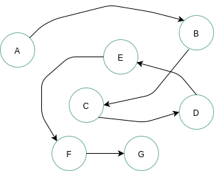

对于 **插入或者删除数据越频繁** 的操作，链表的效率优势越明显

### 3.2 链表的结点

链表的定义意味着链表的数据元素可以利用内存中未被占用的任意位置，那么我们需要知道数据元素的前驱、后继时就无法像顺序表那样直接利用索引来查询了，所以在链表的数据结构中，除了要存储数据元素信息外，至少还要存储它的后继元素的存储地址

**结点 node**：

> 链表中的每个数据元素 `a_i`，既要存储本身信息，也要存储后继信息，这两部分组成的数据元素 `a_i` 称为结点（*node*）

一个结点包含两个域：

-   数据域：存储数据元素信息
-   指针域：存储直接后继的位置，指针域中存储的信息称为指针或者链

**n** 个结点链结成了一个链表，即是线性表的链式存储结构

### 3.3 头指针

头指针即是指向链表第一个元素的指针，沿着头指针可以直接查找到链表中的所有元素位置，所以可以在数据结构中使用头指针来表示链表

如下图所示：


头指针指向第一个结点（*首元结点*），是链表的标识，常用头指针冠以链表的名字，所以头结点是链表必备的！

### 3.4 头结点

为了方便对链表进行操作，有时候会在链表的第一个结点前附设一个结点，称为头结点。**头结点的数据域一般不存储任何信息**，或者存储如线性表的长度等附加信息。**头结点的指针域存储指向第一个结点的指针**

如图所示：


如果一个链表带有头结点，则头指针指向头结点（*因为头结点是第一个结点*）

头结点不是链表必备的，头结点的存在是为了方便操作，如：第一个结点的插入、第一个结点的删除在有头结点时操作更简单

有些场景下，也会有尾结点，链表最后一个元素指向尾结点 ，尾结点的 **next** 为空，这样的行为均是为了一些操作的简便

### 3.5单链表定义总结

#### 单链表

> 链表的指针域中只包含一个指针域，即称为线性链表或者单链表

单链表的最后一个元素没有直接后继，即其指针为空，带头结点的单链表如下所示：


但是如果我们不知道第 **i** 个结点的位置，单链表数据结构在插入和删除操作上，与线性表的顺序存储结构相比没有太大优势。一旦知道精确的位置，无论插入多少个元素，找到第 **i** 位置的指针复杂度为 **O(n)**，但是插入只是简单的移动指针，时间复杂度都是 **O(1)**，而顺序表，每次移动都是 **O(n)**

#### 特点

1）单链表的数据元素的逻辑顺序与物理顺序可能不一致，只能依靠结点的指针将各个数据元素连接起来

2）单链表的长度是可以扩充的

3）**对单链表的遍历、查找只能从头指针指向的首元结点开始，然后逐个访问**

4）插入删除很方便，因为只需要修改相关结点的指针域即可

5）由于表内额外存储了指针域，同样的数据，**比顺序表占据空间更多**

#### 抽象数据类型

定义链单链表每个结点名为 **Node**，其链表名为 **LinkList**，这里采用带头结点的做法

取巧的地方是：**LinkList** 本身其实可以看做一个 **Node**，即头结点，**内部的指针域是链表的首元结点，数据域是链表的长度**

#### 常见操作

插入操作其实是拆除原有两个结点之间的链接，将前一个结点链向插入元素，将插入元素链向后面的元素，如图所示：


上面是带头结点的单链表，插入时不会插入在头结点位置，即元素只会插入在 **a1** 处及其之后。

如果是没有头结点的单链表，插入操作较为复杂，需要额外考虑：插入位置为 **1** 号位时，即首元结点位置，需要修改头指针指向新插入元素！

删除算法同理，也是要拆除要删除元素的链条，重新链接其前后 **2** 个元素，如果单链表没有头结点，也要考虑删除首元结点的情况。

#### 复杂度

| 操作名 | 时间复杂度 | 空间复杂度 |
| ------ | ---------- | ---------- |
| 初始化 | `O(1)`     | `O(1)`     |
| 插入   | `O(n)`     | `O(1)`     |
| 删除   | `O(n)`     | `O(1)`     |
| 查找   | `O(n)`     | `O(1)`     |
| 定位   | `O(n)`     | `O(1)`     |
| 求长度 | `O(1)`     | `O(1)`     |
| 清空   | `O(n)`     | `O(1)`     |

如果头结点并未保存长度，则求长度时间复杂度为 `O(n)`

### 3.6 实现

```go
package main

import (
	"fmt"
	"reflect"
)

// Node 单链表结点类型
type Node struct {
	data interface{}
	next *Node
}

// LinkList 单链表
type LinkList struct {
	head *Node
	size int
}

// newNode 构造Node
func newNode(e interface{}) *Node {
	return &Node{
		data: e,
		next: nil,
	}
}

// NewLinkList 构造单链表
func NewLinkList() *LinkList {
	p := newNode(0)
	return &LinkList{
		head: p,
		size: 0,
	}
}

// Locate 定位：根据位置查询结点地址
func (l *LinkList) Locate(index int) *Node {
	if index < 0 || index > l.size+1 {
		fmt.Println("获取位置不合法")
		return nil
	}
	p := l.head
	k := 0
	for p.next != nil && k < index {
		p = p.next
		k++
	}
	return p
}

// Insert 插入节点
func (l *LinkList) Insert(e interface{}, index int) {
	if index < 1 || index > l.size+1 {
		fmt.Println("插入位置不合法")
		return
	}

	node := newNode(e)
	p := l.head
	k := 0
	for p.next != nil && k < index-1 {
		p = p.next
		k++
	}

	node.next = p.next
	p.next = node
	l.size++
}

func (l *LinkList) Delete(index int) interface{} {
	if index < 0 || index > l.size {
		fmt.Println("删除位置有误")
		return nil
	}

	// 找到删除位置的前一个位置
	p := l.head
	k := 0
	for p.next != nil && k < index-1 {
		p = p.next
		k++
	}
	// 执行删除
	tempData := p.next.data
	p.next = p.next.next

	l.size--
	return tempData
}

func (l *LinkList) Update(e interface{}, index int) interface{} {
	if index < 0 || index > l.size {
		fmt.Println("更新位置有误")
		return nil
	}

	p := l.head
	k := 0
	for p.next != nil && k < index-1 {
		p = p.next
		k++
	}

	node := newNode(e)
	node.next = p.next.next
	p.next = node
	return e
}

func (l *LinkList) UpdateDate(data interface{}, index int) {
	p := l.Locate(index)
	if p == nil {
		return
	}
	p.data = data
}

func (l *LinkList) Clear() {
	// 仅保留头节点
	l.size = 0
	l.head.next = nil
}

func (l *LinkList) Search(e interface{}) *Node {
	p := l.head
	for p.next != nil {
		if p.data == e {
			break
		}
		p = p.next
	}

	if p.data == e {
		return p
	} else {
		return nil
	}
}

func (l *LinkList) Display() {
	if l.size == 0 {
		fmt.Println("空链表")
		return
	}
	p := l.head
	pos := 0
	for p != nil {
		if pos == l.size { //最后一位
			fmt.Println(p.data)
			break
		} else {
			fmt.Print(p.data, "->")
			p = p.next
			pos++
		}
	}
}

func main() {
	link_l := NewLinkList()
	fmt.Println(link_l, reflect.TypeOf(link_l))
	link_l.Insert(23, 1)
	link_l.Insert(22, 2)
	link_l.Display()
	link_l.Update(15, 1)
	link_l.Display()
	link_l.Update(888, 1)
	link_l.Insert(233, 3)
	link_l.Display()
	link_l.Delete(1)
	link_l.Display()
}
```

## 4. 循环链表

循环链表（*circular linked list*）是另外一种形式的线性链表，其特征是：最后一个结点的指针域不再指向 NULL，而是指向首元结点，整个链表形成了一个闭合的环

由上可得知：在循环链表中从任意一个结点出发，均可以找到其他的结点。如图所示一个带头结点的循环链表：


### 4.1 循环链表制作思路

循环链表的操作和线性表一致，差别进在于算法中循环的条件不再是 `p->next == NULL` ，而是 `p->next == head`

对于空表来说：首元结点指针域指向自己

有时，循环链表中还会设定尾指针，可以让一些操作简化，如合并两个链表时，仅需要将一个表的表尾和另一个表的表头相接，如果有尾指针，其时间复杂度就是 O(1)。同样插入头部、尾部的时间复杂度也都降低到了 O(1)

### 4.2 实现

```go
package main

import (
	"fmt"
	"reflect"
)

// CircleNode 循环链表结点类型
type CircleNode struct {
	data interface{}
	next *CircleNode
}

// CircleList 循环链表
type CircleList struct {
	head *CircleNode
	size int
}

// newCircleNode 构造循环节点
func newCircleNode(e interface{}) *CircleNode {
	return &CircleNode{
		data: e,
		next: nil,
	}
}

// NewCircleList 构造循环链表
func NewCircleList() *CircleList {
	p := newCircleNode(0)
	p.next = p // 尾指针指向头
	return &CircleList{
		head: p,
		size: 0,
	}
}

// Locate 定位：根据位置查询结点地址
func (l *CircleList) Locate(index int) *CircleNode {
	if index < 0 || index > l.size+1 {
		fmt.Println("获取位置不合法")
		return nil
	}
	p := l.head
	k := 0
	// 循环链表，判断是否下个指针域指向头结点
	for p.next != l.head && k < index {
		p = p.next
		k++
	}
	return p
}

// Insert 插入节点
// 带头结点的链表，插入时只能在头结点之后插入，也不允许插入超过最大元素个数的位置
func (l *CircleList) Insert(e interface{}, index int) {
	if index < 1 || index > l.size+1 {
		fmt.Println("插入位置不合法")
		return
	}

	// 找到插入位置的前一个位置
	p := l.head
	k := 0
	for p.next != l.head && k < index-1 {
		p = p.next
		k++
	}

	// 创建要插入的结点
	node := newCircleNode(e)
	node.next = p.next
	p.next = node

	l.size++
}

func (l *CircleList) Delete(index int) interface{} {
	if index < 0 || index > l.size {
		fmt.Println("删除位置有误")
		return nil
	}

	// 找到删除位置的前一个位置
	p := l.head
	k := 0
	for p.next != l.head && k < index-1 {
		p = p.next
		k++
	}
	// 执行删除
	tempData := p.next.data
	p.next = p.next.next

	l.size--
	return tempData
}

func (l *CircleList) UpdateDate(data interface{}, index int) {
	p := l.Locate(index)
	if p == nil {
		return
	}
	p.data = data
}

func (l *CircleList) Clear() {
	// 仅保留头节点
	l.size = 0
	l.head.next = l.head
}

func (l *CircleList) Search(e interface{}) *CircleNode {
	p := l.head
	for p.next != l.head {
		if p.data == e {
			break
		}
		p = p.next
	}

	if p.data == e {
		return p
	} else {
		return nil
	}
}

func (l *CircleList) Display() {
	if l.size == 0 {
		fmt.Println("空循环链表")
		return
	}
	p := l.head
	pos := 0
	for p.next != p {
		if pos == l.size { //最后一位
			fmt.Print(p.data, "->", l.head.data, "->...\n")
			break
		} else {
			fmt.Print(p.data, "->")
			p = p.next
			pos++
		}
	}
}

func main() {
	circle_l := NewCircleList()
	fmt.Println(circle_l, reflect.TypeOf(circle_l))
	circle_l.Insert(23, 1)
	circle_l.Insert(22, 2)
	circle_l.Display()
	circle_l.UpdateDate(15, 1)
	circle_l.Display()
	circle_l.Insert(888, 1)
	circle_l.Display()
	circle_l.Insert(233, 3)
	circle_l.Delete(1)
	circle_l.Display()
}
```

## 5. 双向链表

### 5.1 双向链表概述

单链表和循环链表的结点都仅仅只有一个指示后继的指针域，查找后继的时间复杂度为 O(1)，而查找前驱的时间复杂度为 O(n)，因为每次都要从头开始遍历查找

为了解决链表中访问直接前驱问题，单链表中的每个节点可以使用两个指针：

-   **next**：后继指针，这是单链表节点原有的指针
-   **prev**：前驱指针，额外引入的指向上一个结点的指针

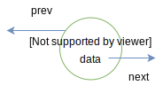

有了这两个指针的链表可以称为双向链表（*简称双链表*），**在双链表中，查找前驱、后继的时间复杂度都为 `O(1)`**

### 5.2 双向循环链表概述

双向链表通常使用带头结点的方式实现，为了查找其节点的前驱、后继，首元节点的 **prev** 指针指向其最后一个元素，最后一个元素的 **next** 指针指向首元节点，这样的链表称为 **双向循环链表**

如图所示：


如果一个双向循环链表为空，则其头节点的前驱、后继都是自己

**实际开发中，双向循环链表由于各项性能较高，使用较为广泛**

### 5.3 实现

循环链表比起单链表的改变，大多情况下都是 **for、while循环** 中判断结点 **next 是否为空**，改为 **结点 next 是否为头结点** ，所以下略简单的循环链表等数据结构

```go
package main

import (
	"fmt"
	"reflect"
)

// DblNode 双向循环链表结点类型
type DblNode struct {
	data interface{}
	next *DblNode
	prev *DblNode
}

// DblList 双向循环链表
type DblList struct {
	head *DblNode
	size int
}

// newDblNode 构造双向循环链表节点
func newDblNode(e interface{}) *DblNode {
	return &DblNode{
		data: e,
		next: nil,
		prev: nil,
	}
}

// NewDblList 构造双向循环链表
func NewDblList() *DblList {
	p := newDblNode(0)
	p.next = p // 后/尾指针指向头
	p.prev = p // 前指针指向头
	return &DblList{
		head: p,
		size: 0,
	}
}

func (l *DblList) Locate(index int) *DblNode {
	if index < 0 || index > l.size+1 {
		fmt.Println("查询位置有误")
		return nil
	}

	p := l.head
	k := 0
	for p.next != p && k < index {
		p = p.next
		k++
	}
	return p
}

func (l *DblList) Insert(e interface{}, index int) {
	if index < 0 || index > l.size+1 {
		fmt.Println("插入位置有误")
		return
	}

	p := l.head
	k := 0
	// 插入的前一个位置
	for p.next != l.head && k < index-1 {
		p = p.next
		k++
	}

	node := newDblNode(e)
	// 新结点后继 指向原下个节点
	node.next = p.next
	// 新结点前驱 指向插入前一个位置的结点
	node.prev = p
	// 之前的下个结点的前驱 指向插入结点
	p.next.prev = node

	// 执行插入 前置节点后继 指向新结点
	p.next = node

	l.size++
}

func (l *DblList) Delete(index int) interface{} {
	if index < 1 || index > l.size {
		fmt.Println("删除位置有误")
		return nil
	}

	p := l.head
	k := 0
	// 删除的前一个位置
	for p.next != l.head && k < index-1 {
		p = p.next
		k++
	}

	tempDate := p.next.data
	// 执行删除 后继的后继的前驱 指向删除前一个位置的节点
	p.next.next.prev = p
	// 后继指向 后继的后继结点
	p.next = p.next.next

	l.size--
	return tempDate
}

func (l *DblList) UpdateDate(e interface{}, index int) {
	p := l.Locate(index)
	if p == nil {
		return
	}
	p.data = e
}

func (l *DblList) Clear() {
	l.head.next = l.head
	l.head.prev = l.head
	l.size = 0
}

func (l *DblList) Search(e interface{}) *DblNode {
	if l.size == 0 {
		fmt.Println("空双循环链表不存在结点")
		return nil
	}

	p := l.head
	for p.next != l.head {
		if p.data == e {
			return p
		}
		p = p.next
	}
	// 针对尾结点的判断
	if p.data == e {
		return p
	}
	return nil
}

func (l *DblList)prevElement(e interface{}) *DblNode  {
	node := l.Search(e)
	if node == nil {
		fmt.Println("未找到该元素")
		return nil
	}
	return node.prev
}

func (l *DblList)nextElement(e interface{}) *DblNode  {
	node := l.Search(e)
	if node == nil {
		fmt.Println("未找到该元素")
		return nil
	}
	return node.next
}

func (l *DblList) Display() {
	if l.size == 0 {
		fmt.Println("空双循环链表")
		return
	}

	p := l.head
	k := 0
	for p.next != nil {
		if k == l.size {
			fmt.Print(p.data, " <-> ", l.head.data, " <-> ...\n")
			break
		} else {
			fmt.Print(p.data, " <-> ")
		}
		p = p.next
		k++
	}
}

func main() {
	dbl_l := NewDblList()
	fmt.Println(dbl_l, reflect.TypeOf(dbl_l))
	dbl_l.Insert(23, 1)
	dbl_l.Insert(22, 2)
	dbl_l.Display()
	dbl_l.UpdateDate(15, 1)
	dbl_l.Display()
	dbl_l.Insert(888, 1)
	dbl_l.Display()
	dbl_l.Insert(233, 3)
	dbl_l.Delete(1)
	dbl_l.Display()
	node := dbl_l.Search(233)
	fmt.Println("node:", node)
	prev_node := dbl_l.prevElement(0)
	fmt.Println("prev_node:", prev_node)
	next_node := dbl_l.nextElement(22)
	fmt.Println("next_node:", next_node)
	dbl_l.Display()
}
```

## 6. 静态链表

### 6.1 静态链表概述

在具备指针概念的语言，如 **Go**、**C**、**C++** 中，由于指针的存在，能够灵活的操作内存中的地址和数据。**Java**、**JavaScript** 等语言虽然不具备指针，但是其对象引用机制其实也间接具备了指针的很多功能。但对于一些上古语言，如 **Basic**、**Fortran**，完全没有指针的概念，链表的实现就会出现困难。

我们可以另辟蹊径，使用数组描述单链表及其元素，即：数组中每个元素可以看做一个结点结构，包含数据 **data** 与指针 **cur**：

-   **data**：存储该结点存储的数据
-   **cur**：其实就是数组下标，表示直接后继元素所在数组中的位置

这种用数组的游标描述的链表叫做**静态链表**，也叫链表的**游标实现法**。

静态链表需要预先分配一个较大的空间，但是在做插入和删除时无需移动数组内部的元素，仅需要修改元素的游标即可！故仍具有链式存储结构的优点

### 6.2 静态链表的实现解释

#### 静态链表基本结构

静态链表结构如图：


解释如下：

-   通常静态链表会将第一个数据元素放到数组下标为 1 的位置中
-   数组索引 0 位置的 cur 存储的是没有存放数据的第一个元素，即下标为 4 的元素
-   其他元素的游标都是直接指向它的下一个元素的下标
-   末尾元素的 cur 可以存放首个有值数据的索引

#### 备用链表

静态链表中，除了数据本身通过游标组成的链表外，还需要有一条连接各个空闲位置的链表，称为备用链表。备用链表的作用是回收数组中未使用或之前使用过（*目前未使用*）的存储空间，留待后期使用

也就是说，静态链表使用数组申请的物理空间中，存有两个链表，一条连接数据，另一条连接数组中未使用的空间

通常，备用链表的表头位于数组下标为 **0** 的位置，而数据链表的表头位于数组下标为 **1** 的位置

### 6.3 静态链表初始化与数据变更

在数据链表未初始化之前，数组中所有位置都处于空闲状态，因此都应被链接在备用链表上，当向静态链表中添加数据时，需提前从备用链表中摘除节点，以供新数据使用

备用链表摘除节点最简单的方法是摘除 索引 0 的直接后继节点；同样，向备用链表中添加空闲节点也是添加作为 索引 0 新的直接后继节点。因为 索引 0 是备用链表的第一个节点，我们知道它的位置，操作它的直接后继节点相对容易，无需遍历备用链表，耗费的时间复杂度为 O(1)

### 6.4 静态链表实际演示

假设现在要存储 `{'A', 'B'}`：

第一步：初始化一个静态链表，其实是创建了一个长度为 7 的备用链表，用于存储 5 个数据。如图：


第二步：插入元素 'A'，第一个元素位于数组索引 1 上，如图修改备用链表表头索引：


第三步：插入元素 'B'：


### 6.5 静态链表的优缺点

**优点**：在插入和删除时，只需要修改游标，不需要移动元素，改进了顺序存储结构中插入和删除元素需要移动大量元素的缺点

**缺点**：

-   没有解决连续存储分配带来的表长难以确定问题
-   失去了顺序存储结构随机存取的特性

### 6.6 实现

```go
/**
 *  静态链表：StaticList
 * 链表内部结构应该杜绝指针，因为静态链表本就是为了无指针场景
 *  一般静态链表内部的数组第一个元素、最后一个元素不存储数据
 *  游标cur为0时，表示无指向
 *  下标为0的元素的cur存放备用链表的第一个结点的下标（备用链表即未被使用的数组元素）
 */

package staticlist

import (
 "errors"
 "fmt"
)

// 静态链表中元素结点
type node struct {
 data  interface{}
 cur   int
}

// 静态链表结构体
type StaticList struct {
 size  int
 length  int
 arr   []node
}

 // 构造实例：其实是构造一个备用链表
func NewStaticList(size int) *StaticList {

 if size < 3 {
  fmt.Println("数组长度最少为3")
  panic("数组长度最少为3")
 }

 arr := make([]node, size)
 for i := 0; i < size - 1; i++ {
  arr[i].cur = i + 1
 }
 // 数组的最后一位的cur为0
 arr[size - 1].cur = 0

 return &StaticList{
  size:  size,
  length: 0,
  arr: arr,
 }
}

// 打印线性表
func (l *StaticList) Display() {

 fmt.Printf("数据结构长度：%d，容量：%d\n", l.length, l.size)

 if l.length == 0 {
   return
 }

 fmt.Printf("数据元素显示：")
 for i := 1; i <= l.length; i++ {
  fmt.Printf("%d ", l.arr[i].data)
 }
 fmt.Println("")
}

// 增：任意位置插入元素
func (l *StaticList) Insert(index int, e interface{}) error {

 if index < 1 || index > l.length + 1 {
  fmt.Println("位序不合法")
  return errors.New("位序不合法")
 }

 // 获取空闲分量的下标:取出一个元素，并将数组第一位的cur修改为数组的下一个元素的cur
 freeIndex := l.arr[0].cur
 l.arr[0].cur = l.arr[freeIndex].cur  // 必须用下一个分量作为备用


 // 将数据赋值给取出的这个分量
 l.arr[freeIndex].data = e

 // 找到第index个元素之前的位置
 var updIndex = l.size - 1
 for preIndex := 1; preIndex <= index - 1; preIndex++ {
  updIndex = l.arr[updIndex].cur
 }

 // 把第i个元素之前的cur赋值给新元素的cur
 l.arr[freeIndex].cur = l.arr[updIndex].cur
 l.arr[updIndex].cur = freeIndex

 l.length++
 return nil

}

// 删除
func (l *StaticList)Delete(index int) error {

 if index < 1 || index > l.length {
  fmt.Println("位序不合法")
  return errors.New("位序不合法")
 }

 i := l.arr[l.size - 1].cur
 j := 1
 for i > 0 && j < index - 1 {
  j++
  i = l.arr[i].cur
 }

 temp := l.arr[i].cur
 l.arr[i].cur = l.arr[temp].cur

 // 回收链表
 // 把第一个元素的cur值付给要删除的分量cur
 l.arr[temp].cur = l.arr[0].cur
 // 把要删除的分量下标赋值给第一个元素的cur
 l.arr[0].cur = temp


 l.length--
 return nil
}
```

## 7. 链表的应用

### 7.1 LRU 缓存淘汰算法

缓存是基于内存的高效存取技术，我们最常见的缓存使用是利用 **Map** 对象来存储键值对数据

缓存的大小有限，当缓存被用满时，使用率较低的缓存数据就应该被清理下来，热点数据应该保留。决定缓存去留的算法一般称为缓存淘汰策略，常见的策略有：

-   **FIFO**（*First In，FirstOut*）
-   **最少使用策略 LFU**（*Least Frequently Used*）
-   **最近最少使用策略 LRU**（*LeastRecently Used*）

使用链表来存储缓存数据时，约定：

-   访问一个缓存数据时，从表头开始顺序遍历
-   靠近链表尾部的结点是较早时间之前访问的

实现 **LRU**：根据实际业务情况，限制链表的长度，也即缓存大小，**当数据没有在缓存中时，则插入链表头部，若此时链表已满，则删除尾结点**，如果**再引入哈希表来记录数据的存储位置，那么查询缓存的效率就会接近 O(1)** 