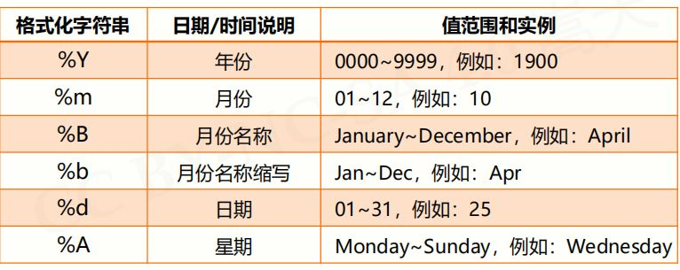

## time 模块：

时间相关的操作，时间有`三种`表示方式：

- **时间戳** : 多少多少秒
- **格式化的字符串**: 2014-11-11 11:11
- **结构化时间** `struct_time`: 元组包含了：年、日、星期等...

#### time.time

- 返回值:

  - int ：从`Unix诞生日` 1970 年 1 月 1 日之后的秒

- 示例：

  ```python
  import time

  ret = time.time()
  print(ret)

  ### 输出结果：
  1564210716.1712065
  ```

#### time.ctime

- 返回值:

  - str ：获取当前时间，并已`易读`的方式返回

- 示例：

  ```python
  time.ctime()

  ### 输出结果:
  # Tue Jul 27 14:52:03 2019
  ```

#### time.gmtime

- 返回值:

  - struct_time : 将一个 `时间戳` 转换为 `UTC时区`（0 时区）的`struct_time`。

- 参数:

  - seconds: str = None : 时间戳 — 秒

- 示例：

  ```python
  time.gmtime()

  ### 输出结果:
  # time.struct_time(tm_year=2019, tm_mon=7, tm_mday=27, tm_hour=7, tm_min=3, tm_sec=49, tm_wday=1, tm_yday=208, tm_isdst=0)
  ```

</br>

<Alert type="info"> **UTC 时区：** 北京在`东八区`，东京在东九区，中心为`本初子午线`，因此英国为世界标准时间 </Alert>

**结构化参数说明**：

| 索引（Index） | 属性（Attribute）         | 值（Values）        |
| :------------ | :------------------------ | :------------------ |
| 0             | tm_year（年）             | 比如 2011           |
| 1             | tm_mon（月）              | 1 - 12              |
| 2             | tm_mday（日）             | 1 - 31              |
| 3             | tm_hour（时）             | 0 - 23              |
| 4             | tm_min（分）              | 0 - 59              |
| 5             | tm_sec（秒）              | 0 - 61              |
| 6             | tm_wday（weekday）        | 0 - 6（0 表示周日） |
| 7             | tm_yday（一年中的第几天） | 1 - 366             |
| 8             | tm_isdst（是否是夏令时）  | 默认为-1            |

#### time.localtime

- 返回值:

  - localtime: 将一个 `时间戳` 转换为 `当前时区`的`struct_time`。

- 参数:

  - seconds: str = None : 时间戳 — 秒

- 示例：

  ```python
  time.localtime(time.time())

  ### 输出结果:
  # time.struct_time(tm_year=2019, tm_mon=7, tm_mday=27, tm_hour=15, tm_min=24, tm_sec=28, tm_wday=1, tm_yday=208, tm_isdst=0)
  ```

<Alert type="info">**注：** 经常用到，取的即是电脑系统里的时间 </Alert>

#### time.strftime

- 参数:

  - format: 格式化字符串
  - p_tuple: 结构化时间元组

- 示例：

  ```python
  time.strftime('%Y-%m-%d %p: %H:%M:%S', time.localtime(time.time()))

  ### 输出结果:
  # 2019-07-27 PM: 14:58:36
  ```

**格式化映射：**




#### time.strptime

- 返回值:

  - struct_time : 把一个`格式化`时间字符串转化为`struct_time`， `strftime` 的逆操作

- 参数:

  - time: str：字符串时间，需要与下面`format`参数对应
  - format: str ： 格式化字符串

- 示例：

  ```python
  time.strptime("2019-07-27 PM: 14:58:36", '%Y-%m-%d %p: %H:%M:%S')

  ### 输出结果:
  # time.struct_time(tm_year=2019, tm_mon=7, tm_mday=27, tm_hour=14, tm_min=58, tm_sec=36, tm_wday=5, tm_yday=208, tm_isdst=-1)
  ```

#### time.mktime

- 返回值:

  - str ：将 `struct_time `转化为时间戳

- 参数:

  - p_tuple: struct_time： 结构化时间元组

- 示例：

  ```python
  time.mktime(time.strptime("2019-07-27 PM: 14:58:36", '%Y-%m-%d %p: %H:%M:%S'))
  # time.mktime(time.localtime())

  ### 输出结果:
  # 1564210716.0
  ```

#### time.perf_counter

- 返回值:

  - str ：返回当前 `CPU进程 ` 运行的时间，计数器以微秒为单位，即`最高测量分辨率`的时钟。包括`睡眠时间`和`系统时间`。

- 示例：

  ```python
  import time
  import threading


  def foo():
      print(f"foo-1: {time.perf_counter()}")
      time.sleep(3)
      print(f"foo-2: {time.perf_counter()}")


  if __name__ == '__main__':
      print(time.perf_counter())
      time.sleep(1)
      print(f"main-1: {time.perf_counter()}")

      ret = threading.Thread(target=foo, )
      ret.start()

      time.sleep(1)
      print(f"main-2: {time.perf_counter()}")
      print(time.perf_counter())

  ### 输出结果:
  # 0.08299
  # main-1: 1.0830797
  # foo-1: 1.0839
  # main-2: 2.0832556
  # 2.0833004
  # foo-2: 4.0847707
  ```

#### time.sleep

- 参数:

  - time: str：`线程`推迟指定的时间运行，单位为秒。

- 示例：

  ```python
  time.sleep(1)	# 此时线程会阻塞 1s
  ```

</br>

---

## datetime 模块：

        .datetime.now()直接看时间 这种方法也常用


        timedelta:
            datetime模块中用于处理时间，代表两个datetime时间的差
            now = datetime.now()
            tommorow = now + timedelta(days=1)          # 当前时间加一天
            next_year = now + timedelta(days = 365)     # next_year距离现在多了365天， 加减其他时间同理

            因此获取两个时段的天数列表，用while start < end: start += timedelta(days=1) append 即可，或是安装 boto3（自查）

---
