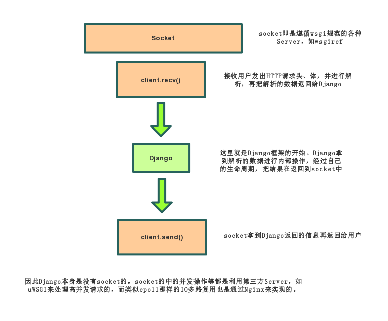

# Django 基础

## 1. 执行流程

#### 1.1 生命周期

**Django** 未封装 `socket`，使用第三方 **Server**

因此 **Server** 必须提供 `socket`

- 处理/解析请求
- 解析结果给 **Django**
- 等待 **Django** 返回结果
- 将返回结果发送到客户端

在将解析结果给 **Django** 时，**Django** 会内部执行中间件

#### 1.2 中间件

**settings.py** 中的 `MIDDLEWARE` ，类似经过洋葱模型，处理各种请求相关，如 **IP** 黑名单、日志、缓存等需要对请求批量处理的

[文档](https://docs.djangoproject.com/zh-hans/4.1/topics/http/middleware/) | 数据监测 [Opentelemetry](https://opentelemetry.io/docs/)

### 2. 简易示例

如下是打通 **Django** 流程的简易示例
