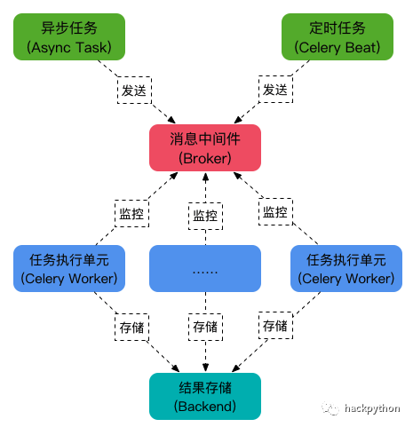

# 异步任务雏形

<Alert type="info"> **造轮子：** 使用 `etcd` 作为中间件，自行构建一套异步任务 </Alert>

参考：

- 1. [异步概述](/back_end/python/base/资源调度/异步概述)
- 2. [异步编程](/back_end/python/base/异步编程/异步并发库asyncio)

## 手动实现异步任务（仿 Celery 模型）

刚好最近项目需求：实现一个基于 `etcd` 的 `aio_task` 便从零开始造个轮子

#### 异步任务队列：

用来减缓高并发，将任务写入队列，通过一定顺序异步执行，因此需要任务队列作为管道

> 目的是为了：
>
> 1. 有空余资源时执行
> 2. 指定时间执行
> 3. 使用后台任务进程执行

#### celery 模型概念：

##### 1.Task(`生产者`)

耗时任务，比如格盘、重启、大批量发短信等。web 不可能立即收到请求，`同步`会卡死 web 死等，`异步`会占用浏览器请求资源卡死/丢失响应，因此需要异步任务，立即返回 task_id 和成功

##### 2.Worker(`消费者`)

在后台处理 Task 的对象

##### 3.Broker（`消息中间件`）

本质是`队列`，Task 会把任务交给 Broker 排队，Broker 来定执行序列，Worker 再从队列里面取任务执行

##### 4.Beat(`调度者`)

定时任务调度器，根据指定的时间，向 Broker 中添加数据，然后等待 Worker 去处理

##### 5.Backend

保存 Worker 执行结果的对象，每个 Task 都会有返回值，这些返回值就在 Backend 中 比如<Badge type="success">success</Badge><Badge type="warning">pedding</Badge><Badge type="error">failed</Badge> 这类状态



<Alert type="info">其实就是一个任务**序列化存储**与**反序列化获取**的过程</Alert>

#### 1.Broker 类

消息中间件，即：<Badge>队列(Queue)</Badge> ，应在此类存 `任务` 并定义队列 `优先级` 等规则.

这里使用了 [etcd](/data-base/etcd/etcd) 构建：[db 源码](/data-base/etcd/aioetcd3#简单封装)

**borker.py**

```python
import json
from typing import List, Optional

from aioetcd3.help import range_prefix

from dashboard import database
from dashboard.db_model.task import TaskInDB
from rook.util import get_now_time


class Broker:
    DB_CONFIG_KEY = "/ufs/monitor/task"

    def __init__(self):
        self.db_connection = database.get_db()

    async def enqueue(self, task_id, task_in_db: TaskInDB, ttl=5000):
        """
        将任务写入队列中
        :param task_id:
        :param task_in_db:
        :param ttl:
        :return:
        """
        # TODO: 定义队列优先级
        task_key = "{}/{}".format(self.DB_CONFIG_KEY, task_id)
        db_value = task_in_db.json()
        await self.db_connection.put(task_key, db_value, timeout=ttl)
        return task_in_db

    async def dequeue(self, task_id) -> Optional[TaskInDB]:
        """
        去任务队列中取任务
        :param task_id:
        :return:
        """
        task_key = "{}/{}".format(self.DB_CONFIG_KEY, task_id)
        task_info = await self.db_connection.get(task_key)
        if task_info[0]:
            task_in_db = TaskInDB(**json.loads(task_info[0]))
            return task_in_db
        return None

    async def update(self, task_id, **kwargs):
        """
        更新队列中指定的任务
        :param task_id:
        :param kwargs:
        :return:
        """
        task_in_db = await self.dequeue(task_id)
        if task_in_db:
            db_key = "{}/{}".format(self.DB_CONFIG_KEY, task_id)
            db_value = task_in_db.dict()
            db_value.update(dict(**kwargs))
            db_value["updated_at"] = get_now_time()
            db_value = TaskInDB(**db_value).json()
            # db_value = task_in_db.json()

            await self.db_connection.put(db_key, db_value)
            return True
        return False

    async def remove(self, task_id):
        """
        将任务从队列中移除
        :param task_id:
        :return:
        """
        db_key = "{}/{}".format(self.DB_CONFIG_KEY, task_id)
        await self.db_connection.delete(db_key)

    async def list(self) -> List[TaskInDB]:
        """ 获取队列中所有任务 """
        db_key = "{}".format(self.DB_CONFIG_KEY)
        db_value = await self.db_connection.range(range_prefix(db_key))
        task_list = []
        for v in db_value:
            if v[1]:
                user_info = json.loads(v[1])
                task_list.append(TaskInDB(**user_info))
        return task_list
```

#### 2.Task 类

**生产者**，定义一个任务类来表示要执行的任务，定义任务相关的逻辑

```python
import abc

from monitor.async_task.backend import Backend
from monitor.async_task.broker import Broker
from dashboard.model.task import StatusEnum


class BaseTask(abc.ABC):
    """
    Example Usage:
    class FooTask(BaseTask):

        async def run(self, *args, **kwargs):
            任务执行逻辑
            pass
        async def delay(self, *args, **kwargs):
            创建任务逻辑
            pass
    """

    def __init__(self):
        self.broker = Broker()
        self.backend = Backend()
        self.task_id = None
        self.task_name = ""

    @abc.abstractmethod
    async def run(self, *args, **kwargs):
        raise NotImplementedError("task `run` method must be implemented")

    async def update_state(self, *, task_id: str, state: StatusEnum, progress: float = 0.0):
        """ 更新任务状态 """
        task_in_db = await self.broker.dequeue(task_id)
        if task_in_db:
            if all([task_in_db.state == state == StatusEnum.RUNNING, progress == 0.0]):
                return
            task_in_db.state = state
            current_progress = round(task_in_db.progress + progress, 4)
            if current_progress >= 100:
                task_in_db.progress = 100
            else:
                task_in_db.progress = current_progress
            print("update_state", state, "progress", task_in_db.progress)
            await self.backend.update(task_id, **task_in_db.dict())
        else:
            raise Exception

    @abc.abstractmethod
    async def delay(self, *args, **kwargs):
        raise NotImplementedError("task `delay` method must be implemented")
```

#### 3.Worker 类

**消费者**，后台执行任务进程，监控并从`Broker`中获取任务，并执行

```python
import asyncio
import logging
import sys
import time
from pathlib import Path

root_path = str(Path(Path(__file__).joinpath("../../..")).resolve())
agent_path = str(Path(Path(__file__).joinpath("../../..").joinpath("agent/proto")).resolve())
sys.path.insert(0, root_path)
sys.path.insert(0, agent_path)

from monitor.async_task.rpc_task import RpcTask
from dashboard.db_model.task import TaskInDB

logger = logging.getLogger()


class Worker:
    def __init__(self, task: RpcTask, max_workers: int = 3) -> None:
        self.task = task
        self.task_queue = asyncio.Queue(maxsize=0, loop=asyncio.get_event_loop())  # 异步队列
        self.pending_tasks = []
        self.max_workers = max_workers  # 设置工作数量，默认起3个

    async def queue(self, task: TaskInDB):
        await self.task_queue.put(task)

    async def dequeue(self):
        return await self.task_queue.get()

    async def worker(self, name):
        """ 消费者：从队列中消费待执行任务，并将执行结果存入Backend中 """
        while True:
            try:
                task = await self.dequeue()
                task_id = task.id
                task_args = task.task_params.dict().get("args")
                task_kwargs = task.task_params.dict().get("kwargs")
                await self.task.run(task_id, *task_args, **task_kwargs)
                self.task_queue.task_done()
            except Exception as why:
                logger.debug(f"Exception occurred during task execution: {str(why)}")
                raise

    async def start(self):
        """ 创建至少一个消费者去异步队列中获取任务并执行 """
        try:
            if self.max_workers <= 1:
                self.max_workers = 1

            for i in range(self.max_workers):
                self.pending_tasks.append(asyncio.create_task(self.worker(f'worker-{i}')))

            # Wait until the queue is fully processed.
            await self.task_queue.join()

            # Wait until all worker tasks are cancelled.
            await asyncio.gather(*self.pending_tasks, return_exceptions=True)
        except Exception as why:
            logger.debug(f"Exception occurred during task execution: {str(why)}")

            # Cancel our worker tasks.
            for task in self.pending_tasks:
                task.cancel()


async def main():
    rpc_task = RpcTask()
    worker = Worker(rpc_task)
    await worker.start()


if __name__ == '__main__':
    asyncio.run(main())
```

#### 4. Backend 类

用来存任务执行的结果，同`Broker` 使用 `etcd` ，换成其他数据库也大同小异

```python
import asyncio
import json
from typing import List, Optional

from aioetcd3.help import range_prefix

from dashboard import database
from dashboard.db_model.task import TaskInDB
from rook.util import get_now_time


class WatchScope(object):
    def __init__(self, _iter):
        self._iter = _iter

    async def __aenter__(self):
        try:
            await self._iter.__anext__()
        except asyncio.CancelledError:
            pass
        return self._iter

    async def __aexit__(self, exc_type, exc_val, exc_tb):
        try:
            await self._iter.aclose()
        except GeneratorExit:
            pass


class Backend:
    DB_CONFIG_KEY = "/ufs/monitor/task"

    def __init__(self):
        self.db_connection = database.get_db()

    async def get_task_by_id(self, task_id) -> Optional[TaskInDB]:
        task_key = "{}/{}".format(self.DB_CONFIG_KEY, task_id)
        task_info = await self.db_connection.get(task_key)
        if task_info[0]:
            task_in_db = TaskInDB(**json.loads(task_info[0]))
            return task_in_db
        return None

    async def update(self, task_id, **kwargs):
        task_in_db = await self.get_task_by_id(task_id)
        if task_in_db:
            db_key = "{}/{}".format(self.DB_CONFIG_KEY, task_id)
            db_value = task_in_db.dict()
            db_value.update(dict(**kwargs))
            db_value["updated_at"] = get_now_time()
            db_value = TaskInDB(**db_value).json()
            await self.db_connection.put(db_key, db_value)
            return True
        return False

    async def remove(self, task_id):
        db_key = "{}/{}".format(self.DB_CONFIG_KEY, task_id)
        await self.db_connection.delete(db_key)

    async def get_tasks(self) -> List[TaskInDB]:
        """ 获取所有异步任务 """
        db_key = "{}".format(self.DB_CONFIG_KEY)
        db_value = await self.db_connection.range(range_prefix(db_key))
        task_list = []
        for v in db_value:
            if v[1]:
                user_info = json.loads(v[1])
                task_list.append(TaskInDB(**user_info))
        return task_list

    async def get_tasks_by_prefix(self, prefix: str) -> List[TaskInDB]:
        """ 获取目标前缀的异步任务 """
        db_key = f"{self.DB_CONFIG_KEY}/{prefix}"
        db_value = await self.db_connection.range(range_prefix(db_key))
        task_list = []
        for v in db_value:
            if v[1]:
                user_info = json.loads(v[1])
                task_list.append(TaskInDB(**user_info))
        return task_list

    async def watch_tasks_by_prefix(self, prefix: str):
        """ 获取目标前缀的异步任务 """
        db_key = f"{self.DB_CONFIG_KEY}/{prefix}"

        async def watch_scope(watch, key_range, start_revision=None, noput=False, nodelete=False, prev_kv=False,
                              always_reconnect=False, ignore_compact=False, batch_events=False):
            return WatchScope(watch(key_range, start_revision=start_revision,
                                    noput=noput, nodelete=nodelete, prev_kv=prev_kv, create_event=True,
                                    always_reconnect=always_reconnect, ignore_compact=ignore_compact,
                                    batch_events=batch_events))

        return await watch_scope(self.db_connection.watch, range_prefix(db_key))
```

#### 5.派生任务

异步派生任务通过继承 `BaseTask` 并重写其 `run()` 方法来

```python

```

#### 6.Beat 类

**定时调度器**，由于定时规则、调度规则等未定，因此最后实现
