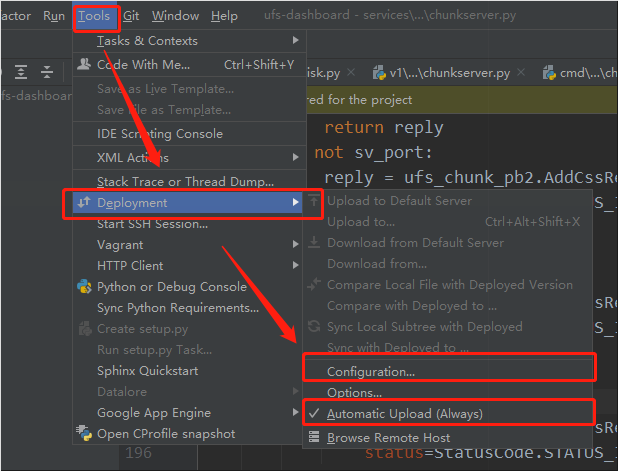
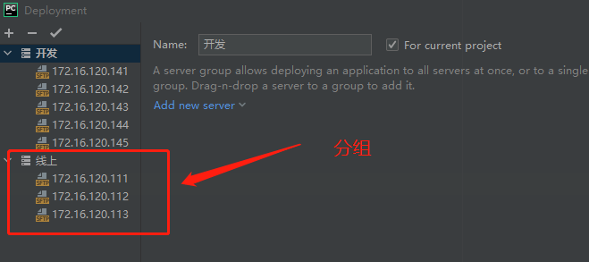

Python下载 & Pycharm 基本使用 

<!-- more -->

# Python 环境安装

### 1. 环境安装

[Python 下载](https://www.python.org/downloads/) | [Miniconda 下载](https://docs.conda.io/en/latest/miniconda.html)

### 2. python 风格指南

[PEP 8](https://pep8.org/)

### 3. Pycharm

#### 3.1 通用设置

基本都在 `setting` -> `editor` 中找

> **背景图：** 双击 <kbd>Shift</kbd> -> `set background`

- **lint：** 用于检查代码规范（需下载安装&配置） **Pycharm** 也会自动检查，波浪线表示有问题

- 快捷注释：<kbd>ctrl</kbd> + <kbd>/</kbd>

- 查看保留字

  ```python
  from keyword import kwlist
  
  print([i for i in kwlist])
  
  ### 输出结果：
  # ['False', 'None', 'True', '__peg_parser__', 'and', 'as', 'assert', 'async', 'await',
  # 'break', 'class', 'continue', 'def', 'del', 'elif', 'else', 'except', 'finally',
  # 'for', 'from', 'global', 'if', 'import', 'in', 'is', 'lambda', 'nonlocal', 'not',
  # 'or', 'pass', 'raise', 'return', 'try', 'while', 'with', 'yield']
  ```

  > **注：** 区分大小写 不能以保留字命名

#### 3.2 快捷键

> 注意其他应用 **热键占用**，如 **网易云**

- 子类继承抽象类：<kbd>Ctrl</kbd> + <kbd>O</kbd>
- 批量的快速重命名：<kbd>Shift</kbd> + <kbd>F6</kbd>
- 快速查找文件名：<kbd>Shift</kbd> + <kbd>Ctrl</kbd> + <kbd>N</kbd>

**快捷键大全：** <kbd>Help</kbd> - <kbd>Keymap Reference</kbd>

#### 3.3 配置 SFTP

**SFTP** 自动同步代码到虚拟机

- 设置入口

  <div class="image-preview">
      
  </div>

- 进行分组管理

  <div class="image-preview">
      
  </div>

**注意：**

若出现 `Permission denied` 许可被拒绝，可能是 **文件所属者** 不对导致，执行如下

```shell
chown -R ubuntu:ubuntu # 所有者，递归修改所有所属组
```
