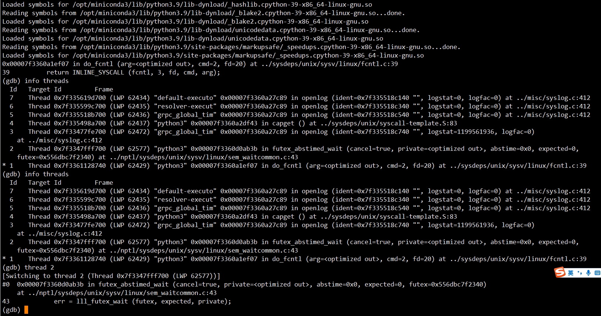

**Linux** 下 **Python** 文件锁的使用

<!--more-->

在并发情况下，多个线程/进程池 对同一文件进行读写，如 **grpc** 线程池收到多个请求同时改写一份文件的情况，

此时需要用到 **fcntl** 来对文件的读写加锁

## Linux 中的文件锁

在 **Linux** 中，**flock** 和 **fcntl** 都是系统调用，而 **lockf** 则是库函数， **lockf** 则是 **fcntl** 的封装，因此 **lockf** 和 **fcntl** 在底层实现是一样的，对文件加锁的效果也是一样的

首先说一些概念：

- **文件锁：** 针对整个文件的锁，如 **flock**
- **记录锁：** 针对整个文件和文件部分字节的锁，如 **fcntl**、**lockf**
- **排他锁：** 也可以称为写锁、独占锁，同一时间只有一个进程可以加锁
- **共享锁：** 也可以称为读锁，支持多个进程并发读文件内容，但不可以写
- **睡眠锁：** 一般和等待队列同时存在，当无法获取锁的时候会在等待队列中睡眠，直到满足条件被唤醒，如 **semaphore**、**mutex**
- **自旋锁：** 自旋锁在被持有时，其它进程再申请时将 **不断” 自旋 ”（死循环）** ，不会陷入睡眠，直到持有者释放，为保证性能，自旋锁不应被持有时间过长
- **劝告锁（建议锁）：** 不要求进程一定要遵守，是一种约定俗成的规则，某进程持有建议锁的时候，其它进程依然可以强制操作，如 **flock**、**fcntl**
- **强制锁：** 是 **内核行为**，在系统调用违反约束条件时，内核将直接阻拦，如 **fcntl**（***fcntl**也可实现强制锁，但不建议使用* ）

## 系统调用 fcntl 和 ioctl

[文档参考](https://docs.python.org/zh-cn/3/library/fcntl.html?highlight=fcntl) 

### Linux 

**Linux** 的 `flock()` 的函数原型如下

```c
int flock(int fd, int operation);
```

其中，参数 `fd` 表示文件描述符；参数 `operation` 指定要进行的锁操作，该参数的取值有如下几种

- **LOCK_SH：** 创建一个 **共享锁**，在任意时间内，一个文件的共享锁 **可以被多个进程拥有**
- **LOCK_EX：** 创建一个 **排他锁**，在任意时间内，一个文件的排他锁 **只能被一个进程拥有**
- **LOCK_UN：**  **解锁**，删除该进程创建的锁
- **LOCK_MAND：** 用于 **共享模式的强制锁**，它可以与 **LOCK_READ** 或者 **LOCK_WRITE** 联合使用，表示 **是否允许 并发读 或 并发写** 操作

通常情况下，如果加锁请求 **不能被立即满足**，那么系统调用 `flock()` **阻塞当前进程** 

> 若进程要请求一个排他锁，但此时已经被其他进程获取了这个锁，那么该进程将会被阻塞

#### lockf 和 fcntl

函数：

```c
int fcntl(int fd, int ⌘, ... /* arg */ ); 
struct flock {
...  
short l_type; 		/* Type of lock: F_RDLCK, F_WRLCK, F_UNLCK */
short l_whence; 	/* How to interpret l_start: SEEK_SET, SEEK_CUR, SEEK_END */
off_t l_start;   	/* Starting offset for lock */ 
off_t l_len;     	/* Number of bytes to lock */ 
pid_t l_pid; 		/* PID of process blocking our lock (F_GETLK only) */
...         
}; `
```

相关的 **cmd** 有三种

- **F_SETLK：** 设置文件锁（***非阻塞*** ）
- **F_SETLKW：** 设置文件锁（***阻塞*** ）
- **F_GETLK：** 获取锁信息，会修改我们传入的 **struct flock**

**fcntl/lockf** 的特性有

- 上锁可以递归
- 加读锁（*共享锁*）**必须是读**打开的，加写锁（*排他锁*）文件 **必须是写** 打开的
- 由 **fork** 产生的子进程 **不继承** 父进程所设置的锁
- **支持强制性锁：** 对一个特定文件打开其设置 **组ID位（*S_ISGID*）** ，并关闭其 **组执行位（*S_IXGRP*）** ，则对该文件开启了强制性锁机制，在 **Linux** 中若使用强制性锁，则要在文件系统 **mount** 时，使用 `-o mand` 打开该机制（*用得少*）

### Python 的 fcntl 模块

函数：`fcntl.flock(fd, operation)`

`fd` 是系统调用 **open** 返回的文件描述符，`operation` 的可选项有：

- **LOCK_SH：** 共享锁
- **LOCK_EX：** 排他锁
- **LOCK_UN：** 解锁
- **LOCK_NB：** 非阻塞（*与上述三种操作一起使用*）

想在 **未获得排他锁情况下不阻塞该进程**，可以将 **LOCK_NB** 和 **LOCK_SH** 或 **LOCK_EX** 联合使用，那么系统就不会阻塞该进程

##### 简单示例

```python
# flock 生成的是劝告锁，因此进程可以正常打开文件，此时语句均可被执行
fd = open("test")  					

# 检测文件是否被加锁，如果已经上了锁，那么这里就会被阻塞，若多线程，此时会阻塞线程后续执行（lll_futex_wait）
fcntl.flock(fd, fcntl.LOCK_EX)  

# 用 LOCK_NB 就不会被阻塞（线程会继续执行，如抢锁操作等）
fcntl.flock(fd, fcntl.LOCK_EX | fcntl.LOCK_NB)  

# 对文件进行解锁
fcntl.flock(fd.fcntl.LOCK_UN) 
```

- 对文件 `close()` 后文件锁会失效
- 进程结束后文件锁会失效

#### **flock 和 lockf 的区别** 

1. **flock** 只能对 **整个文件** 起作用，而不能对文件的某一部分上锁，**lockf** 可以对文件的某个区域进行上锁

2. **flock** 只能产生劝告性锁，**flock** 可以有共享锁和排他锁，而 **lockf** 只支持排他锁 

3. 在 **fork/dup** 的情况不同，**flock** 锁可以递归，即通过 **fork** 或者 **dup** 产生的两个 **fd**，都可以进行加锁而不会死锁

4. **flock** 不能在 **NFS** 文件系统上使用，要在 **NFS** 上使用需要用 **fcntl** 

如果 `flock()` 调用失败，就会触发 [`OSError`](https://docs.python.org/zh-cn/3/library/exceptions.html#OSError) 异常

```python
import fcntl
import os, time
import uuid

FILE = "counter.txt"

if not os.path.exists(FILE):
    # create the counter file if it doesn't exist
    file = open(FILE, "w")
    vnc_line = '123cajfg: 127.0.0.1:15900'
    file.write(vnc_line + '\n')
    file.close()

for i in range(5):
    # 由于flock生成的是劝告锁，不能阻止进程对文件的操作，所以这里可以正常打开文件
    file = open(FILE, "a+") 
    
    # 为了避免同时操作文件，需要程序自己来检查该文件是否已经被加锁,若检查到加锁，进程会被阻塞
    fcntl.flock(file.fileno(), fcntl.LOCK_EX)   
    print('acquire lock')
    now_port = int(file.readlines()[-1].split(':')[-1])
    new_port = now_port + 1
    token = str(uuid.uuid4())
    # file.seek(0)
    vnc_line = ':'.join([token, ' 127.0.0.1', str(new_port)])
    file.write(vnc_line + '\n')
    print os.getpid(), "=>", new_port
    time.sleep(10)
    file.close() # unlocks the file
    print 'release lock'
    time.sleep(2)
```

##### 多线程


```python
import fcntl
import threading
import time

def writetoTxt():
    id = threading.currentThread().getName()
    
    with open("aaa.txt", "a") as f:
        # fcntl.flock(f.fileno(), fcntl.LOCK_EX)  # 加锁
        print("{} acquire lock".format(id))
        
        for i in range(10):
            f.write('"write from" + str(i) + {} \n'.format(id))
            time.sleep(2)
	# 在 with 块外，文件关闭，自动解锁
	print("{} exit".format(id))
            
if __name__ == '__main__':
    for i in range(6):
        t = threading.Thread(target=writetoTxt, args=())
        t.start()
```

在多个终端中启动上面的程序，会发现它们相互阻塞

::: tip 注意

- 对于文件的 `close()` 操作会使文件锁失效
- 同理，进程结束后文件锁失效
- `flock()` 的 **LOCK_EX** 是 **“劝告锁”**，系统内核不会强制检查锁的状态，需要在代码中进行文件操作的地方显式检查才能生效

:::

若跨平台，可自己实现或使用 **portalocker** 魔改

```python
import time
# import fcntl

import portalocker


def acquire(lock_file: str, open_mode: str, timeout: float = 1.0):
    fd = open(lock_file, open_mode)

    lock_file_fd = None
    start_time = current_time = time.time()
    while current_time < start_time + timeout:
        try:
            # 仅同步使用: 使用互斥锁是阻塞式的，若多线程中含异步操作切换上下文会死锁
            portalocker.lock(fd, portalocker.LockFlags.EXCLUSIVE)
            # fcntl.flock(fd, fcntl.LOCK_EX | fcntl.LOCK_NB)
        # except (IOError, OSError):
        except Exception as e:
            pass
        else:
            lock_file_fd = fd
            break
        time.sleep(0.2)
        current_time = time.time()

    if lock_file_fd is None:
        fd.close()
    return lock_file_fd


def release(lock_file_fd):
    portalocker.unlock(lock_file_fd)
    # fcntl.flock(lock_file_fd, fcntl.LOCK_UN)
    lock_file_fd.close()
    return None


def main():
    fp = acquire('/opt/ufs/xxx.json', "r+")
    if fp is None:
        raise OSError(
            "Resource temporarily unavailable"
        )
    fp.read()
    release(fp)

```

::: danger 需要注意

若异步框架，其中混用了多线程同步操作，使用文件锁时，此时一旦 **遇见异步阻塞，自动切换上下文，则会出死锁** （多线程）若使用 **fcntl.LOCK_NB** 非阻塞，则会超时至抢锁失败，故需要避免 



:::

##### **使用示例 json 解析**

```python
class JsonConfigWithRWLock(ConfigInterface):

    def __init__(self, path: Path):
        self._config_file = path
        self.kv = {}
        self.fp_lock = self._acquire()
        self._parse_data()

    def _acquire(self):
        if isinstance(self._config_file, str):
            self._config_file = Path(self._config_file)
        parent_path = Path.absolute(self._config_file.parent)
        file_name = ".{}.lock".format(str(self._config_file.name))
        abs_path = Path.joinpath(parent_path, file_name)
        if not abs_path.exists():
            with open(str(abs_path), "w"):
                pass

        fp_lock = acquire(str(abs_path), "r+")
        if fp_lock is None:
            raise OSError(
                "File Acquire Failed, Resource temporarily unavailable"
            )
        return fp_lock

    def release(self):
        if self.fp_lock:
            release(self.fp_lock)
            self.fp_lock = None

    def __exit__(self, exc_type, exc_val, exc_tb):
        self.release()

    def __enter__(self):
        return self

    def _parse_data(self):
        try:
            with open(self._config_file) as fp:
                data = fp.read()
        except FileNotFoundError:
            data = "{}"
        if data.strip():
            self.kv = json.loads(data)

    def reload(self):
        self.kv = {}
        self._parse_data()

    def get_key(self, key: str):
        return self.kv.get(key, "")

    def set_key(self, key: str, value: str):
        self.kv.update({key: value})

    def get_all(self) -> dict:
        return self.kv

    def save(self):
        data = json.dumps(self.kv, indent=4)
        with open(self._config_file, "w") as fp:
            fp.write(data)
```

