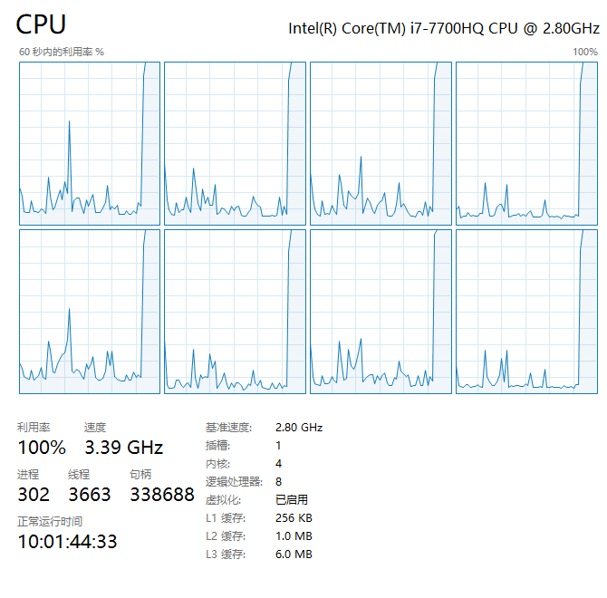

**Python** 基于进程的并行计算

<!--more-->

**multiprocessing**：是一个与 [threading](/back_end/python/base/资源调度/多线程编程#基于线程的并发) 模块类似的包，能提供本地和远程的 [并发](/back_end/python/base/资源调度/进程#12-并发) 操作（若多核那么就是 [并行](/back_end/python/base/资源调度/进程#11-并行) 操作）。它利用子进程来绕过了 [GIL 锁](/back_end/python/base/资源调度/多线程编程#基于线程的并发) ，适用于 Unix 和 Windows 系统的 **CPU**(计算)密集型操作（且通常不依赖上次计算结果）

## 1. 多进程 [multiprocessing](https://docs.python.org/zh-cn/3/library/multiprocessing.html?highlight=basemanager#module-multiprocessing)

### 1.1 主要功能介绍

- 主要用于创建 **子进程** 对象，`Process`类，然后 start 启动
- 进程通信，支持 `Queue`类 队列和 `Pipe` 类管道通信
- 共享数据，在并发编程时通常 **尽量避免共享状态**，若需要，可使用共享内存 `Value ` 或 `Array` 将数据存在共享内存的映射中。
- 进程同步，`Lock` 类实现进程的同步，避免同时抢占同一资源
- 进程池，`Pool` 类创建进程池
- 管理器，分布式计算，通过 `managers` 实现分布式的进程计算和通信
- 监听器，通过 `Listener` 监听管道来交互

::: tip

使用 `multiprocessing` 时，应遵循一些指导原则和习惯 [用法](https://docs.python.org/zh-cn/3/library/multiprocessing.html?highlight=basemanager#multiprocessing-programming) 

:::

#### **部分摘要**：

- `multiprocessing` 有进程间通信 **IPC** (如：`Pipe` 和 `Queue`) 因此优先考虑使用它们，效率会高些

- 避免使用 `Lock/Event/Semaphore/Condition` 等同步方式，因为它们占据了 **非用户进程的** 资源，多进程应该避免共享资源

  > 多线程中，以上方式共享资源很容易，比如使用 **全局变量** 或 **传递参数**，但多进程由于每个进程都有自己独立的内存空间，以上方法并不合适

- 若必须共享，可通过 **共享内存** 和 `Manager` 方法来共享资源，但此时程序复杂度大大提高，且因同步而降低了计算效率

### 1.2 Process 类

**<Font type="dark">`Process`(group=None, target=None, name=None, args=(), kwargs={}, \*, daemon=None)</Font>**

> 进程对象表示在单独进程中运行的活动

- 参数：
  - `group: None`：应该始终为 None
  - `target`：是由 `run()` 方法调用的可调用对象
  - `args|kwargs`：子进程所需参数
  - `daemon`：将进程标志设置为 `True` 或是 `False` ，若为 None（默认值）则该标志将从创建的

`Process` 和 `threading.Thread` API 大致相同，也有两种创建方式：

1.主进程通过实例化 `Process` 对象来创建，并执行子进程 `foo()`

```python
import os
from multiprocessing import Process


def foo(num):
    print(f"pid: {os.getpid()} - num: {num}")


def main():
    process = Process(target=foo, args=(1,))
    process.start()
    process.join()
    print(f"module name: {__name__} - pid: {os.getpid()}")


if __name__ == '__main__':
    main()

### 输出结果
# pid: 34284 - num: 1
# module name: __main__ - pid: 26144
```

> **注**：为啥在 `Windows` 中必须要使用 `if __name__ == '__main__': ` ?
>
> 1. `if __name__ == '__main__':` 表示只有当前运行的 `.py`文件， 它的 `__name__` 才为`__main__` 若不是当前运行的 `.py` 文件则不为 `__main__` 这个字段
> 2. `Unix` 系统中有 `fork()` 这个系统调用来创建进程，若普通函数调用，调一次，返回一次。但 `fork()` 则是调用一次，返回两次，这是因为操作系统自动把当前进程（父进程）复制了一份（称为子进程），然后父子分别返回了一次
>
> 3. `Windows` 系统中没有 `fork()` ，所以暂且理解为 `python` 的多进程在`Windows`中相当与复制了一个一整套的上下文环境（`.py` 文件）为了避免复制的 `.py` 文件再次读到全局的 `Process` 来重复创建子进程（否则递归，无限创建直到发生 **RuntimeError** 异常）因此要通过 `if __name__ == '__main__':` 来区分到谁是主进程，只有主进程才能创建，这样才能有效起到保护作用

2.通过继承 `Process` 类来创建，并复写和执行 `run()` 方法

```python
import os
import time

from multiprocessing import Process


class NextProcess(Process):
    def __init__(self, pro_name):
        super(NextProcess, self).__init__()
        self.pro_name = pro_name

    def run(self):
        start_time = time.time()
        total = 0
        for num in range(100000000):
            total += num
        print(f"Process ID: {os.getpid()} - Name: {self.pro_name} - total: {total} - time: {time.time() - start_time}")


if __name__ == '__main__':
    start = time.time()
    next_list = []
    for i in range(8):
        p = NextProcess(i)
        next_list.append(p)
        p.start()

    # print("子进程正在执行中...")
    #
    # for next_pro in next_list:
    #     next_pro.join()

    print(f"Main Process Over Time: {time.time() - start}")

### 输出结果：
# Main Process Over Time: 0.041664838790893555
# Process ID: 30308 - Name: 5 - total: 4999999950000000 - time: 12.864246606826782
# Process ID: 36596 - Name: 1 - total: 4999999950000000 - time: 12.899959325790405
# Process ID: 29976 - Name: 6 - total: 4999999950000000 - time: 12.89797592163086
# Process ID: 32604 - Name: 2 - total: 4999999950000000 - time: 12.918310642242432
# Process ID: 27108 - Name: 4 - total: 4999999950000000 - time: 13.050273895263672
# Process ID: 36772 - Name: 7 - total: 4999999950000000 - time: 13.054712533950806
# Process ID: 35380 - Name: 0 - total: 4999999950000000 - time: 13.098359823226929
# Process ID: 9352 - Name: 3 - total: 4999999950000000 - time: 13.09786581993103

### 若去除.join()相关部分注释，让主进程等待子进程执行，则主进程结果如下：
# 子进程正在执行中...
# Process ID: 28740 - Name: 0 - total: 4999999950000000 - time: 12.804229497909546
# ...
# Process ID: 35624 - Name: 2 - total: 4999999950000000 - time: 13.160359382629395
# Main Process Over Time: 13.237204313278198
```

- 若不使用 `.join()` 方法，主进程则不会阻塞，此时多个子进程异步执行

- 若使用`.join()` 方法，需要注意避免一个 `for` 循环中每个子进程依次阻塞，应另起循环批量 `join` 即可实现主进程阻塞下的子进程并行

- 以 **CPU** **i7-7700HQ** `4核心8线程` 为例，开启 8 个子进程**并行**，做 1 亿数字相加来跑满核心，执行过程图示如下：

    

  > 此时**CPU 占用 100%**，**8 线程跑满接近极限 3.5GHz 睿频**，以上才是通过多进程，真正充分利用 CPU 的多核性能 **进行计算密集型任务**

### 上下文和启动方法：

根据不同的平台，`multiprocessing` 支持三种启动进程的方法：

- **spawn**：<Badge type="success">Windows 默认</Badge><Badge type="queen">Unix</Badge><Badge type="warning">macOS 默认</Badge>
  - 父进程启动一个全新的 `python` 解释器进程，子进程只继承那些运行进程对象的 `run()` 方法所必须的资源。
  - 来自父进程的非必须文件描述符黑句柄将不会被继承。使用此方法启动进程相比 `fork` 或 `forkserver` 要慢上许多
- **fork**：<Badge type="queen">Unix 默认</Badge>
  - 父进程使用 `os.fork()` 来产生 `Python` 解释器分叉。子进程初始化资源和继承于父进程，和父进程一样。
  - 注意：安全分叉多线程进程？
- **forkserver**: <Badge type="queen">Unix</Badge>
  - 该方式会启动服务器进程，每次要创建进程时，父进程都会连接到服务器去请求它来创建一个新进程
  - 这种方式貌似是 **OS 线程级别** 的进程，因此使用 `os.fork()` 是安全的，也没有不必要的资源被继承

> 注意：
>
> - `spawn` 在 `macOS` 上可能导致 `subprocess` 崩溃，因此不安全
> - `Unix`上 使用 `spawn` 或 `forkserver` 时，会多一个 **资源追踪** 进程，它追踪 **当前进程产生且不用** 的系统资源 (如：命名信号量以及 [`SharedMemory`](https://docs.python.org/zh-cn/3/library/multiprocessing.shared_memory.html#multiprocessing.shared_memory.SharedMemory) 对象)。所有进程退出后，资源追踪释放追踪对象。通常不会有这种对象，但一个子进程被某个信号杀死，就会 **内存泄露** 到下次重启
> - `spawn` 或 `forkserver` 有诸多限制，请参考文档

要选择启动方法，应该在 `if __name__ == '__main__'` 中调用 `set_start_method('method')` 来指定，仅指定一次

## 2. 多进程通讯：队列和管道

进程彼此间的资源是不共享的，上下文相互隔离。因此实现进程间通信，队列和管道这两种方式可以传递消息。

**class multiprocessing.Queue([maxsize])**

> 与标准库中的 [queue.Queue]() 模块类似，实现多生产者，多消费者队列。返回了 **一个管道** 、 **少量锁** 和 **信号量** 构成的共享队列的实例。
>
> 当一个进程将一个对象放进队列中时，一个写入线程会启动，并将对象从缓冲区写入管道中去

- 参数：
  - `maxsize：int = -1`：队列中允许的最大数量，若小于等于零则大小为无限


## 3. subprocess

[`subprocess`](https://docs.python.org/zh-cn/3/library/subprocess.html#module-subprocess) 模块允许你生成新的进程，连接它们的输入、输出、错误管道，并且获取它们的返回码，但该模块在 **WebAssembly** 无法使用

::: tip

用于替代老旧模块 如

```python
os.systm
os.spawn*
```

### 3.1 **关于 os.system os.popen 和 subprocess 的区别**

**os.system()**

返回命令执行结果的返回值，有如下三步操作

1.  **fork** 一个子进程
2. 子进程中调用 **exec** 函数执行命令
3. 父进程中调用 **wait** 阻塞等待子进程结果

**os.popen()**

它先创建了一个管道，然后 **fork**一个子进程，子进程执行命令，但返回值在标准 **IO** 流中，该管道用于父子进程间通信

父进程要么从管道读信息，要么向管道写信息，至于是读还是写取决于父进程调用 **popen** 时传递的参数（***w** 或 **r*** ）

```python
import os

p = os.popen("exec command")
s = p.read()
print(s)
p.close()
```

:::

### 3.2 Popen

通常可使用 `run()` 接口 传入 **arg** 指令等待其完成，并拿到返回的  [`CompletedProcess`](https://docs.python.org/zh-cn/3/library/subprocess.html#subprocess.CompletedProcess) 实例解析

进阶用例请使用底层 [Popen](https://docs.python.org/zh-cn/3/library/subprocess.html#subprocess.Popen) 接口，其构造如下

`class subprocess.Popen(args, bufsize=-1, executable=None, stdin=None, stdout=None, stderr=None, preexec_fn=None, close_fds=True, shell=False, cwd=None, env=None, universal_newlines=None, startupinfo=None, creationflags=0, restore_signals=True, start_new_session=False, pass_fds=(), *, group=None, extra_groups=None, user=None, umask=- 1, encoding=None, errors=None, text=None, pipesize=-1, process_group=None)`

在一个新的进程，执行子程序

- **args：** 参数序列、字符串（*必须 `shell=True`* ），**推荐序列形式**，若字符串，则被作为将 **被执行的程序的命名** 或 **路径** 解释
- **shell：** 在 **POSIX**，当 `shell=True`， **shell** 默认为 `/bin/sh` ，若 **args** 是字符串，则将通过 **shell** 执行

::: danger Shell 注入漏洞

关于为啥不推荐 **shell=True** 以及 **subprocess** 替代 **os** 模块，是由于 **shell 注入漏洞**  

针对 **popen** 其实现是不会隐式调用系统 **shell** 的（*不用 `/bin/sh` 解析命令* ），它是可以将所有字符（*包括 **shell** 元字符* ）安全传递给子进程

但指定 **shell=True** 时，则是显式发起调用（***等效 os.system*** ）此时需要 **应用程序本身** 来保证字符串安全转义

不然攻击输入类似如下这种危险的命令，会引发严重事故

```shell
ls -l;touch 1.txt	# ;rm -rf ~ | rm -rf / 
```

防止操作系统命令注入漏洞的 **最有效方法是永远不要从应用层代码中调用操作系统命令**

使用 **shell=True** 显示调用，尽管可以方便的直接使用 **"|"** 管道符或 **”>“**，如 **SMB** 的录入用户数据

```
echo -e "12345\n12345\n" | pdbedit -t -a zz
```

```python
cmd = f"echo -e '{password}\n{password}\n' | {PDBEDIT} -t -a {name}"
out, err, rc = await run_command(cmd, shell=True)
```

此时若将内嵌的参数 如 `{password}、{PDBEDIT}、{name}` 替换为危险的字符指令，则会引发跑路的后果，所以它不够安全，使用 `stdin=x.stdout` 输入则能安全的规避

```shell
$ df -h |grep sda1
```

可以将第一条指令的管道输出作为第二条指令的输入

```python
In [4]: p1 = subprocess.Popen(['df','-h'], stdout=subprocess.PIPE)
In [5]: p2 = subprocess.Popen(["grep", "sda1"], stdin=p1.stdout, stdout=subprocess.PIPE)
In [6]: p1.stdout.close()
In [7]: output = p2.communicate()[0]
In [8]: output
Out[8]: b'/dev/sda1       259M  119M  122M  50% /boot\n'
```

启动 `p2` 之后再执行 `p1.stdout.close()` 调用很重要，这是为了让 `p1` 能在 `p2` 先于 `p1` 退出时接收到 `SIGPIPE` 

:::

::: warning shlex

若真的必须用 **shell=True** 调用子进程，并使用 **Python** 调用用户输入，还有一种方法可以安全地做到这一点

[shlex.quote()](https://docs.python.org/zh-cn/3/library/shlex.html) 

```python
import shlex
import subprocess

subprocess.call(f'echo {shlex.quote(user_string)} >> user_string.txt', shell=True)
```

:::

- **bufsize：** 给 **open()** 函数提供参数的，此时会创建 **stdin/stdout/stderr** 管道文件对象 
  - **0** 表示不使用缓冲区（*读写是一个系统调用* ）可返回短内容
  - **1** 表示一行 缓冲（*仅在 `text=True` 或 `universal_newlines=True` 中能用*）
  - 任何 **其他正值**，表示使用约为对应大小的缓冲区
  - 负值（*默认*）表示使用系统默认的 `io.DEFAULT_BUFFER_SIZE` ，即默认启用系统缓冲

- **executable：** 指定一个要执行的替换程序，通常替换默认的 **shell** 即 `/bin/sh` 

- **stdin/stdout/stderr：** 指定被执行程序的 **标准输入、标准输出、和标准错误 文件句柄**，合法的值包括 [`PIPE`](https://docs.python.org/zh-cn/3/library/subprocess.html#subprocess.PIPE)、[`DEVNULL`](https://docs.python.org/zh-cn/3/library/subprocess.html#subprocess.DEVNULL)、现存的 **文件描述符**（*正整数* ）、现存的带有合法文件描述符的 [file object](https://docs.python.org/zh-cn/3/glossary.html#term-file-object) 以及 `None` 

  - **PIPE：** 新建一个连接子进程的管道
  - **DEVNULL：** 使用特殊的文件 [`os.devnull`](https://docs.python.org/zh-cn/3/library/os.html#os.devnull) 
  - **None：** 将不会进行任何重定向，子进程的文件流将 **继承自父进程**

  > **stderr** 可以为 [`STDOUT`](https://docs.python.org/zh-cn/3/library/subprocess.html#subprocess.STDOUT)，这表示来自子进程的 **stderr** 数据应当被捕获到与 **stdout** 相同的文件句柄中
  >
  > 若要在结果中同时捕获标准错误，请使用 `stderr=subprocess.STDOUT`

::: tip

**Popen** 对象支持通过 [`with`](https://docs.python.org/zh-cn/3/reference/compound_stmts.html#with) 语句作为上下文管理器，在退出时关闭文件描述符并等待进程

```python
with Popen(["ifconfig"], stdout=PIPE) as proc:
    log.write(proc.stdout.read())
```

请注意，如果您要做的事情比较复杂而又不能容纳在一行中，那么就需要 `devnull` 在 `Popen` 对象的整个生命中保持开放，而不仅仅是其构造。（*即将整个内容放入 `with` 语句*）

```python
with open(os.devnull, 'w') as devnull:
    subprocess.check_call(['java', '-jar', 'foo.jar'], stdout=devnull)
```

**POSIX** 中重定向到 `/dev/null` 或 **Windows** 中的 `NUL` 

- 优点是不会创建不必要的管道，更重要的是，**不会在子进程写入时阻塞该管道** 

- 缺点是  `os.devnull` 可能无法在某些平台上运行，若只关心 **POSIX** 和 **Windows** 上的**CPython**，**PyPy** 和 **Jython**，就没有问题 

::: 

- **cwd：** 字符串、字节串、路径类对象，若 **cwd** 不为 `None`，此函数在执行子进程前会将当前工作目录改为 **cwd** 

- **env：** 可指定环境变量，映射格式如下（*字符串、字节串*）

  ```python
  fake_env = dict(os.environ)
  fake_env["LANG"] = "en_US.UTF-8"
  # subprocess.Popen(..., env=fake_env)
  ```

- **pipesize：** 当 `subprocess.PIPE` 作为输入输出时，可指定管道大小（***3.10** 仅 **Linux***）

| 方法                  | 描述                          |
| --------------------- | ----------------------------- |
| `Popen.poll()`        | 检查子进程是否已终止          |
| `Popen.wait()`        | 等待子进程终止（*小心死锁* ） |
| `Popen.communicate()` | 允许与进程交互（*规避死锁* ） |
| `Popen.send_signal()` | 向子进程发送信号              |
| `Popen.terminate()`   | 停止子进程                    |
| `Popen.kill()`        | 终止（*杀死* ）子进程         |

::: info 说明

使用 [`communicate()`](https://docs.python.org/zh-cn/3/library/subprocess.html#subprocess.Popen.communicate) 而非 [`.stdin.write`](https://docs.python.org/zh-cn/3/library/subprocess.html#subprocess.Popen.stdin)， [`.stdout.read`](https://docs.python.org/zh-cn/3/library/subprocess.html#subprocess.Popen.stdout) 或者 [`.stderr.read`](https://docs.python.org/zh-cn/3/library/subprocess.html#subprocess.Popen.stderr) 来避免由于任意其他 **OS** 管道 **缓冲区被子进程填满阻塞** 而导致的 **死锁** 

它可以向 **stdin** 发送数据，或从 **stdout** 和 **stderr** 中读取数据

**Popen.communicate(input=None, timeout=None)**

- **input：** 可以发送数据到 **子进程**，若流是以文本模式打开的，则为字符串，否则为字节串
- **timeout：** 若进程超时未终止，则 **raise** 一个 [`TimeoutExpired`](https://docs.python.org/zh-cn/3/library/subprocess.html#subprocess.TimeoutExpired) 异常，捕获此异常并重新等待将不会丢失任何输出

如果超时到期，子进程不会被杀死，所以为了正确清理一个行为良好的应用程序应该杀死子进程并完成通讯

```python
proc = subprocess.Popen(...)
try:
    outs, errs = proc.communicate(timeout=15)
except TimeoutExpired:
    proc.kill()
    outs, errs = proc.communicate()
```

**注意：** 内存里数据读取是缓冲的，**若数据尺寸过大或无限，不要使用此方法** 

:::

#### 简单封装

```python
def run_command_sync(cmd, shell=False, stdin=asyncio.subprocess.PIPE, stdout=asyncio.subprocess.PIPE,
                     stderr=asyncio.subprocess.PIPE, log=False, input=None, throw=False, encoding="utf-8"):
    """Usage:
        shell:
            run_command_sync("ls -l", shell=True)
            run_command_sync("/usr/bin/ls -l", shell=True)
        program:
            run_command_sync("/usr/local/bin/your_program", shell=False)
            run_command_sync(["/usr/local/bin/your_program"], shell=False)
            run_command_sync(["/usr/bin/ls", "-l", "-a"], shell=False)
    """
    try:
        # We force run_command to always use en_US
        # to avoid issues on date and number formats
        # on not Anglo-Saxon systems (ex. it, es, fr, de, etc)
        fake_env = dict(os.environ)
        fake_env["LANG"] = "en_US.UTF-8"
        if not shell:
            cmd = map(str, cmd)
        proc = subprocess.Popen(
            cmd,
            shell=shell,
            stdout=stdout,
            stderr=stderr,
            stdin=stdin,
            env=fake_env,
        )
        out, err = proc.communicate(input=input)
        rc = proc.returncode
    except Exception as why:
        err, rc = "Exception while running command({}): {}".format(cmd, str(why)), -1
        logger.info(err)
        if throw:
            raise why
        return [], err, rc
    if log:
        logger.info("Run command: {} => out, err, rc = {}, {}, {} ======="
                    .format(cmd, out, err, rc))
    return out.decode(encoding=encoding), err.decode(encoding=encoding), rc
```


#### Bandit 

**Bandit** 这款工具可以用来搜索 **Python** 代码中常见的安全问题，在检测过程中，**Bandit** 会对每一份 **Python** 代码文件进行处理，并构建 **AST**，然后针对每一个 **AST** 节点运行相应的检测插件。完成安全扫描之后，**Bandit **会直接给用户生成检测报告（建议 **CI/CD** 时使用）
