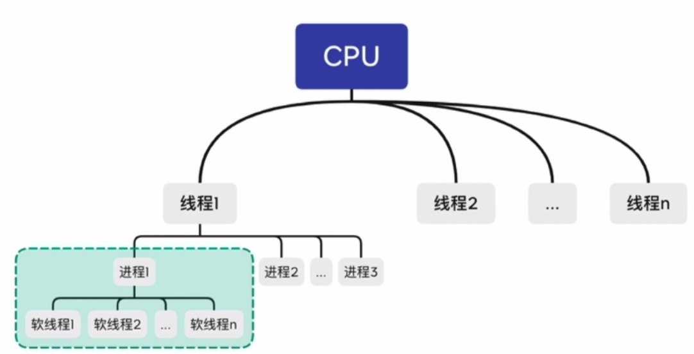

**线程（*thread*） ：** 它是 **操作系统运算调度** 的最小单位，它被包含在 [进程](/back_end/python/base/资源调度/进程) 之中，是进程中的实际运作单位

<!-- more -->

## 1. 区分概念

### 1. CPU 级别的线程：

**此线程非彼线程**：

我们买硬件时常说如：`CPU 酷睿i9-11900K 8核16线程`，这里的线程，**意味着是能够同时并行执行 16 个程序** 的意思

我们知道，程序的多道执行，是被操作系统封装代码为了进程，给了上下文，再分配内存，最后靠 PBC 来实现调度执行的，见[进程](/back_end/python/base/资源调度/进程#进程相关的基本概念)

> 因此，多道程序的执行，就是利用 CPU 多核、多线程，来同时并发、分片轮询执行进程的过程

### 2. 提高 CPU 的利用率：

有了 CPU 的多线程，多个程序可以分片并行执行了，但是此时利用率却不一定高

> 现在要同时从 16 个网站下载数据，假设 CPU 多核没有其他程序在运行或抢占资源，如果设计为开 16 个进程，分别每个进程占一个 CPU 线程去执行，程序如此设计，若进程遇见 IO 时，CPU 就一直 `wait` ，这对于计算资源简直是巨大的浪费

**软线程**：

因此，同时下载几百个数据，是软件层面去实现线程进行并发处理，这个线程就是软线程，也是编程的时候真正使用的线程概念

原理是把线程相关的资源数据，存起来，若出现闲置状态，则挂起当前资源，数据，让 CPU 去处理其他事情，

比如说 软线程 1 遇见阻塞，线程会让其挂起，切换到软线程 2 继续执行下载任务，所以可以最大程度合理的使用资源

容纳所有软线程的容器呢称为进程

若一个应用只有一个进程，那么无论开辟多少软线程，都属于同一个 CPU 线程

多进程编程：
此时会变成只有一个 CPU 线程在工作，其他 CPU 线程都在看，

为了避免只是使用同一个 CPU，会对应用创建多个进程

因为只有创建进程的时候，才会选择空闲的 CPU 线程，来给你分配软线程
已多进程应用的方式来实现对计算机资源的合理利用

多线程编程：
有一个 1G 的服务器，用来处理前端请求，为每一个请求都开辟一个软线程，
开辟软线程需要存储相关资源在内存里面，一个软线程大约需要 1M 内存
因此 1G 服务器理论上最大支持小于 1024 个软线程，若超过内存，服务器宕机，挂掉

因此此模式达咩，因此诞生了线程池的概念

假设最多开辟 5 个线程，当有请求来，就从线程池里面拿一个线程出来

若同时有 6 个请求来，最后一个请求会等着，服务端会返回一个状态忙，等前面的线程处理完之后，在给你开辟线程

可以合理利用服务器端的资源，但还是要让用户等一下，已这种方式处理 http 短连接还有优势，

但是处理实时聊天就不行了，因为实时的场景不能等着。或是有 5M 带宽，但你只开辟了 5 个连接，传输的数据少，对于网络资源来说是个巨大浪费

添内存的成本远远高于添加网络的成本，因此，诞生了异步编程

异步编程：

若有 ABC 三个网站，分别向网卡发送数据，此时底层会有一个线程来不断轮询监听是否有消息发送过来，若监听的 A 站发送了数据，
便往 A 站的处理程序去转发，若监听 B 站发送了数据，便往 B 站的处理程序去转发。因此底层只要做一个事件监听转发机制就可以了

没必要在处理的阶段开辟新线程，这就是一部思想的原型，为了解决合理利用 IO 资源的问题，因此称为异步 IO 编程

因此发展出了概念，纤程，一个软线程，可以开辟大量多个纤程，因此就不用担心 IO 资源被浪费了

> 程序执行时在多个函数中是**顺序串行**的，当一个函数**IO 阻塞**了，**CPU 歇菜**等待，此时程序员会开其他**线程**来让**CPU 不能休息**，达到`并发`效果

> 但启动线程过多，`上下文` 消耗大量资源，还要处理`锁` ，因此创造协程可以在一个线程内检测**IO 阻塞**并**切换阻塞代码**，或**并发 IO 部分的代码** 从而不让 CPU 歇着，也不用处理线程级别的锁
>
> 见下文 [协程]()
