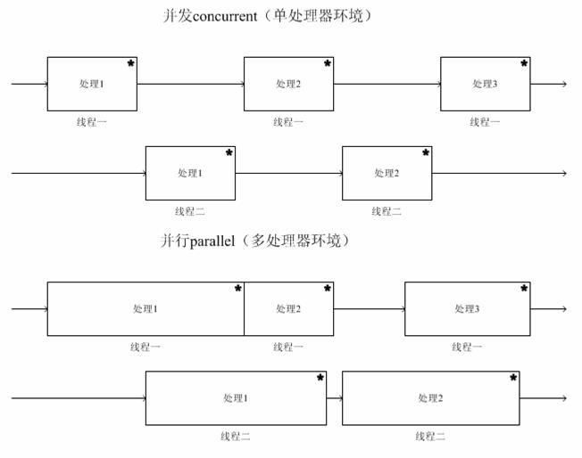

操作系统进程相关

<!-- more -->

首先讨论进程前先要弄清 **并行** 和 **并发** 两个概念

## 1. 并行与并发

### 1.1 并行

- 当计算资源有多个 CPU 时，或一个 CPU 有多核多线程时，每一个 CPU 的线程在同一时刻，都能执行一个进程
- 两个 CPU 线程同一时刻，可以 **同时执行** 两个不同的进程，且不会相互抢夺资源，这种方式即为并行
- **并行不一定并发**，也有同步&异步，并行也会阻塞，但异步往往可以提高效率

### 1.2 并发

- 若只用单 CPU、单核、单线程当做计算资源时，虽然 CPU 的线程在 **同一时刻** 时只能调度一个进程，但在 **一段时间** 内，却能执行不同的 进程 / 线程
- 并发通常使用 **切片轮询** 的执行方式，快速交替执行，来 **伪造** 出多个进程同时执行的效果
- 并行只在多处理器资源中存在，而并发在各种处理系统中存在

## 2. 什么是进程

**进程（*Process*）：** 狭义理解，是 **OS** 即操作系统资源分配的基本单位

### 2.1 进程相关的基本概念

1. **程序**：是指令的集合，不能单独运行，要装载到内存中(`分配内存`),并需要系统为它分配资源(`分配执行环境`)

2. **进程**：具有独立功能的程序，关于某个数据集合上的，一次执行程序的活动（动态概念）。是系统进行`资源管理分配`和`调度`的独立单位 **这种可被执行的程序，称为进程**

   进程 = <Badge type="info">程序</Badge> ＋ <Badge type="error">数据</Badge> ＋ <Badge type="queen">PCB</Badge>

   - <Badge type="info">程序</Badge>：描述了进程所要完成的功能（`静态描述文本`）

     > 理解为代码、做菜的菜谱、说明书...... 而进程就是执行代码的过程、做菜的过程、按照说明书操作的过程...

   - <Badge type="error">数据</Badge>：是程序在执行时所需要的数据和工作区，这两部分是进程存在的物质基础。

   - <Badge type="queen">PCB</Badge>：是最重要的，创建进程实际上是指创建进程实体中的`进程控制块`，而撤销进程也是指将这个进程实体中的进程控制块撤消掉。

3. **多道编程**：允许**多个程序同时加载到内存中**，在操作系统的调度下，可以实现并发地执行。这是这样的设计，大大提高了 CPU 的利用率。

   <Alert type="info">**进程**: 就是为了在 CPU 上实现 多道编程 而提出的，利用 CPU 的多核资源，使程序实现 `并发&并行` ，让每个用户感觉自己在独享 CPU</Alert>

## 3 进程的基本状态与转换

### 3.1 进程的三种基本状态

- **就绪态**

  > 程序已达到可以运行的状态，只等 CPU 分配资源就可以运行的状态

- **阻塞态**

  > 程序运行条件没有满足，需要等待条件满足才能执行的状态。如 `等待IO操作` 时候

- **运行态**

> 进程已抢占到 CPU，并且正在 CPU 上运行时的状态

### 3.2 三种基本状态的转换

进程的三种基本状态及其转换，如下:

``
