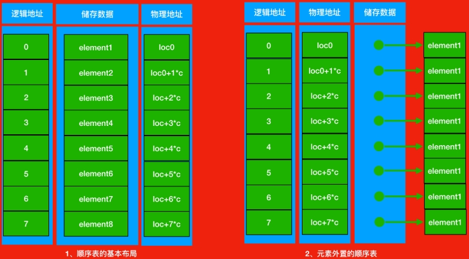
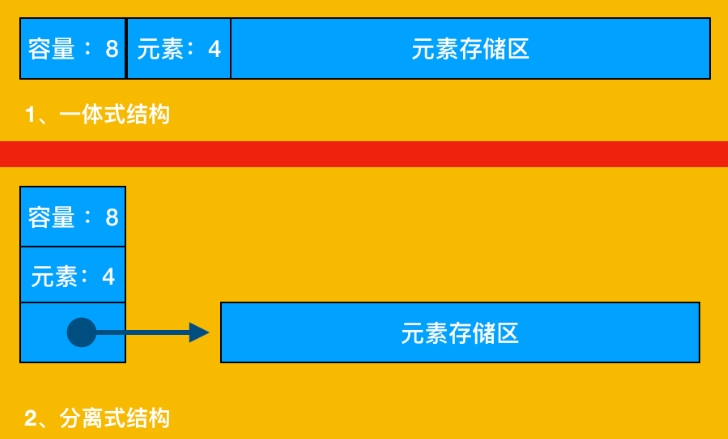

# 序列进阶

## 1. 序列协议

**Python** 中 [序列协议](https://docs.python.org/zh-cn/3/c-api/sequence.html)：指任何类，只要实现 `__len__` 和 `__getitem__` 两个方法，就能当序列使

> 在面向对象编程中，协议是非正式接口，只在文档中定义，代码中不定义

示例：

```python
import collections
from random import choice

Card = collections.namedtuple("Card", ["rank", "suit"])


class FrenchDeck:
    rank = [str(i) for i in range(2, 11)] + list("JQKA")

    suit = 'spades diamonds clubs hearts'.split()

    def __init__(self):
        self.card = [Card(rank=rank, suit=suit) for suit in self.suit for rank in self.rank]

    def __len__(self):
        return len(self.card)

    def __getitem__(self, item):
        return self.card[item]


suit_values = dict(spades=3, hearts=2, diamonds=1, clubs=0)


def spades_high(card):
    rank_value = FrenchDeck.rank.index(card.rank)
    return rank_value * len(suit_values) + suit_values[card.suit]


deck = FrenchDeck()

print(deck[:3])  # 切片取最顶层三张

print(deck[12::13])  # 抽出索引12的那张，每隔13张牌抽一张

print(choice(deck))  # 随机抽一张

for sorted_card in sorted(deck, key=spades_high):
    print(sorted_card)

### 输出结果：
# [Card(rank='2', suit='spades'), Card(rank='3', suit='spades'), Card(rank='4', suit='spades')]
# [Card(rank='A', suit='spades'), Card(rank='A', suit='diamonds'), Card(rank='A', suit='clubs'), Card(rank='A', suit='hearts')]
# Card(rank='10', suit='spades')

# Card(rank='2', suit='clubs')
# ...
# Card(rank='A', suit='spades')
```

- 如上，实现了 `__len__` 和 `__getitem__` 方法，该实例化对象可以像序列一样被操作
- `sorted(*args, **kwargs)` 把 `deck` 视为列表接收，自动迭代传入 `spades_high`，返回排序数值进行排序

## 2. 列表实现原理

#### **顺序表**

元素有序的存放再一块连续存储区里，即 **顺序表**，包含 **表头信息**，**存储区**，声明时就会开辟一块固定大小的内存



第 `i` 个元素的 **物理地址** 可通过：`Loc(e-i)` = 起始物理地址 `Loc(e-0)` + 逻辑地址 `i` * 存储单元大小（*开辟的固定大小内存\*） `c` 获取

- **表头信息：** 包含数组 **容量**，当前元素 **个数**，表示当前顺序表的整体情况

- **存储区：** 具体数据，我们知道内存的单位是 **字节**，一个 `Bytes` 占 `8bit`

##### **顺序表的实现方式**

分为如下两种形式



**64** 位机器下，假设 **Python** 一个普通的 **int**型 占 **28** 位，**7** 个字节，那么会有如下列表

```python
li = [200(0x23), 390(0x30), 78(0x37), ...]
```

- **一体式：** 因为当数组元素增加时，一体式将包括头部，一同搬迁到新的物理空间，数组指向的 **起始内存**（_起始位置_）**会改变**

  ```python
  # 之前 <起始位置> 指向 0x23
  li[0] -> 200(0x23)	-- [200(0x23), 390(0x30), 78(0x37), ...]

  # 增加后 <起始位置> 指向 0x15
  li[0] -> 0x15	-- [4(0x15), 3, 200(0x23), 390, ...]
  ```

- **分离式：** 只将内存空间 **指向不同的位置**，数组的起始位置未发生改变

  ```python
  # 之前 <起始位置> 指向 0x23
  li[0] -> 0x23	-- [200(0x23), 390(0x27), ...]

  # 增加后 <起始位置> 依然指向  0x23
  li[0] -> 0x23	-- [4(0x15), 3, (0x19->0x23), 200, 390, ...]
  ```

  **Python** 的 **list** 官方实现，采用的就是 **分离式动态顺序表**，故 `.append(ele)` 后 `id` 也不会发生改变

python 的 list 采用的就是分离式存储，当 append 之后 id 不会发生改变（也是为什么用 list.append(x) （或 list.insert(len(list),x)即尾部插入）比在指定位置插入元素效率高的原因）

<1>默认创建空表 - 系统分配一块能容纳 8 个元素的存储区;

<2>执行插入操作(insert | append) - 如果元素存储区满就换一块 4 倍大的存储区;

<3>表已经很大(目前的阀值为 50000) - 则改变策略，采用加一倍的方法
