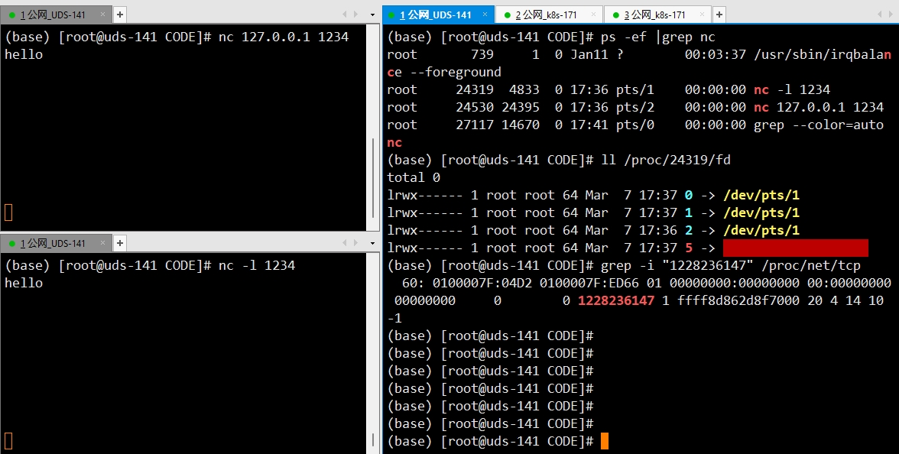

**Python socket** 编程

<!--more-->

请先参考：[网络基础](/unix/Linux/网络/网络基础.html) 熟悉 **7** 层模型和 **传输层** 协议栈下的协议

## 1. Socket 套接字

### 1.1 进程通信

通常，**本地进程** 间通信 **IPC** 有很多种方式，如：

- **消息传递：** **PIPE** 管道、**FIFO**、消息队列
- **同步：** 互斥量、条件变量、读写锁、文件和写记录锁、信号量
- **共享内存：** 匿名、具名
- **远程过程调用：** 各种 **RPC** 

像 **本地**，可以通过进程的 **PID** 来唯一标识一个进程，但网络中却是行不通的，那么 **网络中的进程之间** 是如何通信的呢？

**答：** 是利用 **IP 地址 + 协议 + 端口号** 的方式，作为 **唯一标识** ，它标识了网络中主机的一个应用程序（*进程* ），有了这个唯一标识就能充当网络进程，进行网络进程见 的通信了

而它已经实现好了，就是基于 **TCP/IP 协议簇** 网络应用采用的编程接口 **socket** （***套接字*** ）

### 1.2 Socket 概述

**socket**是在 **应用层** 和 **传输层**（***TCP/IP***）间的 **一组抽象层接口**，它把 **TCP/IP 层** 复杂的操作，**抽象为几个简单接口供应用层调用** （*封装了大量功能的对象* ），方便应用进程实现网络中的通信

**Unix/Linux** 哲学是 **一切皆文件**，那么既然是文件，就可以像文件的方式去 `open(); read(); write(); close();` 这样进行读写 **socket** 接口则是基于如上的实现

其在 **Linux** 中对应的文件系统叫 **Sockfs**，每创建一个 **socket** 就会在 **sockfs** 中创建一个特殊的文件，同时创建了 **sockfs** 文件系统的 **inode** ，该 **inode** 唯一标识了当前 **socket** 的通信,如图

 

这就表示是一个 **socket** 类型的 **fd**，`5 -> socket:[122...47]` 里面的数字即是 **inode** 号，唯一标识了当前的 **socket** 通信连接，进一步 `grep inode` 即可看到该 **TCP** 连接的所有信息（*16进制显示* ）  

先简单看一下 **C** 的接口

```c
socket(int domain, int type, int protocol)
```

在用户进程中， 该函数用于创建 **socket** 并返回与其关联的 **fd（*文件描述符* ）**，毫无疑问，此函数实际执行的是**系统调用**， 即 **sys_socketcall** 

```c
/** sys_socketcall (linux/syscalls.h)*/
asmlinkage long sys_socketcall(int call, unsigned long __user *args);

/** SYSCALL_DEFINE2 (net/socket.c)*/
SYSCALL_DEFINE2(socketcall, int, call, unsigned long __user *, args) {
    // ...
}
```

 **sys_socketcall** 几乎是用户进程 **socket** 所有操作函数的入口，它又实际调用了 **SYSCALL_DEFINE2** ...

因此用户态程序一旦调用了 **socket** 接口，就会通过系统调用陷入内核


​                
​    
        Server端：服务器端，在服务器上运行，先建立，否则客户端没法连
                1->2->3->4  ->6->7
    
        Client端：客户端，在客户主机上运行
                1->5  ->6->7
    
        Socket对象:   ----1
            socket.socket()#建立一个Socket对象，其中有两个参数 family type
                family：叫网络通信地址符，默认为AF_INET 进行网络通信（还有一个AF_INET6用于Ipv6下的网络参数）默认Ipv4 ，这是服务器之间的通信。
                    还有一个AF_UNIX,这是在一个UNIX系统上不同的进程通信会用到
                type:默认为SOCK_STREAM称为流式SOCKET（用于建立TCP连接）,还有一个是SOCK_DGRAM(Datagram：数据报)称为数据流 也就是数据式
                    SOCKET（用于建立UDP连接）
                因为有默认值，通常来说什么都不用写，就默认建立好了。若自己手动加也可以，直接更改参数即可。
                打印时发现，其实是一个socket对象，封装了fd：文件描述符、family：地址族、type：协议类型，proto = 0
    
        绑定IP地址和端口:  ----2
            address = (本机IP地址,端口号) 利用一个元组address来存储
                本机IP地址:现在填127.0.0.1 真实环境下则为服务器的真实IP
                端口号: 一般来说1024之前的端口都被操作系统所占用，通常用8000之后的端口，确保没有占用
            .bind(address): 传入tuple，用来绑定IP地址和端口
    
        监听端口，等待客户端的请求：  ----3
            .listen(backlog):这里指的服务端能容纳的人数，超过则客户端报错（简而言之，我在和第一个人通信时，可有多少个其他人等待）
                开始监听传入连接。backlog指定在拒绝连接之前，可以挂起的最大连接数量。
                backlog等于5，表示内核已经接到了连接请求，但服务器还没有调用accept进行处理的连接个数最大为5
                这个值不能无限大，因为要在内核中维护连接队列
    
        阻塞:(也就是对连接请求进行处理)   ----4
            .accpet()：#接收TCP 客户的连接（阻塞式）等待连接的到来。这里接收的就是建立连接后返回的内容，返回的是Socket对象（多了laddr和
                raddr）再和一个Client端的地址（IP，端口号）其返回值实质是Client端的socket对象（因此通常用两个变量conn、addr来接收）
                coon是什么:就是返回的Client端的Socket对象
    
        连接到指定计算机的端口：    ----5
            .connect(连接目的IP地址,目的端口号)
    
        通信：谁都可以收发，但记住必须要一收一发。一个收对应一个发，否则程序乱套    ----6
        收：
            .recv(value):指定一次最多可以接收多少字节，通常指定为1024。若消息（数据）没有接收到，recv也会进行阻塞，直到接收到后才停止。
        发：
            .send():当发送一个string时，（有可能）一次发送不过去，数量可能小于string的字节大小，此时利用sendall
            .sendall():实质上里面写了while True: 之后里面一直send()。将string中的数据发送到连接的套接字，但在返回之前会尝试发送所有数据。
                成功返回None，失败则抛出异常。内部通过递归调用send，将所有内容发送出去。
    
        在py3中无论是接、收，数据都必须是bytes类型。可用bytes(data,encoding="")来转化
        所以收到的数据也可以用str(data,encoding="")来转化
    
        conn：连接的实质是利用Server端的socket获取到Client端的socket并赋给conn，因此都是利用客户端的socket来进行通信的。（若利用服务端的
            socket如何实现多台计算机对服务端的访问，正因为是有多个客户端的socket才能对每个对应的客户端进行响应）服务端的socket通常只是绑定端口
            和IP地址用的。因此服务端的conn和客户端的socket是一个东西才能进行收发通信
    
        关闭:     ----7
            .close():这里关闭的是通道，Client中进行close操作就是告诉服务器关闭了，而服务器也可以通过conn.close()关闭客户端的通信。客户端关闭后
                依然会存在，可以print查看，也可以重新connect
    
        其他方法：
        .setblocking(bool)
            是否阻塞（默认True），如果设置False，那么accept和recv时一旦无数据，则报错。这里报错是反馈一个错误信息，然后程序继续执行
    
        .connect_ex(address)
            同上，只不过会有返回值，连接成功时返回 0 ，连接失败时候返回编码，例如：10061
    
        .recvfrom(bufsize[.flag])
            与recv()类似，但返回值是（data,address）。其中data是包含接收数据的字符串，address是发送数据的套接字地址。
    
        .sendto(string[,flag],address)
            将数据发送到套接字，address是形式为（ipaddr，port）的元组，指定远程地址。返回值是发送的字节数。该函数主要用于UDP协议。
    
        .settimeout(timeout)
            设置套接字操作的超时期，timeout是一个浮点数，单位是秒。值为None表示没有超时期。一般，超时期应该在刚创建套接字时设置，因为它们可能用于连接的操作（如 client 连接最多等待5s ）
    
        .getpeername()
            返回连接套接字的远程地址。返回值通常是元组（ipaddr,port）。
    
        .getsockname()
            返回套接字自己的地址。通常是一个元组(ipaddr,port)
    
        .fileno()
            套接字的文件描述符
    
        注意:
            1.数据不能发送空（空格不算）发空时接收一方的recv压根就是阻塞状态不动
            2.当强制关闭客户端时，Windows下服务器会报错，要利用try-except解决，而Linux下不会报错，默认客户端和正常退出一样，接收数据为空
            3.当server端数据用sendall发送完毕时，client端数据没有接收完整（下次接受时会延续上次接收数据这样的隐式错误）此时利用循环接收
                recv(1024)数据直到全部接收完毕,因此server端应该先发送待传数据的大小
            4.当一方同时有两个send发送数据时，可能造成粘包的现象，CPU执行过快，导致第二个send的数据跟着第一个send发送了过去。（之后client
                端可能出现强转失败等问题）因此当server端发送数据大小后，跟着recv阻塞。等待client端发一个消息。避免粘包问题的发生
            5.str (转)>>>> Bytes(16进制)  bytes(str,"utf8")#这里面转为那个编码都行，只是utf8是世界公认的，这里用gbk和utf8都是对str（Unicode）进行
                编码，编出的gbk或utf8都有自己对应的16进制（用utf8的规则变为十六进制）便于传输数据
    
        文件上传：
            见Post* 代码合理利用os和判断即可

---

socketserver：
虽说用 Python 编写简单的网络程序很方便，但复杂一点的网络程序还是用现成的框架比较好。这样就可以专心事务逻辑，而不是套接字的各种细节。
SocketServer 模块简化了编写网络服务程序的任务。同时 SocketServer 模块也是 Python 标准库中很多服务器框架的基础。

    socketserver模块可以简化网络服务器的编写，Python把网络服务抽象成两个主要的类，一个是Server类，用于处理连接相关的网络操作，另外一个则
    是RequestHandler类，用于处理数据相关的操作。并且提供两个MixIn 类，用于扩展 Server，实现多进程或多线程。
    
    Server类：
        它包含了种五种server类，BaseServer(不直接对外服务)。TCPServer使用TCP协议，UDPServer使用UDP协议，还有两个不常使用的，即UnixStreamServer
        和UnixDatagramServer,这两个类仅仅在unix环境下有用(AF_unix)。
    RequestHandler类
        所有requestHandler都继承BaseRequestHandler基类。
    
    让你的socketserver并发起来， 必须选择使用以下一个多并发的类
    
        class socketserver.ForkingTCPServer
    
        class socketserver.ForkingUDPServer
    
        class socketserver.ThreadingTCPServer
    
        class socketserver.ThreadingUDPServer
    
    1  tcp与udp的区别（三次握手后，建立连接，双向通道，一个收，一个发，tcp每次接到数据后都会有一个应答，有了应答，新的数据就会被覆盖掉）
    
    2  粘包
    　　
    说再多多没用，详情请见代码socketserver及源码~
