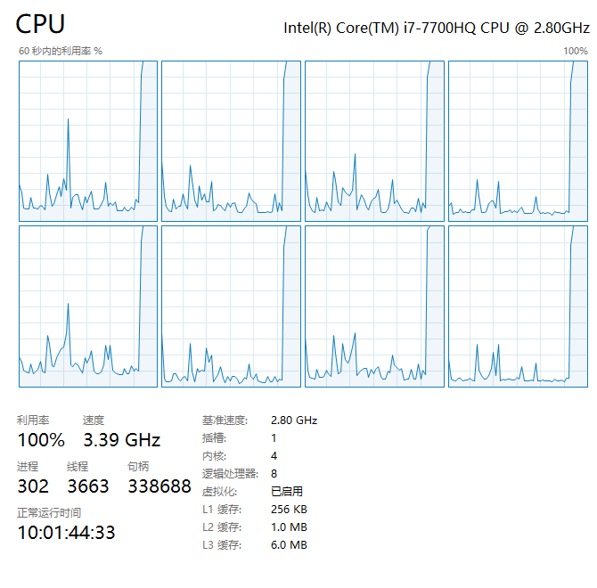

# 基于进程的并行

**multiprocessing**：是一个与 [threading](/back_end/python/base/资源调度/多线程编程#基于线程的并发) 模块类似的包，能提供本地和远程的 [并发](/back_end/python/base/资源调度/进程#12-并发) 操作（若多核那么就是 [并行](/back_end/python/base/资源调度/进程#11-并行) 操作）。它利用子进程来绕过了 [GIL 锁](/back_end/python/base/资源调度/多线程编程#基于线程的并发) ，适用于 Unix 和 Windows 系统的 **CPU**(计算)密集型操作（且通常不依赖上次计算结果）

## [multiprocessing](https://docs.python.org/zh-cn/3/library/multiprocessing.html?highlight=basemanager#module-multiprocessing)

### 主要功能介绍

- 主要用于创建 **子进程** 对象，`Process`类，然后 start 启动
- 进程通信，支持 `Queue`类 队列和 `Pipe` 类管道通信
- 共享数据，在并发编程时通常 **尽量避免共享状态**，若需要，可使用共享内存 `Value ` 或 `Array` 将数据存在共享内存的映射中。
- 进程同步，`Lock` 类实现进程的同步，避免同时抢占同一资源
- 进程池，`Pool` 类创建进程池
- 管理器，分布式计算，通过 `managers` 实现分布式的进程计算和通信
- 监听器，通过 `Listener` 监听管道来交互

<Alert type="error">使用 `multiprocessing` 时，应遵循一些指导原则和习惯[用法](https://docs.python.org/zh-cn/3/library/multiprocessing.html?highlight=basemanager#multiprocessing-programming)</Alert>

#### **部分摘要**：

- `multiprocessing` 有进程间通信 **IPC** (如：`Pipe` 和 `Queue`) 因此优先考虑使用它们，效率会高些

- 避免使用 `Lock/Event/Semaphore/Condition` 等同步方式，因为它们占据了 **非用户进程的** 资源，多进程应该避免共享资源

  > 多线程中，以上方式共享资源很容易，比如使用 **全局变量** 或 **传递参数**，但多进程由于每个进程都有自己独立的内存空间，以上方法并不合适

- 若必须共享，可通过 **共享内存** 和 `Manager` 方法来共享资源，但此时程序复杂度大大提高，且因同步而降低了计算效率

## 1 Process 类

**<Font type="dark">`Process`(group=None, target=None, name=None, args=(), kwargs={}, \*, daemon=None)</Font>**

> 进程对象表示在单独进程中运行的活动

- 参数：
  - `group: None`：应该始终为 None
  - `target`：是由 `run()` 方法调用的可调用对象
  - `args|kwargs`：子进程所需参数
  - `daemon`：将进程标志设置为 `True` 或是 `False` ，若为 None（默认值）则该标志将从创建的

`Process` 和 `threading.Thread` API 大致相同，也有两种创建方式：

1.主进程通过实例化 `Process` 对象来创建，并执行子进程 `foo()`

```python
import os
from multiprocessing import Process


def foo(num):
    print(f"pid: {os.getpid()} - num: {num}")


def main():
    process = Process(target=foo, args=(1,))
    process.start()
    process.join()
    print(f"module name: {__name__} - pid: {os.getpid()}")


if __name__ == '__main__':
    main()

### 输出结果
# pid: 34284 - num: 1
# module name: __main__ - pid: 26144
```

> **注**：为啥在 `Windows` 中必须要使用 `if __name__ == '__main__': ` ?
>
> 1. `if __name__ == '__main__':` 表示只有当前运行的 `.py`文件， 它的 `__name__` 才为`__main__` 若不是当前运行的 `.py` 文件则不为 `__main__` 这个字段
> 2. `Unix` 系统中有 `fork()` 这个系统调用来创建进程，若普通函数调用，调一次，返回一次。但 `fork()` 则是调用一次，返回两次，这是因为操作系统自动把当前进程（父进程）复制了一份（称为子进程），然后父子分别返回了一次
>
> 3. `Windows` 系统中没有 `fork()` ，所以暂且理解为 `python` 的多进程在`Windows`中相当与复制了一个一整套的上下文环境（`.py` 文件）为了避免复制的 `.py` 文件再次读到全局的 `Process` 来重复创建子进程（否则递归，无限创建直到发生 **RuntimeError** 异常）因此要通过 `if __name__ == '__main__':` 来区分到谁是主进程，只有主进程才能创建，这样才能有效起到保护作用

2.通过继承 `Process` 类来创建，并复写和执行 `run()` 方法

```python
import os
import time

from multiprocessing import Process


class NextProcess(Process):
    def __init__(self, pro_name):
        super(NextProcess, self).__init__()
        self.pro_name = pro_name

    def run(self):
        start_time = time.time()
        total = 0
        for num in range(100000000):
            total += num
        print(f"Process ID: {os.getpid()} - Name: {self.pro_name} - total: {total} - time: {time.time() - start_time}")


if __name__ == '__main__':
    start = time.time()
    next_list = []
    for i in range(8):
        p = NextProcess(i)
        next_list.append(p)
        p.start()

    # print("子进程正在执行中...")
    #
    # for next_pro in next_list:
    #     next_pro.join()

    print(f"Main Process Over Time: {time.time() - start}")

### 输出结果：
# Main Process Over Time: 0.041664838790893555
# Process ID: 30308 - Name: 5 - total: 4999999950000000 - time: 12.864246606826782
# Process ID: 36596 - Name: 1 - total: 4999999950000000 - time: 12.899959325790405
# Process ID: 29976 - Name: 6 - total: 4999999950000000 - time: 12.89797592163086
# Process ID: 32604 - Name: 2 - total: 4999999950000000 - time: 12.918310642242432
# Process ID: 27108 - Name: 4 - total: 4999999950000000 - time: 13.050273895263672
# Process ID: 36772 - Name: 7 - total: 4999999950000000 - time: 13.054712533950806
# Process ID: 35380 - Name: 0 - total: 4999999950000000 - time: 13.098359823226929
# Process ID: 9352 - Name: 3 - total: 4999999950000000 - time: 13.09786581993103

### 若去除.join()相关部分注释，让主进程等待子进程执行，则主进程结果如下：
# 子进程正在执行中...
# Process ID: 28740 - Name: 0 - total: 4999999950000000 - time: 12.804229497909546
# ...
# Process ID: 35624 - Name: 2 - total: 4999999950000000 - time: 13.160359382629395
# Main Process Over Time: 13.237204313278198
```

- 若不使用 `.join()` 方法，主进程则不会阻塞，此时多个子进程异步执行

- 若使用`.join()` 方法，需要注意避免一个 `for` 循环中每个子进程依次阻塞，应另起循环批量 `join` 即可实现主进程阻塞下的子进程并行

- 以 **CPU** **i7-7700HQ** `4核心8线程` 为例，开启 8 个子进程**并行**，做 1 亿数字相加来跑满核心，执行过程图示如下：

    

  > 此时**CPU 占用 100%**，**8 线程跑满接近极限 3.5GHz 睿频**，以上才是通过多进程，真正充分利用 CPU 的多核性能 **进行计算密集型任务**

### 上下文和启动方法：

根据不同的平台，`multiprocessing` 支持三种启动进程的方法：

- **spawn**：<Badge type="success">Windows 默认</Badge><Badge type="queen">Unix</Badge><Badge type="warning">macOS 默认</Badge>
  - 父进程启动一个全新的 `python` 解释器进程，子进程只继承那些运行进程对象的 `run()` 方法所必须的资源。
  - 来自父进程的非必须文件描述符黑句柄将不会被继承。使用此方法启动进程相比 `fork` 或 `forkserver` 要慢上许多
- **fork**：<Badge type="queen">Unix 默认</Badge>
  - 父进程使用 `os.fork()` 来产生 `Python` 解释器分叉。子进程初始化资源和继承于父进程，和父进程一样。
  - 注意：安全分叉多线程进程？
- **forkserver**: <Badge type="queen">Unix</Badge>
  - 该方式会启动服务器进程，每次要创建进程时，父进程都会连接到服务器去请求它来创建一个新进程
  - 这种方式貌似是 **OS 线程级别** 的进程，因此使用 `os.fork()` 是安全的，也没有不必要的资源被继承

> 注意：
>
> - `spawn` 在 `macOS` 上可能导致 `subprocess` 崩溃，因此不安全
> - `Unix`上 使用 `spawn` 或 `forkserver` 时，会多一个 **资源追踪** 进程，它追踪 **当前进程产生且不用** 的系统资源 (如：命名信号量以及 [`SharedMemory`](https://docs.python.org/zh-cn/3/library/multiprocessing.shared_memory.html#multiprocessing.shared_memory.SharedMemory) 对象)。所有进程退出后，资源追踪释放追踪对象。通常不会有这种对象，但一个子进程被某个信号杀死，就会 **内存泄露** 到下次重启
> - `spawn` 或 `forkserver` 有诸多限制，请参考文档

要选择启动方法，应该在 `if __name__ == '__main__'` 中调用 `set_start_method('method')` 来指定，仅指定一次

## 2. 多进程通讯：队列和管道

进程彼此间的资源是不共享的，上下文相互隔离。因此实现进程间通信，队列和管道这两种方式可以传递消息。

**class multiprocessing.Queue([maxsize])**

> 与标准库中的 [queue.Queue]() 模块类似，实现多生产者，多消费者队列。返回了 **一个管道** 、 **少量锁** 和 **信号量** 构成的共享队列的实例。
>
> 当一个进程将一个对象放进队列中时，一个写入线程会启动，并将对象从缓冲区写入管道中去

- 参数：
  - `maxsize：int = -1`：队列中允许的最大数量，若小于等于零则大小为无限
