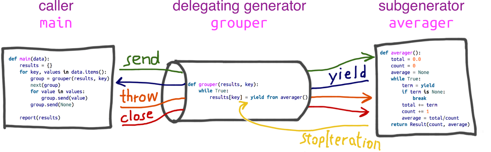

所有的生成器都是 [迭代器](/python/语言/进阶/迭代器.html)，因为生成器 **完全实现** 了迭代器接口

<!-- more -->

# 生成器

迭代器从集合中取元素，而生成器用于 **凭空** 生成元素

::: info 总之

含有 **yield** 关键字的 **函数** 就是 **生成器函数**

:::

### 1.1 生成器表达式

`genexpr = (推导式)` 的这种形式 **是生成器的语法糖**， 非元组，要区别于 `tuple(推导式)`

```python
s = (x * 2 for x in range(10))
print(s)

# <generator object <genexpr> at 0x0000013EF1BF84A0>
```

此时打印出了 **generator** 对象，它保存的与列表、集合（*这种存值的情况*）是不同的，存了程序的上下文状态，因此一样不占内存，还可以像迭代器一样，用 `__next__()` 来取值，但只能顺序取

```python
s.__next__()
# 0

next(s)	# Python3
# 2
```

#### 惰性计算

生成器表达式前的语句是惰性计算的，即只在真正执行时，才计算表达式，可以避免不必要的计算，提升性能

```python
l = [1,2,3]
lf1 = (i**2 for i in l)
l = [4,5,6]
lf2 = (i**2 for i in l)
print(list(lf1)) # 结果 >>> [1, 4, 9]
print(list(lf2)) # 结果 >>> [16, 25, 36]

l = 'ABC'
l_f1 = (l[i] for i in range(2))
l = 'DEF'
l_f2 = (l[i] for i in range(2))
print(list(l_f1))
print(list(l_f2))

# ['D', 'E']
# ['D', 'E']
```

生成器表达式中的 `for` 子句是立即计算的，此时 **有闭包环境**

- 闭包的 `i` 变量存的是 `l` 中的值即 `1`、`2` 的 **int 值** ，`i` 是不可变的
- 表达式 `i**2` 是惰性计算的，调用 `list()` 时计算 `lf1 = (i**2 for i in l)` 此时 `l` 重新赋值并不影响 `i` 的值，依然未发生改变

但生成器表达式的小括号开头的表达式是 **惰性计算** 的

- 闭包的 `i` 变量存的是 `[0, 1]` 中的值，表达式 `l[i]` 同上是惰性计算，但 `l[i]` 的 `l` 却是列表，是可变的，
- 在执行 `print(list(lf2))` 调用 `list()` 计算 `l_f2 = (l[i] for i in range(2))` 之前，`l` 被重新赋值，发生了改变

函数式编程要强调 **immutable**（*不可变* ） 


    
    【特点】：
        1.通过yield替换迭代器两个方法并有中断功能    ——  逐个传出数据
        2.数据需要的时候才存储到内存中               ——  逐个传入数据
    
    yield:(最重要的意义在于协程(跟线程进程并列的))  指的是yield断层(每次执行后的保存状态)
    如果一个函数包含yield 那么它就不是一个普通的函数而是一个generator（生成器） --见fibo 包含警告部分
        def foo():
            yield n #这样便创建了一个生成器
        foo()便是一个生成器对象 无论函数内部有什么 只是放在内存中 都不会执行。当然foo还是一个函数但foo()就是生成器了
    
        def foo():
            print("ok");yield 3;
            print("ok2");yield 1;#断点测试后无论yield后返回什么值 都能根据next()进行记录上一测程序进入时的位置
        for i in foo():
            print(i)此时会把返回值也一起打印出来 利用next()时返回值实质上返回给了next
    
    什么是可迭代对象:
        现象:
            从现象上看能进行for循环的便是可迭代对象
        本质:
            从本质上来说 内部有iter方法的才是可迭代对象.__iter__()


    什么叫同时:
        before, after =after, before + after 当碰到这种情况先想想什么叫同时?
        同时也可以说是并行吖
        什么叫并行？(一个CPU,单核)
            你想让before = after after = before + after 这两件事同时干 那么是谁在干活?-----CPU在干活
            但目前学的都是单线程 一个核在干活(因此它能不能达到同时)它达不到同时
            所以扯淡啊,怎么会有同时执行 单核哪里能同时(顶多分片轮询 但那那是同时啊)
        因此没学线程之前 肯定不会涉及到并发 (因此单核绝无同时的概念)
    
    那么如上是个什么操作?
        是这样,例如
        before = 1;after = 2
        before,after = after, before + after 实质上是先把它们进行计算出来 也就是
        before,after = 2, 3 然后再进行赋值 也就是说是先执行右边
    
    记得上次理解原理是的一些感悟吗?(不是标签哦 虽然文案上并没写--去好好回顾吧)
        得出的结论就是 表达式赋值都是先执行右边的(据上确定) 然后才会赋值给左边
        右边的表达式计算出的结果才会把结果的地址指针赋给左边的标签 因此如上
    
    生成器.send():(和next一样都可以进入函数体)
        当第一次send 前面没有next 只能发送空数据
        生成器.send(None) 等同于next(生成器)
        之后变可以传值 生成器.send(value)
        首先value 可以设置变量利用yield赋值来接收
    
        程序是如何执行的:
            先.send(None) 在count=yield 1处 先执行右边表达式 yield 1 直接返回(冻结记录) 然后.send("hhh")
            count从上次冻结地yield接收"hhh" 此时count 便也在内存中供后续调用。之后到yield时 .send("")接收到了yield
            的返回值
        为什么生成器第一次不能传值?
            假设用next(g)执行 走到yield 1此时程序冻结。下一次便可以利用send传值给yield 1 并用count接收
            第一次就传值的话生成器没有办法接收 因为之前并没有yield记录
        用途:
            有时程序是需要进行交互的 需要调用它的时候给一些参数 这是利用send传值便可以值导入
    
    可控制性:
        普通函数执行完便结束了,但生成器不一样 什么时候想调用就再次next一下 便可以计算下一个值

5.1 生成器伪并发:
论单核如何实现(伪物)并发:
比如同时听歌和看电影 CPU 轮询切换执行(事实上就是先看一段电影在执行一段音乐)只是由于 CPU 切换实在是太快了 0.0...0 几秒
因此感官上感觉是在"同时"执行 或是"并发"的。(人眼处理 == 当每秒帧数<24 当秒速超过 24 时 便意识为连续)
所以是(伪)有先后的
真正的并发还是要有多核多个线程同时执行
下面是一个官方更新的同时模拟多个用户在线看的伪并发(感觉是同时发生的其实不是)
import time

    def consumer(name):
        print("%s 准备看番啦" % name)
        while True:
            animate = yield
    
            print("新番第[%s]集出来啦, [%s]点进去看了看！" % (animate, name))
    
    def producer(name):
        c = consumer("小白")
        c2 = consumer("小明")#两个生成器对象
        c.__next__()#在这里返回之前打印了 小白准备看番啦
        c2.__next__()#在这里执行
        print("%s准备发布新番" % name)
        for i in range(1,13):
            time.sleep(1)
            print("%s更新了一集" % name)
            c.send(i)
            c2.send(i)
    
    producer("官方")
    
    这里c 和c2 实际上是拿到了两个生成器对象
    第一次执行__next__()时先是到了yield (用next 和 send(None)同)进行返回
    之后生产者进行生产(也就是打印等一系列操作)之后调用消费者.send()
    循环调用消费者 每次循环调用两个生成器对象
    第一次时消费者1 从yield开始 把传入的i对animate赋值 消费者2 也从上次中断的yield开始 同时赋值
    这里要另谈的是: c 和 c2 这两个生成器分别是在内存中生成两个地址段(它们是不同的)每次分别调用时 各自的生成器都会
    记录下自己上次返回的yield
    
    之所以和之前的看上去一次次next()不同,无非就是利用了循环加yield
    有点类似协作式的协程 而不是像抢占式的线程

### yield from

#### yield from 和 yield 的区别：

- 简化了 yield 的操作:

  ```python
  for i in titles:    等价于  yield from titles
      yield title
  ```

- 省去了很多异常的处理:

  > 例如`send(None)` 不会报错等

- 建立调用方和子生成器的通道

```python
def generator_1():
    total = 0
    while True:
        x = yield
        print('加', x)
        if not x:
            break
        total += x
    return total


def generator_2():  # 委托生成器
    while True:
        total = yield from generator_1()  # 子生成器
        print('加和总数是:', total)


def main():  # 调用方
    g1 = generator_1()
    g1.send(None)
    g1.send(2)
    g1.send(3)
    g1.send(None)


# g2 = generator_2()
# g2.send(None)
# g2.send(2)
# g2.send(3)
# g2.send(None)

main()
```

- 【子生成器】：yield from 后的 generator_1()生成器函数是子生成器
- 【委托生成器】：generator_2()是程序中的委托生成器，它负责委托子生成器完成具体任务。
- 【调用方】：main()是程序中的调用方，负责调用委托生成器。

  - 在上述代码中 main()每一次在调用 send(value)时，value 不是传递给了委托生成器 generator_2()，而是借助 yield from 传递给了子生成器 generator_1()中的 yield
  - 同理，子生成器中的数据也是通过 yield 直接发送到调用方 main()中。


