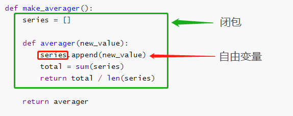

# 装饰器

## 1. 概述

**装饰器（_Decorators_）** 用于源码 ’标记‘ 函数，以某种方式增强函数的行为，必须先掌握 **以下三个条件**

- 作用域
- 高阶函数
- **闭包** 的方方面面

### 1.1 基础知识

装饰器是可调用对象，其参数是**另一个函数**（_被装饰的函数_）。装饰器可能会处理被装饰的函数，然后把它返回，或者将其替换成另一个函数或可调用对象

假如有名为 **decorate** 的装饰器

```python
@decirate
def target():
	print("running target()")
```

上述写法等价于

```python
def target():
	print("running target()")

target = decorate(target)
```

- 上述代码执行后得到的 `target` 不一定是原来的 `target` 函数，而是 `decorate(target)` 返回的函数

为了确认装饰器函数会被替换

```python
def deco(func)
	def inner():
        print("running inner()")
    return inner

@deco
def target()
	print("running target()")

target()
print(target)
# 故意不写打印，盲猜试试？
```

严格来说装饰器是 <span style="color: orange; font-weight: 800">语法糖</span>，可以像常规调函数传参形式调用，但尤其是 **元编程** 时，使用 `@装饰器` 的形式更方便

### 1.2 Python 何时执行装饰器

装饰器有两个特性

1. 能把被装饰的函数替换为其他函数
2. **装饰器在模块加载时立即执行**，这个如何理解？如下

```python
registry = []	# 保存的是被 @register 装饰的函数引用


def register(func):
    print(f"running register({func})")
    registry.append(func)
    return func


@register
def f1():
    print("running f1()")


@register
def f2():
    print("running f2()")


def f3():
    print("running f3()")


def main():
    print("running main()")
    print("registry -> ", registry)
    f1()
    f2()
    f3()


if __name__ == '__main__':
    main()

## 输出结果
# running register(<function f1 at 0x00000206AFD66E58>)
# running register(<function f2 at 0x00000206AFD66EE8>)
# running main()
# registry -> registry ->  [<function f1 at 0x000001B5924DB310>, <function f2 at 0x000001B592502EE0>]
# running f1()
# running f2()
# running f3()
```

- 会发现 `register()` 函数先执行并打印了 `running register`
- **Python** 加载模块时，会先将定义好的函数占块地址加载到内存，然后解释器顺序执行
- 看似直接执行了装饰器，但不是，而是在调用 `@register` 时，相当于执行了 `func= register(func)` ，解释器顺便执行了 `register()` 而已
- 这样直接接收函数，并 **原样返回** 的装饰器，并非没用。很多 **Python Web** 框架使用这种装饰器，把函数添加到某种中央注册处
  - 如：把 **URL** 模式映射到生成 **HTTP** 响应的函数上的注册处

### 1.3 函数的作用域

说闭包前先看一个 [作用域](/back_end/python/base/基本概念/函数#4-函数的作用域) 的栗子

```python
def f():
    c = 6

f()
print(c)
```

这里能拿到 `c` 的值么? 当然不能，函数在 `f()` 调用后便在内存中销毁了，因此全局中拿不到局部的变量 `c`

```python
b = 6

def f3(a):
    # global b
    print(a)
    print(b)
    b = 9
```

此时会报错，为啥 `print(b)` 时显示 `b` 尚未赋值报错？

- 由于 **字节码** 中，**Python** 定义了 **b 是局部作用域，而并非全局作用域**

- 解决办法可以再 `print(b)` 前添加 `global b` 指定字节码解析时 `b` 为全局作用域

  > 这比 **JavaScript** 优秀，因为 **JavaScript** 内部未定义变量 `b` 就会自动全局 `var b` ，所以常会莫名其妙的拿到个全局作用域的变量，就很离谱

关于 **字节码**，可使用反汇编 **dis**

```python
from dis import dis

dis(f3)
```

运行字节码的 **Cpython VM** 是栈机器，**LOAD** 和 **POP** 操作引用的是栈

### 1.4 闭包

通常会将闭包和匿名函数弄混，因为在 **函数里写函数不常见**，通常使用匿名函数才会这么做，且只有涉及到嵌套函数时才有闭包问题，很多人是同时知道这两个概念的

闭包，即 **延伸了作用域** 的函数，函数式实现一个计算平均值的 **高阶函数**

```python
def make_averager():
    series = []

    def averager(new_value):
        series.append(new_value)
        total = sum(series)
        return total / len(series)

    return averager


if __name__ == '__main__':
    avg = make_averager()
    print(avg(10))
    print(avg(11))
    print(avg(12))

# 输出结果
10.0
10.5
11.0
```

会发现每次调用 `avg()` 函数，都会将上一次调用的值存储起来，如何做到的？

- 首先 `series` 是 `make_averager()` 的局部变量，按理说 `make_averager()` 返回后**局部变量及作用域应该被销毁才对**，但其实不然

  - 此时 `series` 是个 **自由变量**（_free variable_）：指在本地作用域中绑定的变量
  - 此时不会触发垃圾回收

  

- 在函数内部，**对外部作用域**（_但不是全局作用域_）的变量，进行 **引用 ** 的，就是闭包

审查 `make_averager()` 创建的函数， 使用 `__code__` （_编译后的函数定义体_）

```python
print(avg.__code__.co_varnames)
print(avg.__code__.co_freevars)

# ('new_value', 'total')
# ('series',)
```

`series` 的绑定，在返回的 `avg` 函数的 `__closure__` 属性中，各元素对应于 `avg.__code__.co_freevars` 中的一个名称，这些元素是 **cell** 对象，有 `cell_contents` 属性保存真正的值

```python
print(avg.__closure__)
# (<cell at 0x000001B3A5EBBFD0: list object at 0x000001B3A5B84D80>,)

print(avg.__closure__[0].cell_contents)
# [10, 11, 12]
```

综上，闭包是种函数，会保留定义函数时，存在的自由变量的绑定，虽然作用域不可用，但 **绑定依然可用**

> **注意：** 大量使用闭包是很有风险的操作，尤其定义的还是 **可变类型的局部变量**，这常导致 **内存泄露！**

### 1.5 结合 nonlocal 声明

上文已经造成了内存泄露，此时为了优化，更好思路如下

```python
def make_averager():
    count = 0
    total = 0

    def averager(new_value):
        count += 1
        total += new_value
        return total / count

    return averager

## 输出结果
# count += 1
# UnboundLocalError: local variable 'count' referenced before assignment
```

- 此时发现，解释器报错，局部变量 `count` 未定义前引用
- 这是由于 `count += 1` 本质是 `count = count + 1` 解释器先执行右边，再未声明 `count` 前就进行了 `+1` 操作
- 这时会有疑问，为啥上文 `series` 不会报错 **?**
  - 是因为 `count` 是不可变对象，不能进行增删改操作，只可读
  - `series` 也没有进行赋值前引用操作，而是调用了 `.append()` 进行了增加操作，此时不会影响变量本身的地址

故可以配合 [nonlocal](/back_end/python/base/基本概念/函数#42-全局变量和局部变量) 来改写，使其不用列表形式，保存所有的历史值

```python
def make_averager():
    count = 0
    total = 0

    def averager(new_value):
        nonlocal count, total
        count += 1
        total += new_value
        return total / count

    return averager


if __name__ == '__main__':
    avg = make_averager()
    print(avg(10))
    print(avg(11))
    print(avg(12))

## 输出结果
10.0
10.5
11.0
```

此时 **内存同样泄露**，但泄露的起码比 **list** （_列表_）少太多，稍微变得 **相对可控**

## 2. 实现装饰器

### 2.1 理念

**装饰器：**区别于《设计模式》中的装饰器模式，但其描述的：“动态的给一个对象添加一些额外的职责” 的理念是一致的，但在实现层面，与装饰器模式，毫无关系。它符合 **开放封闭** 及 **AOP**

- **开放封闭原则：** 不修改内部函数的情况下，增加新功能，类似补丁一样

- **AOP（_面向切面式编程_）：**即横向插入一段逻辑，可以减少大量重复代码
  - 常用场景：插入日志、性能测试、事务处理等

### 2.2 简单装饰器

实现一个简单装饰器：被装饰的函数可以每次调用后，将花费的 **时间**、**传参**、**结果** 都打印出来

```python
import time


def clock(func):
    def clocked(*args):
        start_time = time.perf_counter()
        ret = func(*args)	# 闭包
        end_time = time.perf_counter() - start_time
        print(f"[{end_time:.8f}μs], {func.__name__}({args}) -> {ret}")
        return ret

    return clocked


@clock
def snooze(seconds):
    time.sleep(seconds)


@clock
def factorial(n):
    return 1 if n < 2 else n * factorial(n - 1)


if __name__ == '__main__':
    snooze(.123)
    factorial(6)
    print(factorial.__name__)

## 输出结果
[0.11668170μs], snooze((0.123,)) -> None
[0.00000230μs], factorial((1,)) -> 1
[0.00008320μs], factorial((2,)) -> 2
[0.00013500μs], factorial((3,)) -> 6
[0.00018600μs], factorial((4,)) -> 24
[0.00022760μs], factorial((5,)) -> 120
[0.00028440μs], factorial((6,)) -> 720
clocked
```

- 查看`__name__` 属性，会发现输出 `clocked`，这是由于被装饰后 `factorial` 保存了 `clocked` 函数的引用

- 装饰器的典型行为就是 **把被装饰的函数替换成新函数**，且二者接收到了相同的参数，再做些额外操作，并返回 加工|未加工 的值

如上存在许多缺点，故需要改写

1.  属性 `__name__` 不是想要的值
2.  不支持关键字参数
3.  其实还遮盖了 `__doc__` 属性

```python
import time
import functools


def clock(func):
    @functools.wraps(func)
    def clocked(*args, **kwargs):
        start_time = time.perf_counter()
        ret = func(*args, **kwargs)
        end_time = time.perf_counter() - start_time
        arg_lst = []
        if args:
            arg_lst.append(",".join(repr(arg) for arg in args))
        if kwargs:
            pairs = [f"{k}={v}" for k, v in sorted(kwargs.items())]
            arg_lst.append(", ".join(pairs))
        arg_str = ", ".join(arg_lst)
        print(f"[{end_time:.8f}μs], {func.__name__}({arg_str}) -> {ret}")
        return ret

    return clocked
```

- `@functools.wraps(func)` 详见 [标准库](/back_end/python/package/标准库进阶/函数式编程#1-functools)，用来还原被装饰器覆盖的 `__name__` 和 `__doc__` 等属性

### 2.3 标准库中的装饰器

**Python** 内置了三个用于装饰器方法的函数，`property`、`classmethod` 和 `staticmethod`， 都是和面向对象相关，其他还有 `lru_cache` 做轻量缓存加速、`singledispatch` 做单分派泛函数等

### 2.4 叠放装饰器

装饰器可以叠放，如下

```python
@d1
@d2
def f():
	pass
```

- 这种将 `@d1` 和 `@d2` 两个装饰器顺序叠放到函数 `f()` 上，等同于如下

```python
def f():
	pass

f = d1(d2(f))
```

### 2.5 参数化装饰器

装饰器可以接收被装饰的函数和他的参数，那么如何让装饰器自身来接收额外的参数呢？答案是创建一个 **装饰器工厂函数**，这个工厂的目的是，一调用这个工厂就能 **返回** 一个真正的 **装饰器**

```python
registry = set()


def register(active=True):
    def decorate(func):
        print(f"running register {active} -> decorate({func})")
        if active:
            registry.add(func)
        else:
            registry.discard(func)
        return func

    return decorate


@register(False)
def f1():
    print("running f1()")


@register()
def f2():
    print("running f2()")


def f3():
    print("running f3()")


if __name__ == '__main__':
    print("running main()")
    print(f"registry -> {registry}")
```

#### 工作案例 - rpc 异步装饰器

1.server 端 defer 装饰器（defer 自带异步，非 async-await 形式）
【环境】

将 Twised 的 server 端 线程异步化后的方法添加装饰器，避免每次手写 threads.deferToThread 以及手写偏函数封装

    import functools

    from twisted.internet import threads
    from twisted.web import xmlrpc

    from app.agent.components.service.license import LicenseService

    license_service = LicenseService()
    # 这个是实例化后的具体服务，Twisted的XMLRPC类 都是根据 实例化的LicenseService() 来找方法的

    def defer_to_thread(func):
        def inner(*args, **kwargs):
            cb = functools.partial(func(*args, **kwargs), args, kwargs)  # 此处错误应该在传入参数 self
            return threads.deferToThread(cb)

        return inner

    # 以上为threads.deferToThread 装饰器， 避免了后续每次手写

    class LicenseResource(xmlrpc.XMLRPC):

        def xmlrpc_start(self):     # 未使用装饰器的函数
            return threads.deferToThread(license_service.start)


        @defer_to_thread
        def xmlrpc_get_license_info(self, *args, **kwargs):     # 使用defer装饰器的函数
            return license_service.get_license_info

@defer_to_thread 是装饰在 xmlrpc_get_license_info 上的，但改写都是在其执行的返回值 license_service.get_license_info 上的

【因此】：

- func(*args, \*\*kwargs) : 错误，正确应该为 func(self, *args, \*\*kwargs)， 见下

- inner(*args, \*\*kwargs): 若函数是带有参数的，因此用 inner(*args, \*\*kwargs) 来接收参数

- functools.partial: 偏函数，为了分步传参，方便审查 传入第一个参数为 func 因此需要 执行 func(\*args, \*\*kwargs)返回

- return threads.deferToThread(cb): defer 异步化，并返回结果给 RPC 的 client

- inner(\*args, \*\*kwargs): 原则上带参数可以装饰一切函数，带参的 func 传入后会指向 inner

【二次优化】

    from functools import wraps
    from twisted.internet import threads

    def defer_to_thread(*params, **kwparams):
        def wapper(func):
            @wraps(func)
            def decorator(self, *args, **kwargs):
                cb = func(self, *args, **kwargs)

                def inner(*fargs, **fkeywords):
                    newkeywords = kwargs.copy()
                    newkeywords.update(fkeywords)
                    newfunc = cb(*(args + fargs), **newkeywords)
                    return newfunc

                return threads.deferToThread(inner, *params, **kwparams)

            return decorator

        return wapper

- 装饰器带参： 想装饰器带参数，则需要装饰器外部再封装一层函数，用来接收装饰器的参数给内部函数使用

- @wraps(func)： 添加了@wraps(func)装饰器，来消除函数名属性被装饰后改变的副作用，保留原有函数的名称和 docstring

- func(self, \*args, \*\*kwargs)：上面错误版改正，是执行了传入的 xmlrpc_get_license_info 为了返回 license_service.get_license_info

- inner：去掉 partial，进而改为内部 inner 再次封装，inner 用于接收 func 的新参数。即 cb 获取到的 license_service.get_license_info，之前
  是通过 partial 来接收参数，但看着不够好看规范，用 inner 这个内部函数来 对 cb（即 license_service.get_license_info）传入装饰器的新参数
  当然也可以仅仅返回 cb(\*args, \*\*kwargs) 来接收 license_service.get_license_info 执行并当做参数传入 get_license_info 的 rpc

- threads.deferToThread(inner, \*params, \*\*kwparams)：这里传入的 inner 即是回调了 params、kwparams 为装饰器传入的参数

#####2. client 端 async 异步装饰器

    import asyncio
    from functools import wraps
    from xmlrpc import client


    class RpcProxy:
        def __init__(self, host: str = "localhost", port: int = 9000):
            self.proxy = client.ServerProxy(f"http://{host}:{port}")


    def async_executor(func):
        @wraps(func)
        async def inner(self, *args):
            loop = asyncio.get_event_loop()
            method = func(self, *args) # 若get_license_info加了async 前缀，此处要改为 await func(self, *args)
            return await loop.run_in_executor(None, method, *args)

        return inner

    class LicenseRpc(RpcProxy):
        def __init__(self, host: str = "localhost", port: int = 9000):
            super(LicenseRpc, self).__init__(host, port)

        @async_executor
        def get_license_info(self, *args):  # 若此处加上async 上文method
            return self.proxy.LICENSE.get_license_info

- RpcProxy：该类为 rpc 的客户端初始化，和装饰器无关（此处 RPC 优化见抽象工厂）

- LicenseRpc：改类为 rpc 客户端子类，包含了 rpc 客户端的具体方法，但需要将其每次执行异步化，即将同步的 urllib 这个同步库的请求异步化，因此
  需要装饰器来简化代码，遵循开放封闭原则

- run_in_executor：将同步方法异步化的异步执行器，本案例即对此方法进行了封装

- 注意配合异步化，装饰器装饰的内部要使用 async - await

- method = func(self, \*args)：其实是调用了传入的 get_license_info 并返回 self.proxy.LICENSE.get_license_info 这个同步请求作为回调

【注意】：

- 被装饰函数 get_license_info 绝不能为协程（即加前缀 async）否则会报错： TypeError: 'coroutine' object is not callable。这是由于
  此时的 method 为 <coroutine object LicenseRpc.get_license_info at 0x000000000564E3C8> 协程对象，不能当做 executor 的回调函数，
  func(self, *args) 实际上执行的是 async def get_license_info(self, *args): 只要加了 async 前缀，它就会返回一个协程，除非将
  method = func(self, *args) 改为 method = await func(self, *args) 才能正常拿到 self.proxy.LICENSE.get_license_info，但其实
  没必要，直接不用协程获取返回值即可。

- 对于 def get_license_info(self, *args) 中不用的 *args ，目前未找到合适的处理办法，这是为了用装饰器时，可以方便传或不传任意数量
  的参数。

###三、类装饰器
和普通装饰器的区别就是这个是类，因此也有类相关的特性

    class ServiceName:
        def __init__(self, *aliases):       #这里初始化时传参的，因此类装饰器在初始化时传参
            self.aliases = set(aliases)

        def __call__(self, f):              #当 对象+ () 时触发，类装饰器意味着只要用了语法糖@就已经触发了
            f._aliases = self.aliases
            f.name = "haha"
            return f

        def show(self):
            print(self.name)

    @ServiceName("传参")
    def foo():
        print("被装饰的函数")

此时@ServiceName 等价：

    foo = ServiceName("参数")(foo)    # 此时就即执行了初始化操作，也完成了__call__方法的执行
                                      # 并把要装饰的函数传入其中，在call方法里添加一系列操作

####工作案例：
def service_handler(aliased_class):
original_methods = aliased_class.**dict**.copy()

        for name, method in original_methods.items():
            if hasattr(method, '_aliases'):

                for alias in method._aliases - set(original_methods):
                    setattr(aliased_class, alias, method)

        return aliased_class

    @service_handler
    def foo():
        print("foo")

    此时会发现，它和之前的装饰器不怎么像啊。这不是装饰器，则是运用了语法糖@。凡是加上@的都等同于
    foo = service_handler(foo)这种形式。
    -- 不管你执没执行foo()，凡是加上这个语法糖的方法在解释器初始化时都会先执行一遍语法糖代表的方法或是类。

    但为什么之前的装饰器好像没有这种效果呢？其实是有的，只是没写出来，若把之前的装饰器改为如下

    def show_time(func):
        print("装饰器外部执行")
        def inner():
            func()
            print("装饰器内部执行")
        return inner

    @show_time
    def foo():
        print("foo")

    此时，会发现刚初始化时就会执行装饰器内部的print，这就是为啥@语法糖等同于foo = show_time(foo)了
    通常，装饰器的目的是为了不改变函数名的情况下添加新的功能，故通常不会在装饰器外部进行操作。

    注：活用两个装饰语法糖@目的就是为了把每个服务在注册时就进行重命名，为了规范而牺牲部分可读性，理解这个感觉就是在
        弯路上越走越远。但是，我又想不出更好的方法来代替。

修正误解：
带有@符号的 不一定是装饰器，@只是装饰器简化书写而使用的一种语法糖
如： @wrapper
def foo(): pass 仅仅等同于 foo = wrapper(foo) 的形式 （为了简化书写）

作业 login:
不写就不能发现问题啊 见代码啊见代码！！！
发现如下问题---global 问题 注意为什么要写在 inner 的 if login_status is False 之上
是因为 被装饰函数实质上执行的是 inner 全局变量相当于就是在 inner 之外 在函数内部最好第一句就声明要修改的全局变量
才不会和之后的语句引起冲突 name 'login_status' is used prior to global declaration(在全局声明之前使用名称"login_status")
或者什么都不加直接引用报错 local variable 'login_status' referenced before assignment(赋值之前引用局部变量"login_status")
