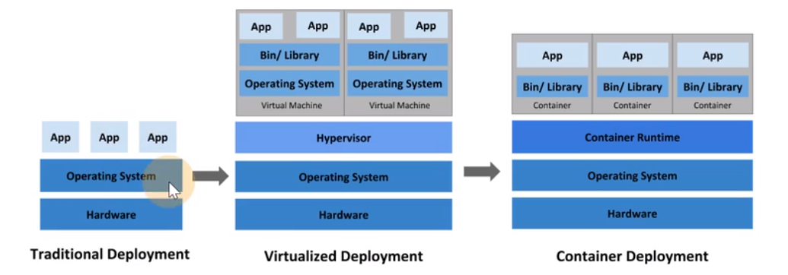
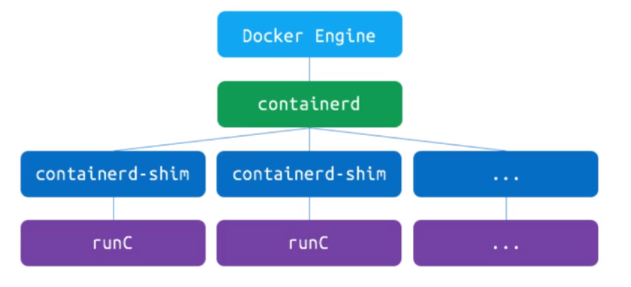
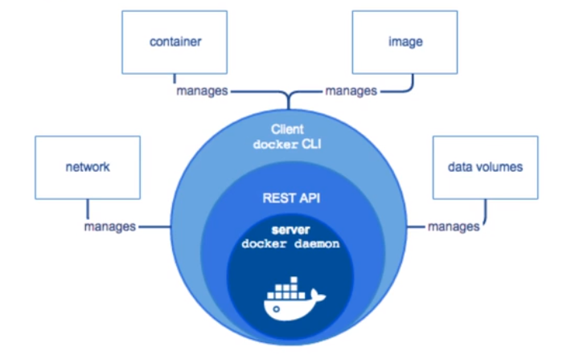
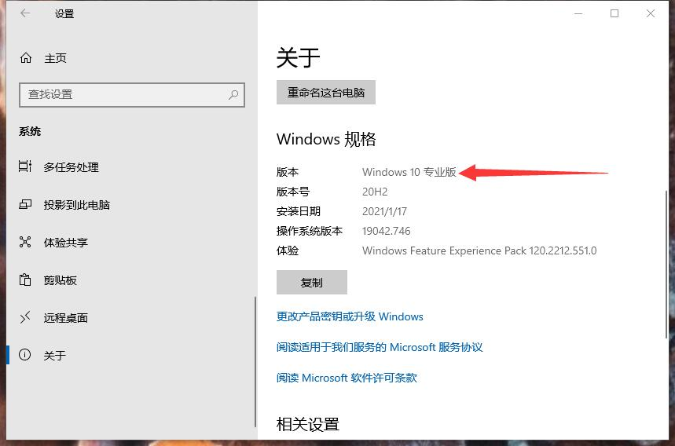
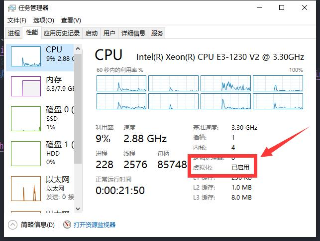
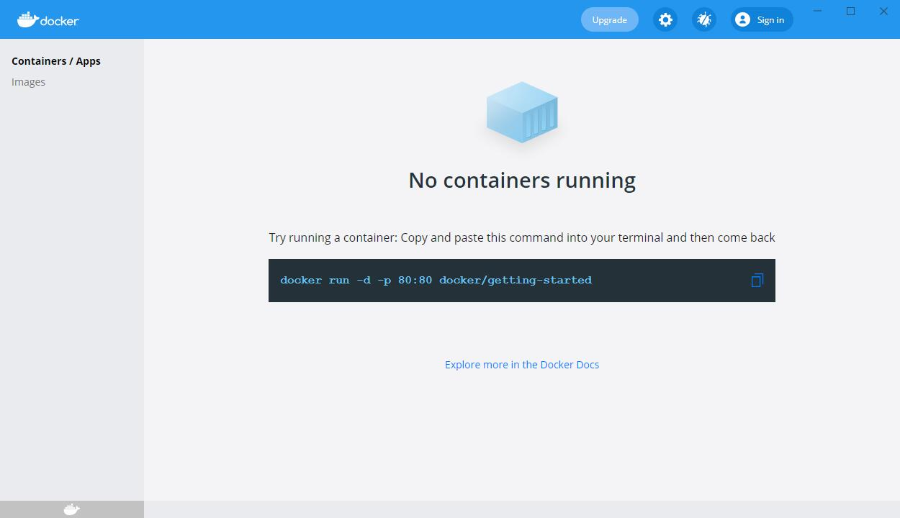
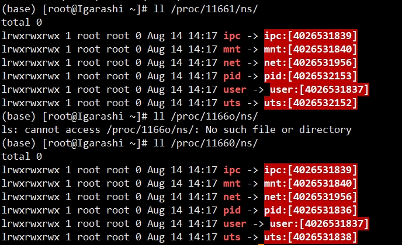
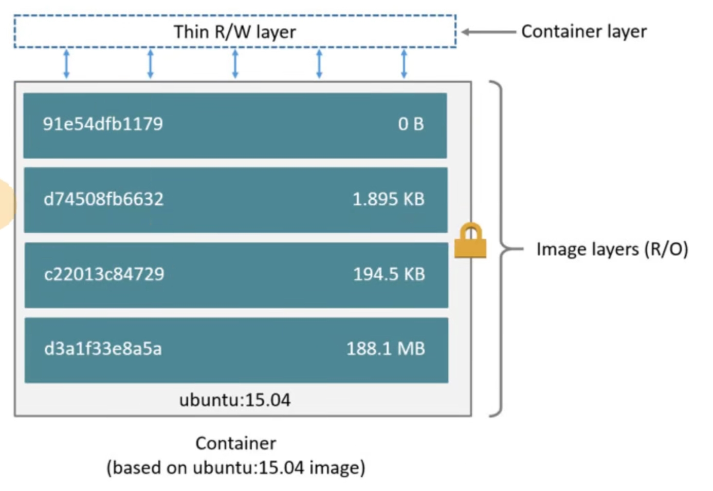
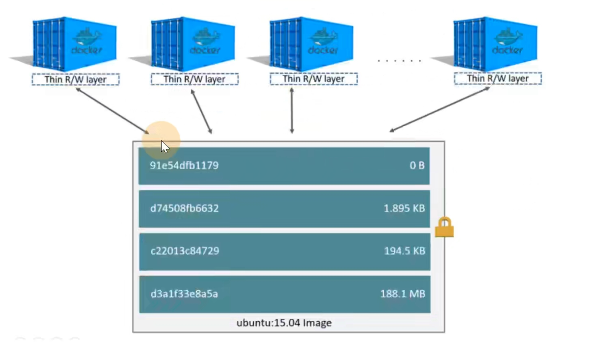
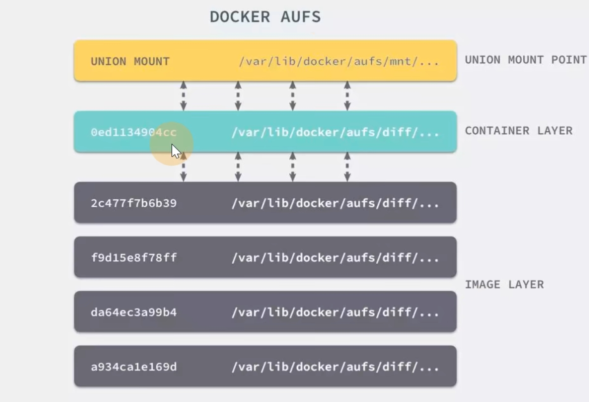

**Docker** 的基础概念和安装说明

<!-- more -->

::: info Docker

让开发者打包他的应用、及依赖包，到一个轻量级、可移植的容器中，可发布到任何流行的 **Linux** 机器上，也能实现虚拟化，**完全使用沙箱机制**（*隔离*），相互之间不会有任何接口，且 **开销极低**
:::

## 1. Docker概述

旧金山 **dotCloud** 基于 **Linux** 容器技术 **LXC** 封装的内部工具，**13** 年诞生，**15** 年逐步投入生产，后面开源出来改个名字叫 **Docker** ，目的为了节省资源（*硬件、虚拟机*）

- [Docker 官网](https://www.docker.com/) 
- [Docker 官方文档](https://docs.docker.com/) 
- [Docker Hub](https://hub.docker.com/) 

### 1.1 教程

<iframe src="//player.bilibili.com/player.html?aid=838132893&bvid=BV1Du411S7Rw&cid=191591478&page=2" scrolling="no" border="0" frameborder="no" framespacing="0" allowfullscreen="true" style="width: 100%; height: 380px;"> </iframe>

- [Docker 教程 | 菜鸟教程](https://www.runoob.com/docker/docker-tutorial.html)
  - [Docker 安装 Redis | 菜鸟教程](https://www.runoob.com/docker/docker-install-redis.html)
- [Docker 教程 | w3cschool](https://www.w3cschool.cn/docker/)
- [Docker 从入门到实践 | w3cschool](https://www.w3cschool.cn/reqsgr/) 

### 1.2 Linux 容器

**Docker** 在 **1.8** 版本之前，全部是封装 **Linux** 的 [LXC](https://linuxcontainers.org/lxc/introduction/)，一个 **用户态** 使用容器化特性的 **接口**（*调用 Kernel*），但不具备跨平台能力

随后为了实现跨平台，抽出了 [libcontainer](https://linuxcontainers.org/lxc/introduction/) 项目，把 **namespace**、**cgroup** 的操作封装在该项目里，支持不同的平台类型

### 1.3 容器与虚拟机对比



##### **虚拟机**

如 **VMware** 、**PVE**、**ESXi**、**Workstation** 等，多台虚拟机都虚拟出了一套 **不同** 的 **虚拟机器硬件资源**、**Kernel**（*内核* ）和 **Lib 库**，然后在上层运行各自的 **APP**，像是物理机的系统中的子系统一样，从物理虚拟层面进行隔离，占用资源极高

- **Hypervisor：** 一种运行在基础物理服务器和操作系统之间的中间软件层，可允许多个操作系统和应用共享硬件
- 共享硬件资源，但每起一个虚拟机都需要额外的安装操作系统，从而带来重复的操作系统开销

##### **容器** 

则是多个容器 **共同使用** 一套物理机 **硬件资源**、**Kernel** 然后从运行所需的 **Lib 库** 层面 进行隔离，因此极大的压榨了物理资源，使物理机物尽其用

- **Container Runtime：** 通过 **Linux** 内核虚拟化能力管理多个容器，多个容器共享一套操作系统内核，因此 **摘掉了内核占用的空间** 及运行所需要的耗时，使得容器极其轻量与快速

::: note Docker 解决如下需求

- 环境、依赖不一致
- 物理硬件资源不够
- 快速交付介质，直接交付打包后的 **Docker** 镜像，各平台部署
- 跨平台，方便装任何系统，屏蔽平台间差异
- 物理资源相互隔离（*也可以做到内存、**CPU** 等资源分配与隔离，但安全性不如虚拟机*）
- **Docker** 启动多容器生命周期管理

:::

### 1.4 Docker 架构

**2015** 年 **6** 月，**Docker** 成立 [OCI](https://opencontainers.org/) （***Open Container Initiative** 开放容器计划* ）组织，建立通用标准并由该组织维护 **libcontainer** 项目，后续由从仅包含 **Kernel** 的库加入了 **CLI** 工具且改名为 [runC](https://github.com/opencontainers/runc) （*运行容器的轻量级工具* ）

**Docker** 随后做出了架构调整



将容器运行时相关的程序从 **docker daemon** 剥离出来，形成了 **containerd**

- **runC：** 是一个 **Linux CLI**（*命令行* ）工具， **runC + containerd-shim** 通过 **gRPC** 去调用 **containerd** 来创建和运行容器
- **containerd：** 一个 **守护程序**，**它管理容器的生命周期**，屏蔽了 **docker deamon** 底层细节（*同时解耦升级后的不兼容* ），抽象出了一套 **gRPC** 接口，提供了在节点上执行容器和管理镜像的最小功能集



因此，**Docker** 演变为了 **CS** 架构的产品

- **Client：** 由 `docker CLI` 通过 `REST API` 调用 **Server** 端服务
- **Server：** 为 `docker daemon` 守护进程

---

## 2. 安装

推荐参考官方文档：[安装 Docker 引擎（英文）](https://docs.docker.com/engine/install/)

::: tabs

@tab CentOS

### 2.1 CentOS

#### **卸载**

- 执行如下命令，卸载软件包

  ```shell
  yum remove docker \
      docker-client \
      docker-client-latest \
      docker-common \
      docker-latest \
      docker-latest-logrotate \
      docker-logrotate \
      docker-engine
  ```

- 删除 `docker` 目录

  ```shell
  rm -rf /var/lib/docker/
  ```

#### **安装**

**必要：配置宿主机网卡转发**

```shell
## 改系统配置，需要root执行，写如下系统配置到 `docker.conf` 中
cat <<EOF > /etc/sysctl.d/docker.conf
net.bridge.bridge-nf-call-ip6tables = 1
net.bridge.bridge-nf-call-iptables = 1
net.ipv4.ip_forward=1
EOF

## 加载配置使其生效
sysctl -p /etc/sysctl.d/docker.conf
```

- `net.ipv4.ip_forward = 1` **重要**，控制机器间 **网卡流量的传递开关** ，需要打开，==否则一个机器多块网卡无法传递流量==

##### yum 安装配置 docker

- 安装 `yum-utils` 包（*提供 `yum-config-manager` 实用程序*）

  ```shell
  yum install -y yum-utils
  ```

- 设置稳定的存储库（*下载阿里源 repo 文件*）

  ```shell
  ## 下载阿里源repo文件
  curl -o /etc/yum.repos.d/Centos-7.repo http://mirrors.aliyun.com/repo/Centos-7.repo
  curl -o /etc/yum.repos.d/docker-ce.repo http://mirrors.aliyun.com/docker-ce/linux/centos/docker-ce.repo

  ll /etc/yum.repos.d

  yum clean all && yum makecache
  ```

- 查看源中可用的版本

  ```shell
  yum list docker-ce --showduplicates | sort -r
  ```

- 安装 `docker-ce`

  - `ce` 为社区免费版， `ee` 为收费企业版

  ```powershell
  ## 会自动列出最新版依赖，否则需要手动指定各依赖版本
  yum install docker-ce -y
  ```

- 查看安装的 **Docker** 软件

  ```shell
  yum list installed |grep docker
  ```

- 配置镜像源加速（*可注册阿里云账号 - 容器获取*）

  ```shell
  ## https://cr.console.aliyun.com/cn-hangzhou/instances/mirrors
  mkdir -p /etc/docker

  tee /etc/docker/daemon.json <<-'EOF'
  {
    "registry-mirrors": ["https://ubhu1j5h.mirror.aliyuncs.com"]
  }
  EOF
  ```

- 后续一系列操作

  ```shell
  ## reload & 开机自启
  systemctl daemon-reload
  systemctl enable docker
  systemctl restart docker
  
  ## 查看版本号和信息
  docker version
  docker info
  
  ## docker-client （就是一个 go 编写的 docker二进制文件）
  which docker
  
  ## docker daemon (查看 dockerd 守护进程)
  ps aux |grep dockerd
  
  ## containerd （独立服务，被dockerd拉起来的 独立进程）
  ps aux|grep conrainerd
  systemctl status containerd
  
  ## 查看docker系统日志
  journalctl -fu docker
  ```

@tab Debian

### 2.2 Debian

- 安装必备的基础系统工具

  ```shell
  sudo apt-get update
  sudo apt-get -y install apt-transport-https ca-certificates curl gnupg lsb-release software-properties-common
  ```

- 安装 **Docker** 的阿里 **GPG** 密钥证书

  ```shell
  curl -fsSL https://mirrors.aliyun.com/docker-ce/linux/ubuntu/gpg | sudo gpg --no-default-keyring --keyring gnupg-ring:/etc/apt/trusted.gpg.d/NAME.gpg --import

  # import
  # gpg: keyring '/etc/apt/trusted.gpg.d/NAME.gpg' created
  # gpg: directory '/root/.gnupg' created
  # gpg: /root/.gnupg/trustdb.gpg: trustdb created
  # gpg: key 8D81803C0EBFCD88: public key "Docker Release (CE deb) <docker@docker.com>" # imported
  # gpg: Total number processed: 1
  # gpg:               imported: 1
  ```

- 写入 **Docker** 镜像源地址，若失败请从 

  ```shell
  add-apt-repository "deb [arch=amd64] https://mirrors.tuna.tsinghua.edu.cn/docker-ce/linux/debian $(lsb_release -cs) stable"
  ```

- 再更新，并安装 **Docker**

  ```
  sudo apt-get update
  sudo apt-get install docker-ce docker-ce-cli containerd.io docker-compose-plugin
  ```

- 后续同 [CentOS 安装](/tool/Docker/docker容器.html#_2-安装)

**注意：** **PVE** 上禁止安装 **Docker** 若需要，开个虚拟机上装

@tab Windows

### 2.3 Windows

推荐参考官方文档 [在 Windows 上安装 Docker Desktop（英文）](https://docs.docker.com/docker-for-windows/install/)

首先，确保满足先决条件：

- **- Windows 10 64 位 专业版、企业版、教育版**

  - 
    > - <Alert type="error">~~Igarashi：如果是家庭版建议重装系统~~ `→_→`</Alert>
    > - [在 Windows 10 家庭版上安装 Docker Hub（英文）](https://docs.docker.com/docker-for-windows/install-windows-home/)

- **已开启 Windows 虚拟化**

  - 

然后，[从官网下载 Docker Desktop 安装包](https://www.docker.com/products/docker-desktop)

安装时会自动打开 Windows 功能——虚拟机平台，如果勾选了
<abbr title="适用于 Linux 的 Windows 子系统">WSL</abbr>
可能会要求安装 [适用于 x64 计算机的 WSL2 Linux 内核更新包](https://docs.microsoft.com/zh-cn/windows/wsl/install-win10#step-4---download-the-linux-kernel-update-package)
下载安装后在 PowerShell 中使用以下指令将 WSL2 设为默认：

```ps
wsl --set-default-version 2
```

最后重启计算机即可。

**安装完成：**


:::

## 3. 实现原理

虚拟化核心需要解决的问题：**资源隔离** 与 **资源限制**

- 虚拟机硬件虚拟化技术，通过一个 **hypervisor** 层实现对资源的彻底隔离
- 容器时操作系统级别的虚拟化，利用的是内核的 **Cgroup** 和 **Namespace** 特性，此功能完全通过软件实现

### 3.1 Namespace 资源隔离

命名空间是全局资源的一种抽象，将资源放到不同的命名空间中，各个 **命名空间中的资源是相互隔离的** 

**Docker 容器** 对操作系统来说是个进程， 实现如下

```C
// Linux里，用clone() 实现进程创建的系统调用
int clone(int (*child_func)(void *), void *child_stack, int flags, void *arg);
```

- `child_func:` 传入子进程运行的程序主函数
- `child_stack:` 子进程使用的栈空间
- `flags：` 表示使用那些 `CLONE_*` 标志位
- `args：` 用于传入用户参数

| 分类               | 系统调用参数  |    相关内核版本    |
| ------------------ | :-----------: | :----------------: |
| Mount namespaces   |  CLONE_NEWNS  |    Linux 2.4.19    |
| UTS namespaces     | CLONE_NEWUTS  |    Linux 2.6.19    |
| IPC namespaces     | CLONE_NEWIPC  |    Linux 2.6.19    |
| PID namespaces     | CLONE_NEWPID  |    Linux 2.6.24    |
| Network namespaces | CLONE_NEWNET  | Linux 2.6.24 ~ 29  |
| User namespaces    | CLONE_NEWUSER | Linux 2.6.23 ~ 3.8 |

- `pid:` 用于进程隔离（*PID：进程 ID*）
- `net:` 管理网络接口（*NET：网络*）
- `ipc：` 管理对 `IPC` 资源的访问（*IPC：进程间通信，信号量，消息队列和共享内存*）
- `mnt：` 管理文件系统挂载点（*MNT： 挂载*）
- `uts：` 隔离主机名和域名
- `user：` 隔离用户、用户组

实现容器独立的主机名和进程空间

```c
#define _GNU_SOURCE
#include <sys/mount.h>
#include <sys/types.h>
#include <sys/wait.h>
#include <stdio.h>
#include <sched.h>
#include <signal.h>
#include <unistd.h>

/* 定义一个给 clone 用的栈，栈大小1M */
#define STACK_SIZE (1024 * 1024)
static char container_stack[STACK_SIZE];

char* const container_args[] = {
    "/bin/bash",
    NULL
};

int container_main(void* arg)
{
    printf("容器进程[%5d] ----进入容器!\n",getpid());
    sethostname("container", 10); // 设置 hostname
    /**执行/bin/bash */
    execv(container_args[0], container_args);
    printf("Something's Error!\n");
    return 1;
}

int main()
{
    printf("宿主机进程[%5d] - 开始一个容器!\n",getpid());
    /* 调用clone函数 新的进程、挂载、空间*/
    int container_pid = clone(container_main, container_stack+STACK_SIZE,  CLONE_NEWPID | CLONE_NEWUTS | SIGCHLD, NULL);
    /* 等待子进程结束 */
    waitpid(container_pid, NULL, 0);
    printf("宿主机 - 容器结束!\n");
    return 0;
}
```

执行编译并测试

```shell
vim container.c
gcc container.c -o  container
./container
## 宿主机进程[11660] - 开始一个容器!
## 容器进程[    1] ----进入容器!

# 查看hostname，发现是 container
hostname

# 查看当前进程号，发现是 1号进程
echo $$
```

通过 `proc` 对比

```shell
# 查看子进程(打印出来的)
pstree -p 11660
## container2(11660)───bash(11661)

ll /proc/11661/ns/
ll /proc/11660/ns/
# Ctrl + d 退出
```



发现和父进程不同，故`pid` 和 `uts` 具有不同的命名空间

因此 **Docker** 在启动一个容器的时候，会调用 **Linux Kernel Namespace** 的接口，创建一块虚拟空间，`user` 通常相同用一样的，不会新建

### 3.2 CGroup 资源限制

**Namespace：** 可以保证容器间的隔离，但无法限制占用资源，若容器中执行 **CPU** 密集型任务，或内存泄漏，此时无法控制，因此需要 **Control Groups**

**CGroup：** 可以隔离宿主机上的物理资源：**CPU**、内存、磁盘 **I/O**、网络带宽，每一个 **CGroup** 都是一组被相同标准的参数限制的进程，我们只需把容器和进程加入到中指定的 **CGroup** 中

### 3.3 UnionFS 联合文件系统

每台机器若运行上百容器，若都去全量 `copy` 文件系统，那么再轻量也会占用大量存储空间，导致

- 运行容器速度慢
- 占用大量磁盘物理空间

因此 **Docker** 用如下手段解决这个问题

- 镜像分层存储
- **UnionFS**

每个镜像是有一系列的层组成，一层代表 **Dockerfile** 中的一条指令，如下文件，就包含了 **4** 条指令

```dockerfile
FROM ubuntu:15.04
COPY . /app
RUN make /app
CMD python /app/app.py
```

每一行就创建一层，**Dockerfile** 构建出来的镜像运行的容器结构如下



镜像就是如上一层层堆叠起来的，而且都是只读的，运行时才会在基础层上添加新的可写层（_容器层_），对于运行中的容器所做的所有更改（*CUD操作*）都将写入容器层

##### 如何写入

当写入时

- 容器层用了写时复制 **CoW** 技术（*copy-on-write*），故所有数据都从 **image** 里读，让容器共享 **image** 的文件系统
- 写时才去进行复制到自己文件系统上的副本操作，也不会影响到 **image** 的源文件，提高磁盘利用率

##### **如何合并层到一起**

**UnionFS** 是为了 **Linux** 系统设计的，用来把多个文件系统联合到同一个挂载点的文件系统服务。能够将**不同文件夹中的层** 联合（*Union*） 到 **同一个文件夹** 中，整个联合的过程成为联合挂载 **Union Mount**



::: info 说明

上述即 **AUFS** （*Docker存储驱动*）的一种实现

此外还支持不同驱动 **devicemapper** 、 **overlay2**、 **zfs** 和 **Btrfs** 等... 新版已经使用 **overlay2** 取代了**AUFS**，但在没有 **overlay2** 驱动的机器上，依然使用 **AUFS** 

:::
