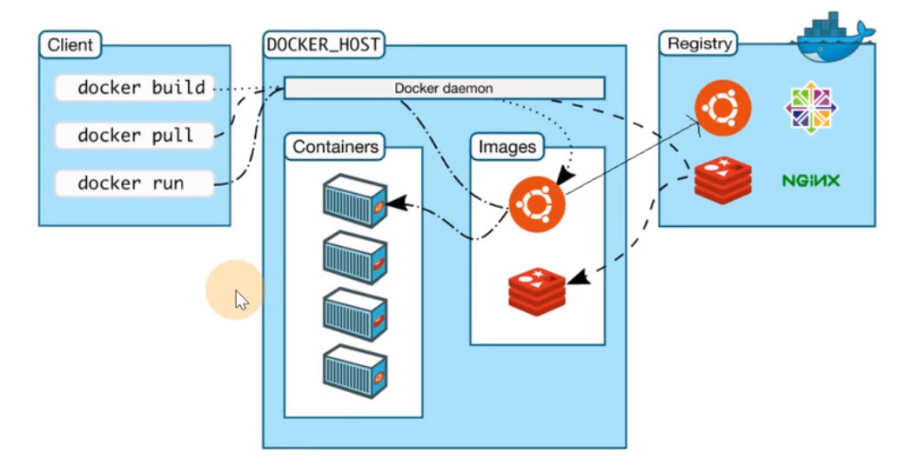
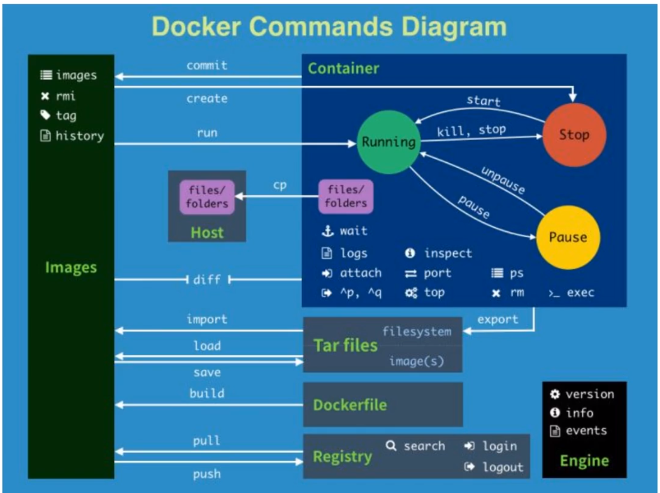

**Docker** 的基础操作，构建 **DockerFile**，以及一个启动案例

<!-- more -->

## 1. Docker 常规操作

### 1.1 核心要素

**Docker**如下三核心：

- **镜像**（*Images*）：打包了业务代码、运行环境的包，是静态文件，不对外直接提供服务
- **容器**（*Containers*）：镜像运行时，对外提供服务
- **仓库**（*Registry*）：存放镜像的地方，容器和仓库不会直接交互，都是以镜像为载体

::: note 仓库说明

**公有仓库：** Docker Hub、阿里、网易... 一般存放以下几类镜像

- 操作系统基础镜像：CentOS、Ubuntu、suse、alpine
- 中间件：Nginx、Redis、MySQL
- 语言编译环境：python、go、rust
- 业务镜像：ufs、igarashi-blog

**私有仓库：** 企业内部搭建

- **Docker Registry：** 官方提供仓库存储
- **Harbor：** 上述封装，WebUI、权限、操作审计等功能（常用）

:::



**Docker** 执行流程

- **docker pull：** `client` 通过 `grpc` 和 `DOCKER_HOST` 通信，`daemon` 进程去 `images` 中查看目标镜像，若没有则去远程仓库 `registry` 下载到本地 `images` 中

- **docker run：** 镜像是静态的，需要容器来运行，因此 `daemon` 会启动一个容器服务运行镜像来对外提供服务

- **docker build：** 通过 `build` 执行 [DockerFile](/igarashi-blog/tool/Docker/使用基础.html#_2-1-dockerfile) 来自定义的打包自己的镜像

### 1.2 基本流程

1. 查看镜像列表

   ```shell
   docker images || docker image ls
   ```

2. 远程仓库拉取镜像

   ```shell
   # 格式为： 镜像名称:tag标签
   docker pull nginx:alpine

   # 若不加 tag
   docker pull ubuntu
   # 等同于
   docker pull docker.io/library/ubuntu:lastest
   ```

3. 通过镜像来启动容器

   ```shell
   docker run --name z-nginx-alpine -d nginx:alpine
   ```

4. 进入容器并查看进程

   ```shell
   # 进入容器内部，分配一个tty终端
   docker exec -ti z-nginx-alpine /bin/shell	# or sh or /bin/sh or bash
   ps aux

   # 退出
   exit
   ```

5. 本地构建镜像

   - 创建 **DockerFile**

     **centos-nfs：** 创建一个带有 **NFS** 功能的 **CentOS** 镜像

     ```shell
     # 定义docker使用那个基础系统镜像作为模板，后续命令都已这个基础镜像为准,等同于 pull 操作
     FROM centos:7.6.1810

     # RUN命令会在模板镜像中执行
     RUN yum -y install nfs-utils

     # 启动容器后执行如下命令（这就是docker容器启动后执行命令的原因）
     CMD ["systemctl", "restart", "nfs"]
     ```

     **ubuntu-nginx：** 创建一个带有 **Nginx** 功能的 **Ubuntu** 镜像

     ```shell
     FROM ubuntu

     RUN apt-get update && apt i -y nginx

     CMD ["/usr/sbin/nginx", "-g", "daemon off;"]
     ```

   - 构建本地镜像

     ```shell
     # 将如上DockerFile 构建出名为 z-nginx-ubuntu 的镜像
     docker build . -t z-nginx:ubuntu -f DockerFile
     ```

   - 使用新镜像启动

     ```shell
     docker run --name z-nginx-ubuntu -d z-nginx:ubuntu
     ```

   - 容器端口转发

     ```shell
     # 查看 nginx 页面
     docker exec -ti z-nginx-ubuntu bash
     curl localhost
      
     # 移除容器 并 重启设置端口转发再启动
     docker rm -f z-nginx-ubuntu
     docker run --name z-nginx-ubuntu -d -p 8080:80 z-nginx:ubuntu
      
     # 查看是否转发（获取到nginx首页）
     curl localhost:8080
     ```

6. 删除容器服务

   ```shell
   docker rm -f z-nginx-ubuntu
   ```

7. 删除镜像

   ```shell
   docker rmi z-nginx:ubuntu
   # 若指定 ID，则同样 ID 的镜像（源文件），均会删除
   ```

### 1.3 部署镜像仓库

**Docker** 复杂命令流程图



1. 镜像打包

   ```shell
   # 将 nginx:alpine 镜像 导出为 z-nginx-ubuntu.tar 包
   docker save -o z-nginx-ubuntu.tar z-nginx:ubuntu
   ```

2. 从 `tar` 包中加载镜像

   ```shell
   docker load -i z-nginx-ubuntu.tar
   ```

3. 部署 [镜像仓库](https://docs.docker.com/registry/) 服务，默认仓库不带认证，若需要认证，请参考 [身份认证](https://docs.docker.com/registry/deploying/#restricting-access)

   ```shell
   # 用docker官方提供的镜像，来启动一个 镜像仓库服务
   docker run -d -p 5000:5000 --restart always --name registry registry:2
   ```

   - `--restart always:` 重启 `docker` 后，会自动拉起该镜像服务

4. 推送本地镜像到上述自建的镜像仓库中

   ```shell
   # 给镜像 打tag
   docker tag z-nginx:ubuntu localhost:5000/znginx:ubuntu

   # 推送到本地自建仓库
   docker push localhost:5000/znginx:ubuntu
   ```

5. 查看仓库内的镜像元数据

   ```shell
   curl -X GET http://localhost:5000/v2/_catalog
   # {"repositories":["znginx"]}

   curl -X GET http://localhost:5000/v2/nginx/tags/list
   # {"name":"nginx","tags":["alpine"]}
   ```

6. 若需要镜像仓库给外部访问

   ```shell
   docker tag z-nginx:ubuntu 120.53.122.253:5000/znginx:ubuntu

   # 若需要push 到外网地址，此时会报错
   docker push 120.53.122.253:5000/znginx:ubuntu
   ## The push refers to repository [120.53.122.253:5000/znginx]
   ## Get "https://120.53.122.253:5000/v2/": http: server gave HTTP response to HTTPS client

   # 这是由于docker默认不允许想http仓库地址推送，需要弄成https的
   # 这就需要证书机构颁发的证书和域名，自签名证书需要再每个节点上拷贝证书文件，比较麻烦，因此通过修改daemon配置的方式，来跳过证书验证：
   $ cat /etc/docker/daemon.json
   {
     "registry-mirrors": ["https://ubhu1j5h.mirror.aliyuncs.com"],
     "insecure-registries": ["120.53.122.253:5000"]
   }
   $ systemctl restart docker
   $ docker push 120.53.122.253:5000/znginx:ubuntu
   $ docker images # IMAGE ID 相同，等同于起别名，或是快捷方式

   ```

7. 限制内存启动

   ```shell
   # 限制资源，最大可用内存500M
   $ docker run --name znginx -d -p 8080:80 --memory=500m localhost:5000/znginx:ubuntu
   ```

8. 查看容器进程（_状态_）

   ```shell
   # 查看运行状态的容器列表
   docker ps

   # 查看全部状态
   docker ps -a
   ```

9. 挂载目录（_数据持久化_）

   ```shell
   # 挂载主机目录，若目录不存在则自动创建
   docker run --name test-volume -v /opt:/opt/sub -d znginx:ubuntu
   docker run --name mysql -e MYSQL_ROOT_PASSWORD=123456 -d -v /opt/mysql/: /var/lib/mysql mysql:5.7

   # 查看 test-volume 挂载后的文件
   docker exec test-volume ls /opt/sub/

   # 使用 volumes 卷（很少使用）
   $ docker volume ls
   ## DRIVER    VOLUME NAME
   ## local     0ea556cf67053a251e6c5cdd52ee861fef78729574f38b21faecf1ef1df7e687
   ## local     5537ee1392f3c89fe872a5af562ae7238168e3eaa81fb4453ed7b1dcf17703e7
   # 通过命令 -v 挂载的，则会自动创建 volume name

   # 相对路径下，创建一个名为 my-vol 的数据卷
   $ docker volume create my-vol
   $ docker run --name naginx -d -v my-vol:/opt/my-vol znginx:ubuntu
   ```

10. 主机与容器之间拷贝数据

    ```shell
    # 主机文件拷贝到容器
    echo "123" > /tmp/test.txt
    docker cp /tmp/test.txt znginx:ubuntu
    docker exec -ti znginx cat /tmp/test.txt

    # 容器文件拷贝到主机
    docker cp znginx:/tmp/test.txt ./
    ```

11. 若网络不佳，可离线打包重建仓库，并修改默认的挂载

    ```shell
    # 比如公司网慢，线上下载卡顿，直接从源哪里打一个离线的registry包，拷贝到本地
    # 解压离线镜像文件
    tar zxf registry.tar.gz -C /opt

    # 删除当前镜像仓库容器
    docker rm -f registry

    # 使用docker 镜像启动镜像仓库服务
    docker run -d -p 5000:5000 --restart always -v /opt/registry:/var/lib/registry --name registry registry:2

    ```

12. 查看日志

    ```shell
    # 实时查看 最新的 100条日志
    docker logs -f --tail=100 znginx
    ```

13. 查看容器或镜像的明细

    ```shell
    # 查看容器的详细信息，包括IP地址等
    docker inspect z-nginx:ubuntu | more
    ```

##### **一号进程**

**1** 号进程比较特殊，若退出则容器销毁，不仅能通过 `CMD` 定义，还能在容器启动时，通过命令去覆盖默认的 `CMD`

```shell
# <自定义命令> 会覆盖镜像中指定的CMD指令，作为容器的 1号进程 启动
docker run -d --name xx nginx:alpine <自定义命令>

docker run -d --name test-3 nginx:alpine echo 123	# 直接退出

docker run -d --name test-4 nginx:alpine ping www.baidu.com	# 卡死在ping命令
```

因此每个容器都是个隔离进程

### 1.4 注意事项与实用小技巧

##### **注意**

不建议使用 ==commit== 和 ==import== 命令

- 通常，可以通过历史命令，来查看镜像的执行过程

  ```shell
  docker history z-nginx:ubuntu

  # IMAGE          CREATED        CREATED BY                                      SIZE      COMMENT
  # 226cb3d00202   6 months ago   /bin/sh -c #(nop)  CMD ["/usr/sbin/nginx" "-…   0B
  # 4f9c565b5c26   6 months ago   /bin/sh -c apt-get update && apt install -y …   92.7MB
  # ba6acccedd29   9 months ago   /bin/sh -c #(nop)  CMD ["bash"]                 0B
  # <missing>      9 months ago   /bin/sh -c #(nop) ADD file:5d68d27cc15a80653…   72.8MB
  ```

  若使用如上命令操作，则为黑盒、不可控，执行过程根本无从追溯，也无法二次改造

- 若出现 **dangling image**（_悬空镜像_）类似 `<none>:<none>` 这类镜像

  ```shell
  # 使用如下命令，删除垃圾镜像
  docker rmi $(docker images -f "dangling=true" -q)
  
  # 检查
  docker images | grep '<none>'
  ```

##### **实用技巧**

1. 清理主机上的所有 **退出状态** 的容器

   ```shell
   docker rm $(docker ps -aq)
   ```

2. 调试或者排查容器启动错误

   ```shell
   # 若遇到容器 启动失败 情况，先实用相同的镜像，启动一个临时容器，先进入容器
   docker run --rm ti <image_id> sh
   
   # 进入容器后，手动指定该容器对应的 ENTRYPOINT 或 CMD 命令，此时即使出错，容器也不会退出
   # 因为 bash 作为 1号进程，只要不主动退出容器，该容器就不会自动退出， --rm 容器跟随退出
   ```

---

## 2. Docker 构建镜像

### 2.1 Dockerfile

**Dockerfile** 是一堆指令，用来构建镜像的文本文件，在 `docker build` 时，按照该指令进行操作，最终生成期望的镜像

**相关文档：**

- [Dockerfile 文档（英文）](https://docs.docker.com/engine/reference/builder/)
- [Dockerfile 最佳实践（英文）](https://docs.docker.com/engine/userguide/eng-image/dockerfile_best-practices/)
- [Dockerfile | 菜鸟教程](https://www.runoob.com/docker/docker-dockerfile.html)
- [Dockerfile 基本结构 | w3cschool](https://www.w3cschool.cn/reqsgr/redknozt.html)

##### 构建命令：

```shell
$ docker build . -t image_name:image_tag -f DockerFile
```

- **FROM:** 指定基础镜像，必须为第一个命令

  ```shell
  # 格式
  	FROM <image>
  	FROM <image>:<tag>
  # 示例
  	FROM mysql:5.7
  # 注意
  	tag 是可选的，如果不使用tag时，会使用latest版本的基础镜像
  ```

- **MAINTAINER** 镜像维护者信息

  ```shell
  # 格式
  	MAINTAINER <name>
  # 示例
  	MAINTAINER Fuuka Igarashi
  	MAINTAINER 2545369032@qq.com
  	MAINTAINER Fuuka Igarashi <2545369032@qq.com>
  ```

- **COPY|ADD** ==添加本地源代码到镜像==

  ```shell
  # 格式
  	COPY <src>... <dest>
  # 示例
  	COPY . .
  	ADD hom* /mydir/ 		# 添加所有已 'hom' 开头的文件
  	ADD test relativeDir 	# 添加 "test" 到 `WORKDIR` /relativeDir/
  # 注意
  	ADD 和 COPY 相比，若指定<src>是个压缩文件，会自动进行解压而导致不可控，因此不要用ADD
  ```

- **WORKDIR** 工作目录

  ```shell
  # 格式
  	WORKDIR /path/to/workdir
  # 示例
  	WORKDIR /opt/ufs		# 工作目录为 /opt/ufs
  # 注意
  	通过 WORKDIR 设置工作目录后，Dokcerfile 中启动后的命令
  	RUN、COM、ENTRYPOINT、ADD、COPY等都会在该目录下执行
  ```

- **RUN** 构建镜像过程中执行命令

  ```shell
  # 格式
  	RUN <command>
  # 示例
  	RUN yum install nginx
  	RUN pip install -r ./requirements.txt
  	RUN mkdir test && rm -rf /var/lib/unusedfiles
  # 注意
  	RUN 指令创建的中间镜像会被缓存，并会在下次构建中使用.
  	如果不想使用这些缓存镜像，可以在构建时指定 --no-cache 参数
  	如： docker build --no-cache
  ```

- **CMD** 构建容器后调用，也就是在容器启动时才进行调用

  ```shell
  # 格式
  	CMD ["executable", "param1", "param2"]	# 执行 可执行文件，优先
  	CMD ["param1", "param2"]				# 设置了 ENTRYPOINT，则直接调用 ENTRYPOINT 添加参数
  	CMD command param1 param2 				# 执行 shell内部命令
  # 示例
  	CMD ["/usr/bin/wc", "--help"]
  	CMD ping www.baidu.com
  # 注意
  	CMD 不同于RUN, CMD 用于指定在容器启动时所要执行的命令
  	而 RUN 用于指定镜像构建时所要执行的命令
  ```

- **ENTRYPOINT** 设置容器初始化命令，使其可执行化

  ```shell
  # 格式
  	ENTRYPOINT ["executable", "param1", "param2"]	# 执行 可执行文件，优先
  	ENTRYPOINT command param1 param2 				# 执行 shell内部命令
  # 示例
  	ENTRYPOINT ["/usr/bin/wc", "--help"]
  # 注意
  	ENTRYPOINT 和 CMD 类似，不同的是通过 docker run 执行的命令不会覆盖 ENTRYPOINT,
  	而 docker run 命令中指定的任何参数，都会被当做参数再次传递给 ENTRYPOINT
  		
  	Dockerfile中只允许有一个 ENTRYPOINT 命令
  	多指定时会覆盖前面的设置，而仅执行最后的 ENTRYPOINT 指令
  ```

- **ENV** 环境变量

  ```shell
  # 格式
  	ENV <key> <value>
  	ENV <key>=<value>
  # 示例
  	ENV NODE_VERSION 7.2.0
  	ENV MYSQL_ROOT_PASSWORD=123456
  ```

- **EXPOSE** 声明端口，无重要意义

  ```shell
  # 格式
  	EXPOSE <port> [<port>...]
  # 示例
  	EXPOSE 80 443
  	EXPOSE 8080
  	EXPOSE 11211/tcp 11211/udp
  # 注意
  	EXPOSE 并不会让容器的端口访问到主机
  	要使其访问，需要在 docker run 运行容器时 指定 -p 来发布端口映射
  	或通过 -P 参数来发布 EXPOSE 导出的所有端口
  ```

### 2.2 示例

构建一个 [blog](https://gitee.com/igarashi/python-demo) 的 **Python Web** 应用，**Dockerfile 如下**

```dockerfile
# This is my first django Dockerfile
# Version 1.0

# Base images 基础镜像
FROM centos:centos7.5.1804

# MAINTAINER 维护者信息
MAINTAINER Igarashi-G

# ENV 设置环境变量
ENV LANG en_US.UTF-8
ENV LC_ALL en_US.UTF-8

# RUN 执行以下命令
RUN curl -so /etc/yum.repos.d/Centos-7.repo http://mirrors.aliyun.com/repo/Centos-7.repo  && rpm -Uvh http://nginx.org/packages/centos/7/noarch/RPMS/nginx-release-centos-7-0.el7.ngx.noarch.rpm
RUN yum install -y python36 python3-devel gcc pcre-devel zlib-devel make net-tools nginx

# 工作目录
WORKDIR /opt/myblog

# 拷贝文件到工作目录
COPY . .

# 拷贝 nginx 配置文件
COPY myblog.conf /etc/nginx

# 安装依赖的插件
RUN pip3 install -i http://mirrors.aliyun.com/pypi/simple/ --trusted-host mirrors.aliyun.com -r requirements.txt
RUN chmod +x run.sh && rm -rf ~/.cache/pip

# EXPOSE映射端口
EXPOSE 8002

# 容器启动时执行命令
CMD ["./run.sh"]
```

**执行构建**

```sehll
docker build . -t myblog:v1 -f Dockerfile
```

**运行 mysql**

```shell
$ docker run -d -p 3306:3306 --name mysql -v /opt/mysql:/var/lib/mysql -e MYSQL_DATABASE=myblog -e MYSQL_ROOT_PASSWORD=123456 mysql:5.7

# 查看数据库
$ docker exec -ti mysql bash
#/ mysql -uroot -p123456
#/ show databases;

# navicator连接
```

**启动 Django 应用**

```shell
# 启动容器
$ docker run -d -p 8002:8002 --name myblog -e MYSQL_HOST=120.53.122.253 -e MYSQL_USER=root -e MYSQL_PASSWD=123456 myblog:v1

# migrate
$ docker exec -ti myblog bash
#/ python3 manage.py makemigrations
#/ python3 manage.py migrate
#/ python3 manage.py createsuperuser

# 创建超级用户
$ docker exec -ti myblog python3 manage.py createsuperuser

# 收集静态文件
#$ docker exec -ti myblog python3 manage.py collectstatic

```

**访问：** [腾讯云地址](http://120.53.122.253:8002/admin)

##### **替换 MySQL的默认编码为 UTF-8**

```shell
 # dockerfiles/mysq1/my.cnf
$ cat my.cnf
[mysqld]
user=root
character-set-server=utf8
lower_case_table_names=1

[client]
default-character-set=utf8
[mysql]
default-character-set=utf8

!includedir /etc/mysql/conf.d/
!includedir /etc/mysql/mysql.conf.d/
```

**重做 MySQL 镜像**

```dockerfile
# 基于 mysql5.7 覆盖
FROM mysql5.7
COPY my.cnf /etc/mysql/my.cnf

# 若不指定 CMD 则会自动继承
```

::: warning 注意

- 通常不会直接写 **FROM** 这种很原生的 **Dockerfile**，因为每次 `build` 构建会拖慢整个自动化的速度
- 因此将所需的环境、依赖啥的，打一个 **基础镜像**，方便直接引入

:::
