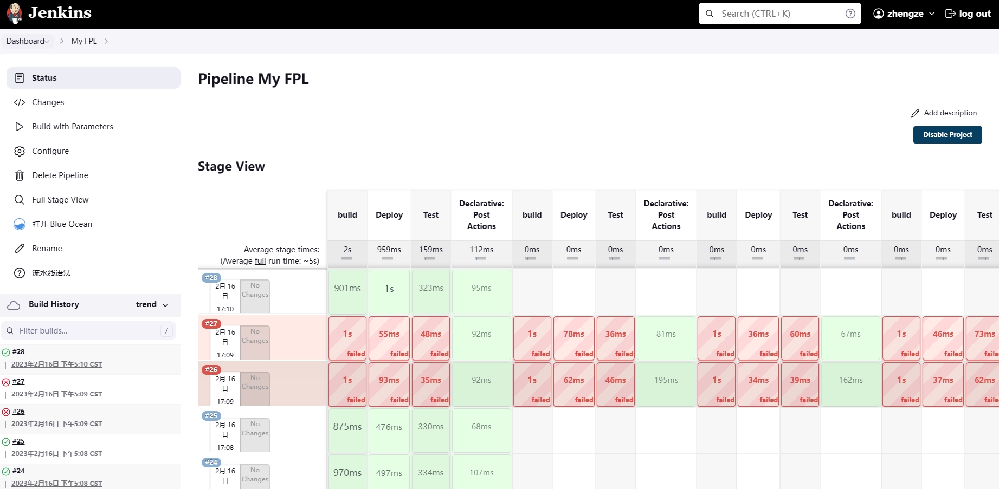

**CI/CD** 自动构建流水线

<!--more-->

## 1. 构建基础

### 1.1 概念

通常 **CI/CD** 由部分组成

- **持续集成：** 帮助开发人员更加频繁的将代码合并到共享分支或主干中，合并后自动触发构建应用，运行不同级别的代码扫描（*工具： **sonarqube***）和自动化测试（*单元&集成测试*）

- **持续交付：** 将通过的集成测试代码合并到一个可以随时部分到生产环境的代码库

- **持续部署：** 持续交付的延伸，将代码自动发布到生产环境中

自动构建流水线代表工具有 **Jenkins**、**GitRunner（测试集成不够灵活）**

### 1.2 Jenkins安装 

**Jenkins** 是一款开源 **CI&CD** 软件，用于自动化各种任务，包括构建、测试和部署软件，**Jenkins2.0** 后主推声明式流水线，简单且支持指定步骤执行，地址如下

[詹金斯部署](https://www.jenkins.io/download/) 

[用户手册](https://www.jenkins.io/doc/book/installing/) 

需要安装  **JAVA** 环境和 **Docker** 

::: tabs

@tab CentOS

要使用此存储库，请运行以下命令：

```shell
$ wget -O /etc/yum.repos.d/jenkins.repo https://pkg.jenkins.io/redhat-stable/jenkins.repo

# 若出现 ERROR: cannot verify pkg.jenkins.io’s certificate, issued by “/C=US/O=L...
# 改为如命令
$ wget --no-check-certificate -O /etc/yum.repos.d/jenkins.repo https://pkg.jenkins.io/redhat-stable/jenkins.repo

# 导入公钥
$ rpm --import https://pkg.jenkins.io/redhat-stable/jenkins.io.key
```

如果之前已经从 **Jenkins** 导入过公钥，则会失败，直接忽略即可

```shell
# 安装 Java 环境
$ yum install fontconfig java-11-openjdk
```

安装/卸载 **jenkins**

```shell
$ yum install jenkins -y

# 卸载Jenkins

$ rpm -e jenkins        # rpm卸载

$ rpm -ql jenkins       # 检查是否卸载成功

$ find / -iname jenkins | xargs -n 1000 rm -rf     # 彻底删除残留文件
```

通过 **war包** 指定版本， [版本查看](https://get.jenkins.io/war-stable/) 

:::

```shell
# 启动 jenkins 服务
systemctl daemon-reload
systemctl status jenkins 
systemctl restart jenkins 
systemctl enable jenkins 

# 可修改的配置文件地址
$ vim /etc/sysconfig/jenkins

# 查看初始化密码文件地址
$ cat /var/lib/jenkins/secrets/initialAdminPassword

# 环境配置、取消代理
export  all_proxy="http://172.16.70.104:7890"
unset all_proxy
```

### 1.3 Jenkins 使用基础

[Jenkins 中文用户手册](https://www.jenkins.io/zh/doc/) 

目录说明

```shell
$ ls /var/lib/jenkins/
#%C          hudson.model.UpdateCenter.xml     jobs              nodes    secret.key                secrets      users
#config.xml  jenkins.telemetry.Correlator.xml  nodeMonitors.xml  plugins  secret.key.not-so-secret  userContent
```

**nodes：** agent

**jobs：** 构建的流水线任务，可以直接迁移

**plugins：** 插件，同样可迁移，直接能启动，更新插件一定要先备份，后更新，否则可能无法启动

**workspace：** 工作路径，实际执行是以该目录下的任务执行

#### 示例

如下 给出`test.sh` 放入创建 **Jenkins** 流水线的工作空间（*用于测试*）

```shell
timestamp=$(date +%s)
if [ `expr $timestamp % 2` == 0 ]
then
        echo "Success"
        exit 0
else
        echo "Fail"
        sleep 1
        exit 1
fi
```

流水线示例如下

```shell
pipeline {
    agent any
    parameters {
		string(name: 'PERSON', defaultValue: 'Mr Zheng')
	}
    environment {
        DISABLE_AUTH = 'true'
        DB_ENGINE    = 'sqlite'
    }
	options {
	    retry(5)
	}
    stages {
        stage('build') {
            steps {
                sh 'python --version'
                sh 'pwd'
                sh 'bash ./test.sh'
            }
        }
        stage('Deploy'){
            steps {
                timeout(time: 10, unit: "SECONDS"){
                    echo "${PERSON}"
                    retry(3) {
                        sh './test.sh'
                        echo 'test.sh retry is over!'
                    }
                    
                }
            }
        }
        stage('Test') {
            steps {
                sh 'echo "Test Fail! but continue"; exit 0'
            }
        }
    }
    post {
        always {
            echo 'This will always run'
        }
        success {
            echo 'This will run only if successful'
        }
        failure {
            echo 'This will run only if failed'
            mail to: 'zhengze@uit.com.cn',
            subject: "Failed Pipeline: ${currentBuild.fullDisplayName}",
            body: "Something is wrong with ${env.BUILD_URL}"
        }
        unstable {
            echo 'This will run only if the run was marked as unstable'
        }
        changed {
            echo 'This will run only if the state of the Pipeline has changed'
            echo 'For example, if the Pipeline was previously failing but is now successful'
        }
    }
}
```

- **agent：** 代理，所有 **Pipline** 都需要指定 **agent** ，它告诉 **Jenkins** 在哪里以及如何执行
- **environment：** 环境变量，可以定义全局和阶段（***stage***），阶段只能在定义对应的阶段使用
- **parameters：** 构建初始化参数，可以指定默认值
- **options：** 定义一些全局配置，此处表示若失败则重试构建 **5** 次
- **stage：** 阶段，声明流程，内容可自定义，常规有 **Build、Test、Deploy** 三阶段，阶段即为部署环境
- **steps：** 步骤，可执行 **sh** 
- **retry：** 重试，若失败则会进行重试操作，可指定次数，并和超时组合
- **timeout：** 超时，可以设置超时时间，常用单位 `SECONDS`，`MINUTES` 
- **post：** 完成 **Pipline** 后执行的任务，如清理，输出分析报表、失败发送电子邮件等工作



**agent** 会将所有步骤 `steps{}` 存入一个执行队列，**executor** 一就绪就会执行

- **docker** 若将其定义为容器 

  ```shell
  agent {
  	docker { image 'node:16.13.1-alpine' }
  }
  ```

  

  

