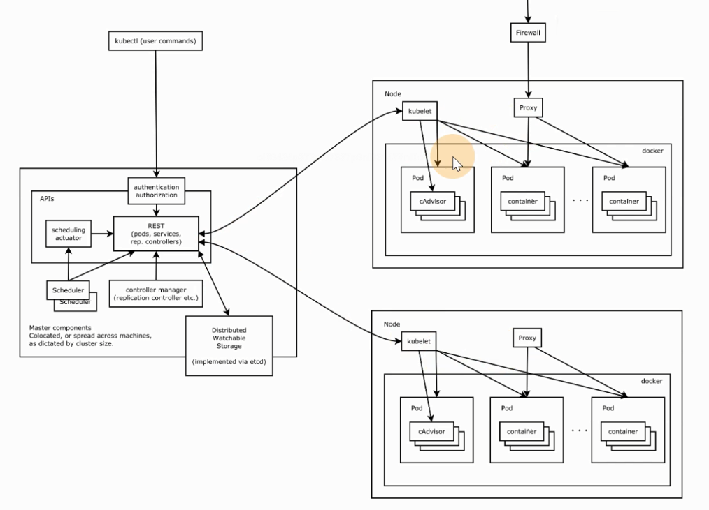
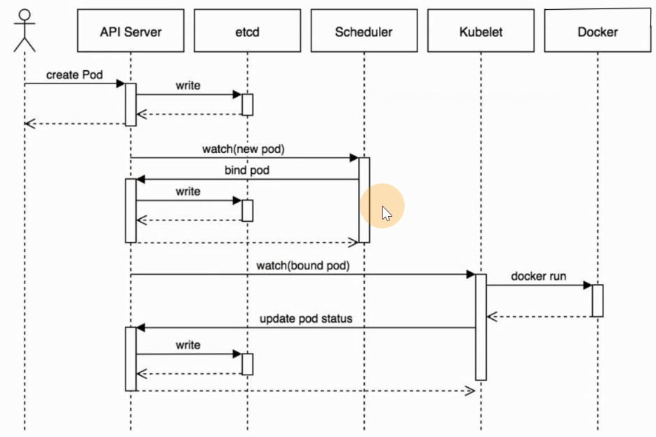

# Kubernets 基础

记录 **kubernetes** 相关文档、基础、使用说明等

<!-- more -->

## k8s 相关文档

[官网 | 学习 Kubernetes 基础知识 | Kubernetes](https://kubernetes.io/zh-cn/docs/tutorials/kubernetes-basics/)

[kubespray.io](https://kubespray.io/#/) 

[Kubernetes教程 | Kuboard](https://kuboard.cn/learning/)


查看k8s 或docker 日志

```shell
journalctl -fu docker | kubelet

# 也可以用docker 看日志
docker logs -f + container_id
```

使用Deployment管理Pod生命周期，实现服务不中断的滚动更新，通过服务发现来实现集群内部的服务间访问，并通过ingress-nginx实现外部使用域名访问集群内部的服务。同时介绍基于EFK如何搭建Kubernetes集群的日志收集系统。


## 1. Kubernetes 概述

纯 **Docker** （*容器模式*） 的运维管理麻烦，尤其涉及到跨容器网络通信，故诞生了容器调度管理平台 **Kubernetes** ，由于功能强大，**17** 年后渐渐成为主流

##### **架构图如下**



##### **包含如下核心组件**

- **[etcd]()：** 分布式高性能键值 **数据库**，存储整个集群的所有元数据，**只通过 ApiServer 访问**
- **ApiServer：** **接口** 服务器，用来交互的，集群资源访问控制入口，提供 **restful api** 及安全访问控制
- **Scheduler：** **调度器**，把业务容器调度到合适节点
- **Controller Manager：** **控制管理器，20来种的统称**，确保集群资源按照期望的方式运行，生成元数据，故在调度之前，**k8s 中最复杂的点** 
  - **Replication Controller** 
  - **Node controller** 
  - **ResourceQuota Controller** 
  - **Namespace Controller** 
  - **ServiceAccount Controller** 
  - **Tocken Controller** 
  - **Service Controller** 
  - **Endpoints Controller** 

- **kubelet：** 节点代理，运行再每个节点上，管节点同时汇报情况给 **Master** 管理节点
  - **pod管理：**  容器的抽象，最小资源调度单位，管容器的，被 **kubelet** 管的
  - **容器健康检查：** 检查容器是否正常运行，若运行出错，按照 **pod** 设置的重启策略处理
  - **容器监控：** 监控容器所在节点资源的使用情况，定时向 **Master** 报告，资源使用数据通过 **cAdvisor** 获取的，对于 **pod** 调度和正常运行至关重要
- **kube-proxy：** 维护节点中的 **iptables** 或 **ipvs** 规则
- **[kubectl](https://kubernetes.io/zh-cn/docs/reference/kubectl/)：** 命令行工具
- **cni：** 通用网络接口，如 **flannel** 等的网络插件，实现集群跨节点通信

##### **其工作流程如下**



::: warning 关于性能

**ApiServer** 压测 **10w+** 大概才会出现性能问题（*应该是普通的企业主机配置*）

:::

部署后则生成 **kubelet** 进程，可执行 **kubectl** 二进制命令行工具，其中

- **组件：** 启动的一个进程，为了支撑 **k8s** 平台的运行，安装好的软件
- **资源：** **k8s** 提供的能力，被 **k8s** 所管理

```shell
# 查看 systemd 服务
systemctl status kubelet

# 查看 kubernetes的资源，简写
kubectl api-resources
```

##### **kubectl**的使用

类似于 **docker**，**[kubectl](https://kubernetes.io/zh-cn/docs/reference/kubectl/)** 是 **CLI**，用于与 **APIServer** 交互，内置了丰富的子命令，功能强大

```powershell
$ kubectl -h
$ kubectl get -h
$ kubectl create -h
$ kubectl create namespace -h
# 管理集群资源
$ kubectl get po -v=7
```

## 2. 资源

### 2.1. namespace

命名空间，集群内的虚拟概念，类似于资源池，池中有各种资源，绝大多数的资源都必须属于某一个**namespace** 

```shell
# 集群初始化安装好之后，会默认有如下几个
$ kubectl get ns	# or get namespaces

NAME                   STATUS   AGE
default                Active   10d
kube-node-lease        Active   10d
kube-public            Active   10d
kube-system            Active   10d
kubernetes-dashboard   Active   9d
```

- 所有 **namespaces** 资源，创建时都要指定 `-n ns`，若不指定，默认为 **default** 
- 同一个 **namespace** 下的同类资源 **不能重名**，不同类型的资源可以重名，不同 **namespace** 也可
- 在项目通常创建带有业务含义的 **namespace** 来做逻辑上的整合

::: tip

```shell
kubectl -n xxxns get xxx	# 命名空间放前面，方便复用
```

:::

### 2.2 Pod

**最小调度单元**，理解为存放多个容器的（*豆荚*），为和容器引擎（*Docker*）解耦（*如 **1.22.x** 改用 **containerd***），抽象出一层 **Pod** 让 **k8s** 进行调度，被 **kubelet** 定期 **watch** ，更新状态并写入 **etcd** 

```shell
# 查看命名空间 kube-system 下的 pods
$ kubectl -n kube-system get po
```

##### **使用 yaml格式 定义 Pod**

**yaml** 工程师，推荐使用**yaml** 而非 **json**，因为大家都用 **yaml...** 如下创建一个 `django.yaml` 文件

```yaml
apiVersion: v1										# API 版本
kind: Pod											# 资源类型
metadata:
  name: ublog										# Pod 名称
  namespace: uit									# 指定命名空间
  labels:											# 作标记
    component: zzblog
spec:
  containers:										# 编写 Pod 中 包含的容器列表
    - name: myblog									# 容器名
      image: 192.168.3.171:5000/myblog:v1			# 拉取镜像地址
      imagePullPolicy: IfNotPresent					# 若本地无，再去远程拉取
      env:											# 环境变量
      - name: MYSQL_HOST 							# 环境变量 Key - Value
        value: "127.0.0.1"
      - name: MYSQL_PASSWD
        value: "123456"
      ports:
      - containerPort: 8002
    - name: mysql
      image: 192.168.3.171:5000/mysql:5.7
      imagePullPolicy: IfNotPresent
      ports:
      - containerPort: 3306
      env:											
      - name: MYSQL_ROOT_PASSWORD
        value: "123456"
      - name: MYSQL_DATABASE
        value: "myblog"
```

| apiVersion | 含义 |
| :--------- | :----------------------------------------------------------- |
| **alpha** | 进入 **k8s** 功能的早期候选版本，可能包含 **Bug**，最终不一定进入 **k8s** |
| **beta** | 已经过测试的版本，最终会进入 **k8s**，但功能、对象定义可能会发生变更 |
| **stable** | 可安全使用的稳定版本 |
| **v1** | **stable** 版本之后的首个版本，包含了更多的核心对象 |
| **apps/v1** | 使用最广泛的版本，像 **Deployment**，**ReplicaSets** 都已进入该版本 |

**资源类型** 与 **apiVersion** 的对照表（*编写如下资源的 **yaml** 该指定那个 **apiVersion***）

| Kind | apiVersion |
| :-------------------- | :-------------------------------------- |
| **ClusterRoleBinding** | **rbac.authorization.k8s.io/v1** |
| **ClusterRole** | **rbac.authorization.k8s.io/v1** |
| **ConfigMap** | **v1** |
| **CronJob** | **batch/v1beta1** |
| **DaemonSet** | **extensions/v1beta1** |
| **Node** | **v1** |
| **Namespace** | **v1** |
| **Secret** | **v1** |
| **PersistentVolume** | **v1** |
| **PersistentVolumeClaim** | **v1** |
| **Pod** | **v1** |
| **Deployment** | **v1、apps/v1、apps/v1beta1、apps/v1beta2** |
| **Service** | **v1** |
| **Ingress** | **extensions/v1beta1** |
| **ReplicaSet** | **apps/v1、apps/v1beta2** |
| **Job** | **batch/v1** |
| **StatefulSet** | **apps/v1、apps/v1beta1、apps/v1beta2** |

快速查看 **资源** 对应的 **版本**

```shell
$ kubectl explain pod
$ kubectl explain Pod.apiVersion
```

##### 创建和访问Pod

```shell
# 创建 命名空间（namespace） 逻辑上的资源池
$ kubectl create namespace uit

# 使用指定文件创建 Pod
$ kubectl create -f django.yaml

# 所有的操作都需要指定 -n 即namespace，但 default 命名空间可省略，
$ kubectl -n demo get pods -o wide
NAME    READY   STATUS    RESTARTS   AGE   IP            NODE            NOMINATED NODE   READINESS GATES
ublog   2/2     Running   0          69m   10.244.1.23   k8s-slave-172   <none>           <none>
# - 查看pod，可以简写 po（其他资源同）
# - -o wide 表示查看广泛的信息，即详情
# - -o yaml/json|more 还可查看 Pod 是根据什么样的原文件运行的

# 使用 Pod IP 访问服务 上文得出 IP 是10.244.1.23 被调度到了 k8s-slave-172 节点
$ curl 10.244.1.23:8002/blog/index

# 进入容器执行初始化, 不必到对应的主机执行docker exec
$ kubectl -n uit exec -ti ublog -c myblog /bin/bash

# 查看环境变量
$ env|grep MYSQL
MYSQL_HOST=127.0.0.1
MYSQL_PASSWD=123456

# 初始化数据库
$ python3 manage.py migrate

# 进入另一个容器 -c: chose 表选择
$ kubectl -n uit exec -ti ublog -c mysql bash

# 查看数据库
$ mysql -p123456
$ show databases;

# 退出 或 ctrl + d
exit
```

##### **Infra 容器**

登录 **k8s-slave-172** 节点，执行如下命令，发现有 **三个容器** （*上文只编写了两个*）

```shell
$ docker ps -a |grep blog

4321affa391e   c20987f18b13                                        "docker-entrypoint.s…"   About an hour ago   Up About an hour                    k8s_mysql_ublog_uit_2905ba41-b03a-4d8d-8fb3-538e962dccbc_0
766410c81aee   2fd137e95f13                                        "./run.sh"               About an hour ago   Up About an hour                    k8s_myblog_ublog_uit_2905ba41-b03a-4d8d-8fb3-538e962dccbc_0
29feb4ab89be   registry.aliyuncs.com/google_containers/pause:3.1   "/pause"                 About an hour ago   Up About an hour                    k8s_POD_ublog_uit_2905ba41-b03a-4d8d-8fb3-538e962dccbc_0
```

包含了上文编写的 **mysql** 和 **myblog** 两个，但额外多出个 **pause** 状态的容器

::: info

为了实现 **Pod** 内部容器，能通过 **localhost** 通信:

- 每个 **Pod** 都会启动 **Infra** 容器
- **Pod** 内部的网络空间会共享 **Infra** 容器的网络空间（*类比 **Docker** 网络的 **container** 模式* ）
- **Infra** 容器只需 **夯住** 网络空间，无需额外功能，资源消耗极低

:::

查看 **Pod** 内部的容器 **IP** ，会发现均相同，都为 **Pod IP**

```shell
# 如下的 10.244.1.23 
$ kubectl -nuit exec -ti ublog -c myblog ifconfig
eth0: flags=4163<UP,BROADCAST,RUNNING,MULTICAST>  mtu 1450
        inet 10.244.1.23  netmask 255.255.255.0  broadcast 10.244.1.255
        ether 1e:8c:df:d3:f3:00  txqueuelen 0  (Ethernet)
        RX packets 38  bytes 3026 (2.9 KiB)
        RX errors 0  dropped 0  overruns 0  frame 0
        TX packets 24  bytes 6618 (6.4 KiB)
        TX errors 0  dropped 0 overruns 0  carrier 0  collisions 0
```

::: tip Pod 容器命名

**k8s \_\<container_name\>\_\<pod_name\>\_\<namespace\>\_\<random_string\>**

 :::

##### **Troubleshooting and Debugging**

```shell
# 查看 Pod 的 明细信息 及 事件
$ kubectl -n demo describe pod ublog

# 进入 Pod 内的 容器
$ kubectl -n <namespace> exec <pod_name> -c <container_name> -ti /bin/sh

# 查看 Pod 内容器 日志，显示标准或者错误输出日志
$ kubectl -n <namespace> logs -f --tail=20 <pod_name> -c <container_name>
```

##### 更新 Pod 服务版本（*若更改文件* ）

```shell
# apply 应用使之生效
$ kubectl apply -f django.yaml

# 仅特定字段 如：镜像版本 之类的改动才会生效，例如 labels、env 之类的改动不会生效
```

##### **删除 Pod 服务**

```shell
# 根据文件删除
$ kubectl delete -f django.yaml

# 根据 Pod name 删除
$ kubectl -n <namespace> delete pod <pod_name>

# 删的慢 可以手动切到对应节点，执行
$ docker rm -f <container>
```

##### **Pod 数据持久化（*挂载* ）**

若删除了 **Pod**，但 **MySQL** 的数据都在容器内部，会造成数据丢失，故需挂载出来持久化

使用 **hostpath** 和 **nodeSelector** 定点挂载

```shell
# 查看节点的 labels 如下
$ kubectl get no --show-labels
NAME             STATUS   ROLES    AGE   VERSION   LABELS
k8s-master-171   Ready    master   15d   v1.16.2   beta.kubernetes.io/arch=amd64,beta.kubernetes.io/os=linux,kubernetes.io/arch=amd64,kubernetes.io/hostname=k8s-master-171,kubernetes.io/os=linux,node-role.kubernetes.io/master=
k8s-slave-172    Ready    <none>   15d   v1.16.2   beta.kubernetes.io/arch=amd64,beta.kubernetes.io/os=linux,kubernetes.io/arch=amd64,kubernetes.io/hostname=k8s-slave-172,kubernetes.io/os=linux
k8s-slave-173    Ready    <none>   15d   v1.16.2   beta.kubernetes.io/arch=amd64,beta.kubernetes.io/os=linux,kubernetes.io/arch=amd64,kubernetes.io/hostname=k8s-slave-173,kubernetes.io/os=linux

# 给 node 节点资源打 label
$ kubectl label node k8s-slave-172 component=zz

# 再次查看 172 的 labels 发现前面已显示
$ kubectl get no --show-labels |grep k8s-slave-172
k8s-slave-172    Ready    <none>   15d   v1.16.2   beta.kubernetes.io/arch=amd64,beta.kubernetes.io/os=linux,component=zz,kubernetes.io/arch=amd64,kubernetes.io/hostname=k8s-slave-172,kubernetes.io/os=linux
```

然后改写文件如下

```yaml
apiVersion: v1
kind: Pod
metadata:
  name: ublog
  namespace: uit
  labels:
    component: zzblog
spec:
  volumes:								# 上文都是定义 源 的挂载，与 containers 同级
    - name: mysql-data
      hostPath:
        path: /opt/mysql/data			# 源 的挂载点
  nodeSelector: 						# 使用 节点选择器，将 Pod 调度到上文指定了 label 的节点
    component: zz
  containers:										
  - name: myblog
    image: 192.168.3.171:5000/myblog:v1
    imagePullPolicy: IfNotPresent
    env:
    - name: MYSQL_HOST
      value: "127.0.0.1"
    - name: MYSQL_PASSWD
      value: "123456"
    ports:
    - containerPort: 8002
  - name: mysql
    image: 192.168.3.171:5000/mysql:5.7
    imagePullPolicy: IfNotPresent
    ports:
    - containerPort: 3306
    env:											
      - name: MYSQL_ROOT_PASSWORD
        value: "123456"
      - name: MYSQL_DATABASE
        value: "myblog"
    volumeMounts:						# 引用 宿主机 的挂载
    - name: mysql-data					# 上文的卷名
      mountPath: /var/lib/mysql			# 宿主机 的 挂载点
```

执行创建

```powershell
# 若存在旧的同名服务，先删除掉，后创建
$ kubectl -n demo delete pod myblog

# 创建
$ kubectl create -f pod-with-volume.yaml

## 此时pod状态Pending
$ kubectl -n demo get po
NAME READY STATUS RESTARTS AGE
myblog 0/2 Pending 0 32s

## 查看原因，提示调度失败，因为节点不满足node selector
$ kubectl -n demo describe po myblog
Events:
Type Reason Age From Message
---- ------ ---- ---- -------
Warning FailedScheduling 12s (x2 over 12s) default-scheduler 0/3 nodes are available: 3 node(s) didn't match node selector.

## 为节点打标签
$ kubectl label node k8s-slave1 component=mysql

## 再次查看，已经运行成功
$ kubectl -n demo get po
NAME READY STATUS RESTARTS AGE IP NODE
myblog 2/2 Running 0 3m54s 10.244.1.150 k8s-slave1

## 到k8s-slave1节点，查看/opt/mysql/data
$ ll /opt/mysql/data/
total 188484
-rw-r----- 1 polkitd input 56 Mar 29 09:20 auto.cnf
-rw------- 1 polkitd input 1676 Mar 29 09:20 ca-key.pem
-rw-r--r-- 1 polkitd input 1112 Mar 29 09:20 ca.pem
drwxr-x--- 2 polkitd input 8192 Mar 29 09:20 sys
...

## 执行migrate，创建数据库表，然后删掉pod，再次创建后验证数据是否存在
$ kubectl -n demo exec -ti myblog python3 manage.py migrate

## 访问服务，正常
$ curl 10.244.1.150:8002/blog/index/

## 删除pod
$ kubectl delete -f pod-with-volume.yaml

## 再次创建Pod
$ kubectl create -f pod-with-volume.yaml

## 查看pod ip并访问服务
$ kubectl -n demo get po -o wide
NAME READY STATUS RESTARTS AGE IP NODE
myblog 2/2 Running 0 7s 10.244.1.151 k8s-slave1

## 未做migrate，服务正常
$ curl 10.244.1.151:8002/blog/index/
```

- 使用PV+PVC连接分布式存储解决方案
- ceph
- glusterfs
- nfs

###### 服务健康检查

检测容器服务是否健康的手段，若不健康，会根据设置的重启策略（restartPolicy）进行操作，两种检测机制可以分别单独设置，若不设置，默认认为Pod是健康的。

两种机制：

- LivenessProbe探针
用于判断容器是否存活，即Pod是否为running状态，如果LivenessProbe探针探测到容器不健康，则kubelet将kill掉容器，并根据容器的重启策略是否重启，如果一个容器不包含LivenessProbe探针，则Kubelet认为容器的LivenessProbe探针的返回值永远成功。
- ReadinessProbe探针
用于判断容器是否正常提供服务，即容器的Ready是否为True，是否可以接收请求，如果ReadinessProbe探测失败，则容器的Ready将为False，控制器将此Pod的Endpoint从对应的service的Endpoint列表中移除，从此不再将任何请求调度此Pod上，直到下次探测成功。（剔除此pod不参与接收请求不会将流量转发给此Pod）。

三种类型：

- exec：通过执行命令来检查服务是否正常，回值为0则表示容器健康
- httpGet方式：通过发送http请求检查服务是否正常，返回200-399状态码则表明容器健康
- tcpSocket：通过容器的IP和Port执行TCP检查，如果能够建立TCP连接，则表明容器健康

示例：

完整文件路径 `myblog/one-pod/pod-with-healthcheck.yaml`

```yaml
containers:
- name: myblog
image: 172.21.32.6:5000/myblog
env:
- name: MYSQL_HOST # 指定root用户的用户名
value: "127.0.0.1"
- name: MYSQL_PASSWD
value: "123456"
ports:
- containerPort: 8002
livenessProbe:
httpGet:
path: /blog/index/
port: 8002
scheme: HTTP
initialDelaySeconds: 10 # 容器启动后第一次执行探测是需要等待多少秒
periodSeconds: 15 # 执行探测的频率
timeoutSeconds: 2 # 探测超时时间
readinessProbe:
httpGet:
path: /blog/index/
port: 8002
scheme: HTTP
initialDelaySeconds: 10
timeoutSeconds: 2
periodSeconds: 15
```

- initialDelaySeconds：容器启动后第一次执行探测是需要等待多少秒。
- periodSeconds：执行探测的频率。默认是10秒，最小1秒。
- timeoutSeconds：探测超时时间。默认1秒，最小1秒。
- successThreshold：探测失败后，最少连续探测成功多少次才被认定为成功。默认是1。对于liveness必须是1，最小值是1。
- failureThreshold：探测成功后，最少连续探测失败多少次
才被认定为失败。默认是3，最小值是1。

重启策略：

Pod的重启策略（RestartPolicy）应用于Pod内的所有容器，并且仅在Pod所处的Node上由kubelet进行判断和重启操作。当某个容器异常退出或者健康检查失败时，kubelet将根据RestartPolicy的设置来进行相应的操作。
Pod的重启策略包括Always、OnFailure和Never，默认值为Always。

- Always：当容器失败时，由kubelet自动重启该容器；
- OnFailure：当容器终止运行且退出码不为0时，有kubelet自动重启该容器；
- Never：不论容器运行状态如何，kubelet都不会重启该容器。

###### 镜像拉取策略

```yaml
spec:
containers:
- name: myblog
image: 172.21.32.6:5000/demo/myblog
imagePullPolicy: IfNotPresent
```

设置镜像的拉取策略，默认为IfNotPresent

- Always，总是拉取镜像，即使本地有镜像也从仓库拉取
- IfNotPresent ，本地有则使用本地镜像，本地没有则去仓库拉取
- Never，只使用本地镜像，本地没有则报错

###### Pod资源限制

为了保证充分利用集群资源，且确保重要容器在运行周期内能够分配到足够的资源稳定运行，因此平台需要具备

Pod的资源限制的能力。 对于一个pod来说，资源最基础的2个的指标就是：CPU和内存。

Kubernetes提供了个采用requests和limits 两种类型参数对资源进行预分配和使用限制。

完整文件路径：`myblog/one-pod/pod-with-resourcelimits.yaml`

```yaml
...
containers:
- name: myblog
image: 172.21.32.6:5000/myblog
env:
- name: MYSQL_HOST # 指定root用户的用户名
value: "127.0.0.1"
- name: MYSQL_PASSWD
value: "123456"
ports:
- containerPort: 8002
resources:
requests:
memory: 100Mi
cpu: 50m
limits:
memory: 500Mi
cpu: 100m
...
```

requests：

- 容器使用的最小资源需求,作用于schedule阶段，作为容器调度时资源分配的判断依赖
- 只有当前节点上可分配的资源量 >= request 时才允许将容器调度到该节点
- request参数不限制容器的最大可使用资源
- requests.cpu被转成docker的--cpu-shares参数，与cgroup cpu.shares功能相同 (无论宿主机有多少个cpu或者内核，--cpu-shares选项都会按照比例分配cpu资源）
- requests.memory没有对应的docker参数，仅作为k8s调度依据

limits：

- 容器能使用资源的最大值
- 设置为0表示对使用的资源不做限制, 可无限的使用
- 当pod 内存超过limit时，会被oom
- 当cpu超过limit时，不会被kill，但是会限制不超过limit值
- limits.cpu会被转换成docker的–cpu-quota参数。与cgroup cpu.cfs_quota_us功能相同
- limits.memory会被转换成docker的–memory参数。用来限制容器使用的最大内存

对于 CPU，我们知道计算机里 CPU 的资源是按`“时间片”`的方式来进行分配的，系统里的每一个操作都需要 CPU 的处理，所以，哪个任务要是申请的 CPU 时间片越多，那么它得到的 CPU 资源就越多。

然后还需要了解下 CGroup 里面对于 CPU 资源的单位换算：

```shell
1 CPU = 1000 millicpu（1 Core = 1000m）
```

这里的 `m` 就是毫、毫核的意思，Kubernetes 集群中的每一个节点可以通过操作系统的命令来确认本节点的 CPU 内核数量，然后将这个数量乘以1000，得到的就是节点总 CPU 总毫数。比如一个节点有四核，那么该节点的 CPU 总毫量为 4000m。

`docker run`命令和 CPU 限制相关的所有选项如下：

| 选项 | 描述 |
| --------------------- | ------------------------------------------------------- |
| `--cpuset-cpus=""` | 允许使用的 CPU 集，值可以为 0-3,0,1 |
| `-c`,`--cpu-shares=0` | CPU 共享权值（相对权重） |
| `cpu-period=0` | 限制 CPU CFS 的周期，范围从 100ms~1s，即[1000, 1000000] |
| `--cpu-quota=0` | 限制 CPU CFS 配额，必须不小于1ms，即 >= 1000，绝对限制 |

```shell
docker run -it --cpu-period=50000 --cpu-quota=25000 ubuntu:16.04 /bin/bash
```

将 CFS 调度的周期设为 50000，将容器在每个周期内的 CPU 配额设置为 25000，表示该容器每 50ms 可以得到 50% 的 CPU 运行时间。

> 注意：若内存使用超出限制，会引发系统的OOM机制，因CPU是可压缩资源，不会引发Pod退出或重建

###### yaml优化

目前完善后的yaml，`myblog/one-pod/pod-completed.yaml`

```yaml
apiVersion: v1
kind: Pod
metadata:
name: myblog
namespace: demo
labels:
component: myblog
spec:
volumes:
- name: mysql-data
hostPath:
path: /opt/mysql/data
nodeSelector: # 使用节点选择器将Pod调度到指定label的节点
component: mysql
containers:
- name: myblog
image: 172.21.32.6:5000/myblog
env:
- name: MYSQL_HOST # 指定root用户的用户名
value: "127.0.0.1"
- name: MYSQL_PASSWD
value: "123456"
ports:
- containerPort: 8002
resources:
requests:
memory: 100Mi
cpu: 50m
limits:
memory: 500Mi
cpu: 100m
livenessProbe:
httpGet:
path: /blog/index/
port: 8002
scheme: HTTP
initialDelaySeconds: 10 # 容器启动后第一次执行探测是需要等待多少秒
periodSeconds: 15 # 执行探测的频率
timeoutSeconds: 2 # 探测超时时间
readinessProbe:
httpGet:
path: /blog/index/
port: 8002
scheme: HTTP
initialDelaySeconds: 10
timeoutSeconds: 2
periodSeconds: 15
- name: mysql
image: 172.21.32.6:5000/mysql:5.7-utf8
ports:
- containerPort: 3306
env:
- name: MYSQL_ROOT_PASSWORD
value: "123456"
- name: MYSQL_DATABASE
value: "myblog"
resources:
requests:
memory: 100Mi
cpu: 50m
limits:
memory: 500Mi
cpu: 100m
readinessProbe:
tcpSocket:
port: 3306
initialDelaySeconds: 5
periodSeconds: 10
livenessProbe:
tcpSocket:
port: 3306
initialDelaySeconds: 15
periodSeconds: 20
volumeMounts:
- name: mysql-data
mountPath: /var/lib/mysql
```

为什么要优化
 考虑真实的使用场景，像数据库这类中间件，是作为公共资源，为多个项目提供服务，不适合和业务容器绑定在同一个Pod中，因为业务容器是经常变更的，而数据库不需要频繁迭代
- yaml的环境变量中存在敏感信息（账号、密码），存在安全隐患

解决问题一，需要拆分yaml

`myblog/two-pod/mysql.yaml`

```yaml
apiVersion: v1
kind: Pod
metadata:
name: mysql
namespace: demo
labels:
component: mysql
spec:
hostNetwork: true # 声明pod的网络模式为host模式，效果通docker run --net=host
volumes:
- name: mysql-data
hostPath:
path: /opt/mysql/data
nodeSelector: # 使用节点选择器将Pod调度到指定label的节点
component: mysql
containers:
- name: mysql
image: 172.21.32.6:5000/mysql:5.7-utf8
ports:
- containerPort: 3306
env:
- name: MYSQL_ROOT_PASSWORD
value: "123456"
- name: MYSQL_DATABASE
value: "myblog"
resources:
requests:
memory: 100Mi
cpu: 50m
limits:
memory: 500Mi
cpu: 100m
readinessProbe:
tcpSocket:
port: 3306
initialDelaySeconds: 5
periodSeconds: 10
livenessProbe:
tcpSocket:
port: 3306
initialDelaySeconds: 15
periodSeconds: 20
volumeMounts:
- name: mysql-data
mountPath: /var/lib/mysql
```

myblog.yaml

```yaml
apiVersion: v1
kind: Pod
metadata:
name: myblog
namespace: demo
labels:
component: myblog
spec:
containers:
- name: myblog
image: 172.21.32.6:5000/myblog
imagePullPolicy: IfNotPresent
env:
- name: MYSQL_HOST # 指定root用户的用户名
value: "172.21.32.6"
- name: MYSQL_PASSWD
value: "123456"
ports:
- containerPort: 8002
resources:
requests:
memory: 100Mi
cpu: 50m
limits:
memory: 500Mi
cpu: 100m
livenessProbe:
httpGet:
path: /blog/index/
port: 8002
scheme: HTTP
initialDelaySeconds: 10 # 容器启动后第一次执行探测是需要等待多少秒
periodSeconds: 15 # 执行探测的频率
timeoutSeconds: 2 # 探测超时时间
readinessProbe:
httpGet:
path: /blog/index/
port: 8002
scheme: HTTP
initialDelaySeconds: 10
timeoutSeconds: 2
periodSeconds: 15
```

创建测试

```powershell
## 先删除旧pod
$ kubectl -n demo delete po myblog

## 分别创建mysql和myblog
$ kubectl create -f mysql.yaml
$ kubectl create -f myblog.yaml

## 查看pod，注意mysqlIP为宿主机IP，因为网络模式为host
$ kubectl -n demo get po -o wide
NAME READY STATUS RESTARTS AGE IP NODE
myblog 1/1 Running 0 41s 10.244.1.152 k8s-slave1
mysql 1/1 Running 0 52s 192.168.136.131 k8s-slave1

## 访问myblog服务正常
$ curl 10.244.1.152:8002/blog/index/
```

 

解决问题二，环境变量中敏感信息带来的安全隐患

为什么要统一管理环境变量

- 环境变量中有很多敏感的信息，比如账号密码，直接暴漏在yaml文件中存在安全性问题
- 团队内部一般存在多个项目，这些项目直接存在配置相同环境变量的情况，因此可以统一维护管理
- 对于开发、测试、生产环境，由于配置均不同，每套环境部署的时候都要修改yaml，带来额外的开销

k8s提供两类资源，configMap和Secret，可以用来实现业务配置的统一管理， 允许将配置文件与镜像文件分离，以使容器化的应用程序具有可移植性 。

- configMap，通常用来管理应用的配置文件或者环境变量，`myblog/two-pod/configmap.yaml`

```yaml
apiVersion: v1
kind: ConfigMap
metadata:
name: myblog
namespace: demo
data:
MYSQL_HOST: "172.21.32.6"
MYSQL_PORT: "3306"
```

- Secret，管理敏感类的信息，默认会base64编码存储，有三种类型

- Service Account ：用来访问Kubernetes API，由Kubernetes自动创建，并且会自动挂载到Pod的/run/secrets/kubernetes.io/serviceaccount目录中；创建ServiceAccount后，Pod中指定serviceAccount后，自动创建该ServiceAccount对应的secret；
- Opaque ： base64编码格式的Secret，用来存储密码、密钥等；
- kubernetes.io/dockerconfigjson ：用来存储私有docker registry的认证信息。

`myblog/two-pod/secret.yaml`

```yaml
apiVersion: v1
kind: Secret
metadata:
name: myblog
namespace: demo
type: Opaque
data:
MYSQL_USER: cm9vdA== #注意加-n参数， echo -n root|base64
MYSQL_PASSWD: MTIzNDU2
```

创建并查看：

```powershell
$ kubectl create -f secret.yaml
$ kubectl -n demo get secret
```

如果不习惯这种方式，可以通过如下方式：

```powershell
$ cat secret.txt
MYSQL_USER=root
MYSQL_PASSWD=123456
$ kubectl -n demo create secret generic myblog --from-env-file=secret.txt
```

修改后的mysql的yaml，资源路径：`myblog/two-pod/mysql-with-config.yaml`

```yaml
...
spec:
containers:
- name: mysql
image: 172.21.32.6:5000/mysql:5.7-utf8
env:
- name: MYSQL_USER
valueFrom:
secretKeyRef:
name: myblog
key: MYSQL_USER
- name: MYSQL_PASSWD
valueFrom:
secretKeyRef:
name: myblog
key: MYSQL_PASSWD
- name: MYSQL_DATABASE
value: "myblog"
...
```

修改后的myblog的yaml，资源路径：`myblog/two-pod/myblog-with-config.yaml`

```yaml
spec:
containers:
- name: myblog
image: 172.21.32.6:5000/myblog
imagePullPolicy: IfNotPresent
env:
- name: MYSQL_HOST
valueFrom:
configMapKeyRef:
name: myblog
key: MYSQL_HOST
- name: MYSQL_PORT
valueFrom:
configMapKeyRef:
name: myblog
key: MYSQL_PORT
- name: MYSQL_USER
valueFrom:
secretKeyRef:
name: myblog
key: MYSQL_USER
- name: MYSQL_PASSWD
valueFrom:
secretKeyRef:
name: myblog
key: MYSQL_PASSWD
```

在部署不同的环境时，pod的yaml无须再变化，只需要在每套环境中维护一套ConfigMap和Secret即可。但是注意configmap和secret不能跨namespace使用，且更新后，pod内的env不会自动更新，重建后方可更新。

 

###### 如何编写资源yaml

1. 从机器中已有的资源中拿

```powershell
$ kubectl -n kube-system get po,deployment,ds
```

2. 学会在官网查找， https://kubernetes.io/docs/home/

3. 从kubernetes-api文档中查找， https://kubernetes.io/docs/reference/generated/kubernetes-api/v1.16/#pod-v1-core

4. kubectl explain 查看具体字段含义

 

###### pod状态与生命周期

Pod的状态如下表所示：

| 状态值 | 描述 |
| ----------------- | ------------------------------------------------------------ |
| Pending | API Server已经创建该Pod，等待调度器调度 |
| ContainerCreating | 镜像正在创建 |
| Running | Pod内容器均已创建，且至少有一个容器处于运行状态、正在启动状态或正在重启状态 |
| Succeeded | Pod内所有容器均已成功执行退出，且不再重启 |
| Failed | Pod内所有容器均已退出，但至少有一个容器退出为失败状态 |
| CrashLoopBackOff | Pod内有容器启动失败，比如配置文件丢失导致主进程启动失败 |
| Unknown | 由于某种原因无法获取该Pod的状态，可能由于网络通信不畅导致 |

生命周期示意图：


启动和关闭示意：

```yaml
apiVersion: v1
kind: Pod
metadata:
name: demo-start-stop
namespace: demo
labels:
component: demo-start-stop
spec:
initContainers:
- name: init
image: busybox
command: ['sh', '-c', 'echo $(date +%s): INIT >> /loap/timing']
volumeMounts:
- mountPath: /loap
name: timing
containers:
- name: main
image: busybox
command: ['sh', '-c', 'echo $(date +%s): START >> /loap/timing;
sleep 10; echo $(date +%s): END >> /loap/timing;']
volumeMounts:
- mountPath: /loap
name: timing
livenessProbe:
exec:
command: ['sh', '-c', 'echo $(date +%s): LIVENESS >> /loap/timing']
readinessProbe:
exec:
command: ['sh', '-c', 'echo $(date +%s): READINESS >> /loap/timing']
lifecycle:
postStart:
exec:
command: ['sh', '-c', 'echo $(date +%s): POST-START >> /loap/timing']
preStop:
exec:
command: ['sh', '-c', 'echo $(date +%s): PRE-STOP >> /loap/timing']
volumes:
- name: timing
hostPath:
path: /tmp/loap
```

创建pod测试：

```powershell
$ kubectl create -f demo-pod-start.yaml

## 查看demo状态
$ kubectl -n demo get po -o wide -w

## 查看调度节点的/tmp/loap/timing
$ cat /tmp/loap/timing
1585424708: INIT
1585424746: START
1585424746: POST-START
1585424754: READINESS
1585424756: LIVENESS
1585424756: END
```

> 须主动杀掉 Pod 才会触发 `pre-stop hook`，如果是 Pod 自己 Down 掉，则不会执行 `pre-stop hook`

###### 小结

1. 实现k8s平台与特定的容器运行时解耦，提供更加灵活的业务部署方式，引入了Pod概念
2. k8s使用yaml格式定义资源文件，yaml中Map与List的语法，与json做类比
3. 通过kubectl create | get | exec | logs | delete 等操作k8s资源，必须指定namespace
4. 每启动一个Pod，为了实现网络空间共享，会先创建Infra容器，并把其他容器网络加入该容器
5. 通过livenessProbe和readinessProbe实现Pod的存活性和就绪健康检查
6. 通过requests和limit分别限定容器初始资源申请与最高上限资源申请
7. 通过Pod IP访问具体的Pod服务，实现是

##### Pod控制器 

只使用Pod, 将会面临如下需求:

1. 业务应用启动多个副本
2. Pod重建后IP会变化，外部如何访问Pod服务
3. 运行业务Pod的某个节点挂了，可以自动帮我把Pod转移到集群中的可用节点启动起来
4. 我的业务应用功能是收集节点监控数据,需要把Pod运行在k8集群的各个节点上

###### Workload (工作负载)

控制器又称工作负载是用于实现管理pod的中间层，确保pod资源符合预期的状态，pod的资源出现故障时，会尝试 进行重启，当根据重启策略无效，则会重新新建pod的资源。


- ReplicaSet: 代用户创建指定数量的pod副本数量，确保pod副本数量符合预期状态，并且支持滚动式自动扩容和缩容功能
- Deployment：工作在ReplicaSet之上，用于管理无状态应用，目前来说最好的控制器。支持滚动更新和回滚功能，还提供声明式配置
- DaemonSet：用于确保集群中的每一个节点只运行特定的pod副本，通常用于实现系统级后台任务。比如ELK服务
- Job：只要完成就立即退出，不需要重启或重建
- Cronjob：周期性任务控制，不需要持续后台运行
- StatefulSet：管理有状态应用

 

###### Deployment

`myblog/deployment/deploy-mysql.yaml`

```yaml
apiVersion: apps/v1
kind: Deployment
metadata:
name: mysql
namespace: demo
spec:
replicas: 1 #指定Pod副本数
selector: #指定Pod的选择器
matchLabels:
app: mysql
template:
metadata:
labels: #给Pod打label
app: mysql
spec:
hostNetwork: true # 声明pod的网络模式为host模式，效果通docker run --net=host
volumes:
- name: mysql-data
hostPath:
path: /opt/mysql/data
nodeSelector: # 使用节点选择器将Pod调度到指定label的节点
component: mysql
containers:
- name: mysql
image: 172.21.32.15:5000/mysql:5.7-utf8
ports:
- containerPort: 3306
env:
- name: MYSQL_USER
valueFrom:
secretKeyRef:
name: myblog
key: MYSQL_USER
- name: MYSQL_PASSWD
valueFrom:
secretKeyRef:
name: myblog
key: MYSQL_PASSWD
- name: MYSQL_DATABASE
value: "myblog"
resources:
requests:
memory: 100Mi
cpu: 50m
limits:
memory: 500Mi
cpu: 100m
readinessProbe:
tcpSocket:
port: 3306
initialDelaySeconds: 5
periodSeconds: 10
livenessProbe:
tcpSocket:
port: 3306
initialDelaySeconds: 15
periodSeconds: 20
volumeMounts:
- name: mysql-data
mountPath: /var/lib/mysql
```

deploy-myblog.yaml:

```yaml
apiVersion: apps/v1
kind: Deployment
metadata:
name: myblog
namespace: demo
spec:
replicas: 1 #指定Pod副本数
selector: #指定Pod的选择器
matchLabels:
app: myblog
template:
metadata:
labels: #给Pod打label
app: myblog
spec:
containers:
- name: myblog
image: 172.21.32.15:5000/myblog
imagePullPolicy: IfNotPresent
env:
- name: MYSQL_HOST
valueFrom:
configMapKeyRef:
name: myblog
key: MYSQL_HOST
- name: MYSQL_PORT
valueFrom:
configMapKeyRef:
name: myblog
key: MYSQL_PORT
- name: MYSQL_USER
valueFrom:
secretKeyRef:
name: myblog
key: MYSQL_USER
- name: MYSQL_PASSWD
valueFrom:
secretKeyRef:
name: myblog
key: MYSQL_PASSWD
ports:
- containerPort: 8002
resources:
requests:
memory: 100Mi
cpu: 50m
limits:
memory: 500Mi
cpu: 100m
livenessProbe:
httpGet:
path: /blog/index/
port: 8002
scheme: HTTP
initialDelaySeconds: 10 # 容器启动后第一次执行探测是需要等待多少秒
periodSeconds: 15 # 执行探测的频率
timeoutSeconds: 2 # 探测超时时间
readinessProbe:
httpGet:
path: /blog/index/
port: 8002
scheme: HTTP
initialDelaySeconds: 10
timeoutSeconds: 2
periodSeconds: 15
```

 

###### 创建Deployment

```powershell
$ kubectl create -f deploy.yaml
```

###### 查看Deployment

```powershell
# kubectl api-resources
$ kubectl -n demo get deploy
NAME READY UP-TO-DATE AVAILABLE AGE
myblog 1/1 1 1 2m22s
mysql 1/1 1 1 2d11h

* `NAME` 列出了集群中 Deployments 的名称。
* `READY`显示当前正在运行的副本数/期望的副本数。
* `UP-TO-DATE`显示已更新以实现期望状态的副本数。
* `AVAILABLE`显示应用程序可供用户使用的副本数。
* `AGE` 显示应用程序运行的时间量。

# 查看pod
$ kubectl -n demo get po
NAME READY STATUS RESTARTS AGE
myblog-7c96c9f76b-qbbg7 1/1 Running 0 109s
mysql-85f4f65f99-w6jkj 1/1 Running 0 2m28s
```

 

###### 副本保障机制

controller实时检测pod状态，并保障副本数一直处于期望的值。

```powershell
## 删除pod，观察pod状态变化
$ kubectl -n demo delete pod myblog-7c96c9f76b-qbbg7

# 观察pod
$ kubectl get pods -o wide

## 设置两个副本, 或者通过kubectl -n demo edit deploy myblog的方式，最好通过修改文件，然后apply的方式，这样yaml文件可以保持同步
$ kubectl -n demo scale deploy myblog --replicas=2
deployment.extensions/myblog scaled

# 观察pod
$ kubectl get pods -o wide
NAME READY STATUS RESTARTS AGE
myblog-7c96c9f76b-qbbg7 1/1 Running 0 11m
myblog-7c96c9f76b-s6brm 1/1 Running 0 55s
mysql-85f4f65f99-w6jkj 1/1 Running 0 11m
```

###### Pod驱逐策略

K8S 有个特色功能叫 pod eviction，它在某些场景下如节点 NotReady，或者资源不足时，把 pod 驱逐至其它节点，这也是出于业务保护的角度去考虑的。

1. Kube-controller-manager: 周期性检查所有节点状态，当节点处于 NotReady 状态超过一段时间后，驱逐该节点上所有 pod。停掉kubelet
- `pod-eviction-timeout`：NotReady 状态节点超过该时间后，执行驱逐，默认 5 min

2. Kubelet: 周期性检查本节点资源，当资源不足时，按照优先级驱逐部分 pod
- `memory.available`：节点可用内存
- `nodefs.available`：节点根盘可用存储空间
- `nodefs.inodesFree`：节点inodes可用数量
- `imagefs.available`：镜像存储盘的可用空间
- `imagefs.inodesFree`：镜像存储盘的inodes可用数量

###### 服务更新

修改dockerfile，重新打tag模拟服务更新。

更新方式：

- 修改yaml文件，使用`kubectl -n demo apply -f deploy-myblog.yaml`来应用更新
- `kubectl -n demo edit deploy myblog`在线更新
- `kubectl set image deploy myblog myblog=172.21.32.6:5000/myblog:v2 --record`

修改文件测试：

```powershell
$ vi mybolg/blog/template/index.html

$ docker build . -t 172.21.32.6:5000/myblog:v2 -f Dockerfile_optimized
$ docker push 172.21.32.6:5000/myblog:v2
```

 

###### 更新策略

```yaml
...
spec:
replicas: 2 #指定Pod副本数
selector: #指定Pod的选择器
matchLabels:
app: myblog
strategy:
rollingUpdate:
maxSurge: 25%
maxUnavailable: 25%
type: RollingUpdate #指定更新方式为滚动更新，默认策略，通过get deploy yaml查看
...
```

策略控制：

- maxSurge：最大激增数, 指更新过程中, 最多可以比replicas预先设定值多出的pod数量, 可以为固定值或百分比,默认为desired Pods数的25%。计算时向上取整(比如3.4，取4)，更新过程中最多会有replicas + maxSurge个pod
- maxUnavailable： 指更新过程中, 最多有几个pod处于无法服务状态 , 可以为固定值或百分比，默认为desired Pods数的25%。计算时向下取整(比如3.6，取3)

*在Deployment rollout时，需要保证Available(Ready) Pods数不低于 desired pods number - maxUnavailable; 保证所有的非异常状态Pods数不多于 desired pods number + maxSurge*。

以myblog为例，使用默认的策略，更新过程:

1. maxSurge 25%，2个实例，向上取整，则maxSurge为1，意味着最多可以有2+1=3个Pod，那么此时会新创建1个ReplicaSet，RS-new，把副本数置为1，此时呢，副本控制器就去创建这个新的Pod
2. 同时，maxUnavailable是25%，副本数2*25%，向下取整，则为0，意味着，滚动更新的过程中，不能有少于2个可用的Pod，因此，旧的Replica（RS-old）会先保持不动，等RS-new管理的Pod状态Ready后，此时已经有3个Ready状态的Pod了，那么由于只要保证有2个可用的Pod即可，因此，RS-old的副本数会有2个变成1个，此时，会删掉一个旧的Pod
3. 删掉旧的Pod的时候，由于总的Pod数量又变成2个了，因此，距离最大的3个还有1个Pod可以创建，所以，RS-new把管理的副本数由1改成2，此时又会创建1个新的Pod，等RS-new管理了2个Pod都ready后，那么就可以把RS-old的副本数由1置为0了，这样就完成了滚动更新

```powershell
#查看滚动更新事件
$ kubectl -n demo describe deploy myblog
...
Events:
Type Reason Age From Message
---- ------ ---- ---- -------
Normal ScalingReplicaSet 11s deployment-controller Scaled up replica set myblog-6cf56fc848 to 1
Normal ScalingReplicaSet 11s deployment-controller Scaled down replica set myblog-6fdcf98f9 to 1
Normal ScalingReplicaSet 11s deployment-controller Scaled up replica set myblog-6cf56fc848 to 2
Normal ScalingReplicaSet 6s deployment-controller Scaled down replica set myblog-6fdcf98f9 to 0
$ kubectl get rs
NAME DESIRED CURRENT READY AGE
myblog-6cf56fc848 2 2 2 16h
myblog-6fdcf98f9 0 0 0 16h
```

###### 服务回滚

通过滚动升级的策略可以平滑的升级Deployment，若升级出现问题，需要最快且最好的方式回退到上一次能够提供正常工作的版本。为此K8S提供了回滚机制。

**revision**：更新应用时，K8S都会记录当前的版本号，即为revision，当升级出现问题时，可通过回滚到某个特定的revision，默认配置下，K8S只会保留最近的几个revision，可以通过Deployment配置文件中的spec.revisionHistoryLimit属性增加revision数量，默认是10。

查看当前：

```powershell
$ kubectl -n demo rollout history deploy myblog ##CHANGE-CAUSE为空
$ kubectl delete -f deploy-myblog.yaml ## 方便演示到具体效果，删掉已有deployment
```

记录回滚：

```powershell
$ kubectl create -f deploy-myblog.yaml --record

$ kubectl -n demo set image deploy myblog myblog=172.21.32.6:5000/myblog:v2 --record=true
```

查看deployment更新历史：

```powershell
$ kubectl -n demo rollout history deploy myblog
deployment.extensions/myblog
REVISION CHANGE-CAUSE
1 kubectl create --filename=deploy-myblog.yaml --record=true
2 kubectl set image deploy myblog myblog=172.21.32.6:5000/demo/myblog:v1 --record=true
```

回滚到具体的REVISION:

```powershell
$ kubectl -n demo rollout undo deploy myblog --to-revision=1
deployment.extensions/myblog rolled back

# 访问应用测试
```

 

##### Kubernetes调度 录屏！！！

###### 为何要控制Pod应该如何调度

- 集群中有些机器的配置高（SSD，更好的内存等），我们希望核心的服务（比如说数据库）运行在上面
- 某两个服务的网络传输很频繁，我们希望它们最好在同一台机器上
- ......

###### NodeSelector

`label`是`kubernetes`中一个非常重要的概念，用户可以非常灵活的利用 label 来管理集群中的资源，POD 的调度可以根据节点的 label 进行特定的部署。

查看节点的label：

```powershell
$ kubectl get nodes --show-labels
```

为节点打label：

```powershell
$ kubectl label node k8s-master disktype=ssd
```

当 node 被打上了相关标签后，在调度的时候就可以使用这些标签了，只需要在spec 字段中添加`nodeSelector`字段，里面是我们需要被调度的节点的 label。

```yaml
...
spec:
hostNetwork: true # 声明pod的网络模式为host模式，效果通docker run --net=host
volumes:
- name: mysql-data
hostPath:
path: /opt/mysql/data
nodeSelector: # 使用节点选择器将Pod调度到指定label的节点
component: mysql
containers:
- name: mysql
image: 172.21.32.6:5000/demo/mysql:5.7
...
```

###### nodeAffinity

节点亲和性 ， 比上面的`nodeSelector`更加灵活，它可以进行一些简单的逻辑组合，不只是简单的相等匹配 。分为两种，软策略和硬策略。

preferredDuringSchedulingIgnoredDuringExecution：软策略，如果你没有满足调度要求的节点的话，Pod就会忽略这条规则，继续完成调度过程，说白了就是满足条件最好了，没有满足就忽略掉的策略。

requiredDuringSchedulingIgnoredDuringExecution ： 硬策略，如果没有满足条件的节点的话，就不断重试直到满足条件为止，简单说就是你必须满足我的要求，不然我就不会调度Pod。

```yaml
#要求 Pod 不能运行在128和132两个节点上，如果有个节点满足disktype=ssd的话就优先调度到这个节点上
...
spec:
containers:
- name: demo
image: 172.21.32.6:5000/demo/myblog
ports:
- containerPort: 8002
affinity:
nodeAffinity:
requiredDuringSchedulingIgnoredDuringExecution:
nodeSelectorTerms:
- matchExpressions:
- key: kubernetes.io/hostname
operator: NotIn
values:
- 192.168.136.128
- 192.168.136.132
preferredDuringSchedulingIgnoredDuringExecution:
- weight: 1
preference:
matchExpressions:
- key: disktype
operator: In
values:
- ssd
- sas
...
```

这里的匹配逻辑是 label 的值在某个列表中，现在`Kubernetes`提供的操作符有下面的几种：

- In：label 的值在某个列表中
- NotIn：label 的值不在某个列表中
- Gt：label 的值大于某个值
- Lt：label 的值小于某个值
- Exists：某个 label 存在
- DoesNotExist：某个 label 不存在

*如果nodeSelectorTerms下面有多个选项的话，满足任何一个条件就可以了；如果matchExpressions有多个选项的话，则必须同时满足这些条件才能正常调度 Pod*

###### 污点（Taints）与容忍（tolerations）

对于`nodeAffinity`无论是硬策略还是软策略方式，都是调度 Pod 到预期节点上，而`Taints`恰好与之相反，如果一个节点标记为 Taints ，除非 Pod 也被标识为可以容忍污点节点，否则该 Taints 节点不会被调度Pod。

Taints(污点)是Node的一个属性，设置了Taints(污点)后，因为有了污点，所以Kubernetes是不会将Pod调度到这个Node上的。于是Kubernetes就给Pod设置了个属性Tolerations(容忍)，只要Pod能够容忍Node上的污点，那么Kubernetes就会忽略Node上的污点，就能够(不是必须)把Pod调度过去。

比如用户希望把 Master 节点保留给 Kubernetes 系统组件使用，或者把一组具有特殊资源预留给某些 Pod，则污点就很有用了，Pod 不会再被调度到 taint 标记过的节点。taint 标记节点举例如下：

设置污点：

```powershell
$ kubectl taint node [node_name] key=value:[effect]
其中[effect] 可取值： [ NoSchedule | PreferNoSchedule | NoExecute ]
NoSchedule：一定不能被调度。
PreferNoSchedule：尽量不要调度。
NoExecute：不仅不会调度，还会驱逐Node上已有的Pod。
示例：kubectl taint node k8s-master smoke=true:NoSchedule
```

去除污点：

```powershell
去除指定key及其effect：
kubectl taint nodes [node_name] key:[effect]- #这里的key不用指定value

去除指定key所有的effect:
kubectl taint nodes node_name key-

示例：
kubectl taint node k8s-master smoke=true:NoSchedule
kubectl taint node k8s-master smoke:NoExecute-
kubectl taint node k8s-master smoke-
```

污点演示：

```powershell
## 给k8s-slave1打上污点，smoke=true:NoSchedule
$ kubectl taint node k8s-slave1 smoke=true:NoSchedule
$ kubectl taint node k8s-slave2 drunk=true:NoSchedule


## 扩容myblog的Pod，观察新Pod的调度情况
$ kuebctl -n demo scale deploy myblog --replicas=3
$ kubectl -n demo get po -w ## pending
```

 

Pod容忍污点示例：`myblog/deployment/deploy-myblog-taint.yaml`

```powershell
...
spec:
containers:
- name: demo
image: 172.21.32.6:5000/demo/myblog
tolerations: #设置容忍性
- key: "smoke"
operator: "Equal" #如果操作符为Exists，那么value属性可省略,不指定operator，默认为Equal
value: "true"
effect: "NoSchedule"
- key: "drunk"
operator: "Equal" #如果操作符为Exists，那么value属性可省略,不指定operator，默认为Equal
value: "true"
effect: "NoSchedule"
#意思是这个Pod要容忍的有污点的Node的key是smoke Equal true,效果是NoSchedule，
#tolerations属性下各值必须使用引号，容忍的值都是设置Node的taints时给的值。
```

```powershell
$ kubectl apply -f deploy-myblog-taint.yaml
```

```powershell
spec:
containers:
- name: demo
image: 172.21.32.6:5000/demo/myblog
tolerations:
- operator: "Exists"
```

 

##### Kubernetes服务访问之Service 录屏！！！

通过以前的学习，我们已经能够通过Deployment来创建一组Pod来提供具有高可用性的服务。虽然每个Pod都会分配一个单独的Pod IP，然而却存在如下两个问题：

- Pod IP仅仅是集群内可见的虚拟IP，外部无法访问。
- Pod IP会随着Pod的销毁而消失，当ReplicaSet对Pod进行动态伸缩时，Pod IP可能随时随地都会变化，这样对于我们访问这个服务带来了难度。

###### Service 负载均衡之Cluster IP

service是一组pod的服务抽象，相当于一组pod的LB，负责将请求分发给对应的pod。service会为这个LB提供一个IP，一般称为cluster IP 。使用Service对象，通过selector进行标签选择，找到对应的Pod:

`myblog/deployment/svc-myblog.yaml`

```yaml
apiVersion: v1
kind: Service
metadata:
name: myblog
namespace: demo
spec:
ports:
- port: 80
protocol: TCP
targetPort: 8002
selector:
app: myblog
type: ClusterIP
```

操作演示：

```powershell
## 别名
$ alias kd='kubectl -n demo'

## 创建服务
$ kd create -f svc-myblog.yaml
$ kd get po --show-labels
NAME READY STATUS RESTARTS AGE LABELS
myblog-5c97d79cdb-jn7km 1/1 Running 0 6m5s app=myblog
mysql-85f4f65f99-w6jkj 1/1 Running 0 176m app=mysql

$ kd get svc
NAME TYPE CLUSTER-IP EXTERNAL-IP PORT(S) AGE
myblog ClusterIP 10.99.174.93 <none> 80/TCP 7m50s

$ kd describe svc myblog
Name: myblog
Namespace: demo
Labels: <none>
Annotations: <none>
Selector: app=myblog
Type: ClusterIP
IP: 10.99.174.93
Port: <unset> 80/TCP
TargetPort: 8002/TCP
Endpoints: 10.244.0.68:8002
Session Affinity: None
Events: <none>

## 扩容myblog服务
$ kd scale deploy myblog --replicas=2
deployment.extensions/myblog scaled

## 再次查看
$ kd describe svc myblog
Name: myblog
Namespace: demo
Labels: <none>
Annotations: <none>
Selector: app=myblog
Type: ClusterIP
IP: 10.99.174.93
Port: <unset> 80/TCP
TargetPort: 8002/TCP
Endpoints: 10.244.0.68:8002,10.244.1.158:8002
Session Affinity: None
Events: <none>
```

Service与Pod如何关联:

service对象创建的同时，会创建同名的endpoints对象，若服务设置了readinessProbe, 当readinessProbe检测失败时，endpoints列表中会剔除掉对应的pod_ip，这样流量就不会分发到健康检测失败的Pod中

```powershell
$ kd get endpoints myblog
NAME ENDPOINTS AGE
myblog 10.244.0.68:8002,10.244.1.158:8002 7m
```

Service Cluster-IP如何访问:

```powershell
$ kd get svc myblog
NAME TYPE CLUSTER-IP EXTERNAL-IP PORT(S) AGE
myblog ClusterIP 10.99.174.93 <none> 80/TCP 13m
$ curl 10.99.174.93/blog/index/
```

为mysql服务创建service：

```yaml
apiVersion: v1
kind: Service
metadata:
name: mysql
namespace: demo
spec:
ports:
- port: 3306
protocol: TCP
targetPort: 3306
selector:
app: mysql
type: ClusterIP
```

访问mysql：

```powershell
$ kd get svc mysql
mysql ClusterIP 10.108.214.84 <none> 3306/TCP 3s
$ curl 10.108.214.84:3306
```

目前使用hostNetwork部署，通过宿主机ip+port访问，弊端：

- 服务使用hostNetwork，使得宿主机的端口大量暴漏，存在安全隐患
- 容易引发端口冲突

服务均属于k8s集群，尽可能使用k8s的网络访问，因此可以对目前myblog访问mysql的方式做改造：

- 为mysql创建一个固定clusterIp的Service，把clusterIp配置在myblog的环境变量中
- 利用集群服务发现的能力，组件之间通过service name来访问

###### 服务发现

在k8s集群中，组件之间可以通过定义的Service名称实现通信。

演示服务发现：

```powershell
## 演示思路：在myblog的容器中直接通过service名称访问服务，观察是否可以访问通

# 先查看服务
$ kd get svc
NAME TYPE CLUSTER-IP EXTERNAL-IP PORT(S) AGE
myblog ClusterIP 10.99.174.93 <none> 80/TCP 59m
mysql ClusterIP 10.108.214.84 <none> 3306/TCP 35m

# 进入myblog容器
$ kd exec -ti myblog-5c97d79cdb-j485f bash
[root@myblog-5c97d79cdb-j485f myblog]# curl mysql:3306
5.7.29 )→ (mysql_native_password ot packets out of order
[root@myblog-5c97d79cdb-j485f myblog]# curl myblog/blog/index/
我的博客列表

```

虽然podip和clusterip都不固定，但是service name是固定的，而且具有完全的跨集群可移植性，因此组件之间调用的同时，完全可以通过service name去通信，这样避免了大量的ip维护成本，使得服务的yaml模板更加简单。因此可以对mysql和myblog的部署进行优化改造：

1. mysql可以去掉hostNetwork部署，使得服务只暴漏在k8s集群内部网络
2. configMap中数据库地址可以换成Service名称，这样跨环境的时候，配置内容基本上可以保持不用变化

修改deploy-mysql.yaml

```yaml
spec:
hostNetwork: true # 去掉此行
volumes:
- name: mysql-data
hostPath:
path: /opt/mysql/data

```

修改configmap.yaml

```yaml
apiVersion: v1
kind: ConfigMap
metadata:
name: myblog
namespace: demo
data:
MYSQL_HOST: "mysql" # 此处替换为mysql
MYSQL_PORT: "3306"
```

应用修改：

```powershell
$ kubectl apply -f configmap.yaml
$ kubectl apply -f deploy-mysql.yaml

## 重建pod
$ kubectl -n demo delete po mysql-7f747644b8-6npzn

#去掉taint
$ kubectl taint node k8s-slave1 smoke-
$ kubectl taint node k8s-slave2 drunk-

## myblog不用动，会自动因健康检测不过而重启
```

服务发现实现：

`CoreDNS`是一个`Go`语言实现的链式插件`DNS服务端`，是CNCF成员，是一个高性能、易扩展的`DNS服务端`。

```powershell
$ kubectl -n kube-system get po -o wide|grep dns
coredns-d4475785-2w4hk 1/1 Running 0 4d22h 10.244.0.64
coredns-d4475785-s49hq 1/1 Running 0 4d22h 10.244.0.65

# 查看myblog的pod解析配置
$ kubectl -n demo exec -ti myblog-5c97d79cdb-j485f bash
[root@myblog-5c97d79cdb-j485f myblog]# cat /etc/resolv.conf
nameserver 10.96.0.10
search demo.svc.cluster.local svc.cluster.local cluster.local
options ndots:5

## 10.96.0.10 从哪来
$ kubectl -n kube-system get svc
NAME TYPE CLUSTER-IP EXTERNAL-IP PORT(S) AGE
kube-dns ClusterIP 10.96.0.10 <none> 53/UDP,53/TCP 51d

## 启动pod的时候，会把kube-dns服务的cluster-ip地址注入到pod的resolve解析配置中，同时添加对应的namespace的search域。 因此跨namespace通过service name访问的话，需要添加对应的namespace名称，
service_name.namespace_name
$ kubectl get svc
NAME TYPE CLUSTER-IP EXTERNAL-IP PORT(S) AGE
kubernetes ClusterIP 10.96.0.1 <none> 443/TCP 26h
```

 

###### Service负载均衡之NodePort

cluster-ip为虚拟地址，只能在k8s集群内部进行访问，集群外部如果访问内部服务，实现方式之一为使用NodePort方式。NodePort会默认在 30000-32767 ，不指定的会随机使用其中一个。

`myblog/deployment/svc-myblog-nodeport.yaml`

```powershell
apiVersion: v1
kind: Service
metadata:
name: myblog-np
namespace: demo
spec:
ports:
- port: 80
protocol: TCP
targetPort: 8002
selector:
app: myblog
type: NodePort
```

查看并访问服务：

```powershell
$ kd create -f svc-myblog-nodeport.yaml
service/myblog-np created
$ kd get svc
NAME TYPE CLUSTER-IP EXTERNAL-IP PORT(S) AGE
myblog ClusterIP 10.99.174.93 <none> 80/TCP 102m
myblog-np NodePort 10.105.228.101 <none> 80:30647/TCP 4s
mysql ClusterIP 10.108.214.84 <none> 3306/TCP 77m

#集群内每个节点的NodePort端口都会进行监听
$ curl 192.168.136.128:30647/blog/index/
我的博客列表
$ curl 192.168.136.131:30647/blog/index/
我的博客列表
## 浏览器访问
```

思考：

1. NodePort的端口监听如何转发到对应的Pod服务？

2. CLUSTER-IP为虚拟IP，集群内如何通过虚拟IP访问到具体的Pod服务？

###### kube-proxy

运行在每个节点上，监听 API Server 中服务对象的变化，再通过创建流量路由规则来实现网络的转发。[参照]( https://kubernetes.io/docs/concepts/services-networking/service/#virtual-ips-and-service-proxies )

有三种模式：

- User space, 让 Kube-Proxy 在用户空间监听一个端口，所有的 Service 都转发到这个端口，然后 Kube-Proxy 在内部应用层对其进行转发 ， 所有报文都走一遍用户态，性能不高，k8s v1.2版本后废弃。
- Iptables， 当前默认模式，完全由 IPtables 来实现， 通过各个node节点上的iptables规则来实现service的负载均衡，但是随着service数量的增大，iptables模式由于线性查找匹配、全量更新等特点，其性能会显著下降。
- IPVS， 与iptables同样基于Netfilter，但是采用的hash表，因此当service数量达到一定规模时，hash查表的速度优势就会显现出来，从而提高service的服务性能。 k8s 1.8版本开始引入，1.11版本开始稳定，需要开启宿主机的ipvs模块。

IPtables模式示意图：

```powershell
$ iptables-save |grep -v myblog-np|grep "demo/myblog"
-A KUBE-SERVICES ! -s 10.244.0.0/16 -d 10.99.174.93/32 -p tcp -m comment --comment "demo/myblog: cluster IP" -m tcp --dport 80 -j KUBE-MARK-MASQ
-A KUBE-SERVICES -d 10.99.174.93/32 -p tcp -m comment --comment "demo/myblog: cluster IP" -m tcp --dport 80 -j KUBE-SVC-WQNGJ7YFZKCTKPZK

$ iptables-save |grep KUBE-SVC-WQNGJ7YFZKCTKPZK
-A KUBE-SVC-WQNGJ7YFZKCTKPZK -m statistic --mode random --probability 0.50000000000 -j KUBE-SEP-GB5GNOM5CZH7ICXZ
-A KUBE-SVC-WQNGJ7YFZKCTKPZK -j KUBE-SEP-7GWC3FN2JI5KLE47

$ iptables-save |grep KUBE-SEP-GB5GNOM5CZH7ICXZ
-A KUBE-SEP-GB5GNOM5CZH7ICXZ -p tcp -m tcp -j DNAT --to-destination 10.244.1.158:8002

$ iptables-save |grep KUBE-SEP-7GWC3FN2JI5KLE47
-A KUBE-SEP-7GWC3FN2JI5KLE47 -p tcp -m tcp -j DNAT --to-destination 10.244.1.159:8002
```

##### Kubernetes服务访问之Ingress

对于Kubernetes的Service，无论是Cluster-Ip和NodePort均是四层的负载，集群内的服务如何实现七层的负载均衡，这就需要借助于Ingress，Ingress控制器的实现方式有很多，比如nginx, Contour, Haproxy, trafik, Istio，我们以nginx的实现为例做演示。

Ingress-nginx是7层的负载均衡器 ，负责统一管理外部对k8s cluster中service的请求。主要包含：

- ingress-nginx-controller：根据用户编写的ingress规则（创建的ingress的yaml文件），动态的去更改nginx服务的配置文件，并且reload重载使其生效（是自动化的，通过lua脚本来实现）；
- ingress资源对象：将Nginx的配置抽象成一个Ingress对象，每添加一个新的Service资源对象只需写一个新的Ingress规则的yaml文件即可（或修改已存在的ingress规则的yaml文件）

###### 示意图：

###### 实现逻辑

1）ingress controller通过和kubernetes api交互，动态的去感知集群中ingress规则变化
2）然后读取ingress规则(规则就是写明了哪个域名对应哪个service)，按照自定义的规则，生成一段nginx配置
3）再写到nginx-ingress-controller的pod里，这个Ingress controller的pod里运行着一个Nginx服务，控制器把生成的nginx配置写入/etc/nginx.conf文件中
4）然后reload一下使配置生效。以此达到域名分别配置和动态更新的问题。

###### 安装

[官方文档](https://github.com/kubernetes/ingress-nginx/blob/master/docs/deploy/index.md)

```powershell
$ wget https://raw.githubusercontent.com/kubernetes/ingress-nginx/nginx-0.30.0/deploy/static/mandatory.yaml
## 或者使用myblog/deployment/ingress/mandatory.yaml
## 修改部署节点
$ grep -n5 nodeSelector mandatory.yaml
212- spec:
213- hostNetwork: true #添加为host模式
214- # wait up to five minutes for the drain of connections
215- terminationGracePeriodSeconds: 300
216- serviceAccountName: nginx-ingress-serviceaccount
217: nodeSelector:
218- ingress: "true" #替换此处，来决定将ingress部署在哪些机器
219- containers:
220- - name: nginx-ingress-controller
221- image: quay.io/kubernetes-ingress-controller/nginx-ingress-controller:0.30.0
222- args:
```

使用示例：`myblog/deployment/ingress.yaml`

```yaml
apiVersion: extensions/v1beta1
kind: Ingress
metadata:
name: myblog
namespace: demo
spec:
rules:
- host: myblog.devops.cn
http:
paths:
- path: /
backend:
serviceName: myblog
servicePort: 80
```

ingress-nginx动态生成upstream配置：

```yaml
...
server_name myblog.devops.cn ;

listen 80 ;
listen [::]:80 ;
listen 443 ssl http2 ;
listen [::]:443 ssl http2 ;

set $proxy_upstream_name "-";

ssl_certificate_by_lua_block {
certificate.call()
}

location / {

set $namespace "demo";
set $ingress_name "myblog";
...
```

###### 访问

域名解析服务，将 `myblog.devops.cn`解析到ingress的地址上。ingress是支持多副本的，高可用的情况下，生产的配置是使用lb服务（内网F5设备，公网elb、slb、clb，解析到各ingress的机器，如何域名指向lb地址）

本机，添加如下hosts记录来演示效果。

```json
192.168.136.128 myblog.devops.cn
```

然后，访问 http://myblog.devops.cn/blog/index/

HTTPS访问：

```powershell
#自签名证书
$ openssl req -x509 -nodes -days 2920 -newkey rsa:2048 -keyout tls.key -out tls.crt -subj "/CN=*.devops.cn/O=ingress-nginx"

# 证书信息保存到secret对象中，ingress-nginx会读取secret对象解析出证书加载到nginx配置中
$ kubectl -n demo create secret tls https-secret --key tls.key --cert tls.crt
secret/https-secret created
```

修改yaml

```yaml
apiVersion: extensions/v1beta1
kind: Ingress
metadata:
name: myblog-tls
namespace: demo
spec:
rules:
- host: myblog.devops.cn
http:
paths:
- path: /
backend:
serviceName: myblog
servicePort: 80
tls:
- hosts:
- myblog.devops.cn
secretName: https-secret
```

然后，访问 https://myblog.devops.cn/blog/index/