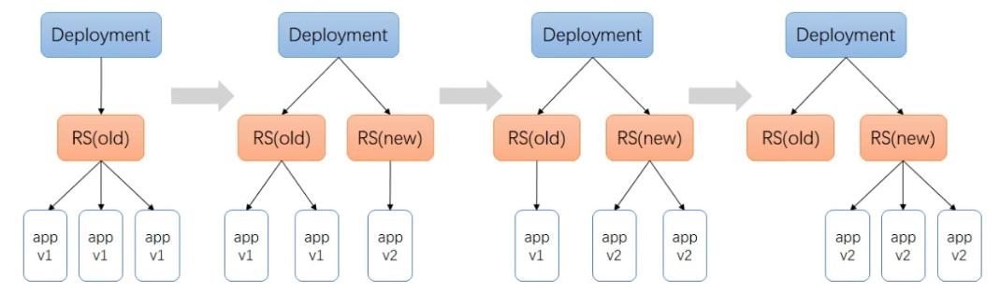

**k8s** 的工作负载、各种控制器

<!-- more -->

# Workload （*工作负载*）

::: warning  只使用 Pod, 将会面临如下需求难以解决

1. 业务应用如何启动多个副本
2. **Pod** 重建后 **IP** 会变化，如何保证依然能通信
3. 外部如何访问 **Pod** 服务
4. 运行业务 **Pod** 的某个节点挂了，如何故障自动转移
5. 若需求是收集各节点监控数据，如何将 **Pod** 运行在 **k8s** 集群的各个节点上

:::

#### 控制器 *Controller*

控制器又称 **工作负载**，是 **管理 Pod 的中间层**，确保 **Pod** 资源符合预期的状态

- 资源出现故障时，会尝试 进行重启
- 当根据重启策略无效，则会重新创建 **Pod** 资源

简要预览如下控制器

- **ReplicaSet：** 代用户创建指定数量的 **Pod 副本** 数量，确保副本数量符合预期状态，并且 **支持滚动式自动扩容和缩容功能**

- **Deployment：** 工作在 **ReplicaSet** 之上，用于 **管理无状态应用**，目前来说 **最好** 的控制器，**支持滚动更新和回滚** 功能，还提供声明式配置

- **DaemonSet：**用于确保集群中，每一个节点只运行特定的 **Pod** 副本（*通常也就一个*），通常用于**实现系统级后台任务**，比如**ELK** 日志服务、监控服务

- **Job：** 只要完成就立即退出，不需要重启或重建

- **Cronjob：** **周期性任务** 控制，不需要持续后台运行

- **StatefulSet：** 管理 **有状态应用**

## 1. Deployments（*无状态*）

**Deployments** 是管理 **Pod** 的控制器，用于 **管理无状态应用**，工作在 **ReplicaSet** 之上，之前 **Pod** 的配置，会指定在 `template:` 之下

[官方文档](https://kubernetes.io/zh-cn/docs/concepts/workloads/controllers/deployment/) 

##### **中间件容器：** 

```yaml
apiVersion: apps/v1
kind: Deployment            # 此时为控制器 Deployment
metadata:
  name: mysql
  namespace: uit
  labels:
    component: zz
spec:
  replicas: 1               # 指定 Pod 副本数
  selector:                 # 指定 Pod 选择器
    matchLabels:            # 必定与下文 labels 对应
      app: mysql
  template:
    metadata:
      labels:               # 给 Pod 打 label，与上文 matchLabels: 对应
        app: mysql
    spec:
      hostNetwork: true     # 声明 pod 的网络模式为host模式，效果同 docker run --net=host
      volumes:
      - name: mysql-data
        hostPath:
          path: /opt/mysql/data
      nodeSelector:         # 使用节点选择器将 Pod 调度到指定 label 的节点
        component: zz
      containers:
      - name: mysql
        image: 192.168.3.171:5000/mysql:5.7
        imagePullPolicy: IfNotPresent
        ports:
        - containerPort: 3306
        env:
        - name: MYSQL_PASSWD
          valueFrom:
            secretKeyRef:
              name: ublog
              key: MYSQL_PASSWD
        - name: MYSQL_DATABASE
          value: "myblog"
        resources:
          requests:
            memory: 100Mi
            cpu: 50m
          limits:
            memory: 500Mi
            cpu: 100m
        readinessProbe:
          tcpSocket:
            port: 3306
          initialDelaySeconds: 5
          periodSeconds: 10
        livenessProbe:
          tcpSocket:
            port: 3306
          initialDelaySeconds: 5
          periodSeconds: 20
        volumeMounts:
        - name: mysql-data
          mountPath: /var/lib/mysql
```

控制器通过 **label** 可以找到对应的 **Pod** ，此时可通过 **label** 进行过滤

```shell
$ kubectl -n uit get po -l component=zz
```

##### **业务容器：（*改造同上*）**  

```yaml
apiVersion: apps/v1
kind: Deployment
metadata:
  name: ublog
  namespace: uit
spec:
  replicas: 1 
  selector:  
    matchLabels:
      app: myblog
  template:
    metadata:
      labels:  
        app: myblog
    spec:
      containers:
      - name: myblog
        image: 192.168.3.171:5000/myblog:v1
        imagePullPolicy: IfNotPresent
        ports:
        - containerPort: 8002
        env:
        - name: MYSQL_HOST
          valueFrom:						# 同上 映射配置 configmap.txt 指定的环境变量
            configMapKeyRef:
              name: ublog
              key: MYSQL_HOST
        - name: MYSQL_PASSWD
          valueFrom:
            secretKeyRef:
              name: ublog
              key: MYSQL_PASSWD
        resources:
          requests:
            memory: 100Mi
            cpu: 50m
          limits:
            memory: 500Mi
            cpu: 100m
        livenessProbe:
          httpGet:
            path: /blog/index/
            port: 8002
            scheme: HTTP
          initialDelaySeconds: 10 # 容器启动后第一次执行探测是需要等待多少秒
          periodSeconds: 15 # 执行探测的频率
          timeoutSeconds: 2 # 探测超时时间
        readinessProbe:
          httpGet:
            path: /blog/index/
            port: 8002
            scheme: HTTP
          initialDelaySeconds: 10
          timeoutSeconds: 2
          periodSeconds: 15
```

#### **操作** 

**Deployment** 创建、查看

```shell
# 创建
$ kubectl create -f deployxx.yaml

# 查看
$ kubectl -n uit get deploy
NAME    READY   UP-TO-DATE   AVAILABLE   AGE
mysql   1/1     1            1           11m
ublog   1/1     1            1           10m

* `NAME` 		# 列出了集群中 Deployments 的名称
* `READY` 		# 显示当前 正在运行的/期望的 副本数
* `UP-TO-DATE`	# 显示已更新 以实现期望状态的 副本数
* `AVAILABLE`	# 显示应用程序 可供用户使用的 副本数
* `AGE` 		# 显示应用程序运行的 时间量

# 查看 replicasets 或是 rs 简写
$ kubectl -n uit get replicasets
NAME               DESIRED   CURRENT   READY   AGE
mysql-6fbb5cc967   1         1         1       10m
ublog-5ff678657f   1         1         1       10m

# 查看 pod
kubectl -n uit get po
NAME                     READY   STATUS    RESTARTS   AGE
mysql-6fbb5cc967-48dfd   1/1     Running   0          12m
ublog-5ff678657f-m42hz   1/1     Running   0          11m

"此时会发现 Pod 的名字是 deployment -> replicasets -> pod 一步步根据 被管理者名称 拼接的"
```

**Deployment** 更新，有如下三种方式

```shell
#修改yaml文件，使用 apply 应用更新
$ kubectl -n uit apply -f ublog.yaml

# 通过命令更新，太长太难记
$ kubectl set image deploy ublog ublog=192.168.3.171:5000/myblog:v2 --record

# 推荐：直接在线编辑
$ kubectl -n uit edit deploy ublog
```

## 2. ReplicaSet（*副本保障机制*）

前身是 **~~Replication Controller（已废弃）~~**  ，现配合 **Deployment** 自动管理，和之前的唯一区别是 **支持标签选择器** 

[官方文档](https://kubernetes.io/zh-cn/docs/concepts/workloads/controllers/replicaset/) 

```yaml
# 修改 yaml 文件的副本数
...
  replicas: 2		# 修改为2，然后执行 apply 即可更新
...
```

将上文的 **deployment** 的副本数量修改为 **2**，然后执行 `apply` 即可更新

```shell
$ kubectl apply -f mysql.yaml

# 查看 Pod，此时发现新的副本正在创建中...但由于调度指定，且端口被占了，中间件是不会创建成功的
kubectl -n uit get po
NAME                     READY   STATUS    RESTARTS   AGE
mysql-6fbb5cc967-48dfd   1/1     Running   0          23m
mysql-6fbb5cc967-rdlrb   0/1     Pending   0          58s
ublog-5ff678657f-m42hz   1/1     Running   0          22m
```

当然，还可以 **通过命令** 修改副本数量

```shell
# 通过命令设置 3个副本
$ kubectl -n uit scale deploy mysql --replicas=3
deployment.apps/mysql scaled

# 观察 Pod, 此时发现又有一个新的副本正在创建中...
$ kubectl -n uit get po
NAME                     READY   STATUS    RESTARTS   AGE
mysql-6fbb5cc967-48dfd   1/1     Running   0          25m
mysql-6fbb5cc967-957gj   0/1     Pending   0          8s
mysql-6fbb5cc967-rdlrb   0/1     Pending   0          3m27s
ublog-5ff678657f-m42hz   1/1     Running   0          25m
```

::: info 其他方式 

当然，还可通过 `kubectl -n uit edit deploy mysql` 的方式，但最好还是上文改 **yaml** 文件然后 `apply` 的方式，有迹可循

:::

##### **ReplicaSet 高可用** 

**ReplicaSet** 会实时检测 **Pod** 状态，并保障副本数一直处于期望的值，此时是无法通过普通的指定来删除 **Pod** 的，由于要保证预期副本数，执行删除，也会被 **ReplicaSet** 自动拉起

```shell
# 删除 Pod，观察 Pod 状态变化
$ kubectl -n uit delete pod ublog-5ff678657f-m42hz

# 发现 旧副本执行删除，并有新副本创建
$ kubectl -n uit get pod
NAME                     READY   STATUS              RESTARTS   AGE
mysql-6fbb5cc967-48dfd   1/1     Running             0          34m
ublog-5ff678657f-8xcp7   0/1     ContainerCreating   0          1s
ublog-5ff678657f-nbs77   1/1     Terminating         0          82s

# 然后 新副本成功运行，继续删除旧副本
mysql-6fbb5cc967-48dfd   1/1     Running       0          35m
ublog-5ff678657f-8xcp7   1/1     Running       0          39s
ublog-5ff678657f-nbs77   0/1     Terminating   0          2m

# 最后 恢复如初
mysql-6fbb5cc967-48dfd   1/1     Running   0          35m
ublog-5ff678657f-8xcp7   1/1     Running   0          41s
```

### 2.1 Replicaset  服务更新

修改 **Dockerfile**，重新打 **tag** 可以模拟服务更新（*v1 -> v2*）

```shell
# 修改前端的显示文案
$ vim ./python-demo/blog/templates/index.html

# 重新 build 镜像，但是指定 tag 未生效，只有镜像ID
$ docker build . -t 192.168.3.171:5000/myblog:v2 -f Dockerfile

# 手动打 tag 并上传
$ docker tag 728e50e60021 192.168.3.171:5000/myblog:v2
$ docker push 192.168.3.171:5000/myblog:v2
```

此时副本数为 **3** 的情况下，修改镜像版本

```shell
# 查看 Pod，发现 新版本镜像正在 滚动更新
kubectl -nuit get po -owide
NAME                     READY   STATUS              RESTARTS   AGE     IP              NODE            NOMINATED NODE   READINESS GATES
mysql-6fbb5cc967-48dfd   1/1     Running             0          11h     192.168.3.172   k8s-slave-172   <none>           <none>
ublog-5f55c5568b-2ggd7   1/1     Running             0          48s     10.244.1.27     k8s-slave-172   <none>           <none>
ublog-5f55c5568b-jstms   1/1     Running             0          24s     10.244.2.24     k8s-slave-173   <none>           <none>
ublog-5f55c5568b-mgn96   0/1     ContainerCreating   0          1s      <none>          k8s-slave-172   <none>           <none>
ublog-5ff678657f-5k2d7   1/1     Terminating         0          2m35s   10.244.1.26     k8s-slave-172   <none>           <none>
ublog-5ff678657f-8xcp7   1/1     Running             0          10h     10.244.2.22     k8s-slave-173   <none>           <none>
ublog-5ff678657f-d8fkk   1/1     Terminating         0          2m35s   10.244.2.23     k8s-slave-173   <none>           <none>
```

##### **更新策略**

也可通过执行如下命令查看到

```shell
$ kubectl -nuit get deploy ublog -oyaml|grep -n7 strategy
```

```yaml
...
spec:
  progressDeadlineSeconds: 600
  replicas: 3						# 上文修改 Pod 副本数
  revisionHistoryLimit: 10			# 保留的历史版本
  selector:							# 上文指定的 Pod 选择器
    matchLabels:
      app: myblog
      
  strategy:							# 此时发现会有如下默认配置项
    rollingUpdate:
      maxSurge: 25%
      maxUnavailable: 25%
    type: RollingUpdate				# 指定更新方式为 滚动更新，默认策略
  
  template:
    metadata:
      creationTimestamp: null
      labels:
        app: myblog
...
```



**策略控制** 

- **maxSurge：** 最大激增（*存活*）数，指更新过程中，最多可比 **replicas** （*预设副本数*）多出的 **Pod** 数量
  - 可为 固定值 或 百分比，默认为 **desired Pods** 数的 **25%**，
  - 计算时 **向上取整** （*比如 3.2，取 4*），更新过程中最多会有 **replicas + maxSurge** 个 **Pod**

- **maxUnavailable：** 最大不可用数，指更新过程中，最多有几个 **Pod** 处于无法服务状态 ,
  - 可以为 固定值 或 百分比，默认为 **desired Pods** 数的 **25%**
  - 计算时 **向下取整** （*比如 2.8，取 2*）


::: info Deployment rollingUpdate 时，需要

- 保证 **Running** 活着的（*非异常状态的*） **Pods** 数不超过 **desired pods number + maxSurge**

- 保证 **Available（*Ready状态的*） Pods** 数不低于 **desired pods number - maxUnavailable** 

:::

::: note 假设 3 副本的 ublog

**Running** 状态的 **Pod** 最多不超过 **3 + 1（*3 x 25%=0.75*） = 4** 个 

**Running** 状态的 **Pod** 最少不低于 **3 - 1（*3 x 25%=0.75*） = 3** 个 

1. 先 新增一个 **v2** 版本的 **Pod**，此时 **3** 个 **v1** 版本 **+ 1** 个**v2** 版本的，当前 **Pod=4** 不能再增加
2. 然后 删掉一个 **v1** 版本的 **Pod**，此时 **2** 个 **v1** 版本 **+ 1** 个**v2** 版本的，当前 **Pod=3** 不能再删除
3. 滚动重复 **1、2** 步骤，直到更新结束

:::

```shell
# 查看副本rs 发现有两个ublog，一个 3副本，一个 0副本
$ kubectl -n uit get rs
NAME               DESIRED   CURRENT   READY   AGE
mysql-6fbb5cc967   1         1         1       2d
ublog-5f55c5568b   3         3         3       37h
ublog-5ff678657f   0         0         0       2d

# 此时，edit 回退到 v1版本，查看滚动更新事件
$ kubectl -n uit describe deploy ublog
...
Conditions:
  Type           Status  Reason
  ----           ------  ------
  Available      True    MinimumReplicasAvailable
  Progressing    True    NewReplicaSetAvailable
OldReplicaSets:  <none>
NewReplicaSet:   ublog-5ff678657f (3/3 replicas created)
Events:
  Type    Reason             Age                From                   Message
  ----    ------             ----               ----                   -------
  Normal  ScalingReplicaSet  89s (x2 over 2d)   deployment-controller  Scaled up replica set ublog-5ff678657f to 1
  Normal  ScalingReplicaSet  66s                deployment-controller  Scaled down replica set ublog-5f55c5568b to 2
  Normal  ScalingReplicaSet  66s                deployment-controller  Scaled up replica set ublog-5ff678657f to 2
  Normal  ScalingReplicaSet  49s (x2 over 37h)  deployment-controller  Scaled up replica set ublog-5ff678657f to 3
  Normal  ScalingReplicaSet  49s                deployment-controller  Scaled down replica set ublog-5f55c5568b to 1
  Normal  ScalingReplicaSet  27s                deployment-controller  Scaled down replica set ublog-5f55c5568b to 0

$ kubectl -n uit get rs
NAME               DESIRED   CURRENT   READY   AGE
mysql-6fbb5cc967   1         1         1       2d
ublog-5f55c5568b   0         0         0       37h
ublog-5ff678657f   3         3         3       2d
```

**replicaset** 会创建不同的名称的 **rs** 副本，然后仅调节对应的副本数更新即可，默认会缓存 **10** 个历史版本数便于回滚

### 2.2 Replicaset 服务回滚

通过滚动升级策略，可平滑升级 **Deployment**，但升级出现问题，需要最快、最好的方式回退到上个正常版本，就需要回滚机制

**revision**：

- 更新应用时，**k8s** 会记录当前的 **revision** （*版本号*），当升级出现问题时，可通过 **revision** 回滚
- 默认配置下，只保留最近的几个 **revision**，可通过 **Deployment** 配置的 `spec.revisionHistoryLimit` 属性增加数量，默认为**10**
- 历史记录，记录的是 **操作过 replicaset 的** 历史

```shell
# 查看版本历史记录
$ kubectl -nuit rollout history deploy ublog
deployment.apps/ublog 
REVISION  CHANGE-CAUSE
2         <none>
3         <none>

# 配置如下，revisionHistoryLimit 为默认 10条记录
$ kubectl -n uit get deploy ublog -oyaml|grep revision
    deployment.kubernetes.io/revision: "3"
  revisionHistoryLimit: 10

"但查看时不会全部显示完整的10条，而是默认显示最近的 2条记录，所以上文从 REVISION 2 开始"
```

发现 **CHANGE-CAUSE** 为 \<none\> 是由于没有添加记录参数，**记录回滚**

```shell
# 使用命令来修改配置文件的版本 v2 -> v1 -> v2
$ kubectl -nuit set image deploy ublog myblog=192.168.3.171:5000/myblog:v1 --record
deployment.apps/ublog image updated

$ kubectl -nuit set image deploy ublog myblog=192.168.3.171:5000/myblog:v2 --record
deployment.apps/ublog image updated

# 再次查看 版本历史记录，发现已经有了命令显示
$ kubectl -nuit rollout history deploy ublog
deployment.apps/ublog 
REVISION  CHANGE-CAUSE
5         kubectl set image deploy ublog myblog=192.168.3.171:5000/myblog:v1 --namespace=uit --record=true
6         kubectl set image deploy ublog myblog=192.168.3.171:5000/myblog:v2 --namespace=uit --record=true
```

删除 **Deployment** 再重建，版本记录会清空，并从 **1** 记录

```shell
$ kubectl delete -f ublog.yaml
deployment.apps "ublog" deleted

# 将版本记录再改为 v1
$ vim ublog.yaml 

# 增加 --record 参数，重新创建
$ kubectl create -f ublog.yaml --record
deployment.apps/ublog created

# 通过命令修改版本
$ kubectl -nuit set image deploy ublog myblog=192.168.3.171:5000/myblog:v2 --record

# 查看历史记录
$ kubectl -nuit rollout history deploy ublog
deployment.apps/ublog 
REVISION  CHANGE-CAUSE
1         kubectl create --filename=ublog.yaml --record=true
2         kubectl set image deploy ublog myblog=192.168.3.171:5000/myblog:v2 --namespace=uit --record=true
```

回滚到具体的 **revision**

```shell
# 执行回滚操作
$ kubectl -nuit rollout undo deploy ublog --to-revision=1
deployment.apps/ublog rolled back

# 此时历史记录更新，重复记录了回滚记录
$ kubectl -nuit rollout history deploy ublog
deployment.apps/ublog 
REVISION  CHANGE-CAUSE
2         kubectl set image deploy ublog myblog=192.168.3.171:5000/myblog:v2 --namespace=uit --record=true
3         kubectl create --filename=ublog.yaml --record=true

# 此时访问应用，查看输出版本，此时又变回 v1
curl 10.244.1.35:8002/blog/index/
```

后续见 

## 3. StatefulSet

**StatefulSet** 同上也是管 **Pod** 的，区别是用来管理 **有状态应用** 的，且为每个 **Pod** 维护一个 **有粘性、永久不变** 的 **ID** ，常用来弄中间件，需持久化数据的应用

[官方文档](https://kubernetes.io/zh-cn/docs/concepts/workloads/controllers/statefulset/) 

::: info 命名

每个 **Pod** 在重新调度时依然会保留持久的标识符，格式为 **StatefulSetName-Number** ，如创建名字是 **Redis-Sentinel** 的 **StatefulSet** 起 **3** 个 **Pod** ，名字通常为 **Redis-Sentinel-0 / 1 / 2**，一般格式如下

```sh
"statefulSetName-{0..N-1}.serviceName.namespace.svc.cluster.local" 
```

- **serviceName** 是 **Headless Service** 的名字，必须指定
- **0..N-1** 为 **Pod** 序号
- **.cluster.local** 是 **Cluster Domain（*集群域* ）** 
- 同一命名空间下，**namespace.svc.cluster.local** 可省略

:::

**StatefulSet** 启动时，只有 **当前一个容器完全启动，后一个容器才会被调度**，并且每个容器的标识符固定，可以根据标识符来断定当前 **Pod** 的角色，因此可以配置集群应用

::: tip 如配置主从 **redis**，名为 **redis-ms**，使用 **StatefulSet** 进行部署

- 启动第一个容器，标识符为 **redis-ms-0** ，此时就可以根据 **0** 来认为它是 **Master** 节点
- 后面再启动第二个 **redis** 就可以通过标识符来连接 **Master** 节点
- 第二个启动后则为 **Slave** 节点 **redis-ms-1**

:::

**StatefulSet** 使用 **Headless Service（*无头服务* ）** 进行通信，即没有 **Cluster IP** ，而是用 **Endpoint** 来通信，但 **yaml** 中必须要指定一个 **serviceName** 进行绑定，因此通常和 **Service** 放一起，结构如下

```yaml
apiVersion: v1
kind: Service
metadata:
  name: nignx
  namespace: dev
  labels:
    app: nginx
spce:
  ports:
  - port: 80
    name: web
  clusterIP: None
  selector:
    app: nginx
---
apiVersion: apps/v1
kind: StatefulSet
metadata:
  name: web
  namespace: dev
spec:
  serviceName: "nginx"
  replicas: 2
  selector:
    matchLabels:
      app: nginx
    template:
      metadata:
        labels:
          app: nginx
      spce:
        containers:
        - name: nginx
          image: nginx: 1.15.2
          ports:
          - containerPort: 80
            name: web
```

 

## 4. DaemonSet

**DaemonSet** 同上也是管 **Pod** 的，区别是用来管理 **有状态应用** 的

## 5. Job
