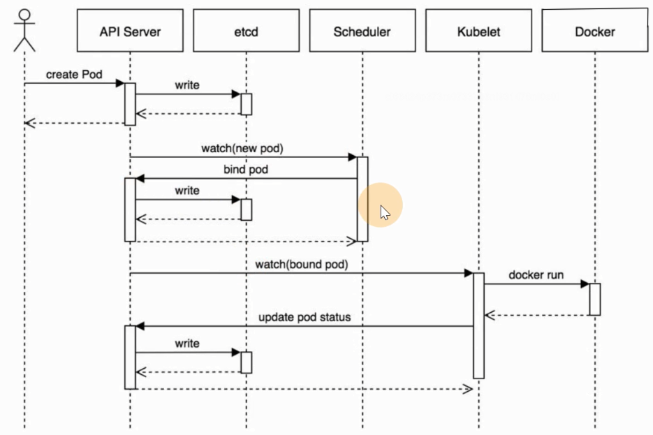
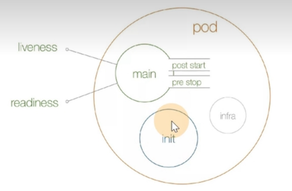
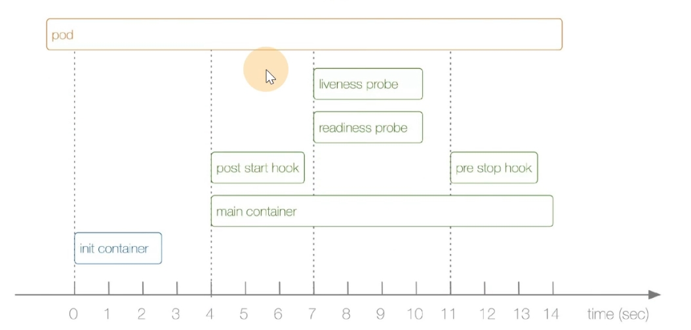

# Kubernets 基础

记录 **kubernetes** 相关文档、基础、**Pod** 的使用说明等

<!-- more -->

## k8s 相关文档

[官网 | 学习 Kubernetes 基础知识 | Kubernetes](https://kubernetes.io/zh-cn/docs/tutorials/kubernetes-basics/)

[kubespray.io](https://kubespray.io/#/) 

[Kubernetes教程 | Kuboard](https://kuboard.cn/learning/)


查看k8s 或docker 日志

```shell
journalctl -fu docker | kubelet

# 也可以用docker 看日志
docker logs -f + container_id
```

使用Deployment管理Pod生命周期，实现服务不中断的滚动更新，通过服务发现来实现集群内部的服务间访问，并通过ingress-nginx实现外部使用域名访问集群内部的服务。同时介绍基于EFK如何搭建Kubernetes集群的日志收集系统。


## 1. Kubernetes 概述

纯 **Docker** （*容器模式*） 的运维管理麻烦，尤其涉及到跨容器网络通信，故诞生了容器调度管理平台 **Kubernetes** ，由于功能强大，**17** 年后渐渐成为主流

##### **架构图如下**


##### **包含如下核心组件**

- **[etcd]()：** 分布式高性能键值 **数据库**，存储整个集群的所有元数据，**只通过 ApiServer 访问**
- **ApiServer：** **接口** 服务器，用来交互的，集群资源访问控制入口，提供 **restful api** 及安全访问控制
- **Scheduler：** **调度器**，把业务容器调度到合适节点
- **Controller Manager：** **控制管理器，20来种的统称**，确保集群资源按照期望的方式运行，生成元数据，故在调度之前，**k8s 中最复杂的点** 
  - **Replication Controller** 
  - **Node controller** 
  - **ResourceQuota Controller** 
  - **Namespace Controller** 
  - **ServiceAccount Controller** 
  - **Tocken Controller** 
  - **Service Controller** 
  - **Endpoints Controller** 

- **kubelet：** 节点代理，运行在每个节点上，管节点同时汇报情况给 **Master** 管理节点
  - **pod管理：**  容器的抽象，最小资源调度单位，管容器的，被 **kubelet** 管的
  - **容器健康检查：** 检查容器是否正常运行，若运行出错，按照 **pod** 设置的重启策略处理
  - **容器监控：** 监控容器所在节点资源的使用情况，定时向 **Master** 报告，资源使用数据通过 **cAdvisor** 获取的，对于 **pod** 调度和正常运行至关重要
- **kube-proxy：** 维护节点中的 **iptables** 或 **ipvs** 规则
- **[kubectl](https://kubernetes.io/zh-cn/docs/reference/kubectl/)：** 命令行工具
- **cni：** 通用网络接口，如 **flannel** 等的网络插件，实现集群跨节点通信

##### **其工作流程如下**



::: warning 关于性能

**ApiServer** 压测 **10w+** 大概才会出现性能问题（*应该是普通的企业主机配置*）

:::

部署后则生成 **kubelet** 进程，可执行 **kubectl** 二进制命令行工具，其中

- **组件：** 启动的一个进程，为了支撑 **k8s** 平台的运行，安装好的软件
- **资源：** **k8s** 提供的能力，被 **k8s** 所管理

```shell
# 查看 systemd 服务
systemctl status kubelet

# 查看 kubernetes的资源，简写
kubectl api-resources
```

##### **kubectl**的使用

类似于 **docker**，**[kubectl](https://kubernetes.io/zh-cn/docs/reference/kubectl/)** 是 **CLI**，用于与 **APIServer** 交互，内置了丰富的子命令，功能强大

```powershell
$ kubectl -h
$ kubectl get -h
$ kubectl create -h
$ kubectl create namespace -h
# 管理集群资源
$ kubectl get po -v=7
```

## 2. namespace

命名空间，集群内的虚拟概念，类似于资源池，池中有各种资源，绝大多数的资源都必须属于某一个**namespace** 

```shell
# 集群初始化安装好之后，会默认有如下几个
$ kubectl get ns	# or get namespaces

NAME                   STATUS   AGE
default                Active   10d
kube-node-lease        Active   10d
kube-public            Active   10d
kube-system            Active   10d
kubernetes-dashboard   Active   9d
```

- 所有 **namespaces** 资源，创建时都要指定 `-n ns`，若不指定，默认为 **default** 
- 同一个 **namespace** 下的同类资源 **不能重名**，不同类型的资源可以重名，不同 **namespace** 也可
- 在项目通常创建带有业务含义的 **namespace** 来做逻辑上的整合

::: tip

```shell
kubectl -n xxxns get xxx	# 命名空间放前面，方便复用
```

:::

## 3. Pod

**最小调度单元**，理解为存放多个容器的（*豆荚*），为和容器引擎（*Docker*）解耦（*如 **1.22.x** 改用 **containerd***），抽象出一层 **Pod** 让 **k8s** 进行调度，被 **kubelet** 定期 **watch** ，更新状态并写入 **etcd** 

```shell
# 查看命名空间 kube-system 下的 pods
$ kubectl -n kube-system get po
```

##### **使用 yaml格式 定义 Pod**

**yaml** 工程师，推荐使用**yaml** 而非 **json**，因为大家都用 **yaml...** 如下创建一个 `django.yaml` 文件

```yaml
apiVersion: v1										# API 版本
kind: Pod											# 资源类型
metadata:
  name: ublog										# Pod 名称
  namespace: uit									# 指定命名空间
  labels:											# 作标记
    component: zzblog
spec:
  containers:										# 编写 Pod 中 包含的容器列表
    - name: myblog									# 容器名
      image: 192.168.3.171:5000/myblog:v1			# 拉取镜像地址
      imagePullPolicy: IfNotPresent					# 若本地无，再去远程拉取
      env:											# 环境变量
      - name: MYSQL_HOST 							# 环境变量 Key - Value
        value: "127.0.0.1"
      - name: MYSQL_PASSWD
        value: "123456"
      ports:
      - containerPort: 8002
    - name: mysql
      image: 192.168.3.171:5000/mysql:5.7
      imagePullPolicy: IfNotPresent
      ports:
      - containerPort: 3306
      env:											
      - name: MYSQL_ROOT_PASSWORD
        value: "123456"
      - name: MYSQL_DATABASE
        value: "myblog"
```

| apiVersion | 含义 |
| :--------- | :----------------------------------------------------------- |
| **alpha** | 进入 **k8s** 功能的早期候选版本，可能包含 **Bug**，最终不一定进入 **k8s** |
| **beta** | 已经过测试的版本，最终会进入 **k8s**，但功能、对象定义可能会发生变更 |
| **stable** | 可安全使用的稳定版本 |
| **v1** | **stable** 版本之后的首个版本，包含了更多的核心对象 |
| **apps/v1** | 使用最广泛的版本，像 **Deployment**，**ReplicaSets** 都已进入该版本 |

**资源类型** 与 **apiVersion** 的对照表（*编写如下资源的 **yaml** 该指定那个 **apiVersion***）

| Kind | apiVersion |
| :-------------------- | :-------------------------------------- |
| **ClusterRoleBinding** | **rbac.authorization.k8s.io/v1** |
| **ClusterRole** | **rbac.authorization.k8s.io/v1** |
| **ConfigMap** | **v1** |
| **CronJob** | **batch/v1beta1** |
| **DaemonSet** | **extensions/v1beta1** |
| **Node** | **v1** |
| **Namespace** | **v1** |
| **Secret** | **v1** |
| **PersistentVolume** | **v1** |
| **PersistentVolumeClaim** | **v1** |
| **Pod** | **v1** |
| **Deployment** | **v1、apps/v1、apps/v1beta1、apps/v1beta2** |
| **Service** | **v1** |
| **Ingress** | **extensions/v1beta1** |
| **ReplicaSet** | **apps/v1、apps/v1beta2** |
| **Job** | **batch/v1** |
| **StatefulSet** | **apps/v1、apps/v1beta1、apps/v1beta2** |

快速查看 **资源** 对应的 **版本**

```shell
$ kubectl explain pod
$ kubectl explain Pod.apiVersion
```

##### **镜像拉取策略** 

```yaml
spec:
  containers:
  - name: ...
    image: ...
    imagePullPolicy: IfNotPresent
```

- **Always：** 即使本地有，也总是远程仓库拉取镜像
- **IfNotPresent：**  默认为此，本地有则使用本地镜像，没有才去远程仓库拉取
- **Never：** 只使用本地镜像，没有则报错

### 3.1 **Infra 容器**

登录 **k8s-slave-172** 节点，执行如下命令，发现有 **三个容器** （*上文只编写了两个*）

```shell
$ docker ps -a |grep blog

4321affa391e   c20987f18b13                                        "docker-entrypoint.s…"   About an hour ago   Up About an hour                    k8s_mysql_ublog_uit_2905ba41-b03a-4d8d-8fb3-538e962dccbc_0
766410c81aee   2fd137e95f13                                        "./run.sh"               About an hour ago   Up About an hour                    k8s_myblog_ublog_uit_2905ba41-b03a-4d8d-8fb3-538e962dccbc_0
29feb4ab89be   registry.aliyuncs.com/google_containers/pause:3.1   "/pause"                 About an hour ago   Up About an hour                    k8s_POD_ublog_uit_2905ba41-b03a-4d8d-8fb3-538e962dccbc_0
```

包含了上文编写的 **mysql** 和 **myblog** 两个，但额外多出个 **pause** 状态的容器

::: info 为了实现 Pod 内部容器，能通过 localhost 通信:

- 每个 **Pod** 都会启动 **Infra** 容器
- **Pod** 内部的网络空间会共享 **Infra** 容器的网络空间（*类比 **Docker** 网络的 **container** 模式* ）
- **Infra** 容器只需 **夯住** 网络空间，无需额外功能，资源消耗极低

:::

查看 **Pod** 内部的容器 **IP** ，会发现均相同，都为 **Pod IP**

```shell
# 如下的 10.244.1.23 
$ kubectl -nuit exec -ti ublog -c myblog ifconfig
eth0: flags=4163<UP,BROADCAST,RUNNING,MULTICAST>  mtu 1450
        inet 10.244.1.23  netmask 255.255.255.0  broadcast 10.244.1.255
        ether 1e:8c:df:d3:f3:00  txqueuelen 0  (Ethernet)
        RX packets 38  bytes 3026 (2.9 KiB)
        RX errors 0  dropped 0  overruns 0  frame 0
        TX packets 24  bytes 6618 (6.4 KiB)
        TX errors 0  dropped 0 overruns 0  carrier 0  collisions 0
```

::: tip Pod 容器命名

**k8s \_\<container_name\>\_\<pod_name\>\_\<namespace\>\_\<random_string\>**

 :::

### 3.2 **Pod 基本操作**

##### 创建和访问Pod

```shell
# 创建 命名空间（namespace） 逻辑上的资源池
$ kubectl create namespace uit

# 使用指定文件创建 Pod
$ kubectl create -f django.yaml

# 所有的操作都需要指定 -n 即namespace，但 default 命名空间可省略，
$ kubectl -n demo get pods -o wide
NAME    READY   STATUS    RESTARTS   AGE   IP            NODE            NOMINATED NODE   READINESS GATES
ublog   2/2     Running   0          69m   10.244.1.23   k8s-slave-172   <none>           <none>
# - 查看pod，可以简写 po（其他资源同）
# - -o wide 表示查看广泛的信息，即详情
# - -o yaml/json|more 还可查看 Pod 是根据什么样的原文件运行的

# 使用 Pod IP 访问服务 上文得出 IP 是10.244.1.23 被调度到了 k8s-slave-172 节点
$ curl 10.244.1.23:8002/blog/index

# 进入容器执行初始化, 不必到对应的主机执行docker exec
$ kubectl -n uit exec -ti ublog -c myblog /bin/bash

# 查看环境变量
$ env|grep MYSQL
MYSQL_HOST=127.0.0.1
MYSQL_PASSWD=123456

# 初始化数据库
$ python3 manage.py migrate

# 进入另一个容器 -c: chose 表选择
$ kubectl -n uit exec -ti ublog -c mysql bash

# 查看数据库
$ mysql -p123456
$ show databases;

# 退出 或 ctrl + d
exit
```

##### **删除 Pod 服务**

```shell
# 根据文件删除
$ kubectl delete -f django.yaml

# 根据 Pod name 删除
$ kubectl -n <namespace> delete pod <pod_name>
# 如 kubectl -n uit delete pod ublog

# 删的慢 可以手动切到对应节点，执行
$ docker rm -f <container>
```

##### **Troubleshooting and Debugging**

```shell
# 查看 Pod 的 明细信息 及 事件
$ kubectl -n uit describe pod ublog

# 进入 Pod 内的 容器
$ kubectl -n <namespace> exec <pod_name> -c <container_name> -ti /bin/sh

# 查看 Pod 内容器 日志，显示标准或者错误输出日志
$ kubectl -n <namespace> logs -f --tail=20 <pod_name> -c <container_name>
```

##### 更新 Pod 服务版本（*若更改文件* ）

```shell
# apply 应用使之生效
$ kubectl apply -f django.yaml

# 仅特定字段 如：镜像版本 之类的改动才会生效，例如 labels、env 之类的改动不会生效
```

### 3.3 **Pod 数据持久化（*挂载* ）**

若删除了 **Pod**，但 **MySQL** 的数据都在容器内部，会造成数据丢失，故需挂载出来持久化

使用 **hostpath** 和 **nodeSelector** 定点挂载

```shell
# 查看节点的 labels 如下
$ kubectl get no --show-labels
NAME             STATUS   ROLES    AGE   VERSION   LABELS
k8s-master-171   Ready    master   15d   v1.16.2   beta.kubernetes.io/arch=amd64,beta.kubernetes.io/os=linux,kubernetes.io/arch=amd64,kubernetes.io/hostname=k8s-master-171,kubernetes.io/os=linux,node-role.kubernetes.io/master=
k8s-slave-172    Ready    <none>   15d   v1.16.2   beta.kubernetes.io/arch=amd64,beta.kubernetes.io/os=linux,kubernetes.io/arch=amd64,kubernetes.io/hostname=k8s-slave-172,kubernetes.io/os=linux
k8s-slave-173    Ready    <none>   15d   v1.16.2   beta.kubernetes.io/arch=amd64,beta.kubernetes.io/os=linux,kubernetes.io/arch=amd64,kubernetes.io/hostname=k8s-slave-173,kubernetes.io/os=linux

# 给 node 节点资源打 label
$ kubectl label node k8s-slave-172 component=zz
# 删除即 “-” 号
$ kubectl label node k8s-slave-172 component-

# 再次查看 172 的 labels 发现前面已显示
$ kubectl get no --show-labels |grep k8s-slave-172
k8s-slave-172    Ready    <none>   15d   v1.16.2   beta.kubernetes.io/arch=amd64,beta.kubernetes.io/os=linux,component=zz,kubernetes.io/arch=amd64,kubernetes.io/hostname=k8s-slave-172,kubernetes.io/os=linux
```

然后改写文件如下

```yaml
apiVersion: v1
kind: Pod
metadata:
  name: ublog
  namespace: uit
  labels:
    component: zzblog
spec:
  volumes:								# 宿主机 的挂载，与 containers 同级
    - name: mysql-data
      hostPath:
        path: /opt/mysql/data			# 宿主机 的挂载点
  nodeSelector: 						# 使用 节点选择器，将 Pod 调度到指定 label 的节点
    component: zz
  containers:										
  - name: myblog
    image: 192.168.3.171:5000/myblog:v1
    imagePullPolicy: IfNotPresent
    env:
    - name: MYSQL_HOST
      value: "127.0.0.1"
    - name: MYSQL_PASSWD
      value: "123456"
    ports:
    - containerPort: 8002
  - name: mysql
    image: 192.168.3.171:5000/mysql:5.7
    imagePullPolicy: IfNotPresent
    ports:
    - containerPort: 3306
    env:											
      - name: MYSQL_ROOT_PASSWORD
        value: "123456"
      - name: MYSQL_DATABASE
        value: "myblog"
    volumeMounts:						# 定义 源 的挂载
    - name: mysql-data					# 上文 宿主机 定义的卷名
      mountPath: /var/lib/mysql			# 容器中 源 的 挂载点
```

此时重新创建

```shell
# 在 k8s-slave-172 查看目录
ls /opt/mysql/data/
.... `发现会多出一堆 pod 上 mysql 的文件`
```

::: warning 局限性

只能 **固定在单个节点** 上持久化，若该节点挂了，此时存储的数据也随之而挂

因此，可使用 **PV + PVC** 的方式 **对接分布式存储**来解决

- **分布式存储：** **UFS**、 **ceph** 、**glusterfs**、**nfs**（*高可用版*）

:::

### 3.4 **服务健康检查**

检测容器服务是否健康的手段，若不健康，会根据设置的 **重启策略**（*restartPolicy*）进行操作，两种检测机制可以分别单独设置，若不设置，默认**Pod** 一直健康

```yaml
...
  containers:										
  - name: myblog
    image: 192.168.3.171:5000/myblog:v1
    imagePullPolicy: IfNotPresent
    livenessProbe:
    # ReadinessProbe:
      httpGet:
        path: /blog/index/
        port: 8002
        scheme: HTTP
      initialDelaySeconds: 5		# 容器启动后，x s后，才开始第一次探测
      periodSeconds: 5				# 执行探测的频率，默认是 10s，隔 x s后，再探测
      timeoutSeconds: 2				# 探测超时时间，默认 1s，最小 1s
...
```

- **LivenessProbe 探针（*存活性检查* ）**

  **kubelet** 根据配置的探针判断容器是否存活（***Running** 状态*），若不健康 **kubelet** 会 **kill** 掉容器，并根据配置的重启策略重启，若不包含 **LivenessProbe** 探针，则返回值永远成功

- **ReadinessProbe 探针（*可用性检查* ）**

  **kubelet** 根据配置的探针判断容器是否正常提供服务（***Ready** 是否为 **True***） 可以接收请求，如果失败，容器的 **Ready** 为 **False**，控制器将此 **Pod** 的 **Endpoint** 从对应的 **service** 的 **Endpoint** 列表中移除，从此不再将任何请求调度该 **Pod** 上，直到下次探测成功为止

- **检测类型** 

  - **exec：** 通过执行命令来检查服务是否正常，回值为 **0** 则表示容器健康

  - **httpGet：** 通过发送 **http** 请求检查服务是否正常，返回 **200-399** 状态码则表明容器健康

  - **tcpSocket：** 通过容器的 **IP** 和 **Port** 执行 **TCP** 检查，如果能够建立 **TCP** 连接，则表明容器健康

- **successThreshold：** 探测失败后，最少连续探测成功多少次才被认定为成功，默认是**1**
  - 对于 **LivenessProbe** 必须是**1**，最小值是**1**
- **failureThreshold：** 探测成功后，最少连续探测失败多少次才被认定为失败，默认是 **3**，最小值 **1**

::: note 举例

按上文配置，**Pod 的容器** 启动 **5s（*initialDelaySeconds*）** 后，用 **HTTP** 访问 **8002** 端口的 **/blog/index/** 路由，若 **超过2s** 或 返回码不在 **200~399** 内，连续 **failureThreshold** 次，则健康检查失败

:::

##### **重启策略（*RestartPolicy*）** 

```yaml
metadata:
...
spce:
  restartPolicy: OnFailure
  containers:
  - name: ...
    image: ...
    args:
    - /bin/sh
    - -c
    - sleep 10 && exit 0
...
```

应用于 **Pod** 内的所有容器，仅由 **kubelet** 进行判断和重启操作，当某个 **容器异常退出** 或 **健康检查失败** 时，**kubelet** 来进行如下设置的操作

- **Always：** 默认为此，容器失败，自动重启
- **OnFailure：** 容器终止运行且退出码不为 **0** 时（*异常退出* ），自动重启（*正常则返回 Complete* ）
- **Never：** 不论运行状态如何，都不会重启该容器

### 3.5 **Pod 资源限制** 

保证充分利用集群资源，且确保重要容器在运行周期内能够分配到足够的资源稳定运行，因此平台需要具备

Pod的资源限制的能力， 资源限制最关注的即 **CPU** 和 **Memory**

```yaml
...
  containers:
  - name: myblog
    ...
    ports:
    - containerPort: 8002
    resources:
      requests:
        memory: 100Mi
        cpu: 50m
      limits:
        memory: 500Mi
        cpu: 100m
...
```

- **requests：** （*不会限制最大使用资源*）

  - 容器使用的最小资源需求，作用于 **schedule** 阶段，作为容器调度时资源分配的判断依赖

  - 只有当前节点上可分配的资源量 **>= request** 时才允许将容器调度到该节点

  - **requests.cpu** 会被转成容器的 `--cpu-shares` 参数，与 **cgroup cpu.shares** 功能相同 (*无论宿主机有多少个 **CPU** 或者内核，都会按照比例分配*）

  - r**equests.memory** 没有对应容器的参数，仅作为 **k8s** 调度依据


- **limits：**

  - 容器能使用资源的最大值

  - 设置为 **0** 表示对使用的资源不做限制，可无限的使用

  - 当 **pod** 内存超过 **limit** 时，会被 **oom**

  - 但 **cpu** 超时不会被 **kill**，但会限制不超过 **limit** 值（*由于 **CPU** 是可压缩资源*）

  - **limits.cpu** 会被转换成容器的 `-–cpu-quota` 参数。与 **cgroup cpu.cfs_quota_us** 功能相同

  - **limits.memory** 会被转换成容器的 `-–memory` 参数，用于限制容器使用的最大内存


计算机的 **CPU** 是按 **时间片** 的方式来进行分配的，系统里的每一个操作都需要 **CPU** 的处理，哪个任务申请的时间片多，即得到的 **CPU** 资源越多

**CGroup** 里面对于 **CPU** 资源的单位换算：

```shell
1 CPU = 1000 millicpu（1 Core = 1000m）
```

- 1**000m：** 其中 **m** 表示毫、毫核的意思

::: tip

**Kubernetes** 中的每个节点通过操作系统命令确认自身 **CPU** 内核数量，然后乘以**1000**，得到的就是节点总 **CPU** 总毫数

- 比如一个节点有**四核**，那么该节点的 **CPU** 总毫量为 **4000m**

`docker run` 命令和 **CPU** 限制相关的所有选项如下

| 选项                  | 描述                                                    |
| --------------------- | ------------------------------------------------------- |
| `--cpuset-cpus=""`    | 允许使用的 CPU 集，值可以为 0-3,0,1                     |
| `-c`,`--cpu-shares=0` | CPU 共享权值（相对权重）                                |
| `cpu-period=0`        | 限制 CPU CFS 的周期，范围从 100ms~1s，即[1000, 1000000] |
| `--cpu-quota=0`       | 限制 CPU CFS 配额，必须不小于1ms，即 >= 1000，绝对限制  |

```shell
docker run -it --cpu-period=50000 --cpu-quota=25000 ubuntu:20.04 /bin/bash
```

将调度的周期设为 **50000**，容器在每个周期内的 **CPU** 配额设置为 **25000**，表示该容器每 **50ms** 可以得到 **50%** 的 **CPU** 运行时间

:::

### 3.6 优化改造

 在真实使用场景中，上述 **Pod** 存在如下问题需要优化

- **中间件应作为公共资源** （*数据库、MQ、Cache 等* ），为多个项目提供服务
  - 不适合与业务容器绑定同一 **Pod** ，因为业务容器往往经常变更，而中间件则很少迭代

-  **密码、环境变量等应该统一管理**

针对环境变量，**k8s** 提供 **configMap** 和 **Secret**，实现业务配置的统一管理， 允许将配置文件与镜像文件分离，以使容器化的应用程序具有可移植性 。

#### **ConfigMap（*常用环境变量* ）** 

通常用来管理应用的 **配置文件** 或者 **环境变量** （*非特别敏感* ），可以将环境相关的信息存入 **ConfigMap** 里面， 然后 **Pod** 去其中读，如下创建文件 

```yaml
apiVersion: v1
kind: ConfigMap
metadata:
  name: ublog
  namespace: uit
data:
  MYSQL_HOST: "192.168.3.172"	# 下文会通过 label 将调度指定 k8s-slave-172 节点
  MYSQL_PORT: "3306"
```

创建并查看

```shell
$ kubectl create -f configmap.yaml
$ kubectl -n uit get cm
```

另一种创建方式 `configmap.txt` ，好处是灵活、写的少

```shell
vim configmap.txt
MYSQL_HOST=192.168.3.172
MYSQL_PORT=3306

$ kubectl -n uit create configmap ublog --from-env-file=configmap.txt
```

#### **secret（*密码* ）** 

常用来管理 **敏感类** 的信息，默认会 **base64** 编码存储，有三种类型

- **Service Account ：** 用来访问 **k8s API**，自动创建，且会自动挂载到 **Pod** 上的 `/run/secrets/kubernetes.io/serviceaccount` 目录，之后 **Pod** 指定 **serviceAccount** 自动创建对应的 **secret**
- **Opaque ：** 是 **base64** 编码格式的 **Secret**，用来 **存储密码、密钥** 等
- **kubernetes.io/dockerconfigjson ：** 用来存储私有 **docker registry** 的认证信息

如下创建一个 `secret.yaml`

```yaml
apiVersion: v1
kind: Secret
metadata:
  name: ublog
  namespace: uit
type: Opaque
data:
  MYSQL_USER: cm9vdA== 			# 注意加 -n 参数, echo -n root|base64
  MYSQL_PASSWD: MTIzNDU2
```

创建并查看：

```shell
$ kubectl create -f secret.yaml
$ kubectl -n uit get secret
```

另一种创建方式 `secret.txt` ，好处同上

```shell
$ cat secret.txt
MYSQL_USER=root
MYSQL_PASSWD=123456
$ kubectl -n uit create secret generic ublog --from-env-file=secret.txt
```

##### **中间件容器：（*MySQL*）** 

```yaml
apiVersion: v1
kind: Pod
metadata:
  name: mysql
  namespace: uit
  labels:
    component: zz
spec:
  hostNetwork: true						# 修改为 host 模式，此时 MySQL运行的IP 为 宿主机IP
  volumes:
  - name: mysql-data
    hostPath:
      path: /opt/mysql/data
  nodeSelector:
    component: zz
  containers:
  - name: mysql
    image: 192.168.3.171:5000/mysql:5.7
    imagePullPolicy: IfNotPresent
    ports:
    - containerPort: 3306
    env:
    - name: MYSQL_ROOT_PASSWORD
      valueFrom:						# 映射 secret.txt 中设置的敏感值
        secretKeyRef:
          name: ublog
          key: MYSQL_PASSWD
    - name: MYSQL_DATABASE
      value: "myblog"
    resources:
      requests:
        memory: 100Mi
        cpu: 50m
      limits:
        memory: 500Mi
        cpu: 100m
    readinessProbe:
      tcpSocket:
        port: 3306
      initialDelaySeconds: 5
      periodSeconds: 10
    livenessProbe:
      tcpSocket:
        port: 3306
      initialDelaySeconds: 5
      periodSeconds: 20
    volumeMounts:
    - name: mysql-data
      mountPath: /var/lib/mysql
```

- **hostNetwork：** 声明 **Pod** 的网络模式为 **host** 模式，等同 `docker run --net=host`

**业务容器：**

```yaml
apiVersion: v1
kind: Pod
metadata:
  name: ublog
  namespace: uit
  labels:
    component: zz
spec:
  containers:
    - name: myblog
      image: 192.168.3.171:5000/myblog:v1
      imagePullPolicy: IfNotPresent
      ports:
      - containerPort: 8002
      env:
      - name: MYSQL_HOST
        valueFrom:						# 同上 映射配置 configmap.txt 指定的环境变量
          configMapKeyRef:
            name: ublog
            key: MYSQL_HOST
      - name: MYSQL_PASSWD
        valueFrom:
          secretKeyRef:
            name: ublog
            key: MYSQL_PASSWD
      resources:
        requests:
          memory: 100Mi
          cpu: 50m
        limits:
          memory: 500Mi
          cpu: 100m
      livenessProbe:
        httpGet:
          path: /blog/index/
          port: 8002
          scheme: HTTP
        initialDelaySeconds: 10 # 容器启动后第一次执行探测是需要等待多少秒
        periodSeconds: 15 # 执行探测的频率
        timeoutSeconds: 2 # 探测超时时间
      readinessProbe:
        httpGet:
          path: /blog/index/
          port: 8002
          scheme: HTTP
        initialDelaySeconds: 10
        timeoutSeconds: 2
        periodSeconds: 15
```

执行创建

```shell
$ kubectl create -f mysql.yaml
$ kubectl create -f ublog.yaml

# 访问 ublog Pod 服务正常
$ curl 10.244.2.18:8002/blog/index/
```

**补充：** `/etc/kubernetes/manifests` 目录下存放  **静态Pod**，即凡是放在这个目录下的 **yaml** 文件，**k8s** 会自动创建，无需执行 `kubectl create -f` ，且删除也会自动拉起，目录下的 **yaml** 可用于编写参考（*同时有这种目录的，一定是 **kubeadm** 搭建起来的集群*）

::: warning 注意

- 部署不同的环境时，**Pod** 的 **yaml** 无须再变化，只在每套环境中维护一套 **ConfigMap** 和 **Secret** 即可

- **ConfigMap** 和 **secret** 不能跨 **namespace** 使用
- 更新配置后，**Pod** 内的 **env** 不会自动更新，重建后方可更新

::: 

### 3.7 **Pod 状态与生命周期**

| 状态值 | 描述 |
| ----------------- | ------------------------------------------------------------ |
| **Pending** | **API Server** 已经创建该 **Pod**，等待调度器调度 |
| **ContainerCreating** | 镜像正在创建 |
| **Running** | **Pod** 内，容器均已创建，且至少有一个容器处于运行状态、正在启动状态或正在重启状态 |
| **Succeeded** | **Pod** 内，所有容器均已成功执行退出，且不再重启 |
| **Failed** | **Pod** 内，所有容器均已退出，但至少有一个容器退出为失败状态 |
| **CrashLoopBackOff** | **Pod** 内，有容器启动失败，比如配置文件丢失导致主进程启动失败 |
| **Unknown** | 由于某种原因无法获取该 **Pod** 的状态，可能由于网络通信不畅导致（*少见*） |

##### **启动和关闭示意**





**init container：** 初始化容器，做一些初始化操作

- 验证业务应用依赖的组件是否均已启动
- 修改目录权限
- 调整系统参数

**main container：** 执行的主容器，即 **containers** 下定义的

**lifecycle：** 有如下两个钩子

- **postStart：** 容器启动该做的事情，和 **mainContainer** 不分先后
- **preStop：** 容器停止之前该做的事情

```yaml
...
spec:
  initContainers:
  - command:
    - /sbin/sysctl
    - -w 
    - vm.max_map_count=262144
    image: alpine:3.6
    imagePullPolicy: IfNotPresent
    name: elasticsearch-logging-init
    resources: {}
    securityContext:
      privileged: true
  - name: fix-permissions
    image:alpine: 3.6
    command: ["sh", "-c", "chown -R 1000:1000 /usr/share/elasticsearch/data"]
    securityContext:
      privileged: true
    volumeMounts:
    - name: elasticsearch-logging
      mountPath: /usr/share/elasticsearch/data
...
```

验证 **Pod** 生命周期示例，`demo-pod-start.yaml`

```yaml
apiVersion: v1
kind: Pod
metadata:
  name: demo-start-stop
  namespace: uit
  labels:
    component: demo-start-stop
spec:
  initContainers:
  - name: init
    image: busybox
    command: ['sh', '-c', 'echo $(date +%s): INIT >> /load/timing']
    volumeMounts:
    - mountPath: /load
      name: timing
  containers:
  - name: main
    image: busybox
    command: ['sh', '-c', 'echo $(date +%s): START >> /load/timing;sleep 10; echo $(date +%s): END >> /loap/timing;']
    volumeMounts:
    - mountPath: /load
      name: timing
    livenessProbe:
      exec:
        command: ['sh', '-c', 'echo $(date +%s): LIVENESS >> /load/timing']
    readinessProbe:
      exec:
        command: ['sh', '-c', 'echo $(date +%s): READINESS >> /load/timing']
    lifecycle:
      postStart:
        exec:
          command: ['sh', '-c', 'echo $(date +%s): POST-START >> /load/timing']
      preStop:
        exec:
          command: ['sh', '-c', 'echo $(date +%s): PRE-STOP >> /load/timing']
  volumes:
  - name: timing
    hostPath:
      path: /tmp/load
```

创建 Pod 测试

```shell
$ kubectl create -f demo-pod-start.yaml

# 查看demo状态
$ kubectl -n uit get po -o wide -w

# 查看调度节点 k8s-slave-172 的/tmp/loap/timing
$ cat /tmp/load/timing
1666057181: INIT
1666057199: START
1666057199: POST-START
1666057202: LIVENESS
1666057206: READINESS
1666057227: START
1666057227: POST-START
1666057232: LIVENESS
1666057236: READINESS
1666057272: START
...
```

> 须主动杀掉 **Pod** 才会触发 `pre-stop hook`，如果是 **Pod** 自己 **Down** 掉，则不会执行 `pre-stop hook`

### **3.8 Pod 驱逐策略（*简述*）**

**k8s** 有个特色功能叫 **pod eviction**，它在某些场景下如：节点 **NotPodReady**、或者资源不足时，把 **Pod** 驱逐至其它节点，是出于业务保护的角度去考虑的

1. **Kube-controller-manager：** 周期性检查所有节点状态，当节点处于 **NotReady** 状态超过一段时间后，驱逐该节点上所有 **pod**，并停掉 **kubelet**

   - **pod-eviction-timeout：（*controller-manager的一个参数*）** 当 **NotReady** 状态节点超过该时间后，执行驱逐，默认 **5 min**，仅适用于 **1.13** 版本之前

     - **1.13** 版本后，集群开启 `TaintBasedEvictions` 与 `TaintNodesByCondition` 功能，若节点失联等异常，**k8s** 会自动为该节点打上 **污点** ，同时为 **Pod** 默认添加如下容忍设置

       ```yaml
       tolerations:
       - effect: NoExecute
         key: node.kubernetes.io/not-ready
         operator: Exists
         tolerationSeconds: 300
       - effect: NoExecute
         key: node.kubernetes.io/unreachable
         operator: Exists
         tolerationSeconds: 300
       ```

       各 **Pod** 可以独立设置驱逐容忍时间

2. **Kubelet：** 周期性检查本节点资源，当资源不足时，按照优先级驱逐部分 **Pod**

   - **memory.available：** 节点可用内存

   - **nodefs.available：** 节点根盘可用存储空间

   - **nodefs.inodesFree：** 节点 **inodes** 可用数量

   - **imagefs.available：** 镜像存储盘的可用空间

   - **imagefs.inodesFree：** 镜像存储盘的 **inodes** 可用数量
