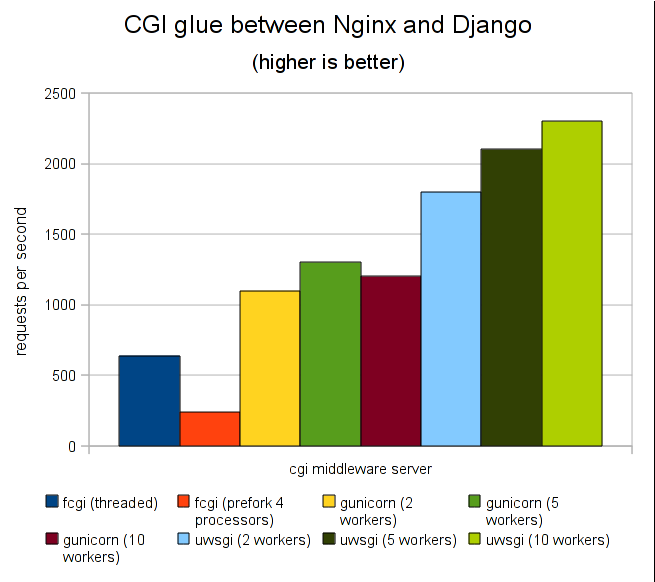

# Django部署

**Django** 和 **Flask** 项目部署方式很多，采用 **Nginx + uwsgi + Django** 较常见

<!-- more -->

## 1. 部署说明

### 1.1 uWSGI 服务器

它实现了 **WSGI** 、**uwsgi**、**HTTP** 等协议，本身也是 **WEB Server**，可不与 **Nginx** 搭配，就能承载高并发，但通常搭配 **Nginx** 来负载均衡、反向代理、承载前端静态文件等

- **Nginx** 中 `HttpUwsgiModule` 模块的作用，是与 `uWSGI` 服务器交互
- **[WSGI](./Nginx基础.html#nginx)**：是 **Web** 服务器网关接口，不是服务器，是种通信规范
- **uwsgi** 是 [uWSGI 服务器](./Nginx基础.html#nginx) 独占的一种**线路协议**，不是通信协议，常用于其他网络服务器的数据通信
  - 定义了传输信息的类型，每个`uwsgi packet` 前 **4byte** 为传输信息类型描述

:::tip 生产环境，就用 uWSGI 

:::

### 1.2 uWSGI 特点

- 超快的性能
- 低内存占用，实测大概 **apache2** 的 `mod_wsgi`（模块）一半左右
- 多 **app** 管理，省去冥思苦想应用的端口号
- 详尽的日志功能，分析性能瓶颈
- 高度可定制（_内存大小限制，服务一定次数后重启等_）



:::tip 用户请求到 Django 应用的流程

1. 浏览器 将请求发给 **Nginx**  [`user -> Nginx`]
2. **Nginx** 通过 **uwsgi** 协议，转发给 **uWSGI** [`Nginx -> uwsgi -> uWSGI`]
3. **uWSGI** 再转发给 **Django** 应用 [`uWSGI -> Django`]

:::

:::note

**Nginx** 和 **uWSGI**之间是通过 `unix socket`，把请求转到 `socket` 上的

:::

### 1.3 uWSGI 安装使用

- 安装

  ```shell
  $ pip install uwsgi

  # ... or if you want to install the latest LTS (long term support) release
  $ pip install https://projects.unbit.it/downloads/uwsgi-lts.tar.gz
  ```

- 基本测试

  ```python
  # mkdir uWSGI_test dir and Create a file called test.py:

  # test.py
  def application(env, start_response):
      start_response('200 OK', [('Content-Type','text/html')])
      return [b"Hello World"] # python3
  ```

  - 运行:

    ```shell
    $ uwsgi --http :8000 --plugin python --wsgi-file test.py
    ##  --plugin python 告诉uWSGI 用python插件，防止出错
    ```

- 用 `uwsgi` 启动 **Django**

  ```shell
  # 项目名.wsgi 是 Django 工程的项目名
  $ uwsgi --http :8000 --module --plugin python 项目名.wsgi
  ```

- 创建，配置 `uwsgi`

  ```shell
  # touch application-uwsgi.ini
  $ cat application-uwsgi.ini
  
  [uwsgi]
  
  http = :9000 								# 与 Nginx 的 socket通信的进程
  socket = 127.0.0.1:8001 					# 告诉 uWSGI 项目 BASE_DIR
  
  chdir = /home/igarashi/CODE/Application		# 上面写了绝对路径，此时直接写路径即可
  
  wsgi-file = Application/wsgi.py
  
  processes = 4 								# 启 4个 进程
  threads = 2									# 每个进程 启 俩 线程
  
  stats = 127.0.0.1:9191						# 监控命令，监控后台，启动后会多占个进程
  vacuum          = true						# 退出时把相关的环境、环境变量清除掉
  
  daemonize      = /var/log/日志.log		# 日志
  
  # 启动：
  $ /usr/local/bin/uwsgi --ini application-uwsgi.ini
  
  ## 查看uwsgi启动的进程
  ps -ef |grep uwsgi
  
  ## 全库搜索和uwsgi相关的包等等
  sudo apt-cache search uwsgi |grep uwsgi
  
  ## 安装uwsgi的监控
  pip3 install uwsgitop  # uwsgitop:9191 端口 进行监控
  ```

### 1.4 配置 Nginx

安装配置见：[Nginx 基础](./Nginx基础.html#_2-安装)

- 默认为 `/etc/nginx/sites-enabled/default` 文件的配置

  ```ini
  server {
      # the port your site will be served on
      listen      80;
      # the domain name it will serve for
      server_name 127.0.0.1; # substitute your machine's IP address or FQDN
      charset     utf-8;

      # max upload size
      client_max_body_size 75M;   # adjust to taste

      # Django media
      location /media  {
          alias /home/ubuntu/blog/media;  # your Django project's media files - amend as required
      }

      location /static {
          alias /home/ubuntu/blog/static; # your Django project's static files - amend as required
      }

      # Finally, send all non-media requests to the Django server.
      location / {
          include     uwsgi_params; # the uwsgi_params file you installed
          uwsgi_pass 127.0.0.1:8001;
      }
  }
  ```

- 收集 **Django** 静态文件

  ```shell
  # Django setting.py
  STATIC_ROOT = os.path.join(BASE_DIR, "static/")
  DEBUG = False
  ALLOWED_HOSTS = ['*']
  
  # 收集
  $ python manage.py collectstatic
  ```
