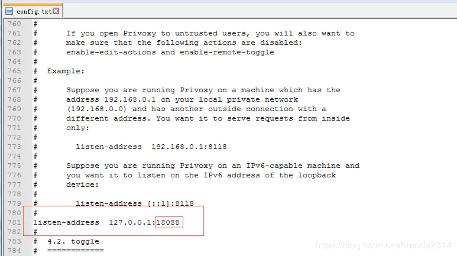
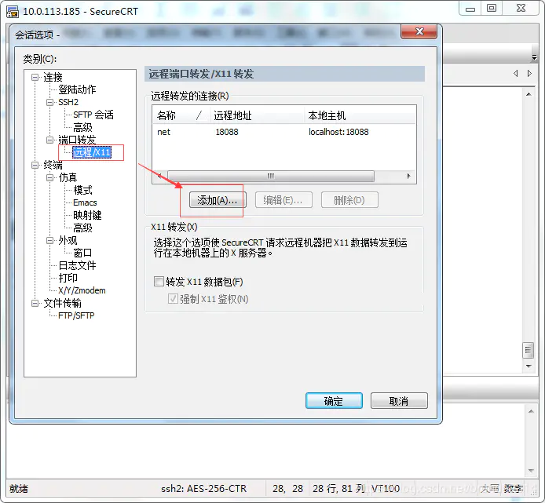
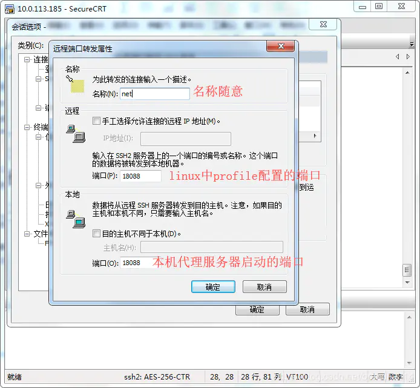

# 配置 Linux 网络代理

## 配置 linux 通过 Windows 上网的网络代理

> **背景：** 由于一些服务器处于安全考虑，只能通过内网访问，且服务器不能够请求外网，此时需要 `Windows` 代理让 **Linux 联网** 来安装应用

### 1. privoxy

`Windows` 上先安装代理工具 [privoxy](https://www.jianshu.com/p/42a90cf33095)

[下载地址](http://www.privoxy.org/)

安装软件后，配置启动端口：修改安装目录下的 `config.txt` 文件中的 `listen-address` （**记得备份**）：


<br/>

点击 `privoxy.exe` 启动代理服务器

### 2. 在 linux 中配置代理

- 修改 `/etc/profile` 文件：

  ```shell
  http_proxy=http://127.0.0.1:18088/
  https_proxy=http://127.0.0.1:18088/
  export http_proxy https_proxy
  ```

- 执行如下命令使配置生效：

  ```shell
  source /etc/profile
  ```

- 或是通过命令 **一次性** 的设置、取消代理:

  ```shell
  # 直接执行命令
  export http_proxy=http://127.0.0.1:18088/
  export https_proxy=http://127.0.0.1:18088/

  # 取消代理
  unset http_proxy
  unset https_proxy
  ```

### 3. 配置映射

**通过 SecureCRT 配置 Linux 到本机的映射**

- 先正常按照 `xshell` 的方式配置一个远程连接 session

- 然后找到 选项 `Options` -> `Session Options` -> `端口转发Prot...` -> `X11`

    

- 点击 `add` 按钮，`Name` 随便起，`Port` 为 **18088** 即可

    

最后测试:

```shell
curl www.baidu.com
```

### 4. 快捷配置

下载 [CCProxy](https://www.youngzsoft.net/ccproxy/)

启动软件并直接执行如下命令即可

```shell
export all_proxy=http://172.16.70.104:808
```
