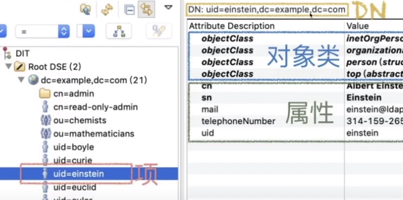

微软 **LDAP** 协议的一个实现，但又不仅仅实现了 **LDAP** 协议，它先实现了一个 **LDAP** 服务器，在此基础上又实现了具体的应用 **（_Windows 域控_）** ，常用于公司的用户、计算机资源统一管理

<!-- more -->

# 1. AD

**AD（_Active Directory 活动目录_）：** 可以作为数据源， **和各种应用集成**，比如公司内部的软件系统、**Web** 应用等，还可以设立群组、访问权限等

## 1.1 核心概念

**DomainController** （**DC**： _域控制器_），就是一台装了 **AD** 活动目录服务的 **Windows** 服务器，所有的域用户等的资源信息都会存在 **DC** 里

:::tip

一旦装上域控制器，就 **没有本地用户** 了，会自动的变为域用户，实际应用场景可能会有多个 **DC**

:::

**成员计算机：** 公司有很多计算机，需要和域控制器通信、连接时，需要加入域，和一套 **信任机制** 的，加入到域时，会生成信任密钥（_类似 token_），每隔一段时间会刷新 **key**，不同成员间需要访问的话，也要通过 **DC 的 token**

**sid：** 用户和计算机都有（_security id_）作为唯一标识

**Directory：** 用来存储用户帐户、计算机帐户、打印机与共享文件等对象，这些对象的存储位置都是目录数据库（_Directory Database_）

:::note

**AD** 活动目录都要配一个本地的 **DNS** 服务，因为活动目录一般都不会通过 **ip** ，而是通过域名来登录，这样用户可以通过域名来访问 **DC** 域控制器

:::

## 1.2 关键字

**DIT（_Driectory Information Tree_）：** 目录信息树

**Root DSE（_Root DSA-specific entry_）：** 根节点项

**ObjectClass：** 对象类，指定规则，比如本项中必须有、可能有的属性，比如规定 **User** 必须有人名

**项：** 如 `uid=einstein`、`CN=zhengze` ，每个项都会包含 **对象类** 和 **属性**

**DN（_distinguishedName_）：** 代表了该条目的 **唯一标识** ，类似数据库的主键，可以通过该名字找到唯一记录，实际是从左到右，记录了 **当前节点到树根的路径** ，也可以理解为 **叶子节点**

:::tip 不仅能直接用户登入，AD 也可以通过 DN 来登入的

:::

**RDN：** 是 **DN** 的组成部分，一个键值对就是一个 **RDN** ，如 `CN=zhengze` , `CN=Users` , `DC=uit` , `DC=devops` , `DC=local` 就是 **5** 个 **RND**

**DC（_domain component_）：** 这里不是上文的域控制器，而是 **域名组成** ，比如 `uit.deveops.local` 拆出来的域名组成

**C（_country_）：** 指国家，国际化公司常用

**O（_organization_）：** 指公司

**OU（_organization unit_）：** 组织单元，指部门、分公司，可以理解为一个 **树** 

> 下面可以包含：用户、计算机、工作组、打印机、安全策略、其他组织等

**CN（_Common name_）：** 通用记录名，也会用 **uid** ，也指记录名/用户唯一标识，又时会共存

# 2. AD DS

**Active Directory** 的 **Directory** 则是用来存储用户帐户、计算机帐户、打印机与共享文件等对象，这些对象的存储位置都是目录数据库（*Directory Database*），而 **Active Directory** 负责提供目录服务的组件就是 **AD域服务**（*AD DS*），负责操作（*增删改查*）目录数据库。

**AD DS** 可以在一台计算机、一个小型 **LAN** 或是数个 **WAN** 的结合中，它包含此范围内所有的对象，如文件、打印机、应用程序、服务器、域控制器与用户帐号等。
