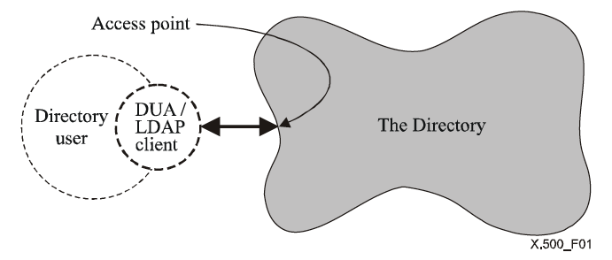
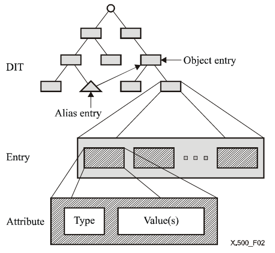
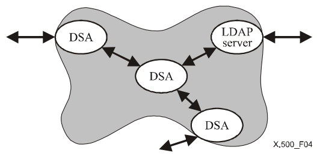
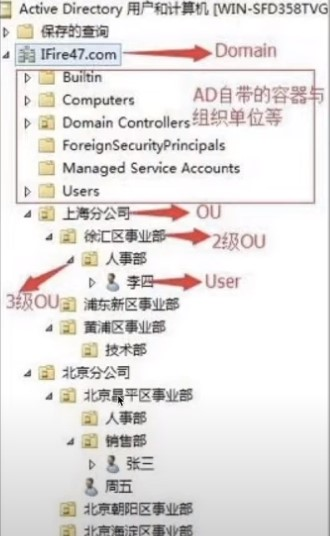
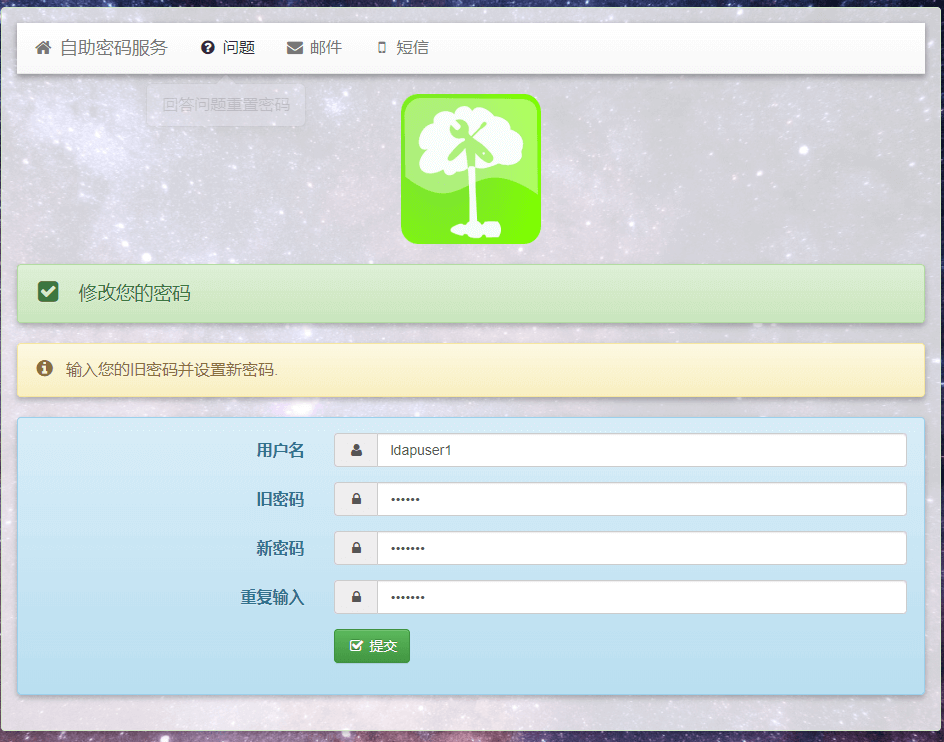
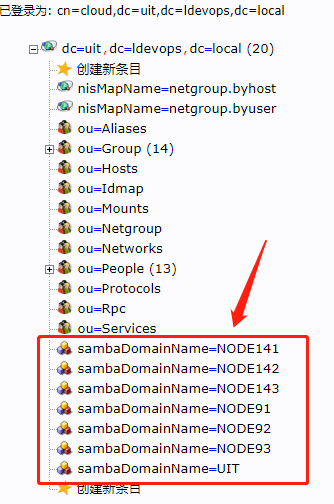

# LDAP

**DAP（Directry Access Protocol）：** 即目录访问协议，较老、复杂且重量级，后面又出轻量级、更好用的 **LDAP**

<!-- more -->

## 1. X.500 协议

### 1.1 概述

**X.500** 定义了目录系统，**LDAP** 只是它的轻量级实现

##### **目录系统**

**Directory：** 目录服务，旨在提供一个用户友好的 `name-address` 类的映射，其中 `name` 不可变，`address` 允许动态变化，即`key-value` 结构

**DIB：** 目录信息库，由一批系统组成，每个系统持有对应现实世界的逻辑数据，这些存储的数据叫做 **DIB**



一个标准的目录系统，有以下几部分

- 目录服务
- 目录服务的用户
- 目录服务用来暴露自己的访问端点
- 用户和服务之间使用协议如 LDAP 进行交互
- 用户使用 LDAP 客户端访问目录服务

### 1.2 DIB 与 DIT

**DIB** 目录信息库，由 **DIT**（_目录信息树_）、节点 **Entry**、**Entry** 中的属性及属性值构成，树形结构

- **Entry** 代表一个节点，类型可以是 `object`，也可以是 `alias` 别名
- 一个 **Entry** 内可以拥有多个属性
- 一个属性内可以拥有一个 **Type**，以及多个 **Value**



::: tip 

故这种树形存储结构适用于，查询多、更新少

:::

### 1.3 分布式 Directory

**Directory** 支持分布式操作，此时的服务端组成如下



**DSA（_Directory System Agent_）：** 用来连接服务和 **DUA**。他可以缓存 **Directory** 数据，可以用本地数据直接响应，也可以单纯做一个转发

**LDAP Server**：是 **Directory Service** 的一部分，可以直接使用本地数据，也可以转发到其它 **LDAP Server** 获取数据

## 2. LDAP 协议

**LDAP 协议：** 是 **轻量级的目录访问协议**，其中

- **L（_LightWeight_）：** 轻量级

- **D（_Directory_）：** 目录
- **AP（_Access Protocol_）：** 存取协议

是 **读性能高，写性能低且没有回滚机制** 的数据存储协议，不是数据库，没有数据库这么强大，而是一个树状结构的目录，每个叶子都是由一条一条的分成若干区域的记录



### 2.1 概念说明

**Entry：** 最小单元 (_对象_）

**LDIF：** 上文 **Entry** 的纯文本表示文件

**Schema：** 模式（_对象类的集合_）对属性做了限制

**attribute：** 基本对象的属性

**ObjectClass：** 属性集合（_基本对象的继承属性_）

**backend & database**

[属性说明 - 参考 AD](./AD)

[参考详解 LDAP](https://blog.csdn.net/zou8944/article/details/122287398)

## 3. 搭建 LDAP服务端

[ReadHat OpenLDAP](https://access.redhat.com/documentation/en-us/red_hat_enterprise_linux/7/html/system-level_authentication_guide/openldap)

[OpenLDAP](http://www.openldap.org/) 是一款 **LDAP** 开源集中账号管理的实现，支持众多系统版本，被广大互联网公司使用，**openldap-server** 的数据必须用原配的 **Berkeley DB**，不能使用 **MySQL** 作为后端数据库

:::tabs

@tab CentOS

**关闭 selinux 和防火墙**

```shell
setenforce 0
sed -i '/SELINUX/s/enforcing/disabled/' /etc/selinux/config
systemctl disable firewalld.service && systemctl stop firewalld.service
systemctl stop NetworkManager && systemctl disable NetworkManager
```

**按需换源**

```shell
sed -e 's!^#baseurl=!baseurl=!g' \
       -e  's!^mirrorlist=!#mirrorlist=!g' \
       -e 's!mirror.centos.org!mirrors.ustc.edu.cn!g' \
       -i  /etc/yum.repos.d/CentOS-Base.repo

yum install -y epel-release
sed -e 's!^mirrorlist=!#mirrorlist=!g' \
	-e 's!^#baseurl=!baseurl=!g' \
	-e 's!^metalink!#metalink!g' \
	-e 's!//download\.fedoraproject\.org/pub!//mirrors.ustc.edu.cn!g' \
	-e 's!http://mirrors\.ustc!https://mirrors.ustc!g' \
	-i /etc/yum.repos.d/epel.repo /etc/yum.repos.d/epel-testing.repo
```

**同步时间**

```shell
yum install -y ntpdate ntp
ntpdate 0.cn.pool.ntp.org
hwclock --systohc
cat <<EOF>> /etc/ntp.conf
driftfile /var/lib/ntp/drift
server 0.cn.pool.ntp.org
server 1.cn.pool.ntp.org
server 2.cn.pool.ntp.org
server 3.cn.pool.ntp.org
EOF

systemctl enable ntpd  && systemctl start ntpd
ntpq -p
```

**安装 OpenLDAP**

```shell
yum -y install openldap compat-openldap openldap-clients openldap-servers openldap-servers-sql openldap-devel migrationtools
```

**查看 OpenLDAP 版本**

```shell
slapd -VV
@(#) $OpenLDAP: slapd 2.4.44 (Feb 23 2022 17:11:27) $
	mockbuild@x86-01.bsys.centos.org:/builddir/build/BUILD/openldap-2.4.44/openldap-2.4.44/servers/slapd
```

**OpenLDAP** 相关配置文件信息

- `/etc/openldap/slapd.conf：` **OpenLDAP** 主配置文件，记录根域信息，管理员名称，密码，日志，权限等
- `/etc/openldap/slapd.d/*：` 这下面是 `/etc/openldap/slapd.conf` 配置信息生成的文件，每修改一次配置信息，这里的东西就要重新生成
- `/etc/openldap/schema/*：` **OpenLDAP** 的 **schema** 存放的地方
- `/var/lib/ldap/*：` **OpenLDAP** 的数据文件
- `/usr/share/openldap-servers/DB_CONFIG.example：` 模板数据库配置文件

**OpenLDAP** 监听的端口

- 默认监听端口：**389**（*明文数据传输*）
- 加密监听端口：**636**（*密文数据传输*）

启动 **slapd** 服务

```shell
systemctl start slapd
systemctl enable slapd
```

:::

### 3.1 配置 OpenLDAP

##### **配置OpenLDAP数据库**

**OpenLDAP** 默认使用 **BerkeleyDB**，如下命令配置数据库

```shell
cp /usr/share/openldap-servers/DB_CONFIG.example /var/lib/ldap/DB_CONFIG
```

**生成 ldap 管理员密码** （*初始化后默认空密码* ）

```shell
slappasswd -s user@dev
{SSHA}rEXQDROfAHRMoZS1TnFTZBsNL+387ogk
```

**修改 olcDatabase={2}hdb.ldif 文件**

```shell
vim /etc/openldap/slapd.d/cn\=config/olcDatabase\=\{2\}hdb.ldif

olcSuffix: dc=uit,dc=ldevops,dc=local
olcRootDN: cn=cloud,dc=uit,dc=ldevops,dc=local
olcRootPW: {SSHA}rEXQDROfAHRMoZS1TnFTZBsNL+387ogk
```

**修改olcDatabase={1}monitor.ldif文件**

```shell
vim /etc/openldap/slapd.d/cn\=config/olcDatabase\=\{1\}monitor.ldif

olcAccess: {0}to * by dn.base="gidNumber=0+uidNumber=0,cn=peercred,cn=extern
 al,cn=auth" read by dn.base="cn=cloud,dc=uit,dc=ldevops,dc=local" read by * none
```

其中 `dn.base` 是修改 **OpenLDAP** 的管理员信息的

**验证 OpenLDAP 的基本配置**

```shell
slaptest -u
5d30769d ldif_read_file: checksum error on "/etc/openldap/slapd.d/cn=config/olcDatabase={1}monitor.ldif"
5d30769d ldif_read_file: checksum error on "/etc/openldap/slapd.d/cn=config/olcDatabase={2}hdb.ldif"
config file testing succeeded
```

> 校验error请忽略

**修改ldap文件权限**

```shell
chown -R ldap:ldap /var/lib/ldap/
chown -R ldap:ldap /etc/openldap/
```

**启动并查看**

```shell
systemctl start slapd
systemctl enable --now slapd
systemctl status slapd.service

ss -natup | grep 389
tcp    LISTEN     0      128       *:389                   *:*                   users:(("slapd",pid=1773,fd=8))
tcp    LISTEN     0      128      :::389                  :::*                   users:(("slapd",pid=1773,fd=9))
```

**导入基本 Schema**

```shell
# 查看预生成的 ldif 文件
ll /etc/openldap/schema

ldapadd -Y EXTERNAL -H ldapi:/// -f /etc/openldap/schema/cosine.ldif
ldapadd -Y EXTERNAL -H ldapi:/// -f /etc/openldap/schema/nis.ldif
ldapadd -Y EXTERNAL -H ldapi:/// -f /etc/openldap/schema/inetorgperson.ldif

# 注意！！加域必须要如下ldif 文件
ldapadd -Y EXTERNAL -H ldapi:/// -f /etc/openldap/schema/samba.ldif
```

**修改 migrate_common.ph 文件**

改文件主要用于生成 **ldif** 文件使用，修改如下

```shell
vim /usr/share/migrationtools/migrate_common.ph +71

# Default DNS domain
$DEFAULT_MAIL_DOMAIN = "uit.ldevops.local";

# Default base 
$DEFAULT_BASE = "dc=uit,dc=ldevops,dc=local";

$EXTENDED_SCHEMA = 1;
```

**生成 base.ldif**

```shell
mkdir /root/openldap
/usr/share/migrationtools/migrate_base.pl >/root/openldap/base.ldif

ldapadd -x -D "cn=cloud,dc=uit,dc=ldevops,dc=local" -w user@dev -f /root/openldap/base.ldif
```

**添加用户及用户组**

默认情况下 **OpenLDAP** 没有普通用户的，但有个管理员用户，即刚配置的 **root**

现在我们把系统中的用户，添加到 **OpenLDAP** 中，为了进行区分，新加两个用户 **ldapuser1** 和 **ldapuser2**，和两个用户组 **ldapgroup1** 和 **ldapgroup2**

```shell
groupadd ldapgroup1
groupadd ldapgroup2
```

添加用户并设置密码

```shell
useradd -g ldapgroup1 ldapuser1
useradd -g ldapgroup2 ldapuser2
echo '123456' | passwd --stdin ldapuser1
echo '123456' | passwd --stdin ldapuser2
```

将 用户 和 用户组提取出来，包括该用户的密码和其他相关属性

```shell
grep ":10[0-9][0-9]" /etc/passwd > /root/openldap/users
grep ":10[0-9][0-9]" /etc/group > /root/openldap/groups
```

根据上述生成的 用户 和 用户组 属性，使用 **migrate_passwd.pl** 文件生成对应的 **ldif**

```shell
/usr/share/migrationtools/migrate_group.pl /root/openldap/groups > /root/openldap/groups.ldif
/usr/share/migrationtools/migrate_passwd.pl /root/openldap/users > /root/openldap/users.ldif
```

**导入用户及用户组到OpenLDAP数据库**

```shell
ldapadd -x -w "user@dev" -D "cn=cloud,dc=uit,dc=ldevops,dc=local" -f /root/openldap/groups.ldif
ldapadd -x -w "user@dev" -D "cn=cloud,dc=uit,dc=ldevops,dc=local" -f /root/openldap/users.ldif
```

**把OpenLDAP用户加入到用户组**

尽管已经把用户和用户组信息，导入到 **OpenLDAP** 数据库中了，但实际上 **用户 和 用户组之间没有任何关联** ，关联需另外单独配置

把 **ldapuser1** 用户加入到 **ldapgroup1** 用户组，需要新建添加用户到用户组的 **ldif** 文件，如下

```shell
cat > /root/openldap/add_user_to_groups.ldif << "EOF"
dn: cn=ldapgroup1,ou=Group,dc=uit,dc=ldevops,dc=local
changetype: modify
add: memberuid
memberuid: ldapuser1

dn: cn=ldapgroup2,ou=Group,dc=uit,dc=ldevops,dc=local
changetype: modify
add: memberuid
memberuid: ldapuser2
EOF

ldapadd -x -w "user@dev" -D "cn=cloud,dc=uit,dc=ldevops,dc=local" -f /root/openldap/add_user_to_groups.ldif
```

**查询测试** 刚才添加的 **OpenLDAP** 用户组信息，如下：

```shell
ldapsearch -LLL -x -D "cn=cloud,dc=uit,dc=ldevops,dc=local" -w "user@dev" -b "dc=uit,dc=ldevops,dc=local" "cn=ldapgroup1"

dn: cn=ldapgroup1,ou=Group,dc=uit,dc=ldevops,dc=local
objectClass: posixGroup
objectClass: top
cn: ldapgroup1
userPassword:: e2NyeXB0fXg=
gidNumber: 1002
memberUid: ldapuser1
```

### 3.2 开启 OpenLDAP 日志访问

默认情况下 **OpenLDAP** 未启用日志记录功能，但实际使用过程中，定位问题需要使用 **OpenLDAP** 日志

新建日志配置 **ldif** 文件，如下

```shell
cat > /root/openldap/loglevel.ldif << EOF
dn: cn=config
changetype: modify
replace: olcLogLevel
olcLogLevel: stats
EOF

ldapmodify -Y EXTERNAL -H ldapi:/// -f /root/openldap/loglevel.ldif
```

修改 **rsyslog** 配置文件，并重启服务，如下

```shell
cat >> /etc/rsyslog.conf << EOF
local4.* /var/log/slapd.log
EOF

systemctl restart rsyslog
systemctl restart slapd
```

使用 **ldapuser1** 认证

```shell
ldapwhoami -x -D uid=ldapuser1,ou=People,dc=uit,dc=ldevops,dc=local -w 123456

dn:uid=ldapuser1,ou=People,dc=uit,dc=ldevops,dc=local
```

查看 **OpenLDAP** 日志

```shell
$ tail /var/log/slapd.log

Nov  1 10:24:55 [localhost] slapd[30924]: conn=1006 fd=11 closed
Nov  1 10:25:12 [localhost] slapd[30924]: conn=1007 fd=11 ACCEPT from IP=[::1]:56602 (IP=[::]:389)
Nov  1 10:25:12 [localhost] slapd[30924]: conn=1007 op=0 BIND dn="uid=ldapuser1,ou=People,dc=uit,dc=ldevops,dc=local" method=128
Nov  1 10:25:12 [localhost] slapd[30924]: conn=1007 op=0 BIND dn="uid=ldapuser1,ou=People,dc=uit,dc=ldevops,dc=local" mech=SIMPLE ssf=0
Nov  1 10:25:12 [localhost] slapd[30924]: conn=1007 op=0 RESULT tag=97 err=0 text=
Nov  1 10:25:12 [localhost] slapd[30924]: conn=1007 op=1 EXT oid=1.3.6.1.4.1.4203.1.11.3
Nov  1 10:25:12 [localhost] slapd[30924]: conn=1007 op=1 WHOAMI
Nov  1 10:25:12 [localhost] slapd[30924]: conn=1007 op=1 RESULT oid= err=0 text=
Nov  1 10:25:12 [localhost] slapd[30924]: conn=1007 op=2 UNBIND
Nov  1 10:25:12 [localhost] slapd[30924]: conn=1007 fd=11 closed
```

### 3.3 说明

#### 配置 LDIF 文件

**.ldif** 配置文件，通常用来进行数据添加、初始化等（*手动编辑效率低因此通常用上文的工具*），文件内容类似如下

```shell
# 假设要创建一个名为 uit.ldevops.local.ldif 的ldif 文件，内容如下
vim uit.ldevops.local.ldif

# 创建名为 uit.ldevops.local 的 top根域
dn: dc=uit,dc=ldevops,dc=local			# 条目标识
objectclass: top						# 对象类型为 顶级 即根
objectclass: domain						# 对象类型为 域
objectclass: dcobject					
objectclass: organization				
dc: uit									# 必须定义属性dc
o: uit									# 必须定义属性 o

# 创建名为 cloud 的组织 ou
dn: ou=cloud,dc=uit,dc=ldevops,dc=local
ou: cloud
objectclass: organizationalUnit			# ou 组织

# 创建名为 admin 的 person 用户
dn: cn=admin,ou=cloud,dc=uit,dc=ldevops,dc=local
cn: admin
sn: admin
objectclass: person						# person 类型的用户

# 创建名为 zz 的 person 用户
dn: cn=zz,ou=cloud,dc=uit,dc=ldevops,dc=local
cn: zz
sn: zz
objectclass: person
```

- **dn** 是主键，要唯一，要确保这些数据不能与已有数据相同，否则操作中断

有了 **.ldif** 文件，就可以将其添加到 **目录数据库**，导入到 **LDAP**，其创建的层级结构，类似如下

```shell
                 +-------------------------------+
                 |  dc=uit,dc=ldeveops,dc=local  |
                 +-------------------------------+
                 |
                 v
        +--------+--+
        |ou=cloud|
        +-+------+--+
          |      |
          v      v
   +------+-+   ++----+
   |cn=admin|   |cn=zz|
   +--------+   +-----+
```

若要添加管理员密码的 **.ldif** 文件

```shell
# 创建 passwd.ldif 如下
dn: olcDatabase={2}hdb,cn=config
changetype: modify
replace: olcSuffix
olcSuffix: dc=test,dc=com

dn: olcDatabase={2}hdb,cn=config
changetype: modify
replace: olcRootDN
olcRootDN: cn=dev3,dc=test,dc=com

dn: olcDatabase={2}hdb,cn=config 
changetype: modify
add: olcRootPW
olcRootPW: {SSHA}xvQKJMVV5699d7cIeDYlNhOZKQHwbCyo

# 执行如下命令添加
ldapmodify -Y EXTERNAL -H ldapi:/// -f passwd.ldif	`
```

### 3.4 LDAP 的 CURD 操作

:::tabs

@tab 添加

##### **ldapadd 添加**

```shell
# 导入 ldap 命令
$ ldapadd -x -D "DN" -w password -f idif-file.ldif

# 选项
    -x   进行简单认证
    -D   用来绑定服务器的 DN
    -h   目录服务的地址
    -w   绑定 DN 的密码
    -f   使用 ldif 文件 来添加条目
```

@tab 删除

##### **ldapdelete 删除**

```shell
$ ldapdelete -x -D "DN" -w password -f idif-file.ldif

# 选项
    -c         连续运行模式 (运行出错时跳过继续执行)
    -f file    指定文件
    -M         启用管理DSA IT控制
    -P version 协议版本(default: 3)
    -r         递归删除
```

将 `uit.ldeveops.local.ldif` 编写的数据导入到 **ldap** 删除示例

```shell
# 删除整个配置文件
$ ldapdelete -x -D "cn=cloud,dc=uit,dc=ldevops,dc=local" -w {SSHA}SsnKledkDHBy6V8vU9kffRvM8GzWZhSx -f /root/uit.ldeveops.local.ldif

# 删除root用户
ldapdelete -x -D "cn=cloud,dc=uit,dc=ldevops,dc=local" -w {SSHA}SsnKledkDHBy6V8vU9kffRvM8GzWZhSx "cn=admin,ou=cloud,dc=uit,dc=ldevops,dc=local"
ldapdelete -x -D 'cn=cloud,dc=uit,dc=ldevops,dc=local' -w password 'uid=ldapuser1,,ou=People,dc=uit,dc=ldevops,dc=local'
```

@tab 修改

##### **ldapmodify 修改**

```shell
$ ldapmodify -x -D DN -w password -f modify.ldif

# 选项
    -a 添加新的条目.缺省的是修改存在的条目.
    -C 自动追踪引用.
    -c 出错后继续执行程序并不中止.缺省情况下出错的立即停止.
    -D binddn 指定搜索的用户名(一般为一dn 值).
    -e 设置客户端证书文件,例: -e cert/client.crt
    -E 设置客户端证书私钥文件,例: -E cert/client.key
    -f file 从文件内读取条目的修改信息而不是从标准输入读取.
    -H ldapuri 指定连接到服务器uri.常见格式为ldap://hostname:port
    -h ldaphost 指定要连接的主机的名称/ip 地址.它和-p 一起使用.
    -p ldapport 指定要连接目录服务器的端口号.它和-h 一起使用.
    -M [M] 打开manage DSA IT 控制. -MM 把该控制设置为重要的.
    -n 用于调试到服务器的通讯.但并不实际执行搜索.服务器关闭时,返回错误；服务器打开时,常和-v 参数一起测试到服务器是否是一条通路.
    -v 运行在详细模块.在标准输出中打出一些比较详细的信息.比如:连接到服务器的ip 地址和端口号等.
    -V 启用证书认证功能,目录服务器使用客户端证书进行身份验证,必须与-ZZ 强制启用TLS 方式配合使用,并且匿名绑定到目录服务器.
    -W 指定了该参数,系统将弹出一提示入用户的密码.它和-w 参数相对使用.
    -w bindpasswd 直接指定用户的密码. 它和-W 参数相对使用.
    -x 使用简单认证.
    -Z[Z] 使用StartTLS 扩展操作.如果使用-ZZ,命令强制使用StartTLS 握手成功.
```

编写文件如下

```shell
dn: olcDatabase={2}hdb,cn=config
changetype: modify
replace: olcSuffix
olcSuffix: dc=uit,dc=ldevops,dc=local

dn: olcDatabase={2}hdb,cn=config
changetype: modify
replace: olcRootDN
olcRootDN: cn=root,dc=uit,dc=ldevops,dc=local

dn: olcDatabase={2}hdb,cn=config
changetype: modify
add: olcRootPW
olcRootPW: {SSHA}SsnKledkDHBy6V8vU9kffRvM8GzWZhSx

$ ldapmodify -Y EXTERNAL -H ldapi:/// -f passwd.ldif
```

```shell
$ ldapmodify -x -D "cn=root,dc=it,dc=com" -W secret
```

@tab 查询

##### **ldapsearch 查询**

```shell
$ ldapsearch -LLL -x -D DN -w password -b 根域 query_param

# 选项
    -x   进行简单认证
    -D   用来绑定服务器的DN
    -w   绑定DN的密码
    -b   指定要查询的根节点
    -H   制定要查询的服务器
```

示例如下

```shell
$ ldapsearch -LLL -x -D "cn=cloud,dc=uit,dc=ldevops,dc=local" -w "user@dev" -b "dc=uit,dc=ldevops,dc=local" "cn=ldapgroup1"

# 查询 uit.ldevops.local 域下 cloud 组织的 ldapgroup1 用户组

-H ldaps://192.168.10.192:389
# 貌似可以远程查询
```

:::

## 4. 图形化应用

### 4.1 phpldapadmin

[phpldapadmin](http://phpldapadmin.sourceforge.net/wiki/index.php/Main_Page) 是用 **php** 开发的 **Web** 应用

#### 安装 phpldapadmin

```shell
# 安装红帽衍生库
yum -y install epel-release

# 安装
yum install -y phpldapadmin 

# 或是
yum --enablerepo=epel -y install phpldapadmin
```

**修改 php 配置**

```shell
vim /etc/phpldapadmin/config.php +397

# 397行取消注释，398行添加注释
$servers->setValue('login','attr','dn');
//$servers->setValue('login','attr','uid');

# 配置域名
$servers->setValue('server','base',array('dc=uit,dc=ldevops,dc=local'));

# 绑定登录账户，默认填写
$servers->setValue('login','bind_id','uid=ldapuser1,ou=People,dc=uit,dc=ldevops,dc=local');
```

修改 **httpd** 的 **apache** 配置

```shell
vim /etc/httpd/conf.d/phpldapadmin.conf

# 改写如下配置
#  Web-based tool for managing LDAP servers
#

Alias /phpldapadmin /usr/share/phpldapadmin/htdocs
Alias /ldapadmin /usr/share/phpldapadmin/htdocs

<Directory /usr/share/phpldapadmin/htdocs>
  <IfModule mod_authz_core.c>
    # Apache 2.4
    # Require local
    # 还可以添加一行内容，指定可访问的ip段，按需
    # Require ip 192.168.77.0/24
    # 也可以所有
    Require all granted
  </IfModule>
  <IfModule !mod_authz_core.c>
    # Apache 2.2
    Order Deny,Allow
    Deny from all
    Allow from 127.0.0.1
    Allow from ::1
  </IfModule>
</Directory>
```

**重启 httpd 并配置防火墙**

```shell
systemctl restart httpd.service
systemctl enable --now httpd

firewall-cmd --permanent --zone=public --add-service=http
firewall-cmd --reload
```

**浏览器访问 phpldapadmin**

- **url：** http://172.16.120.145/phpldapadmin/
- **用户名：** 默认上文已经配置，需全称
- **密码：** 设定的管理员密码


### 4.2 Self Service Password

[Self Service Password](https://ltb-project.org/documentation/self-service-password) 是基于 **php** 的 **Web** 应用，用来自助修改密码，解放管理员的工作，让 **OpenLDAP** 用户可自行进行密码的修改和重置，支持标准的 **LDAPv3** 目录服务，包括：**OpenLDAP**、**Active Directory**、**OpenDS**、**ApacheDS** 等

[GItHub](https://github.com/ltb-project/self-service-password) 

#### 安装 Self Service Password

```shell
cat > /etc/yum.repos.d/ltb-project-noarch.repo << EOF
[ltb-project-noarch]
name=LTB project packages
baseurl=https://ltb-project.org/rpm/\$releasever/noarch
enabled=1
gpgcheck=1
gpgkey=file:///etc/pki/rpm-gpg/RPM-GPG-KEY-LTB-project
EOF

rpm --import https://ltb-project.org/lib/RPM-GPG-KEY-LTB-project

yum -y install self-service-password
```

查看 **Self Service Password** 安装的文件，如下

```shell
rpm -ql self-service-password
```

- `/etc/httpd/conf.d/self-service-password.conf： ` **apache** 配置文件
- `/usr/share/self-service-password/conf/config.inc.php：` **self-service-password** 配置文件

**修改配置文件**

若不用虚拟机，可修改 **apache** 配置文件

```shell
cp /etc/httpd/conf.d/self-service-password.conf{,.bak}
cat > /etc/httpd/conf.d/self-service-password.conf << EOF
Alias /ssp /usr/local/self-service-password
 
<Directory /usr/local/self-service-password>
        AllowOverride None
        <IfVersion >= 2.3>
            Require all granted
        </IfVersion>
        <IfVersion < 2.3>
            Order Deny,Allow
            Allow from all
        </IfVersion>
        DirectoryIndex index.php
        AddDefaultCharset UTF-8
</Directory>
EOF
```

修改 **LDAP** 连接和 **email**

```shell
vim  /usr/share/self-service-password/conf/config.inc.php +37

$ldap_url = "ldap://localhost";
$ldap_starttls = false;
$ldap_binddn = "cn=Manager,dc=uit,dc=ldevops,dc=local";
$ldap_bindpw = "user@dev";
$ldap_base = "ou=People,dc=uit,dc=ldevops,dc=local";
$ldap_login_attribute = "uid";
$ldap_fullname_attribute = "cn";
$ldap_filter = "(&(objectClass=person)($ldap_login_attribute={login}))";


$keyphrase = "uitRandmon";

$hash = "SSHA";

$who_change_password = "manager";


$mail_from = "admin@example.com";
$mail_from_name = "Self Service Password";
$mail_signature = "";
# Notify users anytime their password is changed
$notify_on_change = false;
# PHPMailer configuration (see https://github.com/PHPMailer/PHPMailer)
$mail_sendmailpath = '/usr/sbin/sendmail';
$mail_protocol = 'smtp';
$mail_smtp_debug = 0;
$mail_debug_format = 'error_log';
$mail_smtp_host = 'localhost';
$mail_smtp_auth = false;
$mail_smtp_user = '';
$mail_smtp_pass = '';
$mail_smtp_port = 25;
$mail_smtp_timeout = 30;
$mail_smtp_keepalive = false;
$mail_smtp_secure = 'tls';
$mail_smtp_autotls = true;
$mail_contenttype = 'text/plain';
$mail_wordwrap = 0;
$mail_charset = 'utf-8';
$mail_priority = 3;
$mail_newline = PHP_EOL;
```

> 修改ldap的连接信息，`$keyphrase` 设定一个随机字符串

重启 **apache** 

```shell
systemctl restart httpd
```

访问页面

```shell
http://172.16.120.145/index.php
```

修改密码



在终端验证修改的密码

```shell
ldapwhoami -x -D uid=ldapuser1,ou=People,dc=lework,dc=com -w 123456
ldap_bind: Invalid credentials (49)
ldapwhoami -x -D uid=ldapuser1,ou=People,dc=lework,dc=com -w 12345678
dn:uid=ldapuser1,ou=People,dc=lework,dc=com
```

也可以使用邮件找回，或者短信找回


## 5. 管理软件

### 5.1 smbldap-tools

是数据库管理软件，方便进行用户端的管理，但 **smbldap-tools** 有个缺点，不管你本地用户是否有相同的 **UID** 或则 **GID** 都会直接添加用户，故可能会引起冲突

> **smbldap-tools** 的软件包在 **epel** 库，可能需先安装 **epel** 源（建议在客户端安装，方便初始化

```shell
$ yum install -y smbldap-tools
```

**smbldap** 会从 `/etc/samba/smb.conf` 读取部分信息，使用如下命令配置

```shell
$ smbldap-config

# 初始化配置 OPENldap 数据库
$ smbldap-populate    
```

创建用户如下

```shell
# 添加用户User2
$ smbldap-useradd -a -m igarashi -u 100001
    -a： 指定添加的用户类型为 Windows，这样 samba 才能识别到该用户
    -m： 指定创建该用户的家目录

# 修改该用户的密码
$ smbldap-passwd igarashi 
```

> **注意：** 如上方式加入用户，会默认使用客户端的 **SID** ，认证时需确认加入的节点同属于一个 **SID** （*服务端修改* ） 

### 5.2 其他 Windows 管理工具

- **ldapadmin**
- **apache Directory Studio**


## 6. 加域配置

以上述搭建环境 **uit.ldevops.local** 为例 ，现有目标节点 **172.16.120.141** 待加入域

- **ip: 172.16.120.145** 
- **域管理员: cloud**
- **绑定DN：cn=cloud,dc=uit,dc=ldevops,dc=local**

修改 **Samba** 配置文件

```ini
$ vim /etc/samba/smb.conf

[global]
workgroup = UIT
netbios name = node141
security = user
passdb backend = ldapsam:ldap://172.16.120.145
ldap suffix = "dc=uit,dc=ldevops,dc=local"
ldap group suffix = "cn=group"
ldap user suffix = "ou=people"
ldap admin dn = "cn=cloud,dc=uit,dc=ldevops,dc=local"
ldap delete dn = no
pam password change = yes
ldap passwd sync = yes
ldap ssl = no

# optimization
sync always = no
write cache size = 10485760
socket options = TCP_NODELAY IPTOS_LOWDELAY SO_RCVBUF=131072 SO_SNDBUF=131072
use sendfile = yes
min receivefile size = 131072

# common params
log file = /var/log/samba/%m.log
max log size = 50
printcap name = /etc/printcap
load printers = no
wins server =
unix charset = utf-8
dos charset = cp936
dns proxy = no
delete readonly = yes
create mask = 0777
directory mask = 0777
force create mode = 0777
force directory mode = 0777
template shell = /bin/false
map to guest = bad user
null passwords = yes
usershare allow guests = yes
include = /etc/samba/smb_shares.conf
```

::: danger 特别注意

**include** 共享文件路径参数，必须放在最后

:::

修改 **nsswitch**

```ini
$ vim /etc/nsswitch

passwd:        files ldap
shadow:        files ldap
group:         files ldap
hosts:         files dns ldap
bootparams:    files
ethers:        files
networks:      files
protocols:     files
rpc:           files
services:      files
netgroup:      files
publickey:     files
automount:     files
aliases:       files
```

修改 **nslcd**

```ini
$ vim /etc/nslcd.conf

uid nslcd
gid ldap
uri ldap://172.16.120.145/
base dc=uit,dc=ldevops,dc=local
ssl no
binddn cn=cloud,dc=uit,dc=ldevops,dc=local
bindpw user@dev
filter passwd (objectclass=*)
filter shadow (objectclass=*)
filter group  (objectclass=*)
```

修改 **hosts**

```ini
$ vim /etc/hosts

172.16.120.145 uit.ldevops.local
```

加域验证操作

```shell
# 重启一系列服务
systemctl restart nmb
systemctl restart nslcd
systemctl restart smb

# 重启成功此时应该可以列出域用户
$ getent passwd

# 若有问题，先查看 Samba 配置文件是否正确
$ testparm 

# 验证 Samba DB 是否能显示域用户的 SID
$ pdbedit -L
igarashi:1000001:igarashi
jackson:150001:jackson
sasaki:100002:sasaki
jack:200041:jack
sid S-1-5-21-336872314-1070286693-535668972-1001 does not belong to our domain

`最后一个 sid 则表示非域内用户，若Samba访问会显示 安全ID 结构无效，解决方式参考如下`
```

**成功加入域的检测方式：** 上述步骤正确，服务正常，且在 **ldap** 服务端可以查看到加入节点的域名，则表示成功（*加入域后，服务端会自动注册节点的 **hostname** 信息* ）



::: info 注意

若连接多个域，可能需要在服务端将每个节点自动生成的 **SID** 都改为域用户一致的 **SID**（*可用上述工具  **smbldap-tool** 方便的生成域用户* ）

若用户有（*不在服务端改写数据*）的需求，获取考虑获取域用户的 **SID**，然后重新对加域节点的 **SID** 进行改写一致操作，这一开始也许是为了多个域的不同域用户而设计的，实际需根据客户现场环境考虑

:::
