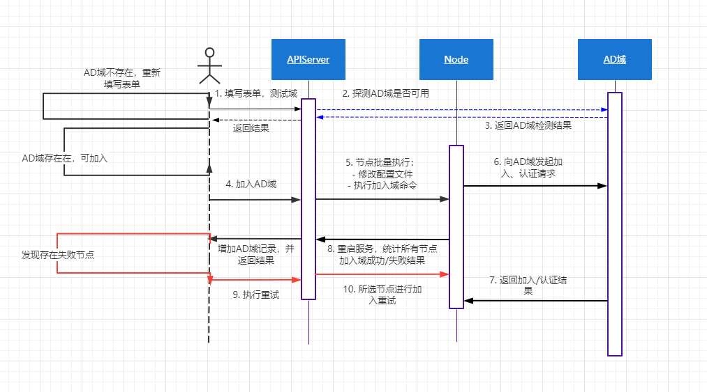
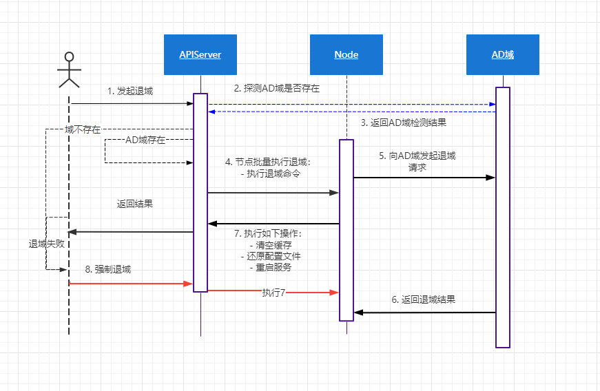

**UFS** 管理平台 通过 **ldap3** 等 **Python** 工具，对接域相关的认证 


<!-- more -->

# Python 对接域认证

## 1. 需求分析

> 支持所有存储节点加入到 **AD域 / LDAP**
>
> **CIFS** 服务（*NAS节点*）支持 **AD**域 | 本地认证

### 1.1 加入/退出域

##### **加入域的场景**

- **添加/扩容节点后：** 提示 `"当前节点尚未加入域"`  **手动执行单节点加入域**
- **加入失败时：** 提示 `"当前节点加入域失败，请检查环境"`  **手动执行单节点加入域**

##### **修改域的场景** 

- 暂不支持

##### **退出域的场景** 

- **删除节点前：** 删除节点时校验，若该节点依然在域中，提示 "`请先退出AD/LDAP域，再重试删除`" 
  - 是否支持强制退出域？ 【支持/不支持】

### 1.2 AD/LDAP的配置

##### **AD域配置参数** 

- **AD域名：** 如 `uit.devops.local`
- **AD DNS IP：** 如 `172.16.70.124`
- **管理员账号** 
- **管理员密码：** 
  - 考虑加密
- 【待定】**过滤器：** 例如 OU、CN 等或自定义的结构，暂不考虑，直接获取所有数据
- 【待定】**认证方式选择：** 当前基于 **kerberos** 的 `GSS-API SASL` 认证
  - 其他方式还有 **Simple authentication** 的 `SSL/TLS` 认证
- 【默认内置】**version：** 仅支持 **v3** 
- **测试按钮：** 测试当前 **AD** 域是否连通，未测试通过前无法执行 **“加入域”** 操作
  - **成功：** 提示 "`连接成功`"
  - **失败：** 
    - **超时 10s 后：** 提示 "`服务器不在工作`"
    - **相同 hostname：** 提示 "`存在相同主机名，无法加入`"

##### **LDAP配置参数**

- **LDAP基准DN：** 如 `DC=uit,DC=ldevops,DC=local`
- **LDAP主服务器IP：** 如 `172.16.70.124`
  - 【待定】**LDAP从服务器IP：** 

- **LDAP 端口：** 默认 `389`
- 【待定】**LDAP协议：** `LDAP/LDAPS` 
- **管理员账号** 
- **管理员密码** 
- **测试按钮：** 同上
- **高级参数：** 对象 `Objectclass=*`

### 1.3 集成到CIFS、文件设置、POSIX

**认证模式：** 支持 **本地认证** 或者 **域认证** （*需要增加全局配置文件*）

- **Samba共享导出：** 增加指定认证模式
- **文件高级设置：** 同上
- **POSIX共享：** 同上

[RedHat 参考](https://access.redhat.com/documentation/zh-cn/red_hat_enterprise_linux/7/html/system_administrators_guide/ch-file_and_print_servers#understanding_id_mapping)

## 2. 加域、退域实现

### 2.1 加域流程



#### AD域加入流程

简单认证 **winbind + kerberos** ，需安装如下软件

- **winbind ：** 允许 **Unix** 系统利用 **Windows NT** 的用户帐号信息来解析 **AD** 域 的程序
- **kerberos：** 加密 **Ticket** 的网络身份认证协议，由 **Key Distribution Center** (*即KDC)*、**Client** 和 **Service** 组成，访问**KDC** 两次，拿到 **TGT**，再访问服务器

```shell
$ yum install realmd oddjob-mkhomedir oddjob samba-winbind-clients samba-winbind samba-common-tools samba-winbind-krb5-locator krb5-devel krb5-workstation -y

# 安装后，客户端会生成 Kerberos 的配置文件
"/etc/krb5.conf"

# 检查
$ systemctl status winbind
```

以域 **UIT.DEVOPS.LOCAL** （*172.16.70.104*）示例：

使用 **Jinjia** 模板

```python
from jinja2 import Environment, FileSystemLoader, Template
from pathlib import Path


class JinJaConfig(object):
    def __init__(self, path: str):
        self.env_path = Path.joinpath(Path(__file__).parent.parent.parent, "etc")
        self._config_file = path
        self.template = ""
        self._parse_data()

    def _parse_data(self):
        env = Environment(loader=FileSystemLoader(self.env_path))
        self.template = env.get_template(self._config_file)

    def reload(self):
        self._parse_data()

    def render_str(self, **kwargs) -> str:
        data = ""
        if isinstance(self.template, Template):
            data = self.template.render(**kwargs)
        return data

    
async def render_action(path: str, **kwargs) -> str:
    conf = jinja_config.JinJaConfig(path)
    render_data = conf.render_str(**kwargs)
    return render_data


async def gen_krb5_config(
        realm: str,
        server_ip: str,
) -> str:
    upper_realm = str(realm).upper()

    path = "krb5/krb5.cfg"
    data = {
        "realm": realm,
        "server_ip": server_ip,
        "upper_realm": upper_realm,
    }
    return await render_action(path, **data)


async def gen_local_smb_config(
        smb_path: str,
        smb_shares_file: str,
):
    path = "smb/smb.cfg"
    data = {
        "smb_shares_file": smb_shares_file,
    }
    smb_local_share = await render_action(path, **data)

    await write_action(smb_path, smb_local_share)
    await aiofiles.open(smb_shares_file, "w")


async def gen_ad_smb_config(
        host_name: str,
        realm: str,
        server_ip: str,
        workgroup: str,
        id_map_range: str,
        id_map_ad_range: str,
        smb_shares_file: str,
) -> str:
    upper_realm = str(realm).upper()

    # FIXME: smb_domain.cfg 中，将 security = domain 暂时替换为 ads
    path = "smb/smb_ad.cfg"
    data = {
        "host_name": host_name,
        "realm": realm,
        "server_ip": server_ip,
        "workgroup": workgroup,
        "id_map_range": id_map_range,
        "id_map_ad_range": id_map_ad_range,
        "upper_realm": upper_realm,
        "smb_shares_file": smb_shares_file,
    }
    return await render_action(path, **data)


async def gen_ldap_smb_config(
        host_name: str,
        server_ip: str,
        workgroup: str,
        base_dn: str,
        bind_dn: str,
        smb_shares_file: str,
) -> str:
    path = "smb/smb_ldap.cfg"
    data = {
        "host_name": host_name,
        "server_ip": server_ip,
        "workgroup": workgroup,
        "base_dn": base_dn,
        "bind_dn": bind_dn,
        "smb_shares_file": smb_shares_file,
    }
    return await render_action(path, **data)


async def gen_ad_nsswitch_config() -> str:
    path = "nsswitch/nsswitch_ad.cfg"
    return await render_action(path, **{})


async def gen_ldap_nsswitch_config() -> str:
    path = "nsswitch/nsswitch_ldap.cfg"
    return await render_action(path, **{})


async def gen_ldap_nslcd_config(
        server_ip: str,
        base_dn: str,
        bind_dn: str,
        admin_pwd: str,
        userObjclass: str,
        groupObjclass: str,
) -> str:
    path = "nslcd/nslcd.cfg"
    data = {
        "server_ip": server_ip,
        "base_dn": base_dn,
        "bind_dn": bind_dn,
        "admin_pwd": admin_pwd,
        "userObjclass": userObjclass,
        "groupObjclass": groupObjclass,
    }
    return await render_action(path, **data)
```

备份并修改 `/etc/krb5.conf` 配置文件为如下

```ini
[logging]
default = FILE:/var/log/krb5libs.log
kdc = FILE:/var/log/krb5kdc.log
admin_server = FILE:/var/log/kadmind.log

[libdefaults]
default_realm = {{upper_realm}}
dns_lookup_realm = false
dns_lookup_kdc = false

[realms]
{{upper_realm}} = {
    kdc = {{server_ip}}
    default_ad = {{upper_realm}}
}

[ad_realm]
.{{upper_realm}} = {{upper_realm}}
{{upper_realm}} = {{upper_realm}}

[kdc]
profile = /var/kerberos/krb5kdc/kdc.conf

[appdefaults]
pam = {
    debug = false
    ticket_lifetime = 36000
    renew_lifetime = 36000
    forwardable = true
    krb4_convert = false
}
```

- **[logging]：** 表示 **Server** 端的日志的打印位置 
- **[libdefaults]：** 连接默认配置 
  - `default_realm = UIT.DEVOPS.LOCAL` 大写，与下文 **realms** 的一致　
-  **[realms]：** 列举使用的 **realm** 
  - `kdc` 机器的 **hostname** 或 **IP** 地址 
  - `admin_server` 机器的 **hostname** 或 **IP** 地址
  - `default_domain` 默认的域名
- **[appdefaults]：** 设定一些针对特定应用的配置，覆盖默认配置

备份并修改 `/etc/hosts` 文件，加入

```ini
172.16.70.124	server124.uit.devops.local
```

备份并修改 `/etc/samba/smb.conf` 如下

```ini
[global]
workgroup = {{workgroup}}
netbios name = {{host_name}}
server string =
security = ads
realm = {{upper_realm}}
password server = {{upper_realm}}
encrypt passwords = yes
local master = no
domain master = no
preferred master = no
idmap config * : backend = tdb
idmap config * : range = {{id_map_range}}
idmap config {{workgroup}} : backend = rid
idmap config {{workgroup}} : range = {{id_map_ad_range}}
winbind use default domain = yes
winbind enum users = yes
winbind enum groups = yes
winbind separator = +

# optimization
sync always = no
write cache size = 10485760
socket options = TCP_NODELAY IPTOS_LOWDELAY SO_RCVBUF=131072 SO_SNDBUF=131072
use sendfile = yes
min receivefile size = 131072

# ad common params
log file = /var/log/samba/%m.log
max log size = 50
printcap name = /etc/printcap
load printers = no
wins server =
unix charset = utf-8
dos charset = cp936
dns proxy = no
delete readonly = yes
create mask = 0777
directory mask = 0777
force create mode = 0777
force directory mode = 0777
template shell = /bin/false
map to guest = bad user
null passwords = yes
usershare allow guests = yes
include = {{smb_shares_file}}
```

备份并修改 `/etc/nsswitch.conf` 如下

```ini
passwd:        files winbind
shadow:        files winbind
group:         files winbind
hosts:         files dns winbind
bootparams:    files
ethers:        files
networks:      files
protocols:     files
rpc:           files
services:      files
netgroup:      files
publickey:     files
automount:     files
aliases:       files
```

执行加域命令

```shell
$ net ads join -U administrator%user@dev -S server124.uit.devops.local
$ net ads testjoin

# 重启相关服务
systemctl enable winbind
systemctl restart winbind
systemctl restart nmb
systemctl restart smb

# 此时通过判断 uid > 100000 获取到对应 域用户 / 组 
getent passwd

# 类似如下
local_zz:x:1000:0::/home/local_zz:/usr/sbin/nologin
xingang:x:1001:1001::/home/xingang:/bin/bash
administrator:*:10000500:10000513::/home/UIT/administrator:/bin/false
guest:*:10000501:10000513::/home/UIT/guest:/bin/false
zhengze:*:10001002:10000513::/home/UIT/zhengze:/bin/false
```

::: tip

**Python** 通过引入 **pwd** 、 **grp** 库，直接本地获取，效率比 **ldap3** 高，但会有缓存，重启服务或改 **C** 源码，或直接调用命令行解析

:::

#### LDAP加入流程

使用 **nslcd** 进行认证 ，与 **AD** 域大致流程差不多，不需要命令，直接改配置文件启动即可

- **nslcd：** 加入 **LDAP** 的程序

```shell
# 安装加入 ldap 所需工具
$ yum -y install nss-pam-ldapd pam_ldap openldap-clients oddjob oddjob-mkhomedir
```

备份并修改 `/etc/nslcd.conf` 如下

```ini
uid nslcd
gid ldap
uri ldap://{{server_ip}}/
base {{base_dn}}
ssl no
binddn {{bind_dn}}
bindpw {{admin_pwd}}
filter passwd {{userObjclass}}
filter shadow {{userObjclass}}
filter group  {{groupObjclass}}
```

需要修改该配置文件权限，否则无法启动服务

```shell
chmod 600 /etc/nslcd.conf
```

备份并修改 `/etc/hosts` 文件，加入

```ini
172.16.120.145	uit.ldevops.local
```

备份并修改 `/etc/samba/smb.conf` 如下

```ini
[global]
workgroup = {{workgroup}}
netbios name = {{host_name}}
security = user
passdb backend = ldapsam:ldap://{{server_ip}}
ldap suffix = "{{base_dn}}"
ldap group suffix = "cn=group"
ldap user suffix = "ou=people"
ldap admin dn = "{{bind_dn}}"
ldap delete dn = no
pam password change = yes
ldap passwd sync = yes
ldap ssl = no

# optimization
sync always = no
write cache size = 10485760
socket options = TCP_NODELAY IPTOS_LOWDELAY SO_RCVBUF=131072 SO_SNDBUF=131072
use sendfile = yes
min receivefile size = 131072

# ldap common params
log file = /var/log/samba/%m.log
max log size = 50
printcap name = /etc/printcap
load printers = no
wins server =
unix charset = utf-8
dos charset = cp936
dns proxy = no
delete readonly = yes
create mask = 0777
directory mask = 0777
force create mode = 0777
force directory mode = 0777
template shell = /bin/false
map to guest = bad user
null passwords = yes
usershare allow guests = yes
include = {{smb_shares_file}}
```

备份并修改 `/etc/nsswitch.conf` 如下

```ini
passwd:        files ldap
shadow:        files ldap
group:         files ldap
hosts:         files dns ldap
bootparams:    files
ethers:        files
networks:      files
protocols:     files
rpc:           files
services:      files
netgroup:      files
publickey:     files
automount:     files
aliases:       files
```

执行加域命令

```shell
# 重启相关服务，正常启动即可
systemctl restart nmb
systemctl enable nslcd
systemctl restart nslcd
systemctl restart smb

# 与 AD 域不同，没有映射ID，此时获取的用户、组存在 uid、gid 冲突
getent passwd

# 类似如下，且有些非能加域的用户
ldapuser1:x:1002:1002:ldapuser1:/home/ldapuser1:/bin/bash
ldapuser2:x:1003:1003:ldapuser2:/home/ldapuser2:/bin/bash
root:x:0:0:Netbios Domain Administrator:/home/root:/bin/false
nobody:x:999:514:nobody:/nonexistent:/bin/false
User1:x:1005:513:System User:/home/User1:/bin/bash
igarashi:x:1000001:513:System User:/home/igarashi:/bin/bash
jackson:x:150001:513:System User:/home/jackson:/bin/bash
```

::: warning 注意

通常需含有 `(objectclass=sambaSamAccount)` 、`(objectclass=sambaGroupMapping)` 等一系列 **samba** 相关的类，才具有访问 **CIFS** 的能力，建议使用 **sabldap** 工具（*详见 LDAP* ）来添加用户，示例如下

```shell
smbldap-useradd -a -m jackson -u 150000
```

:::

### 2.2 退域流程



离开 **AD** 域，执行如下命令，**LDAP** 只需还原配置文件重启即可 

```shell
$ net ads leave -U administrator%管理员密码 -S server124.uit.devops.local

# 重启相关服务
systemctl restart winbind
systemctl restart nmb
systemctl restart smb
```

> - 还原之前修改的配置文件
> - 清空缓存
> - **etcd** 中清空记录的配置信息

#### 补充（*针对 Samba* ）

1. 对于特殊用户，提供了如下简单的映射机制

   - 将 Windows 管理员，如：administrator 映射为本地用户 root

   - 将 everyone 这种特殊用户 映射为 nobody

2. 对于重名限制，界面上开关控制，并显示全称

   - 重名：指存在 `【ad域】张三 & 【本地】：张三` 的情况，虽然名称相同，但 id 号不同

   - 此时设置访问前，通过开关控制 仅本地 | 所有用户，若所有，则显示前缀

## 3. ldap3

**pip** 安装 [ldap3](https://ldap3.readthedocs.io/en/latest/welcome.html) 库

```shell
$ pip install ldap3
```

简单建立同步连接

```python
from ldap3 import Server, Connection, ALL

server = Server("uit.devops.local", get_info=ALL)	# Windows 搭建的AD Server 域名
conn = Connection(server, auto_bind=True)

print(repr(server))
print(repr(server.info))
print(repr(conn))

ret = conn.extend.standard.who_am_i()
print("who_am_i", ret)

....
# who_am_i None
```

**LDAP** 允许无需认证的匿名登入，因为 **DAP** 协议最早是读取电话簿的，任何人都可以阅读（*但内容上会部分受限*），但若建立身份认证的会话，就需要 **DN** 和 **密码** 

```python
from ldap3 import Server, Connection, ALL

server = Server("uit.devops.local", get_info=ALL)
# conn = Connection(server, user="zhengze", password="user@dev", auto_bind=True) # 或使用 DN
conn = Connection(server, user='cn=zhengze,cn=Users,dc=uit,dc=devops,dc=local', password='user@dev', auto_bind=True)

ret = conn.extend.standard.who_am_i()
print(ret)

# u:UIT\zhengze
```

### 2.1 查询

可使用 **上下文管理器** 自动绑定，查询操作如下

```python
with Connection(server, user='cn=zhengze,cn=Users,dc=uit,dc=devops,dc=local', password='user@dev') as conn:
    print(conn.extend.standard.who_am_i())
    conn.search('dc=uit,dc=devops,dc=local', '(objectclass=user)',
                attributes=['name', 'cn', 'mail', "description", "UserAccountControl"])
    print(conn.entries[3].name)
    print(conn.entries[3].entry_to_json())
```

**AD** 域 & **LDAP** 查询器，使用 **search()** 查询，支持生成器方式如下

```python
import pprint

# 注释部分为 AD 域
def search_generator():
    # server = Server(host="172.16.70.124", port=389)
    # with Connection(server, user="uit.devops.local\\administrator", password="xxxxxx", authentication=NTLM) as conn:
    server = Server(host="172.16.120.145", port=389)
    with Connection(server, user='cn=cloud,dc=uit,dc=ldevops,dc=local', password='xxxxxx') as conn:
        conn.open()
        conn.bind()
        print("bound result", conn.bound)
        entry_generator = conn.extend.standard.paged_search(
            # search_base="dc=uit,dc=devops,dc=local",
            # attributes=['cn', 'name', 'mail', "description", "UserAccountControl", "uid", "sn", "gidNumber"],
            search_base="dc=uit,dc=ldevops,dc=local",
            attributes=['cn', 'name', 'mail', "description", "uid", "sn", "gidNumber"],  # "UserAccountControl",
            search_filter='(objectclass=organizationalPerson)',
            search_scope=SUBTREE,
            paged_size=100,
            generator=True
        )
        for entry in entry_generator:
            if not entry.get("attributes", None):
                continue
            yield entry['attributes']


users = []
entry = search_generator()
for item in range(0, 20):
    try:
        users.append(next(entry))
    except StopIteration:
        break

        
pprint.pprint(users)
```

