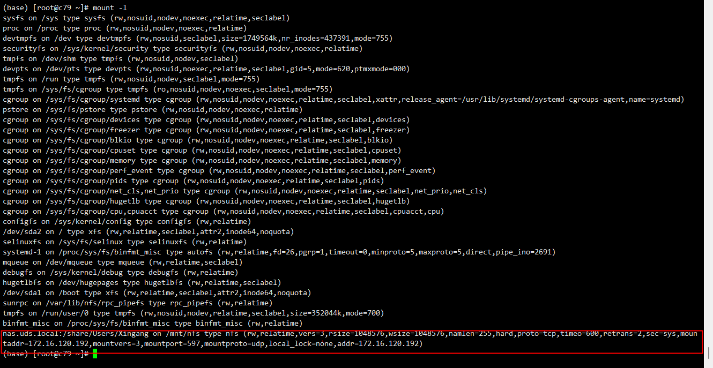

**NFS** 服务基础

<!-- more -->

## 1. 简介

## 2. 安装及配置

### 2.1 安装NFS客户端

通过 **yum** 或者 **apt** 工具安装 **nfs** 客户端软件包

::: tabs

@tab CentOS 7.x

```shell
$ sudo yum install nfs-utils
```

@tab Ubuntu 20.04 / Debian 11.x

```shell
sudo apt install nfs-common
```

@tab openSUSE-Leap-15.x

```shell
sudo zypper install nfs-utils
```

:::

### 2.2 基本配置

**软件配置：** 

**导出配置:** [NFS Export Config](https://insights-core.readthedocs.io/en/latest/shared_parsers_catalog/nfs_exports.html#insights.parsers.nfs_exports.NFSExportsBase) 

## 3. 使用及说明

### 3.1 exportfs 工具

**语法格式**

```shell
exportfs [必要参数] [选择参数] [目录]
```

**功能描述**

[exportfs 命令](https://access.redhat.com/documentation/zh-cn/red_hat_enterprise_linux/8/html/managing_file_systems/the-exportfs-utility_exporting-nfs-shares) ：可以在不直接编辑 `/etc/exports` 文件的情况下，使 `root` 用户能够有选择的导出或取消导出目录，而无需重启服务

- `exportfs` 会将导出的文件系统写到 `/var/lib/nfs/xtab`
- `nfs-mountd` 服务在决定访问文件系统的特权时，会参考 `xtab` 文件，因此对导出的文件系统列表的更改，会立即生效

```shell
# reload 导出
$ exportfs -rv  ||  -arv
```

### 3.2 发现 NFS 导出

- 对于支持 **NFSv3** 的任何服务器，请使用 `showmount` 工具

  ```shell
  $ showmount -e 172.16.120.141
  # Export list for 172.16.120.141:
  # /exports/zz              *
  # /share/Users/grpc-master *
  ```

- 对于支持 **NFSv4** 的任何服务器，挂载根目录并查找

  ```shell
  $ mount 172.16.120.141:/share /mnt/zz
  $ ls /mnt/zz
  # exports
  
  $ls /mnt/zz/exports/
  # foo
  # bar
  ```

### 3.3 挂载 NFS 文件系统

其挂载形式命令如下

```shell
$ mount -t nfs -o options host:/remote/export /local/directory
```

##### **NFS v3** 

使用 **NFS v3** 协议挂载文件系统

```shell
# v3版本通过简易 IP 挂载
$ mount.nfs -vvv -o vers=3 172.16.120.141:/share/Users/zz /home/zz

$ mount -t nfs -vvv -o vers=3,nolock,noacl,proto=tcp,rsize=1048576,wsize=1048576,hard,timeo=600,retrans=2 nas.uds.local:/share /mnt/nfs
```

##### **NFS v4** 

使用 **NFS v4** 协议挂载文件系统

```shell
# v4 版本通过简易 域名 挂载
$ mount.nfs -vvv -o vers=4 nas.local:/share/zz /home/zz

$ mount -t nfs -vvv -o vers=4,minorversion=0,rsize=1048576,wsize=1048576,hard,timeo=600,retrans=2 nas.uds.local:/share /mnt/nfs
```

**重要参数：**

- <span style="color: blue">**nas.uds.local:/share /mnt/nfs：**</span>  表示 ==*<挂载地址>：<NAS文件系统目录> <当前服务器上待挂载的本地路径>*==，请根据实际情况替换
  - ==*<挂载地址>：*== **NAS** 共享的服务器 **IP** 地址或 **DNS** 域名，本例的 `nas.uds.local` 为 **DNS** 域名
  - ==*<NAS文件系统目录>：*== **NAS 导出（*exports*）** 的根目录 `"/"` 或任意子目录，如 `"/share"`，请您确保子目录已存在
  - ==*<当前服务器上待挂载的本地路径>*==：**Linux ECS** 实例的根目录 `"/"` 或任意子目录，如 `"/mnt/nfs"` ， 请您确保子目录已存在
- <span style="color: blue">**vers=3/4：**</span> 指定文件系统版本，用 **v3 or v4** 协议挂载文件系统

**其他挂载参数：** 挂载文件系统时，可选择多种挂载选项，挂载选项使用英文逗号 `","` 分隔

- <span style="color: blue">**rsize：**</span>定义数据块的大小，用于客户端与文件系统之间读取数据，建议值 **1048576**
- <span style="color: blue">**wsize：**</span>定义数据块的大小，用于客户端与文件系统之间写入数据，建议值 **1048576**
  - 若需要更改 **IO** 大小参数（*rsize 和 wsize*），建议尽可能使用最大值（***即：1048576***），以避免性能下降
- <span style="color: blue">**hard：**</span>在文件存储 **NAS** 暂时不可用的情况下，使用文件系统上某个文件的本地应用程序时会停止并等待至该文件系统恢复在线状态，建议启用
- <span style="color: blue">**timeo：**</span>指定时长，单位为 **0.1** 秒，即 **NFS** 客户端在重试向文件系统发送请求之前等待响应的时间。建议值：**600**（***60秒***）
  - 若必须更改超时参数（***timeo***），建议您使用 **150** 或更大的值，该参数的单位为 **0.1** 秒，因此 **150** 表示的时间为 **15** 秒
- <span style="color: blue">**retrans：**</span> **NFS** 客户端重试请求的次数，建议值，**2** 
- <span style="color: blue">**noresvport：**</span>在网络重连时使用新的 **TCP** 端口，保障在网络发生故障恢复时不会中断连接，建议启用
  - 不建议使用 **soft** 选项，有数据一致性风险，若必须使用，相关风险需自行承担    
- 避免设置不同于默认值的任何其他挂载选项。如果更改读或写缓冲区大小或禁用属性缓存，可能会导致性能下降

##### **查看挂载结果** 

执行如下命令，查看挂载结果，若包含如下类似返回信息，说明挂载成功

```shell
$ mount -l
```

 

挂载成功后，查看当前文件系统的容量信息

```shell
$ df -h
```

 

若挂载失败，请进行错误排查

##### **访问NFS** 

挂载成功后，可在 **Linux** 上访问 **NAS** 文件系统，执行 读取 或 写入 操作，可把其当作一个普通的目录来访问和使用

 

##### **自动挂载NFS客户端** 

为避免已挂载 **NFS** 文件系统的服务器重启后，挂载信息丢失，可在 **Linux** 系统中配置 `/etc/fstab` 文件，实现服务器设置重启时，**NFS** 文件系统自动挂载

打开 `/etc/fstab` 配置文件，添加挂载配置

* 使用 **NFS v3** 协议挂载文件系统

  ```shell
  $ nas.uds.local:/share /mnt/nfs nfs vers=3,nolock,proto=tcp,rsize=1048576,wsize=1048576,hard,timeo=600,retrans=2,_netdev 0 0
  ```

* 使用NFS v4协议挂载文件系统

  ```shell
  $ nas.uds.local:/share /mnt/nfs nfs vers=4,minorversion=0,rsize=1048576,wsize=1048576,hard,timeo=600,retrans=2,_netdev 0 0
  ```

其参数说明如上挂载，其余参数说明如下：

- <span style="color: blue">**_netdev：**</span> 防止客户端在网络就绪之前开始挂载文件系统
- <span style="color: blue">**0（_netdev 后第一项）：**</span>  非零值表示文件系统应由 **dump** 备份，对于 **NAS** 文件系统而言，此值默认为 **0**
- <span style="color: blue">**0（_netdev 后第二项）:**</span> 该值表示 **fsck** 在启动时检查文件系统的顺序，对于 **NAS** 文件系统而言，此值默认为 **0**，表示 **fsck** 不应在启动时运行

##### **验证自动挂载**

执行重启命令，重启应用服务器，验证 **NFS** 客户端自动挂载

```shell
$ reboot
```

::: warning 注意

在重启服务器前，请确认手动挂载成功，避免服务器重启耗时过久

另外，若自动挂载配置成功，在重启后的一分钟内，可以通过 **`df -h`** 命令查看挂载的 **NFS** 文件系统

:::

**附（*Redhat*）：** [常用挂载选项](https://access.redhat.com/documentation/zh-cn/red_hat_enterprise_linux/8/html/managing_file_systems/common-nfs-mount-options_mounting-nfs-shares)

### 3.4 卸载

```shell
$ umount /home/zz

# 若提示 umount.nfs4: /home/zz: device is busy

# 执行如下命令，强制卸载
$ umount -fl /home/zz
```

### 3.5 获取挂载 NFS 客户端 

> 查询默认服务端口 `cat /etc/services| grep nfs`

- 命令快速查: （_不一定好用_）

  ```shell
  ss | grep :nfs
  ```

- 使用 **python**:

  ```python
  import psutil
  
  [
      {
          "laddr": f"{net.laddr.ip}:{net.laddr.port}",
          "raddr": f"{net.raddr.ip}:{net.raddr.port}"}
      for net in psutil.net_connections()
      if net.laddr.port == 2049 and
      isinstance(net.laddr, psutil._common.addr) and
      isinstance(net.raddr, psutil._common.addr)
  ]
  ```

## 4. V4 无法直接挂载问题

由于 **v4** 的挂载和 **v3** 不同，要先导出根目录，才能挂子目录

若希望无需导出根目录，实现用户通过 **v4** 可自由挂载子目录，其解决办法如下：

针对 `NFSv4` 版本 `Linux` 客户端二次共享: <Badge type="error">fsid</Badge> + <Badge type="info">bind</Badge>

使用 `--bind` 建立挂载链接

[参考](https://access.redhat.com/documentation/en-us/red_hat_enterprise_linux/5/html/deployment_guide/s1-nfs-server-config-exports)

```shell
# 若用户需要挂载 /share/Users/zz 这个子目录:
mkdir /exports/nfs/Users/zz

# 使用 bind 创建绑定
mount --bind /share/Users/zz /exports/nfs/Users/zz

# /etc/exports 文件中添加导出，如：
/exports/nfs/Users/zz		*(fsid=17,async,root_squash,no_all_squash,anonuid=65534,anongid=65534,rw)
```

> **注意：**
>
> - 貌似也需要先导出对应的子目录，才能挂载 `bind` 目录
> - `fsid` 若一致，有无影响，有参考说会影响高可用、或出现不同目录 但同一个挂载的问题
> - 用此方式，会增加开机自动挂载等流程的复杂度
