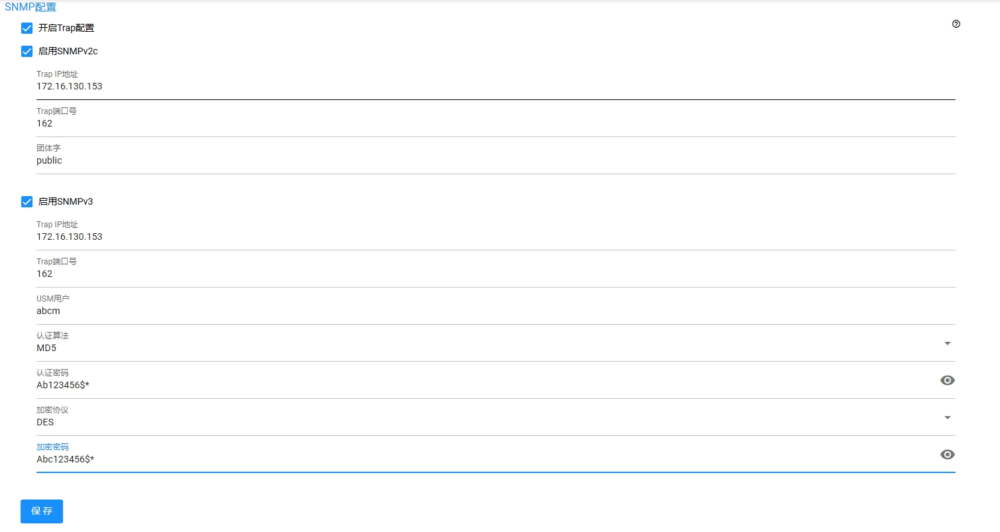
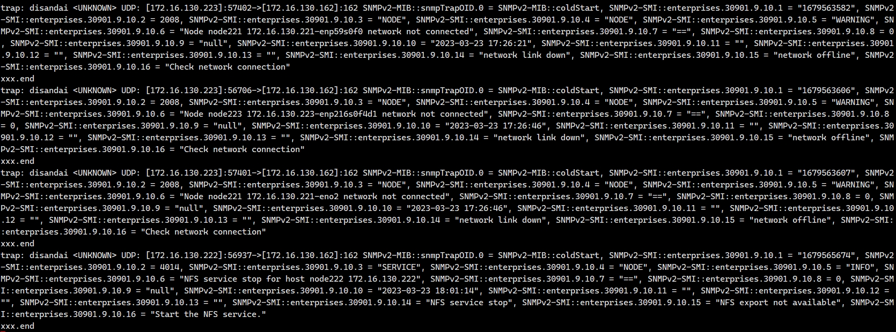
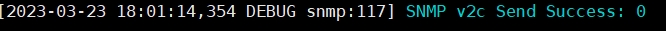

**SNMP** 的研发详细设计


<!--more--> 


## 1. SNMP 详细设计

**需求：** **UDS** 支持 **SNMPv2c、SNMPv3** 协议

- **SNMPv2c：** 仅需支持一个 **Trap ip** 和 团体名
- **SNMPv3：** 仅需支持一个**Trap ip**，一个 **USM** 用户，安全级别 **只支持既 认证 又 加密**

[SNMPv3](https://so.csdn.net/so/search?q=snmp&spm=1001.2101.3001.7020) 安全级别有三种

- **noAuthNoPriv：** 不认证也不加密
- **authNoPriv：** 认证但是不加密
- **authPriv：** 既认证又加密

**功能影响范围：** 监控告警模块，警告发生时，给出 **snmptrap** 接口调用

### 1.2 SNMPv2c

支持设置下列配置项

1. **Trap IP地址：** 接收 **SNMP Trap** 信息的 **SNMP** 服务器的 **IP** 地址

   > 提示要求：请填写正确 **IP**，并执行 **IP** 地址判定，支持 **IPv4** 或 **IPv6** 地址

2. **Trap端口号：** 使用 **Trap** 时，一般端口为**162**

   > 提示要求：设置 **162** 为端口号默认值，端口取值范围为 **1～65535** 

3. **团体字:** **SNMP** 服务器使用的团体字，**Trap** 信息中的一种差异性标识，类似于 **密码**，用于限制 **SNMP** 网络管理系统 与 **SNMP** 管理代理之间的通信，缺省为 **public**

   > 提示要求：字符串形式，不支持空格，区分大小写，长度范围是 **4～32**

### 1.3 SNMPv3

支持设置下列配置项：

1. **Trap IP地址：** 接收 **SNMP Trap** 信息的 **SNMP** 服务器的 **IP** 地址

   > 提示要求：请填写正确 **IP**，并执行 **IP** 地址判定，支持 **IPv4** 或 **IPv6** 地址

2. **Trap端口号：** 使用 **Trap** 时，一般端口为**162**

   > 提示要求：设置 **162** 为端口号默认值，端口取值范围为 **1～65535** 

3. **USM用户：** 

   > 提示要求：用户不能重复，由字母、数字、`“_”` 和 `“-”` 组成，且首字符只能是字母，长度范围是 **4～32**

4. **认证算法（*可选*）：** **MD5、SHA** ，认证鉴权算法

5. **认证密码：** 长度范围根据 **SNMP** 安全策略变化而变化

   > 提示要求：取值范围按需变化，必须包含大写字母、小写字母、数字和特殊字符中任意三种

6. **加密协议（*可选*）：** **DES、AES**，传输加密算法

7. **加密密码：** 长度范围根据 **SNMP** 安全策略变化而变化

   > 提示要求：取值范围按需变化，必须包含大写字母、小写字母、数字和特殊字符中任意三种，**数据加密密码不能和鉴权密码一样** 

**限制 1**：增加用户的时候，**SNMP** 必须关闭，否则有如下报错

```shell
# Apparently at least one snmpd demon is already running.
#  You must stop them in order to use this command.
```

**限制 2**：设置 **SNMP Trap v3**，添加 **USM** 用户时，需要同时操作所有节点添加

### 1.4 服务高可用

目前告警由 **ufs-alarm.service** 的集群 **leader** 发送，所有节点都存在此服务

### 1.5 MIB 管理对象

**固定前导：1.3.6.1.4.1.**

**UIT企业节点：30901.**

**UDS子节点（产品线自定义）：9.10.**

**UDS OID前导：**

**1.3.6.1.4.1.30901.9.10.X**

| **OID**                                       | **数据类型**  | **含义**                                                     | **实现规格** | **状态** |
| --------------------------------------------- | ------------- | ------------------------------------------------------------ | ------------ | -------- |
| idOID:1.3.6.1.4.1.xxxx.x.x.1                  | DisplayString | 告警 **ID**                                                  | read-only    | current  |
| codeOID:1.3.6.1.4.1.xxxx.x.x.2                | INTEGER       | 告警规则编号                                                 | read-only    | current  |
| resourceOID:1.3.6.1.4.1.xxxx.x.x.3            | DisplayString | 告警类型： **SYSTEM、NODE、USER、PROCESS、FS**               | read-only    | current  |
| istanceOID:1.3.6.1.4.1.xxxx.x.x.4             | DisplayString | 实例实例: **CLUSTER、NODE、DISK、SERVICE**                   | read-only    | current  |
| levelOID:1.3.6.1.4.1.xxxx.x.x.5               | DisplayString | 告警级别: **CRITICAL、MAJOR、WARNING、INFO**                 | read-only    | current  |
| descriptionOID:1.3.6.1.4.1.xxxx.x.x.6         | DisplayString | 告警描述                                                     | read-only    | current  |
| conditionOID:1.3.6.1.4.1.xxxx.x.x.7           | DisplayString | 判定条件：**"!="、">"、"=="、"<"、"&"、"\|" **               | read-only    | current  |
| thresholdOID:1.3.6.1.4.1.xxxx.x.x.8           | INTEGER32     | 阈值                                                         | read-only    | current  |
| unitOID:1.3.6.1.4.1.xxxx.x.x.9                | DisplayString | 单位：**"null"、"%"、"B"、"Kib"、"Mib"、"Gib"、"Tib"、"Pib"、"Eib"、"s"、"min"、"hour"、"day"、"month"、"year"** | read-only    | current  |
| createdAtOID:1.3.6.1.4.1.xxxx.x.x.10          | DisplayString | 发生时间                                                     | read-only    | current  |
| is_resolveOID:1.3.6.1.4.1.xxxx.x.x.11         | DisplayString | 是否解决                                                     | read-only    | current  |
| resolveAtOID:1.3.6.1.4.1.xxxx.x.x.12          | DisplayString | 告警解决时间                                                 | read-only    | current  |
| isMultipleInstanceOID:1.3.6.1.4.1.xxxx.x.x.13 | DisplayString | 多个告警实例                                                 | read-only    | current  |
| reasonOID:1.3.6.1.4.1.xxxx.x.x.14             | DisplayString | 触发原因                                                     | read-only    | current  |
| effectOID:1.3.6.1.4.1.xxxx.x.x.15             | DisplayString | 影响                                                         | read-only    | current  |
| solutionOID:1.3.6.1.4.1.xxxx.x.x.16           | DisplayString | 解决方法                                                     | read-only    | current  |
| isClearOID:1.3.6.1.4.1.xxxx.x.x.17            | DisplayString | 是下清除                                                     | read-only    | current  |

## 2. SNMP 接收端配置

**UFS 页面配置：** 页面 **SNMP** 配置参数如下图所示（*仅供参考* ）

 

 

#### **SNMP 接收端配置** 

创建 `/opt/snmp/log.sh` 脚本，键入如下：

```shell
#!/bin/bash

read host
read ip
read test
vars=

while read oid val 
do
  if [ "$vars" = "" ]
  then
    vars="$oid = $val"
  else
    vars="$vars, $oid = $val"
  fi
done

echo trap: $1 $host $ip $vars >>/tmp/checkfile
echo "xxx.end  " >>/tmp/checkfile
```

- 该脚本会将接收的 **snmptrap** 信息写到文件 `/tmp/checkfile` 下

**获取 EngineID：** 类似 `0x80001f8880c317952bdbdb8a6300000000` 的 **ID** ，需要先去对应的 **UFS** 节点执行 如下命令

```shell
# 每台机器应该唯一
$ grep old /var/lib/net-snmp/snmpd.conf 
# oldEngineID 0x80001f8880c317952bdbdb8a6300000000  
```

然后修改  `/etc/snmp/snmptrapd.conf` 配置文件，**createUser** 键入如上 **ID**

```shell
# Example configuration file for snmptrapd
#
# No traps are handled by default, you must edit this file!
#
# authCommunity   log,execute,net public
# traphandle SNMPv2-MIB::coldStart    /usr/bin/bin/my_great_script cold
#
createUser -e 0x80001f88801196ae461af31b6400000000 abcm SHA "Aa1234567*$" AES "Bb1234567#"

createUser -e 0x80001f88801e48667a1af31b6400000000 abcm SHA "Aa1234567*$" AES "Bb1234567#"

createUser -e 0x80001f8880278f8d411af31b6400000000 abcm SHA "Aa1234567*$" AES "Bb1234567#"

# 调用 log.sh 脚本 igarashi 为消息前缀可任意填写
traphandle default /opt/snmp/log.sh igarashi
#
##团体字public
authCommunity log,execute,net public
#
##用户abcm
authUser log,execute abcm
#disableAuthorization yes
```

- 该配置会接收用户 **abcm** 的 **snmptrap** 信息，并调用 `/opt/snmp/log.sh` 脚本存储记录下来

重启 **snmptrapd** 服务，使上文配置生效

```shell
$ systemctl restart snmptrapd
```

之后，在 **snmp** 接收节点执行如下命令查询，并人为制造异常来触发告警进行测试

```shell
$ tailf /tmp/checkfile
```

此时会看到 **snmp** 结果输出 

  

日志也会有如下输出**（*DEBUG* 模式下）** 

```shell
$ tailf /var/log/ufs/ufsdashboard.log
```


