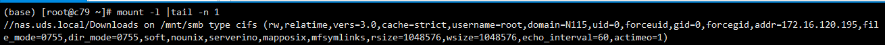
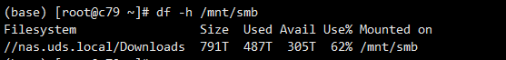
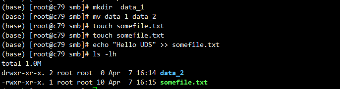

[Samba 文档](https://www.samba.org/) 

<!-- more -->

# SAMBA

## 1. 概述


## 2.安装&配置

### 2.1 客户端安装

::: tabs

@CentOS 7.x

```shell
$ yum install cifs-utils
```

@Ubuntu 20.04 / Debian 11.x

```shell
$ sudo apt install cifs-common
```

@openSUSE-Leap-15.x

```shell
$ sudo zypper install cifs-utils
```

:::

### 2.2 服务端安装


### 2.3 服务端配置

通常在 `/etc/samba/smb.conf` 文件中指定 **日志** 文件名称和 **共享** 存放路径

##### 常规全局配置：

> `#` 号开头：默认的文字注释信息
>
> `;` 号开头：默认的注释配置项

```ini
[global]
	workgroup = SAMBA
	security = user

# 注释网卡配置项
;	interfaces = lo eth0 192.168.1.12/24 172.168.13.2/24
	passdb backend = tdbsam

	printing = cups
	printcap name = cups
	load printers = yes
	cups options = raw

	include = /etc/samba/smb_share.conf
```

**[global]**: 关键字，全局配置

- `workgroup = SAMBA` # Windows NT 域名（域环境为域名） 或 工作组名

- `security = user` # 设置用户访问 **Samba Server** 的验证方式，一共有四种安全级别模式：

  1. `auto：` 默认安全设置，**Samba Server** 查询角色参数，来自动判断安全模式

  2. `user：` 若未执指定服务器角色，则是 **Samba** 中的默认安全设置，访问 **Samba Server** ，需要提交合法的用户名和密码，由服务端负责检查账号和密码的正确性，共享目录只能被授权的用户访问，默认为此模式。

  3. `domain：` 仅当已使用 `net conf` 将此计算机添加到 **Windows NT** 域中时，此模式才能正常工作。**Samba** 会将用户名/密码传递到 Windows NT 主域控制器来验证用户名/密码

  4. `ads：` 在此模式下，**Samba** 将充当 **ADS 域**中的域成员。**Samba Server** 需要安装和配置 **Kerberos**，并且需要使用网络实用程序将 **Samba 加入 ADS 域**

- `realm = SAMBA` # 域选项，指定主机所属的 **AD 域**

  > 仅在设置了 `security = ads` 选项时使用

  ***

- `passdb backend = tdbsam` # 用于存储用户信息的后台，有三种：

  - `smbpasswd：` 使用 `smb` 自己的工具 **smbpasswd** 来给系统用户设置一个 `smb`密码，客户端使用这个密码来访问，默认在 `/etc/samba` 目录下
  - `tdbsam:` 使用数据库文件 `passdb.tdb` 来建立用户数据库，同上可通过工具 **smbpasswd** 创建用户，但前提是创建的用户必须是系统用户
  - `ldapsam：` 该方式则是基于 [LDAP]() 来验证用户
  - 首先要建立 LDAP 服务
  - 然后设置`passdb backend = ldapsam:ldap://LDAP Server`

  ***

- `printing = cups` # 设置共享打印机的类型，支持的打印系统有：`bsd`, `sysv`, `plp`, `lprng`, `aix`, `hpux`, `qnx`

- `printcap name = cups` # 设置共享打印机的配置文件

- `load printers = yes` # 是否在 **启动 `smb` 时** 共享打印机

- `cups options = raw` # 允许您将选项传递给 CUPS 库。设置这个选项，例如，允许您在 Windows 客户端上使用驱动程序。，而不是单独设置它们

  ***

- `include = /etc/samba/smb_share.conf` # 允许全局文件键入子文件，将全局配置和共享配置解耦，若指定文件不存在，则不会加载

  > 当配置 `include = registry` 时，不是键入当前目录下的 `registry` 文件，是从注册表中读取全局配置选项，此时可以通过 `net conf` 进行对 `samba` 的配置，如：

  ```shell
  $ net conf addshare igarashi /export/nas/igarashi
  $ net conf list
  ```

---

```ini
[homes]
	comment = Home Directories
	valid users = %S, %D%w%S
	browseable = No
	read only = No
	inherit acls = Yes
```

**[home]**: 默认共享，特殊共享目录，表示用户主目录

---

```ini
[printers]
	comment = All Printers
	path = /var/tmp
	printable = Yes
	create mask = 0600
	browseable = No
```

**[printers]**: 默认共享，表示共享打印机

---

##### 常规共享配置：

以一个常规 `ufs目录` 导出配置为例

```ini
[ufs]
	comment = UFS
	path = /export/nas
	browseable = yes
	public = yes
	hosts allow = 172.16.120.121/255.255.255.0
	hosts deny = 172.16.120.122
	admin users = root, @root
	valid users = root, @root
	invalid users = fred admin @wheel
	read only = no
	writable = yes
	read list = root
	write list = root
	inherit acls = yes
	create mask = 0664
	directory mask = 0775
```

**[ufs]**: 共享资源名

- `comment = UFS` # 共享的注释说明

- `path = /export/nas` # 共享路径

- `browseable = yes` # 是否允许用户查看共享内容，默认`yes`，若为`no`，必须写绝对路径才能查看

- `public = yes` # 是否允许匿名访问

- `hosts allow = 172.16.120.121/255.255.255.0` # 设置允许哪台主机访问

- `hosts deny = 172.16.120.122` # 设置拒绝哪台主机访问

  ***

- `admin users = root, @root` # 指定用户作为超级用户，无论文件权限如何，都拥有绝对权限

- `invalid users = fred admin @wheel` # 禁止登录到此服务的用户列表，确保不正确的设置不会破坏安全

- `valid users = root, @root` # 仅指定的 **用户 / 组** 可以访问该共享资源

  - 多个用户：若有多个用户名，中间用逗号隔开
  - 组名：需要用@

- `read only = no` # 设置目录只读，`yes` 为 **只读** ，`no` 为 **读写**

- `read list = root` # 控制只读范围，允许该字段填写的 **用户 / 组** 只读

- `writable = yes` # 设置目录可写，`yes` 为 **读写**，`no` 为 **只读**

- `write list = root` # 控制写入范围，允许该字段填写的 **用户 / 组** 可写

  > 若用户同时存在于 `read list` 和 `write list` 中，权限大于只读，赋予可写权限

- `inherit acls = yes` # 父目录上存在默认 acl，则在这些父目录中创建新文件或子目录时始终遵循这些 acl

- `create mask|mode = 0664` # 定义用户可在共享中有 **创建文件** 的权限

- `directory mask|mode = 0775` # 定义用户可在共享中有 **创建文件夹** 的权限，**用户 / 组 有 读、写、执行** 的权限

-

## 3. 命令

### 3.1 挂载SMB文件系统

基本挂载

```shell
# 挂载命令格式如下
$ mount -t cifs //<挂载点>/share <挂载目录> -o <挂载选项>

# 通过IP挂载
$ mount -t cifs //172.16.120./test /mnt/uit-share02/
$ Password for root@//10.10.10.223/test
```

挂载 **SMB v2.1** 

```shell
$ mount -t cifs //nas.uds.local/share /mnt/smb -o vers=2.1,uid=0,gid=0,dir_mode=0755,file_mode=0755,mfsymlinks,cache=strict,rsize=1048576,wsize=1048576
```

挂载 **SMB v3.0** 

```shell
$ mount -t cifs //nas.uds.local/share /mnt/smb -o vers=3.0,uid=0,gid=0,dir_mode=0755,file_mode=0755,mfsymlinks,cache=strict,rsize=1048576,wsize=1048576
```

以 **Guest** 匿名身份进行挂载

```shell
$ mount -t cifs //nas.uds.local/share /mnt/smb -o vers=2.0,guest,uid=0,gid=0,dir_mode=0755,file_mode=0755,mfsymlinks,cache=strict,rsize=1048576,wsize=1048576
```

以 **username + password** 身份进行挂载

```shell
$ mount -t cifs //nas.uds.local/share /mnt/smb -o vers=2.0,username=uds,password=udspass,uid=0,gid=0,dir_mode=0755,file_mode=0755,mfsymlinks,cache=strict,rsize=1048576,wsize=1048576
```

##### **参数说明** 

- <span style="color: blue">**文件系统类型：**</span> 必须配置 **-t cifs** 参数
- <span style="color: blue">**<挂载点>：**</span> 创建文件系统挂载点时，需根据实际值替换自动生成的挂载点
- <span style="color: blue">**<挂载目录>：**</span> 要挂载的目标路径，例如：`/mnt/smb` 
- <span style="color: blue">**vers：**</span> 指定 **v2.0** 或 **v3.0** 协议版本
- <span style="color: blue">**guest：**</span> 只支持基于 **ntlm** 认证协议的客户端挂载
- <span style="color: blue">**rsize：**</span> 用来设置读数据包的最大限制，建议值 **1048576（*1MB*）**
- <span style="color: blue">**wsize：**</span> 用来设置写数据包的最大限制，建议值 **1048576（*1MB*）**
- <span style="color: blue">**uid：**</span> 挂载成功后，文件所属的用户，若未设置，默认**uid=0** 
- <span style="color: blue">**gid：**</span> 挂载成功后，文件所属的用户组，若未设置，默认 **gid=0**
- <span style="color: blue">**dir\_mode：**</span> 向用户授予指定目录的读取、写入和执行权限，必须以 **0** 开头 ***（如：0755、0644）等***，若未设置，默认**dir\_mode=0755**  
- <span style="color: blue">**file\_mode：**</span> 向用户授予普通文件的读取、写入和执行权限。必须以 **0** 开头 ***（如：0755、0644）等***，若未设置，默认 **file\_mode=0755** 
- <span style="color: blue">**mfsymlinks：**</span> 支持 **symbol link** 功能
- <span style="color: blue">**cache：**</span> 设置 **SMB** 文件系统使用客户端缓存，若未设置，默认 **cache=strict** 
  - **cache=none：** 设置 **SMB** 文件系统不使用客户端缓存
- <span style="color: blue">**atime：**</span> 

##### **查看挂载结果** 

执行如下命令，查看挂载结果，若包含如下类似返回信息，说明挂载成功

```shell
$ mount -l
```

 

挂载成功后，查看当前文件系统的容量信息

```shell
$ df -h
```

 如果挂载失败，请进行错误排查

##### **访问SMB** 

挂载成功后，可在 **Linux** 上访问 **NAS** 文件系统，执行 读取 或 写入 操作，可把其当作一个普通的目录来访问和使用

 

##### **自动挂载SMB客户端**

为避免已挂载 **SMB** 文件系统的服务器重启后，挂载信息丢失，可在 **Linux** 系统中配置 `/etc/fstab` 文件，实现服务器设置重启时，**SMB** 文件系统自动挂载。

打开 `/etc/fstab` 配置文件，添加挂载配置

* 使用 **SMB v2.1** 协议挂载文件系统

  ```shell
   //nas.uds.local/share /mnt/smb cifs auto,username=uds,password=udspass,vers=2.1,uid=0,gid=0,dir_mode=0755,file_mode=0755,mfsymlinks,cache=strict,rsize=1048576,wsize=1048576 0 0
  ```

* 使用 **SMB v3.0** 协议挂载文件系统

  ```shell
   //nas.uds.local/share /mnt/smb cifs auto,username=uds,password=udspass,vers=3.0,uid=0,gid=0,dir_mode=0755,file_mode=0755,mfsymlinks,cache=strict,rsize=1048576,wsize=1048576 0 0
  ```

其参数说明如上挂载，其余参数说明如下：

- <span style="color: blue">**auto：**</span> 自动挂载 **SMB** 共享
- <span style="color: blue">**username：**</span> 登录账户
- <span style="color: blue">**password：**</span> 登录密码
- <span style="color: blue">**0（wsize后第一项）：**</span> 非零值表示文件系统应由 **dump** 备份，对于 **NAS** 文件系统而言，此值默认为 **0** 
- <span style="color: blue">**0（wsize后第二项）：**</span> 该值表示 **fsck** 在启动时检查文件系统的顺序，对于 **NAS** 文件系统而言，此值默认为 **0**，表示 **fsck** 不应在启动时运行 

##### **验证自动挂载** 

执行重启命令，重启应用服务器，验证 **SMB** 客户端自动挂载

```shell
$ reboot
```

### 3.2 卸载

强制卸载

```shell
$ umount -f -a -t cifs -l /挂载点
```

### 3.3 关于 Windows客户端 的注意事项

**windows** 默认 不允许同一台机器使用多个用户身份去登录 **SMB**，因此切换用户时需要先清除缓存

##### **清除 Window 下 samba 的缓存** 

- 查看缓存列表

  ```powershell
  $ net use
  ```

- 删除所有缓存

  ```powershell
  $ net use * /del
  ```

  > 再去 任务管理器 - 重启文件资源管理器，确保刷新

### 3.4 pdbedit 的使用

##### pdbedit 操作用户

- 列出当前用户：

  ```shell
  # 全部用户
  $ pdbedit -L

  # 指定用户
  $ pdbedit -L --user=zz
  ```

- 添加用户：

  ```shell
  # 无需回车确认输入
  $ echo -e "12345\n12345\n" | pdbedit -t -a zz
  ```

- 更新用户：

  ```shell
  # 也许这只是针对于修改密码
  $ echo -e "233333\n233333\n" | pdbedit -t -r -u zz
  ```

- 删除用户：

  ```shell
  $ pdbedit -x zz
  ```

## 4. 公网SMB连接

### 4.1 Linux Samba 服务端

配置好共享后，需要去 `/etc/samba/smb.conf` 中修改 

```ini
[global]
		...
		smb ports = 6727
```

然后重启 **samba** 服务，或是直接路由器上设置 **NAT** 端口转发 **445** 转 **6727**

### 4.2 Windows 客户端

需要先关闭 **Windows 防火墙**，检查 **control** -> 程序 -> 启用或关闭 **Windows** 功能 -> 是否开启了 **CIFS** 文件共享支持（*可以关闭SMB直通，无影响*）

##### **1. 组策略关闭禁止访问无密码的 Samba 共享**

直接 <kbd>Windows</kbd> + <kbd>r</kbd> 输入 `gpedit.msc` 服务 

在 **计算机配置** - **管理模板** - **网络-Lanman工作站** 中，找到并双击 **启用不安全的来宾登录**

选择 **已启用** 确定即可

##### **2.关闭 Windows 的 445 端口** 

命令行如下

```powershell
sc config LanmanServer start= disabled
net stop LanmanServer
```

或是直接 <kbd>Windows</kbd> + <kbd>r</kbd> 输入 `services.msc` 服务中找到 **Server** 停止并禁用

##### **3. 启动 windows 的 ip helper 服务**

> 该服务用来端口转发

```powershell
sc config iphlpsvc start= auto

success
```

##### **4. 设置 windows 端口转发** 

> 假如 **公网IP** 是 **116.31.232.32** ，端口为上文的 **6727** 

运行如下命令设置转发

```powershell
# 若有域名，直接将地址改为域名即可
netsh interface portproxy add v4tov4 listenport=445 connectaddress=116.31.232.32 connectport=6727

# 查看
netsh interface portproxy show all

# 删除端口转发
netsh interface portproxy delete v4tov4 listenport=445 connectaddress=116.31.232.32 connectport=6727
```

##### **5.输入\\\\127.0.0.1 即可访问**

::: tabs

@tab Windows 

直接 **`\\127.0.0.1\共享名`**  输入账户名，密码即可访问

@tab Linux

```shell
$ smbclient //116.31.232.32/myshare -p 6727 -U samba

# 若不知道目录，则要检索
$ smbclient -L //116.31.232.32 -p 6727 -U samba`

# 挂载卸载
$ mount -t cifs //116.31.232.32/myshare /samba/samba1/ -o username=xxx,password=xxx,port=6727
$ umount /samba/samba1/
```

@tab Mac端

```shell
smb://用户名:密码@116.31.232.32:6727
```

@tab 手机端

手机可以用 [ES 文件管理器](https://www.zhihu.com/search?q=文件管理器&search_source=Entity&hybrid_search_source=Entity&hybrid_search_extra={"sourceType"%3A"answer"%2C"sourceId"%3A684689433}) 查看 **SMB**，汉堡菜单-网络-局域网-新建-服务器填 **[IP: 端口]** 

:::
