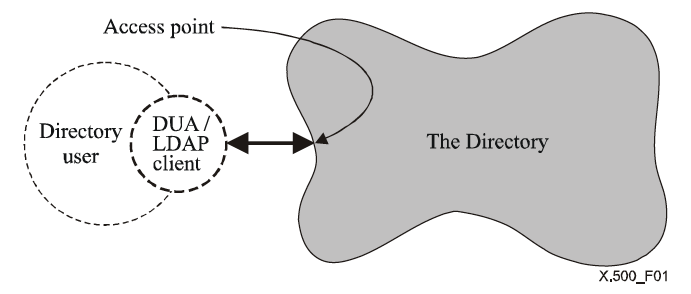
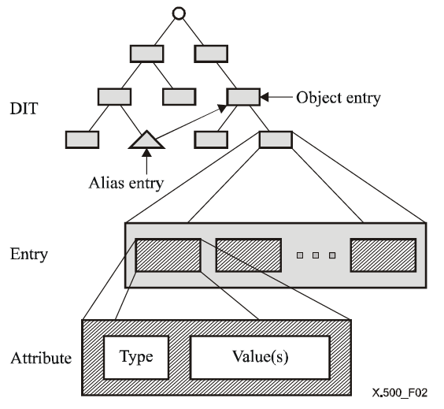

# LDAP

**DAP（Directry Access Protocol）：** 即目录访问协议，较老、复杂且重量级，后面又出轻量级、更好用的 **LDAP**

<!-- more -->

## 1. X.500 协议

### 1.1 概述

**X.500** 定义了目录系统，**LDAP** 只是它的轻量级实现

##### **目录系统**

**Directory：** 目录服务，旨在提供一个用户友好的 `name-address` 类的映射，其中 `name` 不可变，`address` 允许动态变化，即`key-value` 结构

**DIB：** 目录信息库，由一批系统组成，每个系统持有对应现实世界的逻辑数据，这些存储的数据叫做 **DIB**



一个标准的目录系统，有以下几部分

- 目录服务
- 目录服务的用户
- 目录服务用来暴露自己的访问端点
- 用户和服务之间使用协议如 LDAP 进行交互
- 用户使用 LDAP 客户端访问目录服务

### 1.2 DIB 与 DIT

**DIB** 目录信息库，由 **DIT**（_目录信息树_）、节点 **Entry**、**Entry** 中的属性及属性值构成，树形结构

- **Entry** 代表一个节点，类型可以是 `object`，也可以是 `alias` 别名
- 一个 **Entry** 内可以拥有多个属性
- 一个属性内可以拥有一个 **Type**，以及多个 **Value**


:::tip 故这种树形存储结构适用于，查询多、更新少

:::

### 1.3 分布式 Directory

**Directory** 支持分布式操作，此时的服务端组成如下


**DSA（_Directory System Agent_）：** 用来连接服务和 **DUA**。他可以缓存 **Directory** 数据，可以用本地数据直接响应，也可以单纯做一个转发

**LDAP Server**：是 **Directory Service** 的一部分，可以直接使用本地数据，也可以转发到其它 **LDAP Server** 获取数据

## 2. LDAP 协议

**LDAP 协议：** 就是一个 **轻量级的目录访问协议**，其中

- **L（_LightWeight_）：** 轻量级

- **D（_Directory_）：** 目录
- **AP（_Access Protocol_）：** 存取协议

是 **读性能高，写性能低且没有回滚机制** 的数据存储协议，不是数据库，没有数据库这么强大，而是一个树状结构的目录，每个叶子都是由一条一条的分成若干区域的记录


### 2.1 概念说明

**Entry：** 最小单元 (_对象_）

**LDIF：** 上文 **Entry** 的纯文本表示文件

**Schema：** 模式（_对象类的集合_）对属性做了限制

**attribute：** 基本对象的属性

**ObjectClass：** 属性集合（_基本对象的继承属性_）

**backend & database**

[属性说明 - 参考 AD](./AD)

[参考详解 LDAP](https://blog.csdn.net/zou8944/article/details/122287398)

## 3. 安装

:::tabs

@tab CentOS

安装 **LDAP** 所需的软件包

```shell
$ yum install openldap openldap-devel openldap-servers openldap-clients -y
```

启动 **slapd** 服务

```shell
systemctl start slapd
systemctl enable slapd
```

创建 **LDAP** 根密码（_默认是空密码_）

```shell
slappasswd
# {SSHA}SsnKledkDHBy6V8vU9kffRvM8GzWZhSx
```

> 记住生成的 **ssha**，如：密码 `user@dev` 得到 `{SSHA}SsnKledkDHBy6V8vU9kffRvM8GzWZhSx`

:::

## 3. 操作

### 3.1 配置 LDIF 文件

安装后的初始化配置文件位置如下，需要先编辑并创建一个域，添加到 **目录数据库**

```shell
cat /etc/openldap/slapd.d/cn\=config/olcDatabase\=\{2\}hdb.ldif

# AUTO-GENERATED FILE - DO NOT EDIT!! Use ldapmodify.
# CRC32 c0f701a0
dn: olcDatabase={2}hdb
objectClass: olcDatabaseConfig
objectClass: olcHdbConfig
olcDatabase: {2}hdb
olcDbDirectory: /var/lib/ldap
olcSuffix: dc=my-domain,dc=com
olcRootDN: cn=Manager,dc=my-domain,dc=com
olcDbIndex: objectClass eq,pres
olcDbIndex: ou,cn,mail,surname,givenname eq,pres,sub
structuralObjectClass: olcHdbConfig
entryUUID: 509c001e-ce6c-103c-88d2-9b98d85c0d0d
creatorsName: cn=config
createTimestamp: 20220922024508Z
entryCSN: 20220922024508.183007Z#000000#000#000000
modifiersName: cn=config
modifyTimestamp: 20220922024508Z
```

层级结构可类似于如下

```shell
                 +-------------------------------+
                 |  dc=uit,dc=ldeveops,dc=local  |
                 +-------------------------------+
                 |
                 v
        +--------+--+
        |ou=cloud|
        +-+------+--+
          |      |
          v      v
   +------+-+   ++----+
   |cn=admin|   |cn=zz|
   +--------+   +-----+
```

因此创建一个 **.ldif** 后缀的文件

```shell
touch uit.ldeveops.local.ldif
```

键入

```shell
# 创建了一个 uit.ldevops.local  top根域
dn: dc=uit,dc=ldevops,dc=local			# 条目标识
dc: uit
objectclass: top						# 属性
#objectclass: dcobject					# 必须定义属性dc
#objectclass: organization				# 必须定义属性 o
objectclass: domain				# 必须定义属性 o
o: uit

# 创建了一个 名为cloud组织
dn: ou=cloud,dc=uit,dc=ldevops,dc=local
ou: cloud
objectclass: organizationalUnit

# 创建了一个 admin person用户
dn: cn=admin,ou=cloud,dc=uit,dc=ldevops,dc=local
cn: admin
sn: admin
objectclass: person

# 创建了一个 zz person用户
dn: cn=zz,ou=cloud,dc=uit,dc=ldevops,dc=local
cn: zz
sn: zz
objectclass: person
```

- **dn** 主键唯一，要确保这些数据不能与已有数据相同，否则操作中断

### 3.2 LDAP 的 CURD 操作

:::tabs

@tab 添加

##### **ldapadd 添加**

```shell
选项:
-x   进行简单认证
-D   用来绑定服务器的DN
-h   目录服务的地址
-w   绑定DN的密码
-f   使用ldif文件进行条目添加的文件
```

将 `uit.ldeveops.local.ldif` 编写的数据导入到 **ldap**

```shell
ldapadd -x -D "cn=root,dc=uit,dc=ldevops,dc=local" -w {SSHA}SsnKledkDHBy6V8vU9kffRvM8GzWZhSx -f /root/uit.ldeveops.local.ldif
```

@tab 删除

##### **ldapdelete 删除**

```shell
选项:
-c         连续运行模式 (运行出错时跳过继续执行)
-f file    指定文件
-M         启用管理DSA IT控制
-P version 协议版本(default: 3)
-r         递归删除
```

将 `uit.ldeveops.local.ldif` 编写的数据导入到 **ldap** 删除

```shell
# 删除root用户
ldapdelete -x -D "cn=cloud,dc=uit,dc=ldevops,dc=local" -w {SSHA}SsnKledkDHBy6V8vU9kffRvM8GzWZhSx "cn=admin,ou=cloud,dc=uit,dc=ldevops,dc=local"
ldapdelete -x -D 'cn=root,dc=it,dc=com' -w password 'uid=zyx,dc=it,dc=com'
```

@tab 修改

##### **ldapmodify 修改**

```shell
选项
-a 添加新的条目.缺省的是修改存在的条目.
-C 自动追踪引用.
-c 出错后继续执行程序并不中止.缺省情况下出错的立即停止.
-D binddn 指定搜索的用户名(一般为一dn 值).
-e 设置客户端证书文件,例: -e cert/client.crt
-E 设置客户端证书私钥文件,例: -E cert/client.key
-f file 从文件内读取条目的修改信息而不是从标准输入读取.
-H ldapuri 指定连接到服务器uri.常见格式为ldap://hostname:port
-h ldaphost 指定要连接的主机的名称/ip 地址.它和-p 一起使用.
-p ldapport 指定要连接目录服务器的端口号.它和-h 一起使用.
-M [M] 打开manage DSA IT 控制. -MM 把该控制设置为重要的.
-n 用于调试到服务器的通讯.但并不实际执行搜索.服务器关闭时,返回错误；服务器打开时,常和-v 参数一起测试到服务器是否是一条通路.
-v 运行在详细模块.在标准输出中打出一些比较详细的信息.比如:连接到服务器的ip 地址和端口号等.
-V 启用证书认证功能,目录服务器使用客户端证书进行身份验证,必须与-ZZ 强制启用TLS 方式配合使用,并且匿名绑定到目录服务器.
-W 指定了该参数,系统将弹出一提示入用户的密码.它和-w 参数相对使用.
-w bindpasswd 直接指定用户的密码. 它和-W 参数相对使用.
-x 使用简单认证.
-Z[Z] 使用StartTLS 扩展操作.如果使用-ZZ,命令强制使用StartTLS 握手成功.
```

```shell
dn: olcDatabase={2}hdb,cn=config
changetype: modify
replace: olcSuffix
olcSuffix: dc=uit,dc=ldevops,dc=local

dn: olcDatabase={2}hdb,cn=config
changetype: modify
replace: olcRootDN
olcRootDN: cn=root,dc=uit,dc=ldevops,dc=local

dn: olcDatabase={2}hdb,cn=config
changetype: modify
add: olcRootPW
olcRootPW: {SSHA}SsnKledkDHBy6V8vU9kffRvM8GzWZhSx
```

```
ldapmodify -Y EXTERNAL -H ldapi:/// -f passwd.ldif


# ldapmodify -x -D "cn=root,dc=it,dc=com" -W -f modify.ldif
# 交互式修改
# ldapmodify -x -D "cn=root,dc=it,dc=com" -W secret
```

@tab 查询

##### **ldapsearch 查询**

```shell
选项
-x   进行简单认证
-D   用来绑定服务器的DN
-w   绑定DN的密码
-b   指定要查询的根节点
-H   制定要查询的服务器
```

```shell
ldapsearch -x -D "cn=dev3,dc=uit,dc=ldevops,dc=local" -w {SSHA}SsnKledkDHBy6V8vU9kffRvM8GzWZhSx -b "dc=ldevops,dc=local"
"cn=root,dc=uit,dc=ldevops,dc=local"
# 使用简单认证,用 "cn=root,dc=kevin,dc=com" 进行绑定,要查询的根是 "dc=kevin,dc=com".这样会把绑定的用户能访问"dc=kevin,dc=com"下的所有数据显示出来.

# ldapsearch -x -W -D "cn=administrator,cn=users,dc=osdn,dc=cn" -b "cn=administrator,cn=users,dc=osdn,dc=cn" -h troy.osdn.zzti.edu.cn
# ldapsearch -b "dc=canon-is,dc=jp" -H ldaps://192.168.10.192:389
```

:::

### 3.3 图形化应用

##### **安装 phpldapadmin**

1. 安装软件

   ```shell
   # 安装红帽衍生库
   yum -y install epel-release
   
   # 安装
   yum install -y phpldapadmin
   ```

2. 修改配置

   ```shell
   vim /etc/httpd/conf.d/phpldapadmin.conf
   
   # 改写如下配置
   #  Web-based tool for managing LDAP servers
   #
   
   Alias /phpldapadmin /usr/share/phpldapadmin/htdocs
   Alias /ldapadmin /usr/share/phpldapadmin/htdocs
   
   <Directory /usr/share/phpldapadmin/htdocs>
     <IfModule mod_authz_core.c>
       # Apache 2.4
       # Require local
       Require all granted
     </IfModule>
     <IfModule !mod_authz_core.c>
       # Apache 2.2
       Order Deny,Allow
       Deny from all
       Allow from 127.0.0.1
       Allow from ::1
     </IfModule>
   </Directory>
   ```

3. 重启并配置防火墙

   ```shell
   systemctl restart httpd.service
   
   firewall-cmd --permanent --zone=public --add-service=http
   firewall-cmd --reload
   ```

4. **php** 的配置文件中配置

   ```shell
   vim /etc/phpldapadmin/config.php
   
   # 配置域名
   $servers->setValue('server','base',array('dc=uit,dc=ldevops,dc=local'));
   
   # 绑定登录账户，默认填写
   $servers->setValue('login','bind_id','cn=ldapadm,dc=uit,dc=ldevops,dc=local');
   
   # 取消注释并注释下行
   $servers->setValue('login','attr','dn');
   // $servers->setValue('login','attr','uid');
   ```
