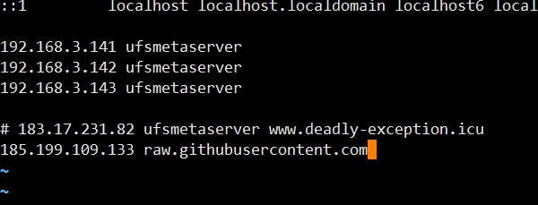
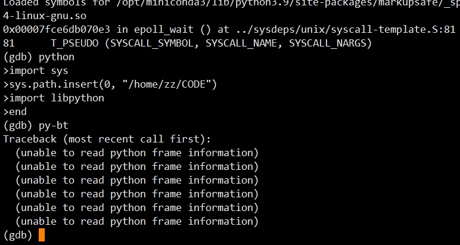
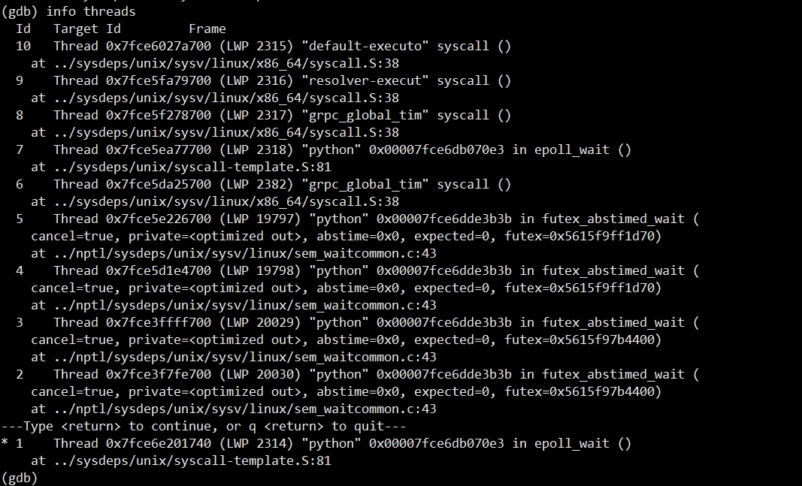
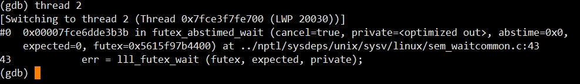

快速排查故障、定位问题

<!--more-->

## 1. gdb

对于排查进程、线程故障、死循环、死锁、Hung process 等故障，除了用 [strace](https://man7.org/linux/man-pages/man1/strace.1.html) 跟一下系统调用来猜原因，相比之下用 **gdb** 来打印 **C** 的堆栈信息，更加有说服力和说明问题

### 1.1 安装

首先得有 [gdb](https://man7.org/linux/man-pages/man1/gdb.1.html) 才能查

::: tabs

@tab CentOS

```shell
$ yum -y install yum-utils

$ debuginfo-install glibc

# 会出现如下包的提示
Package                                Arch        Version               Repository           Size
====================================================================================================
Installing:
 glibc-debuginfo                        x86_64      2.17-326.el7_9        base-debuginfo      9.5 M
 nss-softokn-debuginfo                  x86_64      3.44.0-8.el7_7        base-debuginfo      2.1 M
 yum-plugin-auto-update-debug-info      noarch      1.1.31-54.el7_8       base                 29 k
Installing for dependencies:
 glibc-debuginfo-common                 x86_64      2.17-326.el7_9        base-debuginfo      9.7 M
```

若报错，则需要执行如下改动

```shell
# 不存在该文件则创建，有则改写如下
$ vim /etc/yum.repos.d/CentOS-Debuginfo.repo

[base-debuginfo]
name=CentOS-7 - Debuginfo
baseurl=http://debuginfo.centos.org/7/$basearch/
gpgcheck=1
gpgkey=file:///etc/pki/rpm-gpg/RPM-GPG-KEY-CentOS-Debug-7
- enabled=0
+ enabled=1
```

然后再安装 **gdb** 

```shell
# 安装 gdb python3-debuginfo 注意是 python3
yum -y install gdb python3-debuginfo
```

执行 `gdb python`

```shell
$ gdb python3
GNU gdb (GDB) Red Hat Enterprise Linux 7.6.1-120.el7
Copyright (C) 2013 Free Software Foundation, Inc.
License GPLv3+: GNU GPL version 3 or later <http://gnu.org/licenses/gpl.html>
...
Reading symbols from /opt/miniconda3/bin/python3.9...done.
(gdb) 
# 注意最后的版本号
```

@tab Debian

```shell
$ apt-get install gdb python3-dbg
```

还需要装一个包  `python3-dbg` ， 这个包有什么作用呢？ 前面不是抱怨过 `C` 堆栈对于调试一个 `Python` 有何用？ 我们更需要的是 `Python` 堆栈信息， `python-dbg` 就是为了完成这个使命

:::

### 1.2 运行

全新启动一个 `Python` 程序并进行调试，可以采用交互式方式， 先启动 [gdb](https://man7.org/linux/man-pages/man1/gdb.1.html) 然后在 `gdb shell` 中启动 `Python` 程序

```shell
# 启动 
$ gdb python
...
(gdb) run <programname>.py <arguments>

# 一条命令
$ gdb -ex r --args python <programname>.py <arguments>
```

正在运行的程序突然异常，需要调试它，若去给它发个信号，出一个 `coredump` 文件，然后用 `gdb` 来调试 `coredump` 文件，像这样

```shell
# 调试 coredump 文件
$ gdb <coredump_file>
```

显然易见，不是种好的方式，若捕获进程调试，效率才高

```shell
# 获取 python 进程id
$ ps -ef |grep python
$ pstree -p pid
$ strace -p pid

# 进入调试
$ gdb python -p <process id> 
$ gdb attach <process id> 
```

这两种方式都可以让 `gdb` 捕获一个进程。 因此，需要做的只是确定问题进程的 `pid` ，如使用 `top` 、 `ps` 等命令确定 **Python** 进程

### 1.3 使用

#### **堆栈查看**

查看 `C` 堆栈信息使用 `bt`

```shell
(gdb) bt
#0 0x0000002a95b3b705 in raise () from /lib/libc.so.6
#1 0x0000002a95b3ce8e in abort () from /lib/libc.so.6
#2 0x00000000004c164f in posix_abort (self=0x0, noargs=0x0) at ../Modules/posixmodule.c:7158
#3 0x0000000000489fac in call_function (pp_stack=0x7fbffff110, oparg=0) at ../Python/ceval.c:3531
#4 0x0000000000485fc2 in PyEval_EvalFrame (f=0x66ccd8) at ../Python/ceval.c:2163
```

那么查看 **Python** 堆栈则要在安装 `python-gdb` 之后， `gdb` 才会提供若干相关的操作

使用 `py-bt` 就是用来查看 `Python` 堆栈

```shell
$ (gdb) py-bt
```

::: warning

若提示 `Undefined command: "py-bt". Try "help"` ，这多半是 **gdb** 绑定的是老版的 **python2.7**，对于 **CentOS** 需要手动导入 `libpython.py` 让 **gdb** 读取（***Debian 是 pythonx.x-gdb.py*** ）

故需手动下载 [libpython.py](https://github.com/python/cpython/blob/master/Tools/gdb/libpython.py) 文件到本地

```shell
wget https://raw.githubusercontent.com/python/cpython/main/Tools/gdb/libpython.py

# 连不通需要使用自己的代理
export all_proxy="https://192.168.3.97:7890"
```

若 **DNS** 解析失败需，去网站三方工具查 **DNS** ，然后修改 `/etc/hosts`

```shell
vim /etc/hosts
```

  

若需要搜索某些文件，则

```shell
find / -name "*libpython*"

# 或安装快速查找工具
yum install -y locate

# 更新数据库
updatedb

# 查找某些文件
locate "*libpython*" |grep /
```

手动关联 **libpython.py**

```shell
(gdb) python
>import sys
>sys.path.insert(0, "/home/zz/CODE")
>import libpython
>end
(gdb) py-bt
Traceback (most recent call first)
...
```

 

:::

#### 线程查看

调试多线程程序，使用 `info threads`，但总得搞清楚到底有哪些线程

```shell
(gdb) info threads
...
* 1    Thread 0x7fce6e201740 (LWP 2314) "python" 0x00007fce6db070e3 in epoll_wait ()
    at ../sysdeps/unix/syscall-template.S:81
```

 

请注意 **\*号** 哦——它标识的是当前线程

切换线程，如切换到 **2** 号线程（*将其设置为当前线程进行调试* ）

```shell
(gdb) thread 2
```

 

查看当前线程的相关信息，则使用 `py-list` ，可以清楚看到当前执行到代码的第几行， 还有前后若干行的代码可以对照

```shell
(gdb) py-list
2025         # Open external files with our Mac app
2026         if sys.platform == "darwin" and 'Spyder.app' in __file__:
2027             main.connect(app, SIGNAL('open_external_file(QString)'),
2028                          lambda fname: main.open_external_file(fname))
2029
>2030        app.exec_()
2031         return main
2032
2033
2034     def __remove_temp_session():
2035         if osp.isfile(TEMP_SESSION_PATH):
```

查看所有进程执行位置

```
(gdb) thread apply all py-list
```

命令如下：

- `py-bt :` 输出 **python** 应用程序调用堆栈
- `py-bt-full :` 查看当前 **python** 应用程序调用堆栈，并且显示每个 **frame** 的详细情况

- `py-list:`  显示代码查看当前 **python** 应用程序上下文

- `py-print:` 查看 **python** 变量

- `py-locals:` 查看 **locals** 变量

- `py-up:` 调用栈 **frame** 向上一级

- `py-down:` 调用栈向下一级