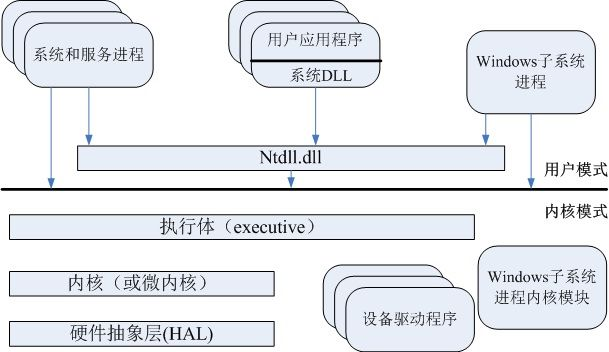
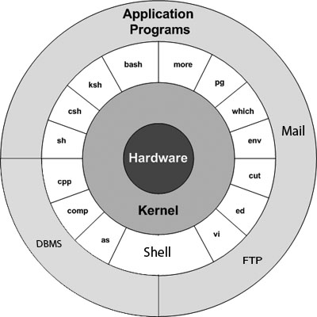

一些操作系统整理

<!-- more -->

## 1. 操作系统

### 1.1 操作系统架构

其常用的操作系统架构如下

#### 1.1.1 windows 架构

如下图所示

  

**windows** 分为 **用户** 和 **内核** 两种模式，区别是对系统数据的访问权限不同，**内核** 有更高的权限（*为了保护操作系统* ），**代码是运行在用户模式下** 

当需要使用内核时，应用程序会通过 **硬件指令** 切换到内核模式，完成请求后再切回用户模式，因此，有时 **多线程程序不一定高效** ，因为线程切换会占用很多 **CPU周期** 

#### 1.1.2 Unix 层次架构

[UNIX](https://www.w3cschool.cn/unix/8a4k1pd2.html) 架构如下图所示

 

> **hardware：** 硬件，比如屏幕显示，键盘输入等
> **kernel：** 内核，负责连接硬件和内核，只有通过内核才能操作硬件
> **shell：** 可以理解为一个框架（更多的翻译将其翻译为壳），通过这个框架外层的应用可以调用内核
>
> **application programs：** 应用程序，比如数据库（***DBMS*** ），邮件服务（***mail*** ）等，他们可能需要使用到硬件，这时候就要通过 **shell** 去调用内核，继而操作硬件

总结所有版本的 **UNIX** 的主要概念包含以下四个基本要素:

- **内核：** 内核是操作系统的核心。它与硬件和大多数任务像内存管理任务调度和文件管理交互。
- **Shell：** 是用于处理您的请求的实用程序。当您在您的终端键入命令时，**Shell** 将命令解释并调用你想要的程序。**Shell** 使用标准语法的所有命令，**C Shell, Bourne Shell 和 Korn Shell**  是最著名的 **shell** ，适用于大多数 **UNIX** 变体
- **命令和实用程序：** 有各种各样的命令和实用程序可供您使用。**cp**, **mv**, **cat** 和 **grep** 等是命令和实用程序的几个例子。有超过 **250** 标准命令，再加上通过第三方软件提供的其他命令
- **文件和目录：** 在 **UNIX** 中的所有数据被都组织到文件中，所有文件被都组织到目录中，这些目录被组织成一个称为文件系统的树状结构

