NAT映射与内网穿透

<!-- more -->

## 1. 基本概念

### 1.1 相关基础
首先需要了解如下相关基础概念:
- [**IPv4**](./网络基础.html#ip协议) 

- [**保留地址**](./网络基础.html#保留地址) 

- 发送数据的过程

  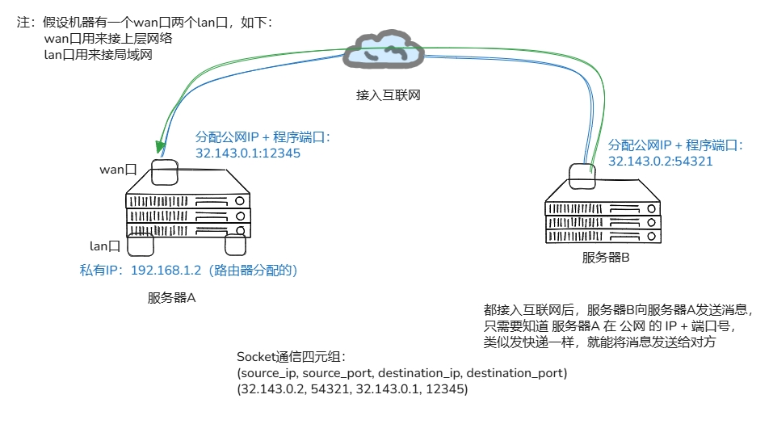 

  - **IP** + **端口:** 4层协议，通过 **源、目标的 IP地址 + port 端口** 进行不同计算机进程间的通信

### 1.2 NAT基本概念
**网络地址转换 NAT（*Network Address Translation*）** 本身就是路由器的一个功能，是为了解决 ==IPv4地址不够用== 而提出的，除了路由器之外，三层交换机也带 **NAT** 功能，但二层交换机不带（*因为没有 IP地址 的概念* ） 

**简单NAT** 如下图所示:

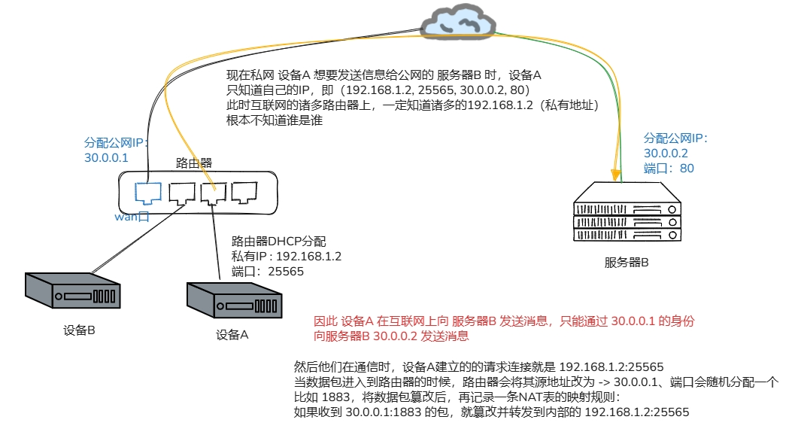

上述实际带了 **端口Port** 因此称为 **NPAT（*Network Address Port Translation*）** 因为 **NAT** 本身太拉了（*一对一转换，用途不广* ），但大家叫 **NPAT** 又觉着麻烦，因此管 **NPAT** 也称 **NAT** 了

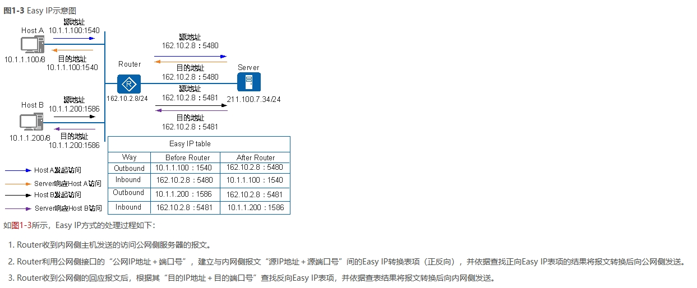

**参考资料：** 

- [华为NAT](https://support.huawei.com/enterprise/zh/doc/EDOC1100086644/7989a4c3)

### 1.3 断开 NAT 连接后

若通信完成后， **NAT** 的连接断开，此时：

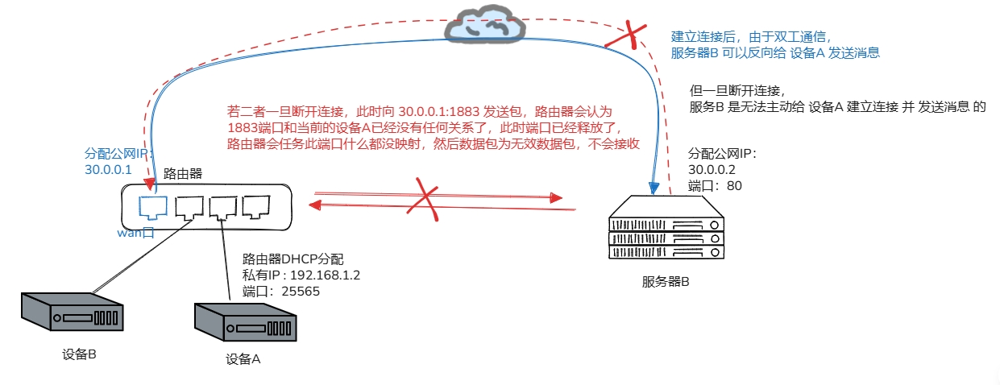 

**服务器B** 在 **断开NAT连接** 之后是不能 主动 和 **设备A** 建立连接的，即 **设备A** 只能往外面发送数据，但不能接收数据。

当 **服务器B** 往 `30.0.0.1:1883` 地址发送数据包时，**1883 端口** 被路由器认为什么都没有，然后丢弃包不处理

### 1.4 端口映射

即声明 **路由器 持续监听 1883 端口（*不再随机分配一个端口了* ）** 而是固定将 **1883端口 绑定到 设备A**，只要路由器发现 **1883端口** 有数据，就会将消息转发到 **设备A** 上，所以在做完端口映射之后，**服务器B** 就可以在广域网上主动访问 **设备A** 了

### 1.5 内网穿透

上述还是较为友好的场景，只有一端做了 **NAT**，现实生活中是，**双方都做了 NAT**，均在一个 **NAT** 的环境中，因此两边均无法相互访问

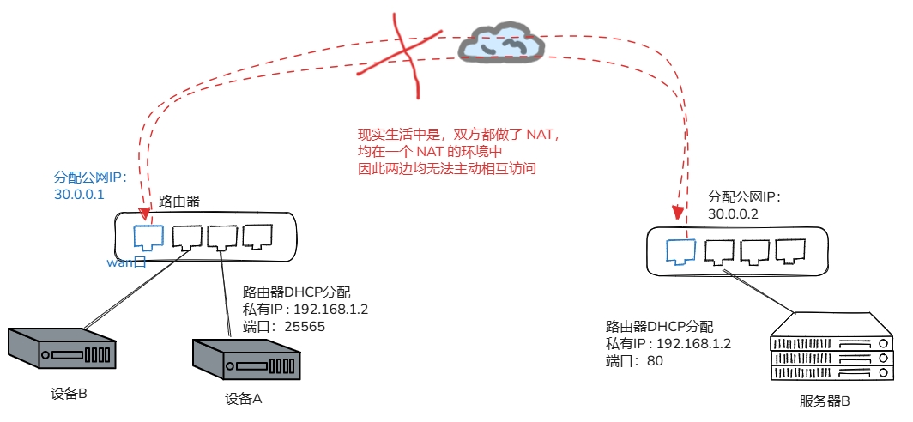

但若想让两台服务器之间可以主动发起请求的话，又该怎么办呢，于是有了第三台作为中继的云服务器来帮助两台内网的设备进行一个 ==“ 穿透 ”== 

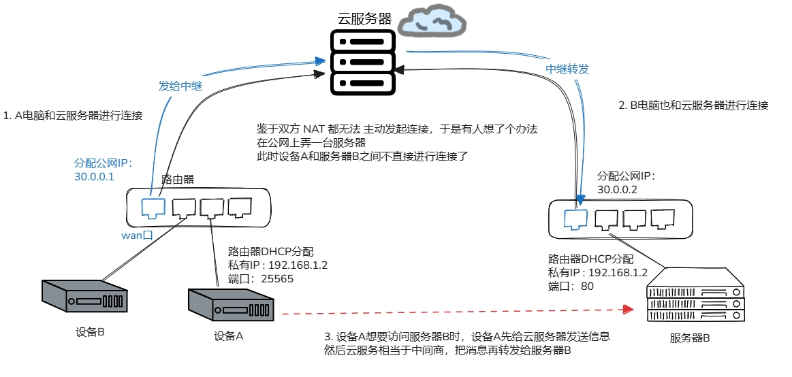

**中继：** 内网穿透的中间商，但中继的带宽会严重影响内网穿透的速度

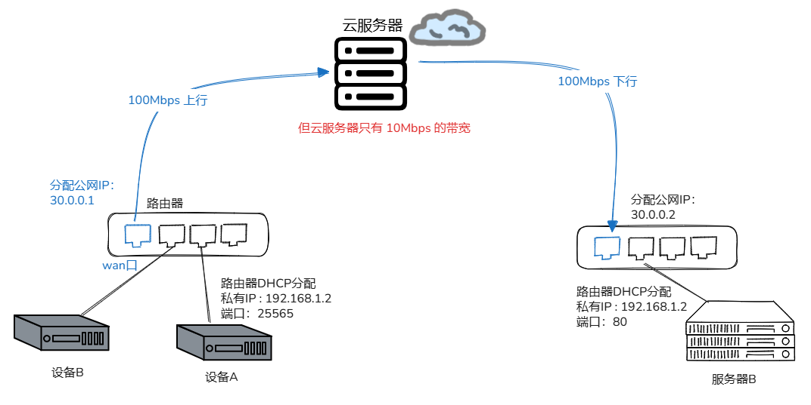

::: warning 注意

通常情况下，国内网络环境复杂，一般是是用不到端口映射的，存在着很多问题，因此才会有内网穿透

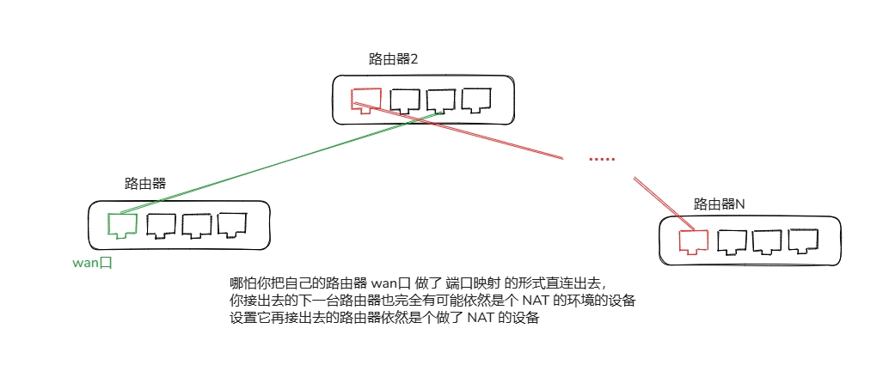

**比如:** 你将自己家里的路由器端口映射开放出去接入小区的机房，但小区的机房可能就是一个 **NAT 环境** ，然后小区又把网线接到了移动的机房里面去（移动大内网很著名），相当于又接入到了一个 **NAT** 环境里面去，而且你没办法协调上层路由器来改规则。

:::

## 2. 内网穿透是怎么实现的

### 2.1 中继转发

若**A** 想与 **B** 通信，此时设备A、服务器B 都需要先和云服务器建立连接，然后每次 **A** 想与 **B** 通信，都要先发送给 **C**，由 **C** 转发给 **B** ,这样每次都由 **云服务器C** 进行流量转发 ==效率很低== ，且带宽瓶颈就是 **C** 带宽的上限

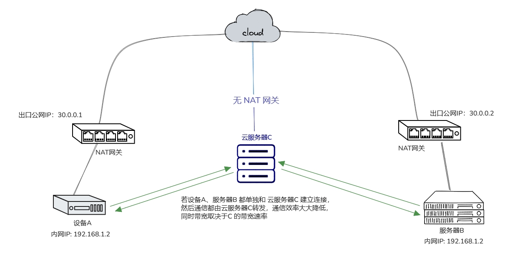

因此有没有一种可能，**A** 通过 **C** 进行了某种协商之后，就可以直接与 **B** 进行通信呢？

### 2.2 NAT类型

**NAT** 通常分为两大类， **锥型** 和 **对称型** ，其中 **锥型** 又可以分为 **完全锥型** 和 **限制型锥型**（分类而非实际存在） ，**限制型锥型** 又可分为 **IP 限制型锥型** 和 **端口 限制型锥型** ， 如下图：

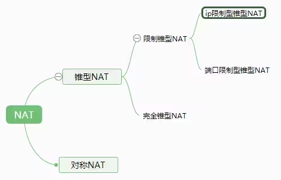

因此去除分类的话，子集就是通常说的 **4 +1 种NAT类型：** 

- **NAT0（Open Internet 开放型/无NAT ）:**  设备 **直接拥有公网IP地址** ，没有NAT网关。任何外网主机只要知道该设备的 公网IP地址 和 端口号，都可以直接向其发送数据包，无需经过NAT转换。

  - **特点：**  开放性高，但安全性低；无NAT转换，通信效率高；适合需要外网直接访问的场景 
  - **场景：** 测试环境（开发调试）、早期的P2P文件共享应用、云服务器、VPS等直接暴露在公网的服务、需要外网直接访问的服务器应用

   

- **NAT1（Full Cone NAT 完全锥型 NAT）:**   同一个内网（IP，端口）对的所有出站请求，都会被映射到同一个外网（IP，端口）。一旦映射建立，任何外网主机都可以通过该映射的外网（IP，端口）访问内网设备，即使内网设备未先向该外网主机发送过数据包。 

  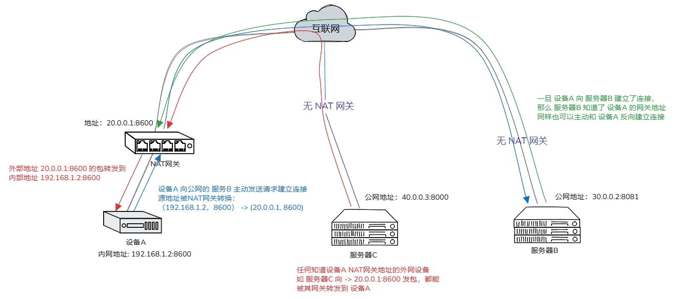 

  - **特点：** **外网设备可以主动连接内网设备；** 映射关系不受目标地址限制；**安全性低；** 行为类似静态NAT，但映射是动态建立的 一对一映射
    - 一个内网（IP，端口）对  →  一个外网（IP，端口）映射
  - **场景：** P2P 应用（如 BitTorrent、某些游戏联机）简单穿透（打洞成功率较高）需要外网主动访问内网服务的场景

  

- **NAT2（Restricted Cone NAT IP地址限制锥型 NAT）:** 当内网设备向某个外网IP地址发送数据包后，会建立 NAT 映射。只有该 **特定外网IP地址的主机** 可以通过该映射访问内网设备（端口可以不同）。其他 外网IP 地址的主机 即使知道该 映射的外网（IP，端口），也无法建立连接。

  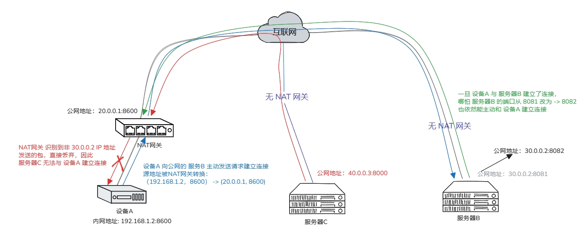

  - **特点：** 只允许 **特定外网IP地址通信（端口可不同）** ；安全性比 **NAT1（Full Cone）** 高，比 **NAT3（Port Restricted）** 低；限制了可连接的外网IP范围，但特定IP 仍可能被恶意利用
  - **场景：** 家庭网络（多数家用路由器）、小型办公网络、需要一定安全性的 P2P应用

  

- **NAT3（Port Restricted Cone NAT 端口限制锥型 NAT）:** 当内网设备向某个外网（IP，端口）发送数据包后，会建立NAT映射。只有该特定外网（IP，端口）的主机可以通过该映射访问内网设备。对外部连接的限制更严格：**即使是 相同IP地址 但 不同端口号 的外网设备，也无法主动建立新连接** 。

  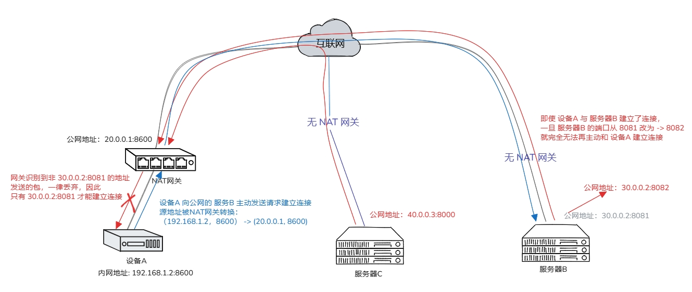 

  - **特点：** ==**IP 限制 同时 端口 限制**== 只允许 **特定（IP，端口）通信** ；在 锥型NAT 中安全性最高；通常允许已建立的连接响应，但 **主动发起新连接必须精确匹配（IP，端口）对**
  - **场景：** 公共网络环境（咖啡馆、机场、酒店等提供的WiFi），企业网络（需要高安全性的场景），保护用户设备安全的网络环境

  

- **NAT4（Symmetric NAT 对称型 NAT）:**  比 **NAT3** 更严格的网络地址转换类型，**同样对 IP 和 端口 均限制，且每次 内网设备 向不同的 外网（IP，端口）建立连接时，NAT网关 都会分配一个 新的外网（IP，端口）映射** 。同一个内网（IP，端口）对，向不同的目标（IP，端口）建立连接，会得到不同的外网映射，只有与特定（内网IP，内网端口，目标IP，目标端口）四元组对应的映射才能通信。换句话说，（SIP，Sport，DIP，Dport）只要有一个发生变化，都会使用不同的映射条目，即此 NAT映射 与 报文四元组绑定。

  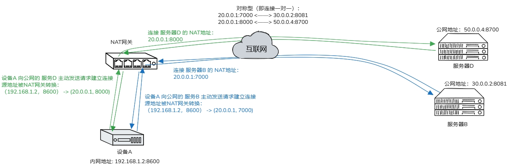 

  

  - **特点：** **安全性极高**，几乎可杜绝外部的恶意攻击；对网络应用的兼容性极差，很多常见的网络应用可能无法正常工作；配置和管理复杂，需要专业的网络技术人员进行操作；P2P打洞成功率低
  - **场景：** 高度敏感的政府机构、军事单位；金融核心系统等对网络安全有极致要求的特殊环境；企业内网的核心安全区域。

##### **全锥型与对称型的显著区别** 

全锥型的形式为一对多

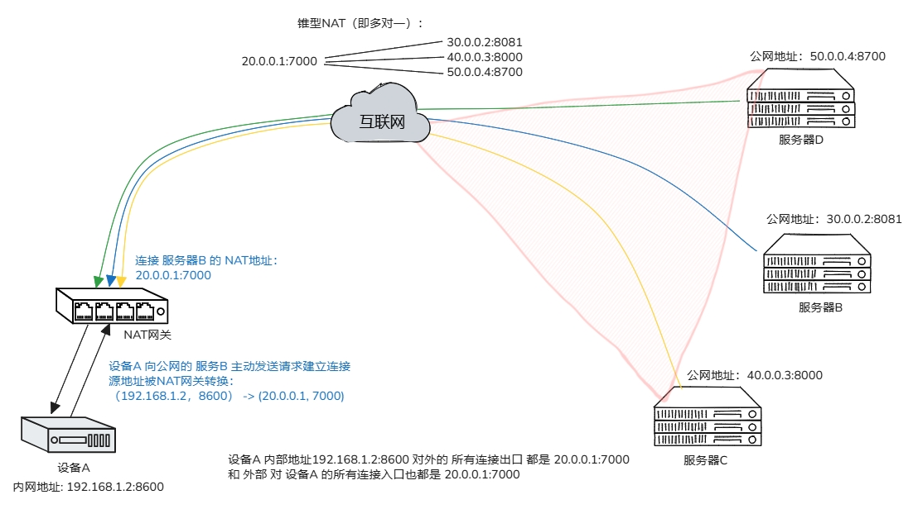

对称型的形式为一对一

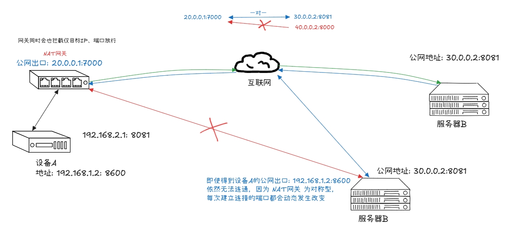

::: tip **总结（NAT映射规则）** 

- 全锥型、地址受限锥型、端口受限锥型NAT中，相同 内网IP 和 端口 的请求会被映射到同一个 外网IP 和 端口（即SPORT固定）。
- 对称型NAT 则根据四元组 动态生成映射表，同一 内网IP 访问 不同外网地址时，会分配 不同的 SPORT。

:::

### 2.3 NAT 打洞

内网穿透的目标是将两台处于NAT后的主机建立直连。前面介绍了四种NAT类型，两两组合共有10种情况。不同组合的穿透方法不同，穿透成功率也不同。

#### 不同NAT的穿透性

**NAT 一共有如下 10种 组合** 

| 左侧NAT类型  | 右侧NAT类型  | 穿透性     |
| ------------ | ------------ | ---------- |
| 全锥型       | 全锥型       | ✓          |
| 全锥型       | 受限锥型     | ✓          |
| 全锥型       | 端口受限锥型 | ✓          |
| 全锥型       | 对称型       | ✓          |
| 受限锥型     | 受限锥型     | ✓          |
| 受限锥型     | 端口受限锥型 | ✓          |
| 受限锥型     | 对称型       | ✓          |
| 端口受限锥型 | 端口受限锥型 | ✓          |
| 端口受限锥型 | 对称型       | ✗ 无法打通 |
| 对称型       | 对称型       | ✗ 无法打通 |

**无法穿透的组合：**

- 端口受限锥型 + 对称型

- 对称型 + 对称型

**当无法穿透时，全程用服务器进行转发理论上是100%可以的** ，但这里不考虑这种方法。当有还有一些实验性方式也可以实现这两种的内网穿透，只不过目前还不成熟（成功率较低）。

- 预测性遍历：如 [猜测NAT的端口分配规则](https://github.com/jflyup/nat_traversal) 
- 多次尝试同时：中继式通信 + 猜端口，穿透成功了就直接通信，不成接着中继

事实上不只是目前，未来也许也不会成熟， 因为这两种组合无法穿透是 NAT在 **设计上就存在的逻辑限制** ，而非实现问题，或者说设计之初就没考虑这两种的穿透问题。

#### 全锥型穿透

全锥型由于是 **NAT1** 对于访问过来的 **IP地址** 和 **端口** 没有任何限制，因此穿透也是最简单的，逻辑如下图：

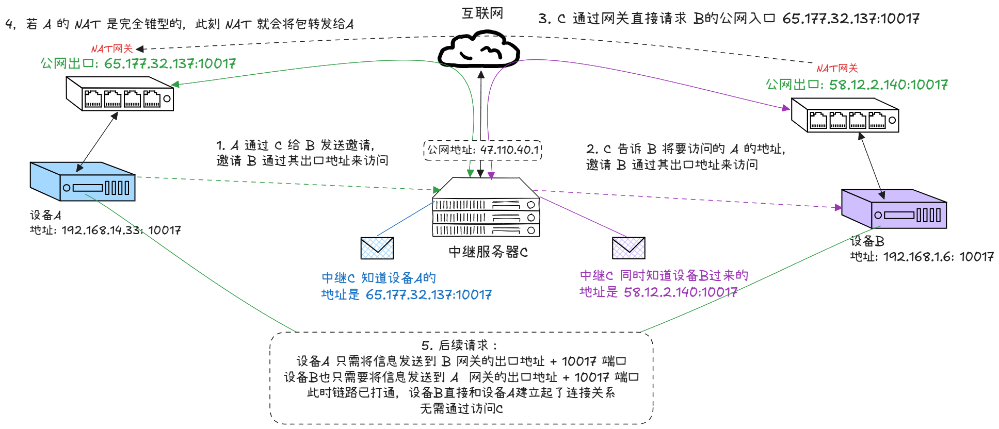

后续 **设备A** 与 **设备B** 之间的通信无需借助 **中继服务器C** 来转发

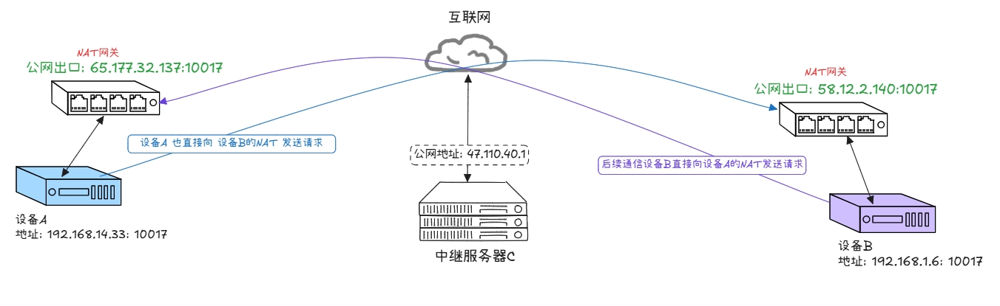

#### IP地址限制型穿透

IP地址限制型由于是 **NAT2** 对于访问过来的 **IP地址** 有限制，因此穿透稍微复杂，逻辑如下图：

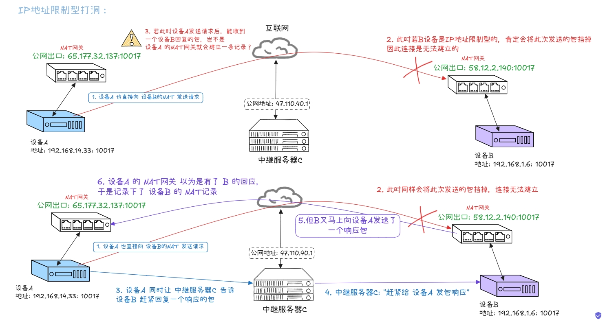

这个实现机制就是 **设备A** 清楚的知道发送的包 **会被 B 的 NAT网关 挡掉** ，然后快速地让 **设备B** 模拟发送一个回复的包， **假装是 B 的 NAT网关 回复的一样**，借助  **设备A 网关** 短时间 ”TTL周期” 内处理 **设备B 网关 ** 回复的能力，将 **假借 设备B** 发送的包记录上去

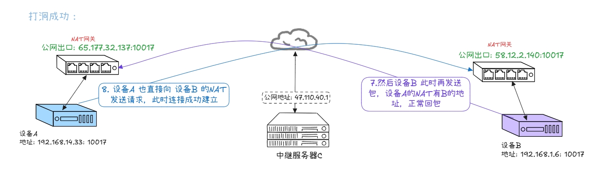

故若 **设备B** 主动打洞成功也同理，相当于 **“三个电脑程序 骗 两个NAT傻子 ಠᴗಠ“**   

#### 端口限制型NAT

跟上述的打洞原理差不多，没有本质上的区别 

::: warning **关于UDP协议** 

打洞大部分场景都是基于 **UDP协议** 的，但 **UDP协议是无连接的** 自然也没有建立连接的说法，其实是 **可以互相发送数据**；

之所以说建立连接，主要是方便理解；

:::

### 2.4 UDP 比 TCP 易打洞的原因

##### **1. UDP 为什么“容易放行”**

首先 **UDP** 是面向无状态的没有连接状态，对 **NAT** 来说，**UDP** 往往只是：

- “这个内网地址刚刚向外发过一个包”
- “那我暂时记住这个映射”
- “如果外面有包回到这个公网端口，我就转进去”，比如：
  - A 内网：**10.0.0.2:5000**
  - A 经过 NAT 后公网变成：**1.2.3.4:62000**
  - A 先给协调服务器发一个 **UDP** 包，**NAT** 就记住：**10.0.0.2:5000  <  —  > 1.2.3.4:62000**
  - 这时如果 B 往 **1.2.3.4:62000** 发 **UDP**，很多 **NAT** 就愿意放进去

注意这里 **NAT** 不太关心 **“这是不是连接建立中的第几步”**，它只是看到：

- 这个端口最近是活跃的
- 有对应映射
- 过滤规则允许的话就转发

因此如果 B 发过来一个包，**NAT** 往往会想：

- “哦，有个包来了，映射也在，转进去试试”

因此 **UDP 对 NAT 的要求很低** 

##### **2. TCP 难在哪里**

**TCP** 不是 ''来个包就行'' ，它有严格状态机，比如正常 **TCP** 建连必须是：

1. A 发 **SYN**
2. B 回 **SYN-ACK**
3. A 回 **ACK**

这时 **NAT** **和两端内核** 通常都会跟踪状态。如果 B 发过来一个 **TCP** 包，**NAT / 防火墙** 可能会想：

- “等等，我这边之前看到的是 A 发出一个 SYN”
- “按正常逻辑，回来应该是 SYN-ACK”
- “你现在给我来的是另一个 SYN，这像不像异常流量？”

于是它就丢了。

::: important 关键差异：

**UDP** 打洞时，**NAT** 只需要维护一个很松的 ==‘最近发过包’== 的状态。
**TCP** 打洞时，**NAT** 往往要理解 **TCP** 的握手过程，而很多 **NAT** 对 **simultaneous open** 支持很差。

:::

### 2.5 **TCP simultaneous open**

同时互发，TCP 理论上确实可以，这叫做 **"simultaneous open"** , 也就是：

- A 向 B 发 **SYN**
- B 也向 A 发 **SYN**
- 两边的 **SYN** 在路上交叉
- 双方都接受这个状态，最后连接建立成功

问题在于：**理论上可以，不代表现实网络设备都老实支持** , 现实里常见问题有：

- **NAT 不接受“入站 SYN”** ，因为它觉得这 **不像返回包**
- 防火墙把它 **当成异常连接** 尝试
- 不同 **NAT** 给不同目标分配不同公网端口，协调更难
- 操作系统和 **socket** 用法也比 **UDP** 麻烦

所以 TCP 打洞不是完全做不到，而是 **成功率差、兼容性差、实现复杂、出问题很难排查**
