**Golang P2P** 网络编程

<!-- more -->

### 1. 网络通信模型

网络简化的四层模型

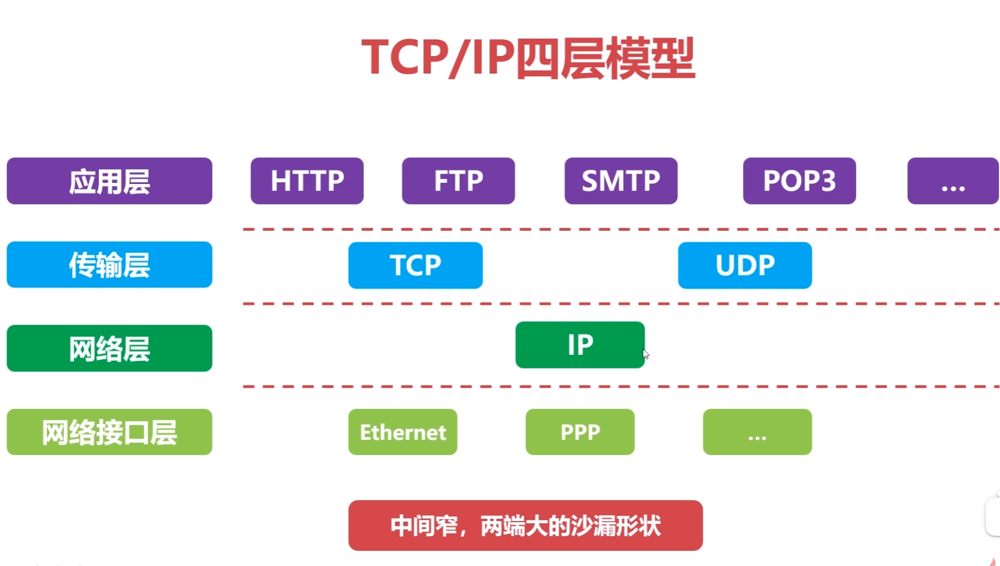 


### 2. IP协议

**IP协议（*Internet Protocol* ）因特网互联协议：** 网络层最核心的协议，它把复杂的实际网络，变为一个 **虚拟互联的网络**，并解决了在虚拟网络中 **数据报传输路径的问题**，即使仅提供了 **不可靠、无连接** 的传送服务，主要功能有：**无连接数据报传输**、**数据报路由选择和差错控制** 

**IPv4：** 该协议其最核心的就是 **源/目的 IP 地址** ，其表现形式为点分十进制**（*v4*）**，并结合子网掩码来划分区域，如下


**IP数据报格式：** 

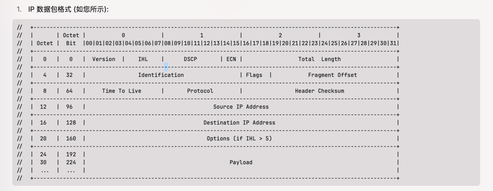

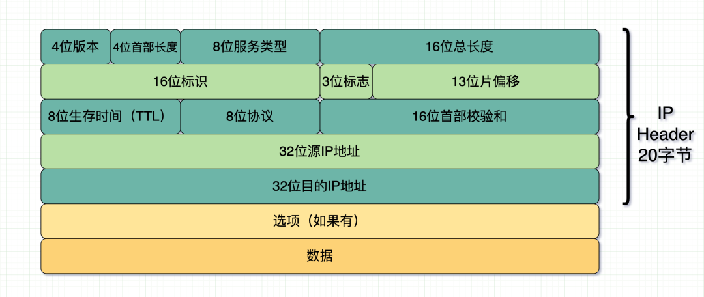 

### 3. TCP协议 

**TCP(*Transmission Control Protocol* ) 传输控制协议: **, 是计算机网络中非常重要的一个协议, 面向**连接、字节流、同时点对点的全双工可靠** 通信协议

##### 协议格式

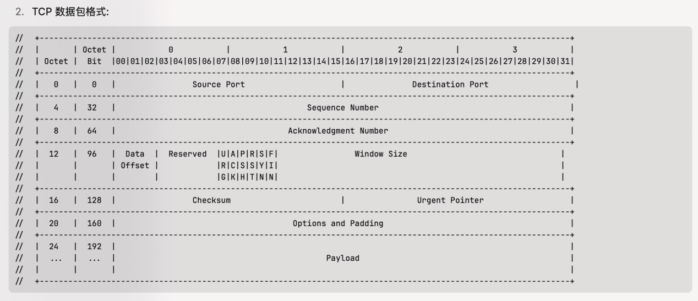 

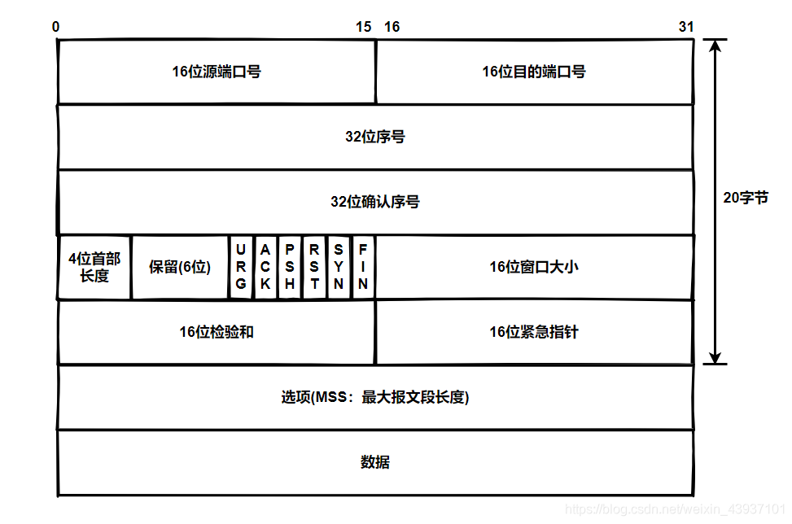

**TCP** 数据包是封装在 **IP** 数据包的 **Payload(*数据负载* )** 部分 

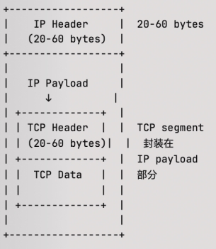 

即如下图的表现形式

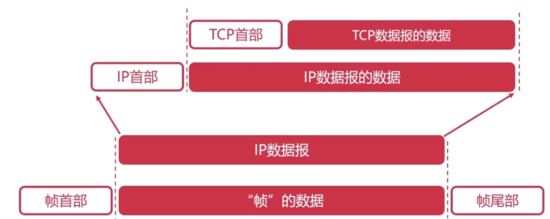

  

### 4. Tun设备

**TUN (*TUNnel*) 网络隧道：** 是一种工作在三层、模拟了网络层物理硬件 的 **虚拟网络设备**，它像但虚拟网卡不同，它是用于创建网络隧道、VPN、网络代理，即用来处理 **IP层数据包（*收发* ）**的场景。

当应用程序发送数据到 **TUN** 设备时 ，数据会被内核网络协议栈处理，此时 **TUN** 设备可以读取和写入 **IP数据包** ，故通过 **TUN** 设备，**处于用户空间的程序** 可以接收和发送网络层数据包。

#### 4.1 传输过程

**从设备 A 的 TUN 接口到设备 B 的 TUN 接口的数据包传输过程如下:**

1. **发送端 (*设备 A*) 封包过程:**

   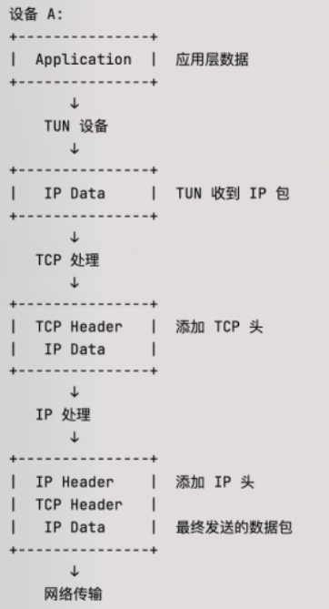 

2. **接收端（*设备B*）的拆包过程：**

   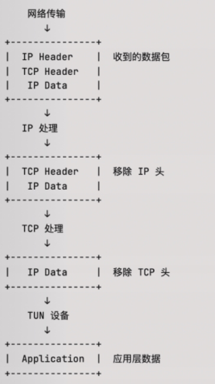 


**1. 发送端封包过程：**

- 应用程序数据先进入 TUN 设备（IP 包）

- TCP 层添加 TCP 头部（20-60字节）
  - 设置源端口、目标端口
  - 设置序列号、确认号
  - 设置控制标志
- IP 层添加 IP 头部（20-60字节）
  - 设置源IP、目标IP
  - 设置协议号为 6（TCP）
  - 计算校验和

**2. 接收端拆包过程：**

- 收到完整的 IP 数据包
- IP 层处理：
  - 验证 IP 头部校验和
  - 检查目标 IP 地址
  - 移除 IP 头部
- TCP 层处理：
  - 验证 TCP 校验和
  - 检查序列号和确认号
  - 移除 TCP 头部
- 将原始 IP 数据包传递给 TUN 设备
- TUN 设备将数据传递给应用程序

**关键注意事项：**

- 每一层都会进行必要的校验

- 头部的添加和移除顺序相反

- TUN 设备工作在 IP 层（第三层）

- 整个过程需要确保数据完整性

- 每一步都需要正确设置相应的协议头部字段

##### 其大致流程图如下：

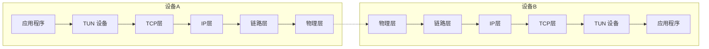

会发现，**TUN** 设备就像一个 **“包裹处理站”**，它会把 **IP数据包** 给包裹到了**TCP（*四层* ）**报文中，作为其 **包裹-Data** ，再经过 **IP、链路、物理 -> 另一端物理、链路、IP、TCP层（*4-3-2-1 -> 1-2-3->4层* ）** 层层传递最后又解析出 **包裹-Data** 

- 应用数据进入 **TUN** 设备

- **TUN** 设备将数据伪装成 **IP 包（*上文 "IP数据包 "* ）**

- 这个 **IP** 包会作为数据被封装进 **TCP** 段

- **TCP** 段再被封装进新的 **IP** 包

- 最后加上链路层帧头

> **:warning: 注意：（*与 TAP 的区别*）**
>
> - **TUN** 工作在网络层(*第三层*)，处理 **IP** 数据包
>
> - 而 **TAP** 工作在数据链路层(*第二层*)，处理以太网数据帧


UDP 和 TCP 在消息处理上有本质区别，让我解释一下：

UDP 特性

​	1.	报文边界保留

​	▪	UDP 是基于消息的协议，天然保留数据包边界

​	▪	每个 UDP 数据包都是独立的，完整的

​	▪	一个 sendto 对应一个 recvfrom

​	2.	包大小限制

​	▪	UDP 数据包有大小限制（通常建议不超过 MTU，一般是 1500 字节）

​	▪	超过 MTU 的包会被分片，可能导致丢包率增加

​	3.	无连接、不可靠

​	▪	不保证包的到达顺序

​	▪	不保证包是否到达

​	▪	不保证包只到达一次

是否需要 Frame 处理？

答案：UDP 通常不需要 Frame 处理，但在特定场景下可能需要自定义分包协议。


### 5. 示例

#### 5.1 TCP服务端示例

```go
package main

import (
    "encoding/binary"
    "encoding/json"
    "fmt"
    "io"
    "net"
    "sync"
)

// 定义消息头部长度（用 4 字节表示消息体长度）
const headerLength = 4

// 基础消息结构
type BaseMessage struct {
    Cmd  string      `json:"cmd"`
    Data interface{} `json:"data"`
}

// Frame 处理器
type FrameReader struct {
    reader io.Reader
    buffer []byte
}

// 创建新的 Frame 读取器
func NewFrameReader(reader io.Reader) *FrameReader {
    return &FrameReader{
        reader: reader,
        buffer: make([]byte, 0),
    }
}

// 读取完整的一帧数据
func (fr *FrameReader) ReadFrame() ([]byte, error) {
    // 读取头部（消息长度）
    header := make([]byte, headerLength)
    _, err := io.ReadFull(fr.reader, header)
    if err != nil {
        return nil, err
    }

    // 解析消息长度
    messageLength := binary.BigEndian.Uint32(header)

    // 检查消息长度是否合理
    if messageLength > 1024*1024 { // 设置最大消息大小为 1MB
        return nil, fmt.Errorf("message too large: %d", messageLength)
    }

    // 读取消息体
    message := make([]byte, messageLength)
    _, err = io.ReadFull(fr.reader, message)
    if err != nil {
        return nil, err
    }

    return message, nil
}

// Frame 写入器
func WriteFrame(writer io.Writer, data []byte) error {
    // 准备头部（消息长度）
    header := make([]byte, headerLength)
    binary.BigEndian.PutUint32(header, uint32(len(data)))

    // 写入头部
    _, err := writer.Write(header)
    if err != nil {
        return err
    }

    // 写入消息体
    _, err = writer.Write(data)
    return err
}

func handleConnection(conn net.Conn) {
    defer conn.Close()

    frameReader := NewFrameReader(conn)

    for {
        // 读取一帧完整数据
        frame, err := frameReader.ReadFrame()
        if err != nil {
            if err != io.EOF {
                fmt.Println("Error reading frame:", err)
            }
            return
        }

        // 解析消息
        var baseMsg BaseMessage
        err = json.Unmarshal(frame, &baseMsg)
        if err != nil {
            sendError(conn, "Invalid JSON format")
            continue
        }

        // 处理消息
        switch baseMsg.Cmd {
        case "login":
            handleLogin(conn, baseMsg.Data)
        case "chat":
            handleChat(conn, baseMsg.Data)
        case "heartbeat":
            handleHeartbeat(conn, baseMsg.Data)
        default:
            sendError(conn, "Unknown command")
        }
    }
}

// 消息处理函数
func handleLogin(conn net.Conn, data interface{}) {
    jsonData, err := json.Marshal(data)
    if err != nil {
        sendError(conn, "Data conversion error")
        return
    }

    var loginMsg struct {
        Username string `json:"username"`
        Password string `json:"password"`
    }
    if err := json.Unmarshal(jsonData, &loginMsg); err != nil {
        sendError(conn, "Invalid login message format")
        return
    }

    fmt.Printf("Processing login for user: %s\n", loginMsg.Username)
    response := map[string]interface{}{
        "status": "success",
        "msg":    "Login successful",
    }
    sendResponse(conn, response)
}

func handleChat(conn net.Conn, data interface{}) {
    // 类似 handleLogin 的实现
    // ...
}

func handleHeartbeat(conn net.Conn, data interface{}) {
    // 类似 handleLogin 的实现
    // ...
}

func sendError(conn net.Conn, message string) {
    response := map[string]interface{}{
        "status": "error",
        "msg":    message,
    }
    sendResponse(conn, response)
}

func sendResponse(conn net.Conn, response interface{}) {
    jsonResponse, err := json.Marshal(response)
    if err != nil {
        fmt.Println("Error marshaling response:", err)
        return
    }

    err = WriteFrame(conn, jsonResponse)
    if err != nil {
        fmt.Println("Error sending response:", err)
    }
}

func main() {
    listener, err := net.Listen("tcp", ":8080")
    if err != nil {
        fmt.Println("Error listening:", err)
        return
    }
    defer listener.Close()

    fmt.Println("TCP Server listening on :8080")

    for {
        conn, err := listener.Accept()
        if err != nil {
            fmt.Println("Error accepting connection:", err)
            continue
        }
        go handleConnection(conn)
    }
}


```

#### 5.2 TCP 客户端示例

```go
func ExampleClient() {
    conn, err := net.Dial("tcp", "localhost:8080")
    if err != nil {
        fmt.Println("Error connecting:", err)
        return
    }
    defer conn.Close()

    // 发送登录消息
    loginMsg := map[string]interface{}{
        "cmd": "login",
        "data": map[string]string{
            "username": "testuser",
            "password": "testpass",
        },
    }

    jsonData, err := json.Marshal(loginMsg)
    if err != nil {
        fmt.Println("Error marshaling:", err)
        return
    }

    // 发送消息
    err = WriteFrame(conn, jsonData)
    if err != nil {
        fmt.Println("Error sending:", err)
        return
    }

    // 读取响应
    frameReader := NewFrameReader(conn)
    response, err := frameReader.ReadFrame()
    if err != nil {
        fmt.Println("Error reading response:", err)
        return
    }

    fmt.Printf("Received response: %s\n", string(response))
}
```

#### 5.3 UDP 服务端示例

```go
package main

import (
    "encoding/binary"
    "encoding/json"
    "fmt"
    "io"
    "net"
    "sync"
)

// 定义消息头部长度（用 4 字节表示消息体长度）
const headerLength = 4

// 基础消息结构
type BaseMessage struct {
    Cmd  string      `json:"cmd"`
    Data interface{} `json:"data"`
}

// Frame 处理器
type FrameReader struct {
    reader io.Reader
    buffer []byte
}

// 创建新的 Frame 读取器
func NewFrameReader(reader io.Reader) *FrameReader {
    return &FrameReader{
        reader: reader,
        buffer: make([]byte, 0),
    }
}

// 读取完整的一帧数据
func (fr *FrameReader) ReadFrame() ([]byte, error) {
    // 读取头部（消息长度）
    header := make([]byte, headerLength)
    _, err := io.ReadFull(fr.reader, header)
    if err != nil {
        return nil, err
    }

    // 解析消息长度
    messageLength := binary.BigEndian.Uint32(header)

    // 检查消息长度是否合理
    if messageLength > 1024*1024 { // 设置最大消息大小为 1MB
        return nil, fmt.Errorf("message too large: %d", messageLength)
    }

    // 读取消息体
    message := make([]byte, messageLength)
    _, err = io.ReadFull(fr.reader, message)
    if err != nil {
        return nil, err
    }

    return message, nil
}

// Frame 写入器
func WriteFrame(writer io.Writer, data []byte) error {
    // 准备头部（消息长度）
    header := make([]byte, headerLength)
    binary.BigEndian.PutUint32(header, uint32(len(data)))

    // 写入头部
    _, err := writer.Write(header)
    if err != nil {
        return err
    }

    // 写入消息体
    _, err = writer.Write(data)
    return err
}

func handleConnection(conn net.Conn) {
    defer conn.Close()

    frameReader := NewFrameReader(conn)

    for {
        // 读取一帧完整数据
        frame, err := frameReader.ReadFrame()
        if err != nil {
            if err != io.EOF {
                fmt.Println("Error reading frame:", err)
            }
            return
        }

        // 解析消息
        var baseMsg BaseMessage
        err = json.Unmarshal(frame, &baseMsg)
        if err != nil {
            sendError(conn, "Invalid JSON format")
            continue
        }

        // 处理消息
        switch baseMsg.Cmd {
        case "login":
            handleLogin(conn, baseMsg.Data)
        case "chat":
            handleChat(conn, baseMsg.Data)
        case "heartbeat":
            handleHeartbeat(conn, baseMsg.Data)
        default:
            sendError(conn, "Unknown command")
        }
    }
}

// 消息处理函数
func handleLogin(conn net.Conn, data interface{}) {
    jsonData, err := json.Marshal(data)
    if err != nil {
        sendError(conn, "Data conversion error")
        return
    }

    var loginMsg struct {
        Username string `json:"username"`
        Password string `json:"password"`
    }
    if err := json.Unmarshal(jsonData, &loginMsg); err != nil {
        sendError(conn, "Invalid login message format")
        return
    }

    fmt.Printf("Processing login for user: %s\n", loginMsg.Username)
    response := map[string]interface{}{
        "status": "success",
        "msg":    "Login successful",
    }
    sendResponse(conn, response)
}

func handleChat(conn net.Conn, data interface{}) {
    // 类似 handleLogin 的实现
    // ...
}

func handleHeartbeat(conn net.Conn, data interface{}) {
    // 类似 handleLogin 的实现
    // ...
}

func sendError(conn net.Conn, message string) {
    response := map[string]interface{}{
        "status": "error",
        "msg":    message,
    }
    sendResponse(conn, response)
}

func sendResponse(conn net.Conn, response interface{}) {
    jsonResponse, err := json.Marshal(response)
    if err != nil {
        fmt.Println("Error marshaling response:", err)
        return
    }

    err = WriteFrame(conn, jsonResponse)
    if err != nil {
        fmt.Println("Error sending response:", err)
    }
}

func main() {
    listener, err := net.Listen("tcp", ":8080")
    if err != nil {
        fmt.Println("Error listening:", err)
        return
    }
    defer listener.Close()

    fmt.Println("TCP Server listening on :8080")

    for {
        conn, err := listener.Accept()
        if err != nil {
            fmt.Println("Error accepting connection:", err)
            continue
        }
        go handleConnection(conn)
    }
}
```

#### 5.4 UDP 客户端端示例

```go
func ExampleClient() {
    conn, err := net.Dial("tcp", "localhost:8080")
    if err != nil {
        fmt.Println("Error connecting:", err)
        return
    }
    defer conn.Close()

    // 发送登录消息
    loginMsg := map[string]interface{}{
        "cmd": "login",
        "data": map[string]string{
            "username": "testuser",
            "password": "testpass",
        },
    }

    jsonData, err := json.Marshal(loginMsg)
    if err != nil {
        fmt.Println("Error marshaling:", err)
        return
    }

    // 发送消息
    err = WriteFrame(conn, jsonData)
    if err != nil {
        fmt.Println("Error sending:", err)
        return
    }

    // 读取响应
    frameReader := NewFrameReader(conn)
    response, err := frameReader.ReadFrame()
    if err != nil {
        fmt.Println("Error reading response:", err)
        return
    }

    fmt.Printf("Received response: %s\n", string(response))
}
```

### 6. tun/tap设备

- [WireGuard](https://github.com/WireGuard/wireguard-go)

- 数据分层传输

  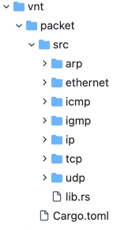 

- 分析数据包： [gopacket](https://github.com/google/gopacket)  

#### TCP编程缺点

tcp/udp是传输层协议 

- **TCP** 是 **stream** 流式无边界的：无 **frame** , 如果要在上面实现拆包处理消息，需要是先实现 **frame**;

- **UDP** 是数据报 **Dgram** 有边界，但是不可靠;

http, grpc，ws，quic, sctp是应用层，自带frame(按帧传输)  

http grpc,ws是tcp之上的

quic,stcp, 都是udp之上，但是应用层实现了可靠性

下面就分别用这些协议实现p2p编程

实现p2p编程，一般在server端需要实现两步

1 信令交换

2 适当的时机流转发

可以用用两个server,监听两个端口，或者listen一个端口。但是 listen 一个端口时client/server 需要按frame 传数据包的。 因为要区分上面两个步骤

http://192.168.0.232/dwu/wire