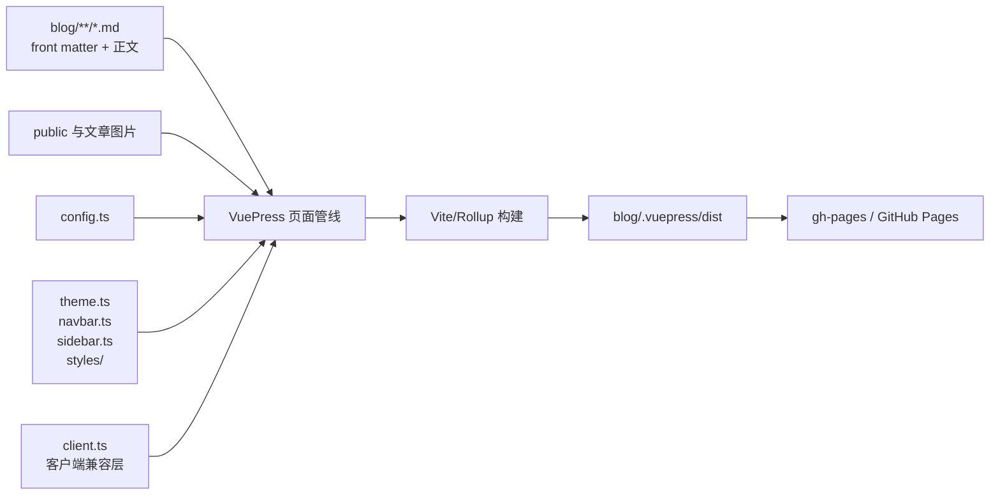

# 架构总览

## 1. 系统定位

Igarashi Blog 是由 VuePress 2、Vite 和 vuepress-theme-hope 构建的静态博客。仓库没有常驻后端、数据库或自定义业务运行时；主要输入是 `blog/` 下的 Markdown、front matter、导航配置和静态资源，主要输出是 GitHub Pages 可发布的静态文件。

> 依据：`package.json:7-23`、`blog/.vuepress/config.ts:1-74`、`.github/workflows/deploy-docs.yml:38-48`。

## 2. 系统边界

### 2.1 输入、处理与输出



> 依据：`blog/.vuepress/config.ts:9-74`、`blog/.vuepress/theme.ts:5-251`、`.github/workflows/deploy-docs.yml:38-48`。

### 2.2 外部边界

| 边界 | 作用 | 是否运行时服务 |
|---|---|---|
| npm registry | 安装锁定的构建依赖 | 否，仅安装时 |
| AliCDN 图标样式 | 浏览器加载自定义字体图标 | 是，浏览器侧资源 |
| GitHub Actions | 执行生产构建与部署 | 否，CI/CD |
| GitHub Pages | 托管静态产物 | 是，静态托管 |

站点配置没有必需密钥或 `.env` 文件；`NETLIFY` 只在编译期转为布尔常量。图标 CDN 由页面 `<head>` 引用。

> 依据：`blog/.vuepress/config.ts:20-27`、`blog/.vuepress/config.ts:53-55`。

## 3. 分层与职责

### 3.1 依赖层次

| 层 | 主要位置 | 职责 | 依赖方向 |
|---|---|---|---|
| 命令与依赖 | `package.json`、锁文件 | 提供 VuePress 命令并解析依赖 | Node.js、pnpm、registry |
| 站点配置 | `blog/.vuepress/config.ts` | 页面发现、搜索、主题、bundler | 主题配置和 VuePress 插件 |
| 主题与信息架构 | `theme.ts`、`navbar.ts`、`sidebar.ts`、`styles/` | 页面表现、博客聚合、导航、Markdown 能力 | Hope 主题与内容路由 |
| 客户端兼容 | `blog/.vuepress/client.ts` | 注册历史 Markdown 仍使用的轻量组件别名 | VuePress Client、Vue |
| 内容与资源 | `blog/**/*.md`、图片、`public/` | 页面正文、元数据和媒体 | Markdown 管线与 Vite |
| 持续部署 | `.github/workflows/deploy-docs.yml` | 安装、构建、发布 | 命令层与 `dist/` |

> 依据：`blog/.vuepress/config.ts:1-4`、`blog/.vuepress/theme.ts:1-3`、`package.json:7-23`。

### 3.2 配置导入图

```mermaid
graph TD
  Config[config.ts] --> VuePress[vuepress]
  Config --> Bundler[@vuepress/bundler-vite]
  Config --> Theme[theme.ts]
  Theme --> Hope[vuepress-theme-hope]
  Hope --> Search[@vuepress/plugin-search]
  Theme --> Navbar[navbar.ts]
  Theme --> Sidebar[sidebar.ts]
  Client[client.ts] --> VuePressClient[vuepress/client]
  Client --> Vue[vue]
  Navbar --> Hope
  Sidebar --> Hope
```

这是配置组合关系，不是运行时服务调用图。

> 依据：`blog/.vuepress/config.ts:1-3`、`blog/.vuepress/theme.ts:1-3`、`blog/.vuepress/client.ts:1-2`、`blog/.vuepress/navbar.ts:1`、`blog/.vuepress/sidebar.ts:1`。

## 4. 核心组件

### 4.1 内容源

`blog/` 是 VuePress 的 `sourceDir`。`pagePatterns` 包含 `**/*.md`，并排除 `*.snippet.md`、`.vuepress` 与 `node_modules`。因此 Markdown 之外的 Python、Go 或 Shell 文件不会成为站点页面，它们通常是文章示例或辅助说明。

> 依据：`package.json:8-10`、`blog/.vuepress/config.ts:46-51`。

### 4.2 站点配置

`config.ts` 定义根路径 `/`、中文站点元数据、浏览器 head、页面发现、`IS_NETLIFY` 编译常量、旧式相对图片路径归一化及 Vite/Rolldown 行为。本地搜索由主题托管的基础 Search 插件提供；当前 SlimSearch/Orama rc.137 的开发 Worker 路径存在上游缺陷，暂不启用。

> 依据：`blog/.vuepress/config.ts:9-42`、`blog/.vuepress/config.ts:46-74`。

### 4.3 主题与 Markdown 管线

`theme.ts` 聚合 navbar 和 sidebar，并配置博客路由、作者资料、页面信息、Mermaid、KaTeX、图表、容器、文件 include、playground、幻灯片等增强能力。新增语法前应检查现有配置，避免引入重复插件。

> 依据：`blog/.vuepress/theme.ts:21-46`、`blog/.vuepress/theme.ts:79-93`、`blog/.vuepress/theme.ts:135-215`。

### 4.4 导航

全局 navbar 和按路由前缀切换的 sidebar 都是手工维护的数据结构。内容文件的存在不会自动把页面加入这些导航；`prefix`、`link` 与字符串 children 共同组成目标路由。

> 依据：`blog/.vuepress/navbar.ts:3-118`、`blog/.vuepress/sidebar.ts:48-470`。

详细规则见[内容与导航设计](design-docs/content-navigation.md)。

## 5. 关键数据流

### 5.1 Markdown 到页面

1. VuePress 以 `blog/` 为源目录并按 `pagePatterns` 发现 Markdown。
2. 文件路径形成基础路由； `README.md` 充当所在目录入口。
3. front matter 向主题提供 layout、title、category、tag、article 等元数据。
4. Markdown 与 Hope 增强插件生成 Vue 页面和博客聚合数据。
5. Vite 打包 HTML、CSS、JavaScript 与可处理资源。

> 依据：`blog/.vuepress/config.ts:31-51`、`blog/README.md:1-59`、`blog/python/README.md:1-7`、`blog/.vuepress/theme.ts:93-215`。

### 5.2 本地开发

`pnpm run docs:dev` 展开为 `vuepress dev blog`；`docs:clean-dev` 在同一命令上增加 `--clean-cache`。开发过程会写 `.cache/` 和 `.temp/`，这些目录不是源代码。

> 依据：`package.json:9-10`。

### 5.3 生产发布

`master` push 触发工作流。工作流使用 pnpm 10.34.6 和 Node 22.18，执行 frozen install，并以 8192 MiB heap 运行 `docs:build`；随后把 `blog/.vuepress/dist` 发布到 `gh-pages`。

> 依据：`.github/workflows/deploy-docs.yml:4-6`、`.github/workflows/deploy-docs.yml:22-45`。

详细规则见[构建与部署设计](design-docs/build-deploy.md)。

## 6. 源文件与生成文件

### 6.1 源文件

- 内容：`blog/**/*.md` 与文章资源。
- 配置：`blog/.vuepress/*.ts`、`styles/`、`public/`。
- 工具：`package.json`、`pnpm-lock.yaml`、`Makefile`、`scripts/`。
- 发布：`.github/workflows/deploy-docs.yml`。

### 6.2 生成文件

| 目录 | 生产者 | 用途 | 编辑规则 |
|---|---|---|---|
| `blog/.vuepress/.cache/` | VuePress/Vite | 本地缓存 | 不手改，可删除重建 |
| `blog/.vuepress/.temp/` | VuePress | 临时应用与页面模块 | 不手改，可删除重建 |
| `blog/.vuepress/dist/` | `vuepress build` | 可部署静态站点 | 不手改，由构建覆盖 |

当前 Git 索引中仍存在这些生成文件。`.gitignore` 已覆盖正确的 `.vuepress` 目录，但不会自动移除既有跟踪文件；清理应作为单独任务处理。

> 依据：`.gitignore:1-5`、`package.json:8-10`、`.github/workflows/deploy-docs.yml:45`。

## 7. 设计约束

### 7.1 路由可移植性

生产 CI 运行于 Linux，导航目标的大小写必须与磁盘文件完全一致。目录 link 只有在目录下存在 `README.md` 或等效页面时才应可点击。

### 7.2 静态站点安全边界

所有构建入产物的配置都可被客户端下载或推断。`theme.ts` 中的页面访问码不能保护真正敏感内容；秘密材料必须留在公开构建之外。

> 依据：`blog/.vuepress/theme.ts:86-90`。

### 7.3 依赖一致性

CI 明确消费 `pnpm-lock.yaml`，因此 pnpm 是可复现安装的权威路径。仓库中的 `package-lock.json` 是竞争锁文件，除非另行决策，不应由日常依赖变更同时刷新。

> 依据：`.github/workflows/deploy-docs.yml:22-35`、`pnpm-lock.yaml:1`、`package-lock.json:4`。

## 8. 已知缺口

- 当前没有自动化测试套件、独立类型检查命令或预览命令。
- PR 已由 `.github/workflows/ci.yml` 执行 lint 与生产构建；部署仍由独立的 `master` push 工作流完成。
- 侧栏存在大小写不匹配目标与无目录入口 link，需由内容检查器报告。
- Markdown 中存在本站无法处理的 `/api/attachments.redirect` 图片引用。

> 依据：`package.json:7-11`、`blog/deploy/start.sh:15`、`.github/workflows/ci.yml:1-36`、`.github/workflows/deploy-docs.yml:4-6`、`blog/ai/HelloAgents/各种疑问.md:99`。

## 9. 相关文档

- [开发指南](DEVELOPMENT.md)
- [质量标准](QUALITY.md)
- [内容与导航设计](design-docs/content-navigation.md)
- [构建与部署设计](design-docs/build-deploy.md)
