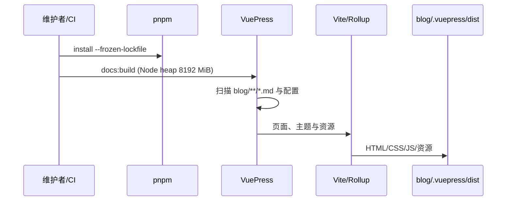

# 构建与部署设计

## 1. 目的

本文记录从锁定依赖到 GitHub Pages 的构建链、生成目录边界和验证接口。它描述当前实现，也定义 Makefile 与检查脚本应提供的稳定入口。

## 2. 工具链契约

### 2.1 Node 与 pnpm

部署工作流、`package.json` 和 `.node-version` 统一使用 Node.js 22.18+ 与 pnpm 10.34.6。VuePress 2.0.0-rc.31 要求 Node `>=22.18.0`，不得用 Node 18/20 安装当前依赖。

> 依据：`.github/workflows/deploy-docs.yml:22-32`、`script/run.sh:1-4`、`pnpm-lock.yaml:4852`。

### 2.2 锁文件

生产安装使用 `pnpm install --frozen-lockfile`，所以 `pnpm-lock.yaml` 是部署事实来源。`package-lock.json` 同时存在但不被工作流消费；日常变更不得把两个锁文件混作同一权威来源。

> 依据：`.github/workflows/deploy-docs.yml:22-35`、`pnpm-lock.yaml:1`、`package-lock.json:4`。

## 3. 本地命令层

### 3.1 已声明 package scripts

| 脚本 | 实际命令 | 作用 |
|---|---|---|
| `build` | `vuepress build blog` | 生产构建别名 |
| `docs:build` | `vuepress build blog` | CI 使用的生产构建 |
| `docs:clean-dev` | `vuepress dev blog --clean-cache` | 清缓存开发 |
| `docs:dev` | `vuepress dev blog` | 普通开发 |

`package.json` 没有 `serve`、`test`、`lint` 或 `typecheck` 脚本。

> 依据：`package.json:7-11`。

### 3.2 Makefile 预期接口

| 目标 | 底层行为 |
|---|---|
| `setup` | 自举 pnpm 10.34.6 后执行 frozen-lockfile 安装 |
| `dev` | `pnpm run docs:dev` |
| `build` | 带 8192 MiB Node heap 的 `pnpm run docs:build` |
| `lint-arch` | `node scripts/lint-architecture.mjs` |
| `lint-content` | `node scripts/lint-content.mjs` |
| `lint` | 依次运行两个 lint 目标 |
| `test` | 当前兼容入口，等同于静态 lint，不是单元测试 |
| `verify` | lint 全部通过后执行 build |

目标是否已实现以当前 `Makefile` 为准；这张表是各工具不得随意破坏的命令契约。

## 4. 构建流程

### 4.1 生产数据流

> 依据：`package.json:8-10`、`blog/.vuepress/config.ts:46-74`、`.github/workflows/deploy-docs.yml:35-45`。

### 4.2 Bundler 定制

Vite 配置把 `
` 视为自定义元素，并替换 Rolldown/Rollup 的 `sanitizeFileName`：保留 Windows 盘符前缀，再移除控制字符和一组不允许的字符。`extendsMarkdown` 还会把旧文章中的 `img/foo.png` 规范化为 `./img/foo.png`，以适配新版资源解析。修改这些逻辑必须通过完整生产构建验证。

Mermaid 12 的 `dayjs`、`@braintree/sanitize-url` 与 `elkjs/lib/elk.bundled.js` 仍以 CommonJS 形式发布。`configureVite` 将它们加入 `optimizeDeps.include` 和 `needsInterop`，否则开发服务器会因缺少 ESM default/named export 而无法渲染图表。

> 依据：`blog/.vuepress/config.ts:57-74`。

### 4.3 页面与资源输入

页面扫描只包含 Markdown；`public/` 资源按根路径复制，文章相对资源由 Markdown/Vite 管线处理。本地搜索索引在构建中从标题和小标题生成。

> 依据：`blog/.vuepress/config.ts:31-51`。

## 5. 生成目录

### 5.1 所有权

| 目录 | 所有者 | 生命周期 |
|---|---|---|
| `blog/.vuepress/.cache/` | VuePress/Vite | 可删除，下次开发/构建重建 |
| `blog/.vuepress/.temp/` | VuePress | 可删除，下次开发/构建重建 |
| `blog/.vuepress/dist/` | 生产构建 | 可删除，发布前重建 |

源代码修复不得直接修改这些目录。构建后的 diff 若只包含生成目录变化，不代表对应源问题已被修复。

### 5.2 当前跟踪状态

这些目录已有大量文件进入 Git 索引。`.gitignore` 已改为正确的 `.vuepress` 路径，但 ignore 不会自动移除既有跟踪文件；清理 Git 索引会产生大范围 diff，应单独审查，不与内容变更混合。

> 依据：`.gitignore:1-5`。

## 6. GitHub Actions 部署

### 6.1 部署触发

部署工作流仅在 `master` push 时触发，显式授予 `contents: write`，并通过 concurrency 取消同一分支的旧部署。

> 依据：`.github/workflows/deploy-docs.yml:4-12`。

### 6.2 构建步骤

1. checkout 完整历史。
2. 安装 pnpm 10.34.6。
3. 设置 Node 22.18 和 pnpm 缓存。
4. frozen-lockfile 安装。
5. 带 8192 MiB heap 执行 `pnpm run docs:build`。
6. 把 `blog/.vuepress/dist` 部署到 `gh-pages`。

> 依据：`.github/workflows/deploy-docs.yml:15-48`。

### 6.3 失败语义

仓库没有应用级重试或降级。安装、构建或部署命令返回非零状态时，由 shell/GitHub Actions 终止步骤。PR 验证位于 `.github/workflows/ci.yml`，部署工作流仍独立重复安装和构建。

## 7. 验证与发布门禁

### 7.1 本地 verify

`make verify` 应按以下顺序短路：

1. `scripts/lint-architecture.mjs`
2. `scripts/lint-content.mjs`
3. 生产构建

前一步失败时不应继续发布意义更高的步骤。检查器必须输出 WHAT、WHY、HOW 和具体位置。

### 7.2 PR CI

`.github/workflows/ci.yml` 在 pull request 与手工触发时安装 Node 22.18、pnpm 10.34.6，并运行 `make verify`。部署 job 尚未复用该 job，因此修改任一工作流时都要防止两套工具链漂移。

### 7.3 无测试声明

当前没有自动化测试套件。成功的 `make verify` 表示仓库静态规则和生产构建通过，不等于单元、集成或端到端测试通过。

> 依据：`package.json:7-11`、`.github/workflows/deploy-docs.yml:35-45`。

## 8. 安全与可复现性

### 8.1 静态配置不是秘密存储

主题配置中的页面访问码会进入公开构建流程，不能用于保护敏感信息。站点构建本身不要求秘密环境变量。

> 依据：`blog/.vuepress/theme.ts:86-90`。

### 8.2 第三方动作

当前 workflow 使用移动的 action 主版本标签，而非不可变 commit SHA。若加强供应链控制，应在独立变更中固定并定期更新 SHA。

> 依据：`.github/workflows/deploy-docs.yml:15-17`、`.github/workflows/deploy-docs.yml:42`。

## 9. 相关文档

- [架构总览](../ARCHITECTURE.md)
- [开发指南](../DEVELOPMENT.md)
- [质量标准](../QUALITY.md)
- [内容与导航设计](content-navigation.md)
